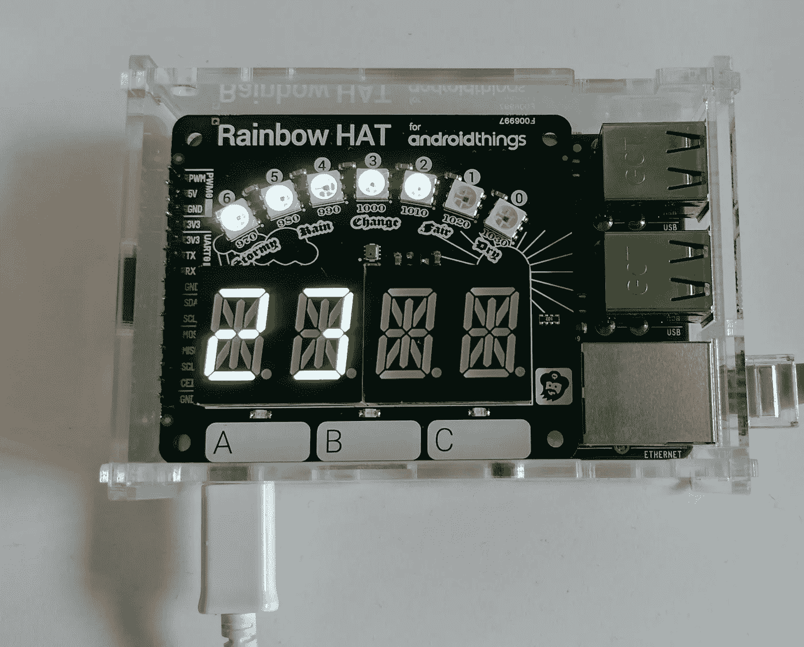

# 试用 Android weather station code lab

> 原文：<https://medium.com/hackernoon/trying-out-the-android-things-weatherstation-codelab-d3f260b59c2f>

Android things[weather station code lab](https://codelabs.developers.google.com/codelabs/androidthings-weatherstation/index.html?index=..%2F..%2Findex#0)前不久掉了，我决定弄个[彩虹帽](https://shop.pimoroni.com/products/rainbow-hat-for-android-things)，看看[修改](https://docs.google.com/presentation/d/1wkKvMk-SHnY2DAJ3a5y8QZdpuF6XBjeRVqKs-BB-bW0/present?slide=id.p)门铃示例后会是什么样子(这里见代码)。



彩虹帽是对 Raspberry PI model 3 B 的一个非常巧妙的补充，它以一种吸引我孩子眼球的方式将设备带入了生活。它有一系列传感器(触摸、温度、压力)以及蜂鸣器、明亮的 led 和数字读数。照片似乎没有公平对待发光二极管。

[codelab](https://hackernoon.com/tagged/codelab) 带领用户完成:添加所需的驱动程序、初始化 led 和数字读数，然后改变 led 和数字读数。

接下来，它会引导用户读入传感器数据(温度和压力)并显示出来。这与 Android 中的任何其他传感器没有什么不同，然而结果并不完全符合我的预期。**当我感觉到 23 摄氏度(~73 华氏度)的时候，我感觉到了大约 33 摄氏度(~91 华氏度)！**

问题是帽子离 Raspberry PI 板太近，以至于 CPU 正在加热传感器。这在 Pimoroni 网站的[注释](https://shop.pimoroni.com/products/rainbow-hat-for-android-things)中注明:

> 温度读数会受到您的 Pi 的 CPU 和板载 led 发出的热量的影响；校准有助于校正温度读数。bstrobl，在[树莓 Pi 论坛](https://www.raspberrypi.org/forums/viewtopic.php?f=104&t=111457)上，建议使用公式:*修正温度。=测量温度。— (CPU 温度。—测量温度。)/ 2* 。使用一个迷你黑帽也有帮助。

# 获取 CPU 温度

我试用了推荐的公式，意思是得到 CPU 温度。我在 Android 中找不到这方面的 API(没有被否决)。环顾四周，我发现[有一个用 CPU 温度](http://kernelreloaded.com/formatting-output-from-raspberry-pi-temperature-sensors/)更新的文件:

```
/sys/class/thermal/thermal_zone0/temp
```

这提供了以“毫”摄氏度为单位的温度。

为了获得温度，我决定使用 RxJava / RxAndroid 定期查询文件(使用处理程序)。我本想使用一个 [FileObserver](https://developer.android.com/reference/android/os/FileObserver.html) ，但是由于某种原因，当它被修改时没有触发一个事件(尽管当我访问它时它触发了)。

不幸的是，当我尝试推荐的公式时，计算出的实际温度仍然相差很大:

> Ta = Tm -(Tc -Tm)/2

其中:
Ta —实际温度
Tm —测量温度
Tc — CPU 温度

Ta 是 23，Tm 是 39，Tc 是 51，所以我得到了大约 33。

# 更新的公式

我想出了下面的方法来计算温度:

> Ta = Tm -C * (Tc -Ta)

其中:
C——常数因子(产生多少热量)

这将产生:

> Ta = (Tm -C * Tc) / (1 -C)

(如果 Tc > Tm，这似乎是合理的)

对我来说，这个系数大约在 0.6 左右(我发现设备达到稳定状态需要一点时间)。我把我的设备放在一个有机玻璃盒子里，这可能意味着传感器会发热。在其他情况下，CPU 或多或少会影响传感器。

我很想知道这对其他人是否有效。

我的简单假设是，从 CPU 到传感器的热量损失取决于 CPU 温度和实际温度的差异(给定[牛顿冷却定律](https://en.wikipedia.org/wiki/Newton%27s_law_of_cooling))。

这比现实要简单得多，比如气流和空气的比热容会发生变化(基于当前的湿度)，但可能只是一个简单的近似值。

如果传感器根本没有靠近，则 C 变为 0，Ta = Tm。如果到了 1 点，一些不好的事情就会发生…


# 要点

我已经[创建了一个要点](https://gist.github.com/juliusspencer/38469e524bfeb8b4c371d580b4caec1a)，它包含了我所做的更改的细节。确保将 RxAndroid 添加到应用的内部版本中。gradle:

```
compile 'io.reactivex:rxandroid:1.2.1'
```

您可能希望为您的方案更改以下内容:

```
public static final String ***CPU_FILE_PATH***= "/sys/class/thermal/thermal_zone0/temp";

private static final float ***HEATING_COEFFICIENT***= 0.55f;private static final long ***UPDATE_CPU_DELAY***= 50;
```

***UPDATE _ CPU _ DELAY****决定了你想要获取最新 CPU 值的频率。*

*文件位置***CPU _ FILE _ PATH****应该适用于树莓派，但在其他硬件上可能会改变。**

*****【加热系数】*** 可能因您的硬件设置而异。我想知道其他人是如何发现这一点的。或者甚至更好…也许有人有一个新的方程式可以尝试。**

**注意:这不是产品代码，而是当用户第一次尝试时，我做的一些小改动，使教程更真实。**

**[](http://bit.ly/HackernoonFB)****[](https://goo.gl/k7XYbx)****[](https://goo.gl/4ofytp)**

> **[黑客中午](http://bit.ly/Hackernoon)是黑客如何开始他们的下午。我们是 [@AMI](http://bit.ly/atAMIatAMI) 家庭的一员。我们现在[接受投稿](http://bit.ly/hackernoonsubmission)并乐意[讨论广告&赞助](mailto:partners@amipublications.com)机会。**
> 
> **如果你喜欢这个故事，我们推荐你阅读我们的[最新科技故事](http://bit.ly/hackernoonlatestt)和[趋势科技故事](https://hackernoon.com/trending)。直到下一次，不要把世界的现实想当然！**

****