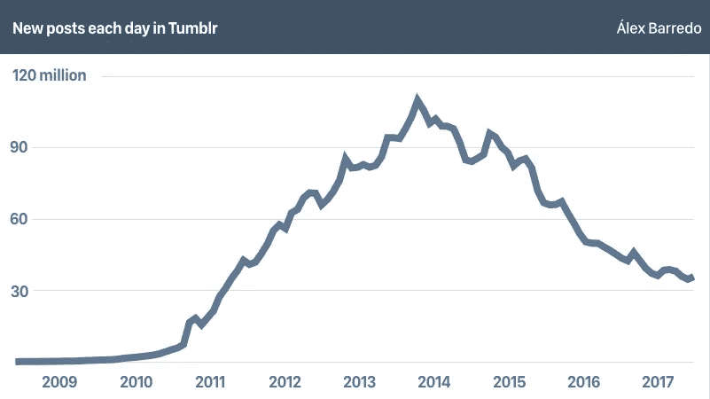
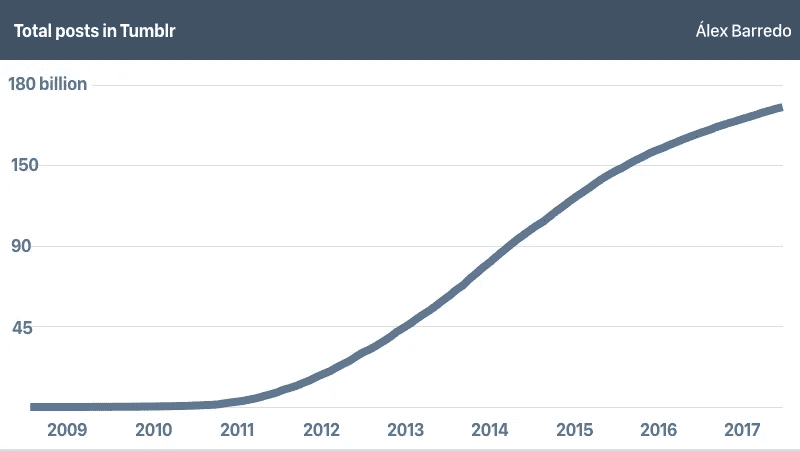

# Tumblr 在翻滚

> 原文：<https://medium.com/hackernoon/tumblr-is-tumbling-d6deb3bb831e>

## Tumblr 是最有创造力和最古怪的人的在线家园，也是社会问题的灯塔，多年来一直在缓慢但持续地衰落。

Álex Barredo

Tumblr 是一些最有创意的在线人物的家园，现在它正在消亡。或者看起来是这样。戴维·卡普于 2007 年初创立了一个真正简化博客的新模式，并迅速发展起来。

随着每一个季度的过去，他们的大部分统计数据都在粉碎它。它是纽约科技界的新星。经过多年的加州垄断(MySpace、Bebo、[、脸书](https://hackernoon.com/tagged/facebook)、Twitter 等)，东海岸终于有了一个好的[社交](https://hackernoon.com/tagged/social)平台。

2013 年 5 月，雅虎[以 1.1 万亿美元](http://money.cnn.com/2013/05/20/technology/yahoo-buys-tumblr/index.html)收购了它:9.9 亿美元加上负债。大多数铁杆支持者对他们新的企业霸主的前景尖叫。雅虎迅速[承诺“不会搞砸”](https://qz.com/735583/marissa-mayer-promised-not-to-screw-up-tumblr-but-she-totally-has/)不再插手 Tumblr，但最终，这无关紧要。

> 雅虎的计划非常简单:(1)购买网站，(2)用雅虎自己的显示业务的广告填充网站，(3)从庞大且不断增长的用户群中获利。**没有发生。**

交易完成后不到一年，Tumblr 的活动达到了顶峰。截至 2014 年 2 月，该平台上每天有超过 1.06 亿条新帖子。如今，这一数字已经减少了三分之二，降至 3500 万左右。

Tumblr peak of activity was between Dec 2013 and February 2014 (Álex Barredo)

这些数字是通过跟踪 Tumblr 上每个新帖子的增量唯一标识得出的。通过与帖子本身的日期进行比较，我们可以知道一天中非常接近准确的帖子数量。这些数据得到了 Tumblr 的[公共统计](https://www.tumblr.com/about)(不经常更新，所以不容易获得准确的数据)的支持，这些数据在不同的历史时期存档在[互联网回溯机](http://archive.org/web/)上。

每天创建的新博客数量也减少了。根据 Tumblr 公共统计数据，每天有超过 13 万个博客被创建。这一指标是 2014 年初巅峰时期的一半，当时每天有超过 24 万个新博客在该平台上打开，下降了 45%。

随着每个月新博客和新帖子的减少，很难看出平台上还剩下多少实际用户。Tumblr 从未公开披露活跃账户数据，这是一种衡量社交平台参与度的半标准方法。

With almost 170 billion posts, Tumblr seems to be at the end of its Sigmoid curve (Álex Barredo)

我们可以尝试用两种方法来猜测确切的用户群。由于每个新用户都有一个博客，我们可以用这个数字作为创建账户总数的上限，但 Tumblr 用户——尤其是最活跃的用户——往往会有几个博客，在每个博客上发布不同的主题，所以这个数字应该被淡化。

Tumblr 从来没有给出一个确切的衡量标准，总是依赖于“数百万的独立访客”。这个数字将平台中的用户与纯粹的外部访问者结合在一起，甚至可以添加从另一个网站的 Tumblr URL 加载 gif 的人。确切的数字仍然是个谜。

雅虎并没有忘记这种下降趋势。2016 年初，它将 Tumblr 的账面价值[降低了 2.3 亿美元，至 7.6 亿美元](https://www.engadget.com/2016/02/03/tumblr-lower-valuation-yahoo/)。在该网站显然无法达到 2015 财年 1 亿美元的收入目标后，这则消息就出来了。当年晚些时候[又进行了第二次减记，减值成本为 4.82 亿美元](https://vulcanpost.com/582639/tumblr-costs-yahoo-another-482-million-what-happened/)。

> 雅虎已经减记了最初为收购 Tumblr 支付的 9.9 亿美元中的 7.12 亿美元

在三年的时间里，Tumblr 在被收购后失去了大部分价值，现在它已经被威瑞森所拥有，对于一个超出大多数人想象的社交平台来说，还有待观察。

威瑞森面临着两难的境地。Tumblr 还是很大，但是增长没那么多了。它似乎处于其 Sigmoid 曲线的末端，其最佳时期早已过去，活动数量也在减少。该平台的广告价值每个月都会下降，这可能会促使其迅速出售给第三方。也许是时候彻底改造了。

后者可能会有所收获。Tumblr 是一个罕见的怪物，因为它从最初的概念开始就没有任何重大变化。这是一个仪表板，用户可以按时间顺序滚动浏览您关注的帐户的帖子和转帖。最近[增加了一种算法驱动的方法](https://staff.tumblr.com/post/166540346380/best-stuff-first)，试图帮助在 gif 和转发的海洋中发现更好的内容，但他们的许多核心用户[并不高兴](https://www.change.org/p/tumblr-remove-tumblr-s-best-stuff-first-option-or-at-least-leave-it-off-by-default)。

也许解决方案不仅仅是“食物”。类似于 Snapchat 和 Instagram 的“故事”格式，是当前仪表板之外的一个新功能，用于增加引擎。这可能有助于 Tumblr 作为一个广告平台，但有疏远用户的风险，同时也不足以吸引新的用户。