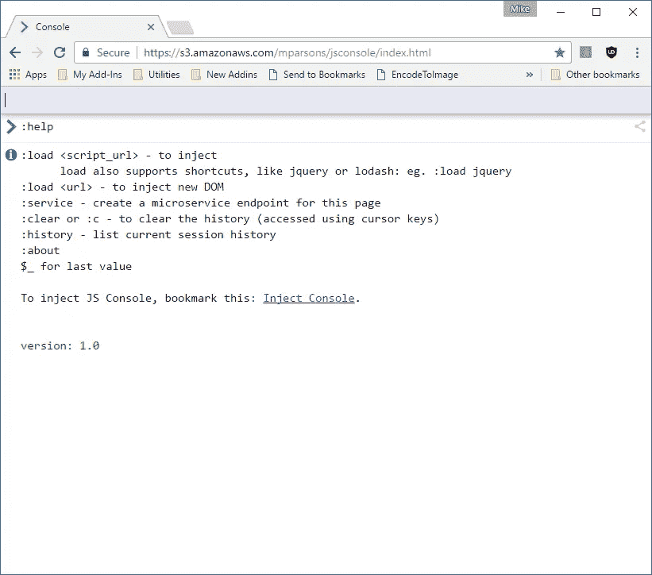
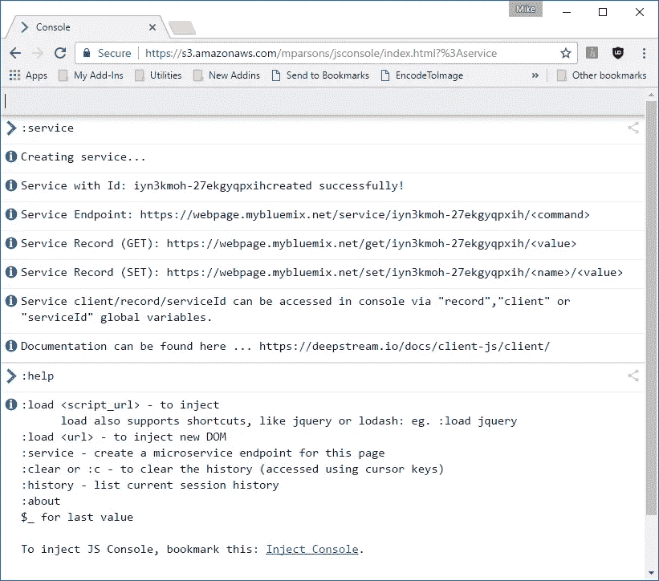
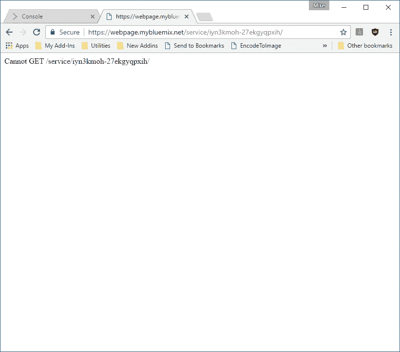
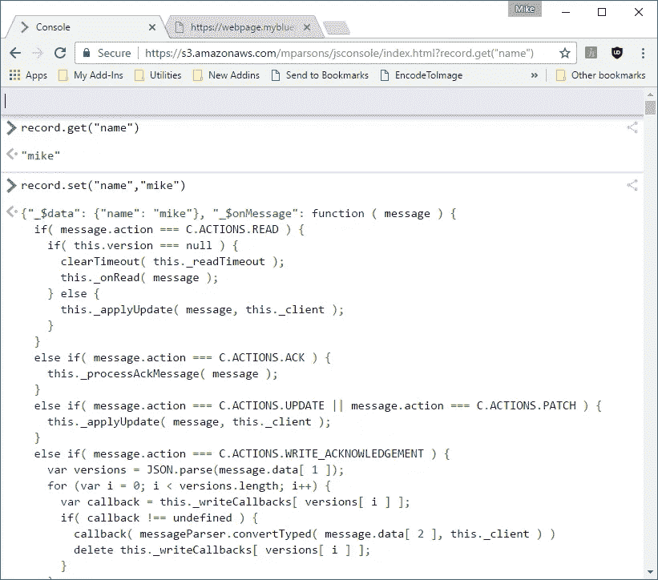
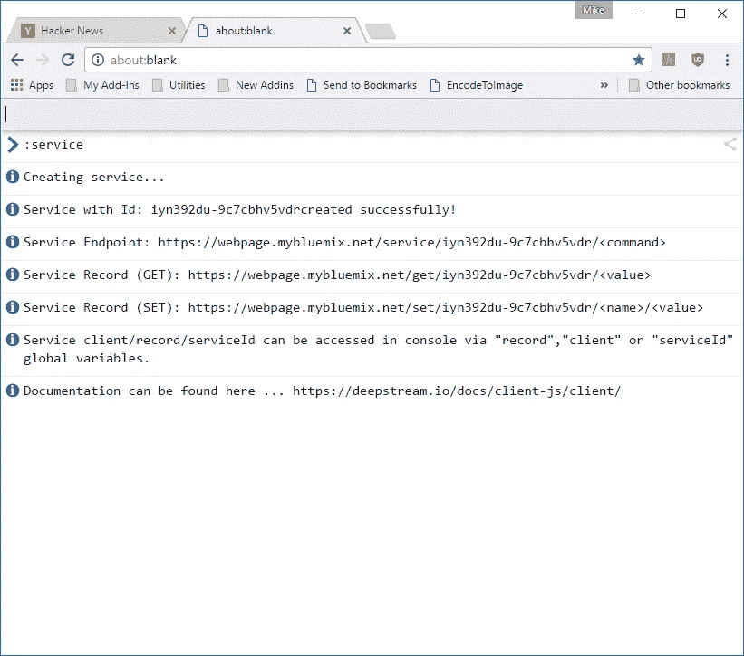
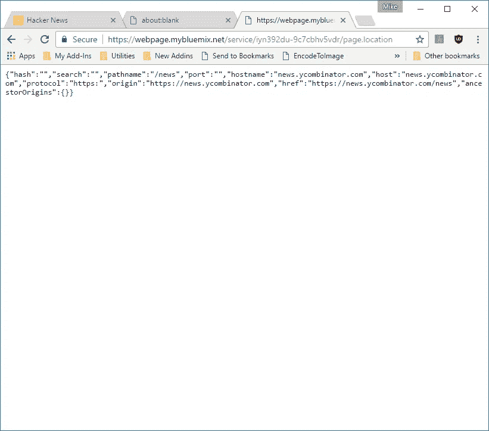
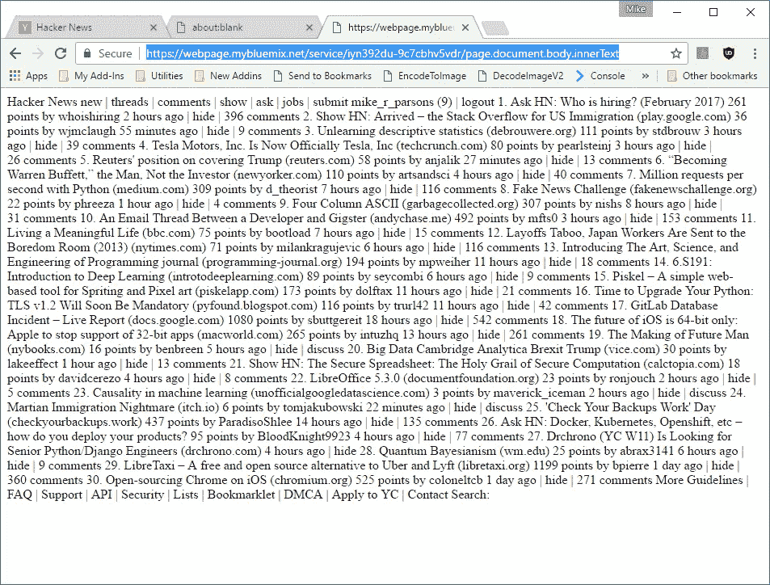
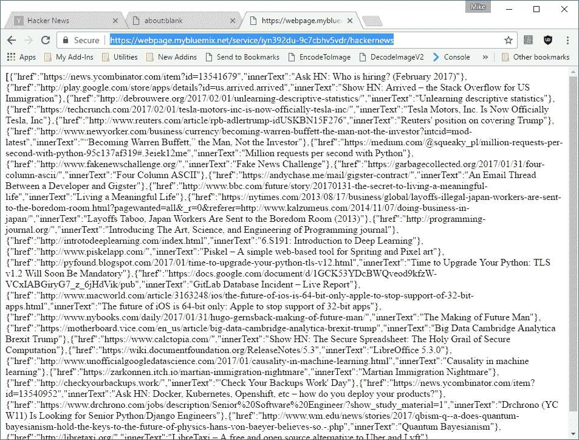

# 将任何网站转变为微服务/无服务器终端。

> 原文：<https://medium.com/hackernoon/turn-any-website-into-a-microservice-serverless-endpoint-4a12446ede7>

全部通过一个单一的命令通过通用 [JavaScript](https://hackernoon.com/tagged/javascript) 控制台- > ***:服务***

如今，无服务器和基于微服务的应用程序风靡一时。无服务器的定义如下:

[](https://martinfowler.com/articles/serverless.html) [## 无服务器架构

### 无服务器架构用一组第三方服务和 FaaS 取代了托管服务器

martinfowler.com](https://martinfowler.com/articles/serverless.html) 

这里的微服务:

[](https://martinfowler.com/articles/microservices.html) [## 微服务

### “微服务”——软件架构拥挤的街道上的又一个新术语。虽然我们的自然…

martinfowler.com](https://martinfowler.com/articles/microservices.html) 

基本上，这些技术都是指在第三方托管环境中托管和运行代码的能力，而不必担心通常与维护自己的服务器相关的所有 devops。两个很好的例子是:

亚马逊λ:

[](https://aws.amazon.com/lambda/) [## AWS Lambda -无服务器计算

### AWS Lambda 允许您在不提供或管理服务器的情况下运行代码。您只需为消耗的计算时间付费…

aws.amazon.com](https://aws.amazon.com/lambda/) 

和微软 Azure 函数:

[](https://azure.microsoft.com/en-us/services/functions/) [## Azure 功能-无服务器架构|微软 Azure

### 借助 Microsoft Azure 功能、无服务器架构、事件驱动的体验，对整个堆栈中的事件做出反应…

azure.microsoft.com](https://azure.microsoft.com/en-us/services/functions/) 

虽然这些环境都很棒，我强烈推荐它们用于生产工作，但它们需要相当多的努力才能启动和运行。其他初创公司提供替代方法，以低得多的“摩擦”进行无服务器计算。这方面的一些好例子有:

[](https://zeit.co/now) [## 现在

### 实时全球部署

zeit.co](https://zeit.co/now)  [## Gomix

### Gomix 将自动部署、即时托管和协作编辑结合在一起，让您直接编码，这样您就可以…

gomix.com](https://gomix.com/) [](https://serverless.com/) [## 无服务器——由 AWS Lambda 和 API Gateway 支持的无服务器应用程序框架

### 构建完全由 AWS Lambda 和 API Gateway 支持的 web、移动和物联网应用

serverless.com](https://serverless.com/) [](https://webtask.io/) [## 网络任务

### 你需要的只是代码！通过 HTTP 调用运行代码。没有供应。没有部署。

webtask.io](https://webtask.io/) 

所有这些解决方案都以最少的设置和配置提供了相当多的功能。

但是，有时您只想使用现有的网站或网页作为某些功能的基础。当您试图从现有网站抓取数据或利用其他开发人员已经构建和部署的一些很酷的 JavaScript 功能时，尤其如此。其他时候，你有一个很棒的想法，想要开发一个应用程序，但你只想快速地构建原型！另一种情况是，您想要托管一些私有的 web 内容，但是您没有 web 服务器或通过浏览器提供这些内容的方法。不管是什么原因，你只是想要快速、简单和随处可得的东西。

我有一个为自己构建的解决方案，我很确定其他开发人员也有类似的问题，可以用它来解决。它基于我在本文中构建和讨论的通用 JavaScript 控制台:

[](https://hackernoon.com/universal-javascript-console-for-browser-electron-nw-js-node-js-and-windows-272e4bd6f9d9) [## 适用于浏览器、电子、NW.js、Node.js 和 Windows 的通用 JavaScript 控制台

### 我喜欢 JavaScript，我喜欢来自一个好的命令行界面的生产力和灵活性。如果你…

hackernoon.com](https://hackernoon.com/universal-javascript-console-for-browser-electron-nw-js-node-js-and-windows-272e4bd6f9d9) 

请花点时间阅读这篇文章，因为我们将要使用的功能取决于您的浏览器中是否有这个 JavaScript 控制台。这就像创建一个 bookmarklet 一样简单，可从以下网址获得:

 [## 安慰

### 编辑描述

s3.amazonaws.com](https://s3.amazonaws.com/mparsons/jsconsole/index.html) 

只需导航到该网站，将 bookmarklet 拖动到您的书签工具栏，如下所示:


一旦安装了 bookmarklet，您就可以导航到任何网站并将 JavaScript 控制台注入到该页面中。

## 注意:使用 bookmarklet 是可选的，您可以简单地导航到控制台 URL 并在“独立模式”下使用它

在我们的第一个示例中，我们将使用独立模式来演示无服务器/微服务功能。因此，请浏览以下网址:

 [## 安慰

### 编辑描述

s3.amazonaws.com](https://s3.amazonaws.com/mparsons/jsconsole/index.html) 

您应该有一个如下所示的窗口:



其中一个命令是 ***:service*** ，它将为这个页面创建一个微服务端点。在控制台中执行该命令，您应该会得到类似如下的结果:



几秒钟后，您应该会看到您的服务已经创建好了，并且描述了各个端点。基本上，这个页面(即 JavaScript 控制台)现在既可以作为 HTTPS 端点，也可以作为微服务端点，可以通过任何计算机或编程语言访问。

## 基本上，您的网页现在可以作为 web 服务器使用了！

要测试功能，请打开另一个浏览器选项卡，并导航到控制台中显示的服务端点。对我来说，这是

https://webpage.mybluemix.net/service/iyn3kmoh-27ekgyqpxih/

当您第一次导航到此 URL 时，您将会看到一条如下所示的消息:



别担心，你的服务没有坏，你只需要提供一个服务命令。当您执行 ***:service*** 命令时，它会创建一个微服务，对您在 URL 上指定的任何命令进行 JavaScript 评估。例如，如果您导航到

[https://网页. mybluemix . net/service/iyn 3 kmoh-27 ekgyqpxih/location](https://webpage.mybluemix.net/service/iyn3kmoh-27ekgyqpxih/location)

您应该会看到类似这样的内容:


基本上，无论您指定什么命令(或代码字符串)，控制台都会尝试并评估它，然后发回一个结果。结果是文本并被 JSON 序列化。请注意，并不是所有东西都可以序列化到 JSON。例如，如果你尝试这样做，

https://网页. mybluemix . net/service/iyn 3 kmoh-27 ekgyqpxih/document

您将得不到预期的结果，因为文档对象不能被 JSON 序列化。

***所以要记住页面的整个对象模型都是可访问的(即窗口对象)，所以你不要在公共互联网上发布你的服务 URL！***

您可以通过在控制台中键入以下代码来立即禁用它:

```
client.rpc.unprovide(serviceId)
```

默认微服务端点定义为:

```
client.rpc.provide(serviceId, (req, res) => {
  var x = '';
  try {
   x = eval(d);
  } catch (e) {
   x = 'Error: ' + e.message
  };
  res.send(x)
});
```

您可以通过在控制台中键入自己的实现来覆盖它，从而提供自己的功能，如下所示:

```
client.rpc.unprovide(serviceId);//echo the command back
client.rpc.provide(serviceId, (req, res) => {
  res.send(d)
});
```

下面是另一个返回当前日期的示例:

```
client.rpc.provide(serviceId, (req, res) => {
   if(req=="date")
      res.send(Date());
   else
      res.send(req +" is an invalid command");
});
```

只要解析在 ***req*** 变量中发送的任何内容，您就可以拥有任意多的端点。例如，您可以使用如下 switch 语句:

```
client.rpc.provide(serviceId, (req, res) => {
 var result="";
 switch (req) {
  case "date":
   result=Date();
   break;
  case "hello":
   result="Hello World!";
   break;
  default:
   result=req +" is an invalid command";
 }
 res.send(result);
});
```

服务实现的功能基于 awesome DeepStream 服务器和相关的 JavaScript 客户端库。

[](https://deepstream.io/docs/client-js/client/) [## Javascript 客户端

### deepstream.io js 客户端的入口点 API 文档

deepstream.io](https://deepstream.io/docs/client-js/client/) 

除了 RPC 功能之外，服务实现还创建了一个 DeepStream 记录，可以通过其端点或控制台中的 ***记录*** 变量来访问该记录。

要通过其端点设置值，调用调用 ***:service*** 命令时提供的 URL:

[https://网页. mybluemix . net/set/iyn 3 kmoh-27 ekgyqpxih/name/Mike](https://webpage.mybluemix.net/set/iyn3kmoh-27ekgyqpxih/name/mike)

其中 ***名称*** 是键， ***麦克*** 是值

要检索该值，请调用以下 URL:

[https://webpage.mybluemix.net/get/iyn3kmoh-27ekgyqpxih/name](https://webpage.mybluemix.net/get/iyn3kmoh-27ekgyqpxih/name)

要在控制台中做到这一点，只需使用 ***记录*** 变量:

```
record.set("name","mike");record.get("name");
```



同样，此功能是由 DeepStream 提供的，因此您可以在此处查看文档:

[](https://deepstream.io/docs/client-js/datasync-record/) [## 记录

### 用于深流记录的 API 文档

deepstream.io](https://deepstream.io/docs/client-js/datasync-record/) 

通过控制台中的 ***客户端*** 变量，可以使用 DeepStream 客户端库提供的所有功能。这包括发布和订阅功能，我们将在另一篇文章中讨论。

**注意:记录是基于服务 id(控制台中的 service id)保存的，因此即使您的控制台会话已经结束，它们也是可用的。如果您返回到同一台机器上相同 URL 的控制台，它应该重用相同的服务 id(它将它存储在 localStorage 中)。**

# 基于现有网页创建服务

在本例中，我们将把控制台注入到一个现有的 Web 页面中，并使用服务功能为该页面创建一个端点。首先，你需要有 ***注入控制台书签*** 如上所述或在本文中

[](https://hackernoon.com/universal-javascript-console-for-browser-electron-nw-js-node-js-and-windows-272e4bd6f9d9) [## 适用于浏览器、电子、NW.js、Node.js 和 Windows 的通用 JavaScript 控制台

### 我喜欢 JavaScript，我喜欢来自一个好的命令行界面的生产力和灵活性。如果你…

hackernoon.com](https://hackernoon.com/universal-javascript-console-for-browser-electron-nw-js-node-js-and-windows-272e4bd6f9d9) 

完成此操作后，导航至

 [## 黑客新闻

### 编辑描述

news.ycombinator.com](https://news.ycombinator.com/news) 

并通过 Bookmarklet 注入控制台。控制台加载完成后，您可以在控制台中键入以下内容，以确保连接到黑客新闻页面:

```
page.location
```

记住 ***页面*** 是对宿主页面上窗口对象的全局引用。

接下来，执行服务命令:

```
:service
```

这将需要几秒钟的时间，但是您应该可以获得关于新创建的服务端点的信息:



要验证端点是否正常工作并连接到主机页面，请打开一个新的浏览器选项卡，导航到控制台中指定的 URL:



现在，您的端点正在工作，您可以通过做一些简单的事情来抓取页面:

[https://网页. mybluemix . net/service/iyn 392 du-9 c 7 cbh V5 VDR/page . document . body . innertext](https://webpage.mybluemix.net/service/iyn392du-9c7cbhv5vdr/page.document.body.innerText)

您应该得到如下所示的内容:



当然，正如我在上面演示的那样，通过覆盖端点实现，您可以变得更加复杂。另外，请记住，您可以通过使用控制台中的 ***:load*** 脚本命令来获取任何您想要的 JavaScript 库。举例来说，下面是利用出色的 AlaSql 库抓取页面并将结果显示为 JSON 的代码:

```
:load alasqlhackernews=JSON.stringify(alasql("select href,innerText INTO JSON({headers:true}) from ? where className='storylink'",[[...page.document.all]]));
```

然后，您应该能够简单地通过它的 URL 访问结果

[https://网页. mybluemix . net/service/iyn 392 du-9 c 7 cbh V5 VDR/hacker news](https://webpage.mybluemix.net/service/iyn392du-9c7cbhv5vdr/hackernews)

听听这个:



注意:您可能需要刷新几次 URL 才能得到结果！

正如你所看到的，这提供了一些非常强大，但访问简单的功能，使原型和黑客超级生产力，我敢说，有趣！

因为我们正在使用 DeepStream 服务器和客户端库来实现这一功能，这也意味着我们可以在浏览器之外访问我们的服务功能，包括在 NodeJS、Java 和本地移动应用程序中。这超出了本文的范围，但是我会有另一篇后续文章来讨论这个问题。为了支持这一点，我还将撰写另一篇文章，介绍我在 IBM Bluemix 中运行的服务器实现。

[](https://www.ibm.com/cloud-computing/bluemix/) [## IBM Bluemix -云基础设施、平台服务、Watson 和更多 PaaS 解决方案

### 使用 IBM Bluemix 混合云开发平台构建和运行您的应用程序，以访问基础设施目录…

www.ibm.com](https://www.ibm.com/cloud-computing/bluemix/) 

同样值得注意的是，因为我们的 JavaScript 控制台是“通用的”，所以服务功能在 electronic、NWJS、NodeJS 以及本地 Windows 应用程序中都是免费的。请参考我之前关于这方面的文章。

最终，这项功能会带来一些成本，因为我必须提供服务器来部署它。如果你喜欢这个功能或者我的任何一篇文章，请考虑给汉普斯特夫妇捐一点钱:-)

[](https://www.paypal.me/michaelparsons) [## 用贝宝支付迈克尔·R·帕森斯。我

### 去 paypal.me/michaelparsons 输入金额。既然是 PayPal，那就简单又安全。没有 PayPal…

www.paypal.me](https://www.paypal.me/michaelparsons) 

谢谢，请推荐并分享这篇文章和我的其他文章:

[](/@mikeptweet) [## 迈克·帕森斯-中等

### 并可选择将其导出到剪贴板或 Excel、JSON、HTML、Tab 或逗号分隔的文件格式！在较早的时候…

medium.com](/@mikeptweet) [](http://bit.ly/HackernoonFB)[](https://goo.gl/k7XYbx)[](https://goo.gl/4ofytp)

> [黑客中午](http://bit.ly/Hackernoon)是黑客如何开始他们的下午。我们是 [@AMI](http://bit.ly/atAMIatAMI) 家庭的一员。我们现在[接受投稿](http://bit.ly/hackernoonsubmission)，并乐意[讨论广告&赞助](mailto:partners@amipublications.com)机会。
> 
> 如果你喜欢这个故事，我们推荐你阅读我们的[最新科技故事](http://bit.ly/hackernoonlatestt)和[趋势科技故事](https://hackernoon.com/trending)。直到下一次，不要把世界的现实想当然！

