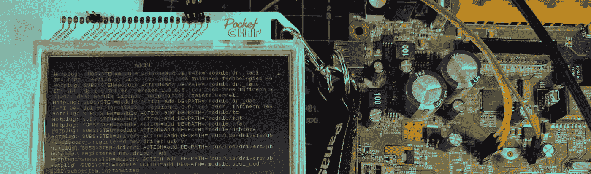
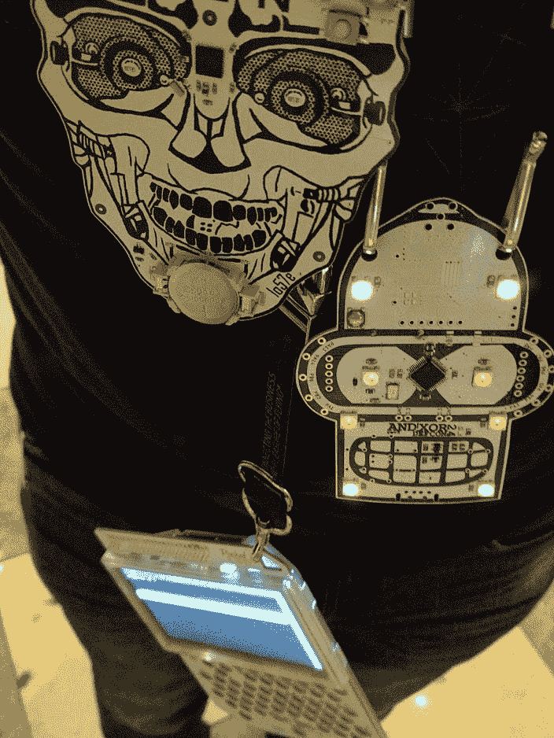
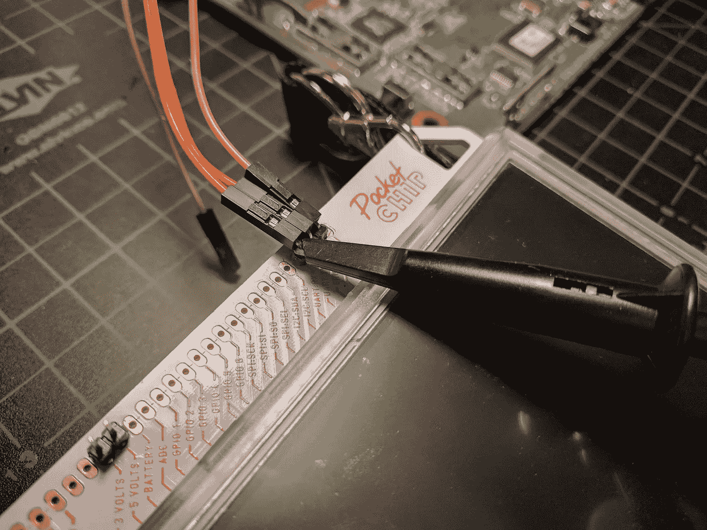
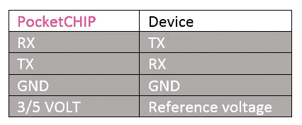
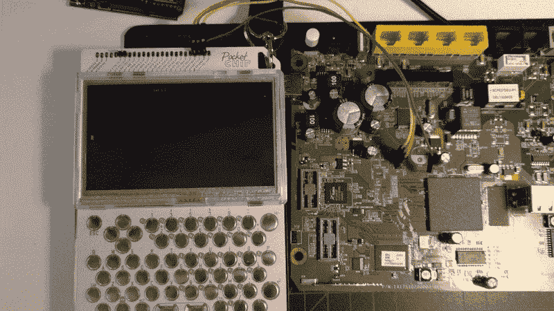

# 把你的袖珍芯片变成一个移动硬件黑客的终端

> 原文：<https://medium.com/hackernoon/turn-your-pocketchip-into-a-badass-on-the-go-hardware-hackers-terminal-84b1edc939f>

一直想有一个[超便携](https://hackernoon.com/tagged/ultra-portable)终端，用于测试自己参与的硬件项目。打开笔记本电脑并使用 USB 来完成一项简单的任务，比如查看终端信息，这种繁琐对于一项如此平凡的任务来说似乎有点过分(而且我的桌子空间总是有限的)。

事实上，当 [PocketCHIP KickStarter 活动](https://www.kickstarter.com/projects/1598272670/chip-the-worlds-first-9-computer)到来时，我正在设计一个基于 Digispark 的解决方案来满足我自己的需求。对我来说，这听起来像是一个更强大的项目(使用一台成熟的计算机，运行一个 Linux 发行版)——尽管是间接地解决了我的需求。

几年前，当它出现在我的桌子上时，我通过几个应用选项实现了这个梦想，并最终以最巧妙的方式拥有了一个移动的、会议厅友好的硬件黑客终端。

L-R: DEFCON 24 (2016) electronic badge, Bender Badge by AND!XOR (v1) — both utilizing UART

在过去的两个 [DEFCONs](https://defcon.org) 中，我一直带着 PocketCHIP 与其他“徽章生活”偶尔出现的新奇事物一起行走，并被要求教授让设备与路由器、电子徽章、物联网设备以及几乎每一种带有终端接口的硬件一起歌唱所需的修修补补。

在这里，我承诺，发布一个关于如何将 PocketCHIP 转化为实用终端的教程 rest。

# 准备电路板

为了使芯片成为真正的便携式解决方案，首先要焊接一些引线。为了以防万一，有些人喜欢把它们安装在最上面一排引脚上。我自己，我更喜欢最小版本。

我们任务感兴趣的管脚是(从左到右): **3 伏**、 **5 伏**、 **RX** 、 **TX** 和 **GND** 。

固定引脚之后，我推荐的一个额外步骤是将分线引脚弯曲 90 度。这实现了三件事:

1.  防止电线阻碍屏幕或键盘；
2.  测试时更容易添加探针；
3.  穿着它的时候，晃来晃去，它不会刺破你的衬衫。

# 释放 PocketCHIP 的 UART 端口

芯片的分线点位于机箱顶部，非常方便，也有 UART 引脚，*但*它们是为了在需要时提供对芯片的串行访问**到**。我们需要定位设备并释放它作为调试接口的状态。

据我所知，这些端口的设备文件路径指定应该在所有 PocketCHIP 固件中是相同的，但在任何情况下，指定它们的快速方法是读取 dmesg 并在/dev 下查找 tty。

在所有情况下，直到现在指定的港口是***【TT y0】***。以下命令考虑到了这一点，如果您的情况不同，您应该修改它以反映端口的变化。

接下来，我们需要解除端口的当前操作，只有这样我们才能利用它们连接到其他设备。

# 穿上裤子去跑步

你需要的最后一件东西是终端仿真器——我选择 minicom，这是一款历史悠久、稳定的基于文本的仿真软件。

要安装它:

首次运行(-s 代表配置菜单):

# 就这样？是的，不是火箭科学！

连接到您最喜欢的串行引脚排列，享受您的便携式生活。根据 UART 规范连接(大多数情况下电压可选):

享受结果吧！

The Moment of Truth

# 附录—系列测试脚本

如果你没有一个暴露的路由器来测试这一切，你可以在你的 [Arduino](https://hackernoon.com/tagged/arduino) 兼容设备上使用下面的脚本，以类似于上表的方式连接它，进行一次安全的测试。