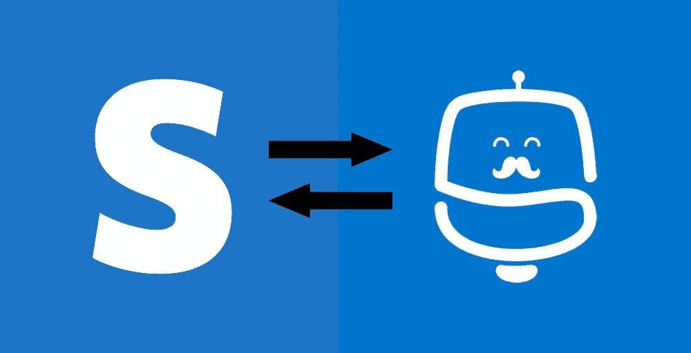
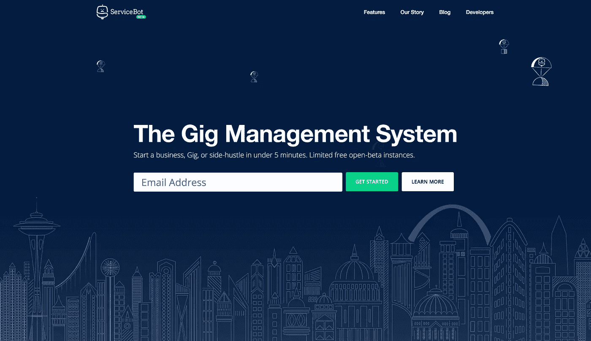
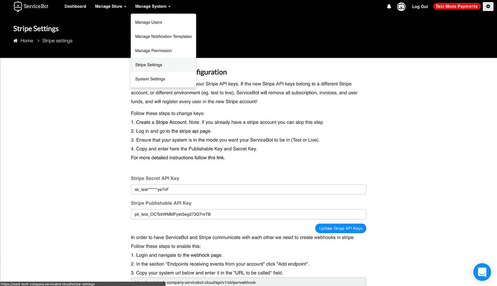

# 将您的 Stripe 帐户转变为在线业务

> 原文：<https://medium.com/hackernoon/turn-your-stripe-account-into-an-online-business-6becd0ee0f8d>

我非常喜欢事物..很简单。我用 [Stripe](https://stripe.com/) 作为支付处理系统来运行我的软件开发业务。 [Stripe](https://hackernoon.com/tagged/stripe) 负责处理我的在线支付，包括客户订阅和定制服务费用。在本文中，我将在不到 3 分钟的时间内解释我是如何使用我们的[开源解决方案](https://servicebot.io)将我的 Stripe 账户转变为在线业务的！不相信我？[我有证据](https://www.youtube.com/watch?v=rVuYvq_B-vk&list=PL0Yv_AvSwjP8rSiX9w39PqnEt5fzhDzbW)！

Flawless Stripe import system with ServiceBot

# 基于订阅的在线业务

如果你拥有一家为客户提供某种服务的企业、演出或副业，那么你可能会有回头客。您可以是每月提供博客服务的博客作者，提供肖像服务的摄影师，或者每月销售服务器、域或任何其他类型的基于订阅的服务的技术企业。

Stripe 已经让事情简单多了。您可以轻松创建付款计划，并在 Stripe 中为客户订阅。Stripe 的订阅系统会在每个计费周期结束时自动向客户收费。它还允许对每次订阅收取额外费用，更改价格，退款，甚至在订阅期内的任何时候向客户提供帐户信用。

如果您想让您的客户无需您的手持设备即可查看付款计划、自行订阅计划、批准额外费用和查看发票，您需要一个与 Stripe 集成的在线网站。一个自动化您基于订阅的在线业务的网站。对于企业来说，自动化可能会变得非常昂贵！

# 可怕的解决方案

有一些现有的解决方案..可怕的。你可以创建一个新的 Wordpress 网站，安装 WooCommerce 插件，将你的 Stripe 帐户附加到上面，然后支付给一家软件公司几千美元来定制这个网站，这样它就可以完美地管理你的订阅并满足你的用例。更不用说，你还得雇个设计师让网店看起来像样点。假设，扩展变得非常困难，很可能会迫使您彻底改变工具。这是一个廉价的肮脏的解决方案。

或者，您当然可以向第三方公司，如[支付您收入的一定比例，以获得部分功能。支付更多，获得更少，后悔放弃了一部分收入。随着您的成长以及希望降低间接成本，这种选择会变得越来越糟糕。](https://www.chargify.com/)

我没有忘记一个自定义网站解决方案。如果你已经掉进了这个兔子洞，就不需要解释了。如果没有，那么我的建议是不要试图重新发明轮子，建立自己的定制解决方案。你最终会花更多的时间来建设和担心你的在线网站，而不是主要业务。

# 解决方案

[ServiceBot](https://servicebot.io) 是一个与您的 Stripe 账户绑定的平台，可导入您现有的所有 Stripe 客户、支付计划、订阅和发票。它还将邀请您的所有客户登录自助服务门户来管理他们现有的订阅。您可以在不到 3 分钟的时间内完成设置…这太强大了！

假设您已经有一个 Stripe 帐户，这个过程很简单。三个简单的步骤:

## 1-创建您的 ServiceBot 网站

第一步，进入 [https://servicebot.io，](https://servicebot.io,)输入你的邮箱地址，选择密码，输入你的企业名称。提交。等待大约 15 秒，你将被重定向到你的新[服务机器人](https://hackernoon.com/tagged/servicebot)网站。

[https://servicebot.io](https://servicebot.io) — Giving out limit open-beta free instances. September 2017

## 2-应用您的条带 API 密钥

第二步，获取你的 [Stripe API 密匙](https://dashboard.stripe.com/account/apikeys)并粘贴到你的 ServiceBot 网站设置页面。

ServiceBot initial setup page. ServiceBot requires you to have an Stripe account.

## 3-导入您的 Stripe 帐户

第三步，使用您的电子邮件和密码登录，单击管理系统>条带设置。按“导入”,您的所有 Stripe 帐户信息将被导入到您的新在线网站。您还可以选择通知您的客户登录他们的新 ServiceBot 帐户并管理他们的订阅！

ServiceBot Stripe Import System.

# 视频演示

我还制作了一个视频向你展示这个过程是多么的快速和简单！

How to turn your Stripe account into a full subscription-based online business

# 结论

ServiceBot 仅仅是一个 8 个月大的项目。它仍然作为测试版运行。我们为每个人提供免费的开放测试版 ServiceBot 网站，以便在推出 ServiceBot 1.0 之前收集反馈并改进软件。你可以从 [https://servicebot.io](https://servicebot.io) 获取你的。

目前我们正专注于我们的插件和集成系统，以及我们新的 NodeJS 框架。

不要忘记查看我们的[开源库](https://github.com/service-bot/servicebot)。如果您有任何问题，请直接联系我。