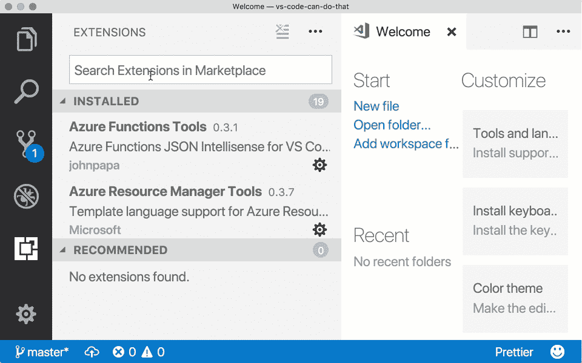
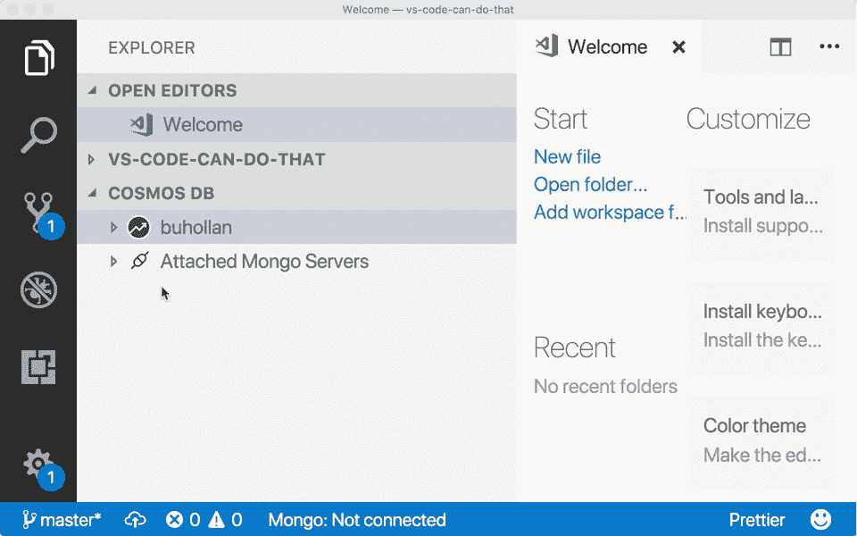
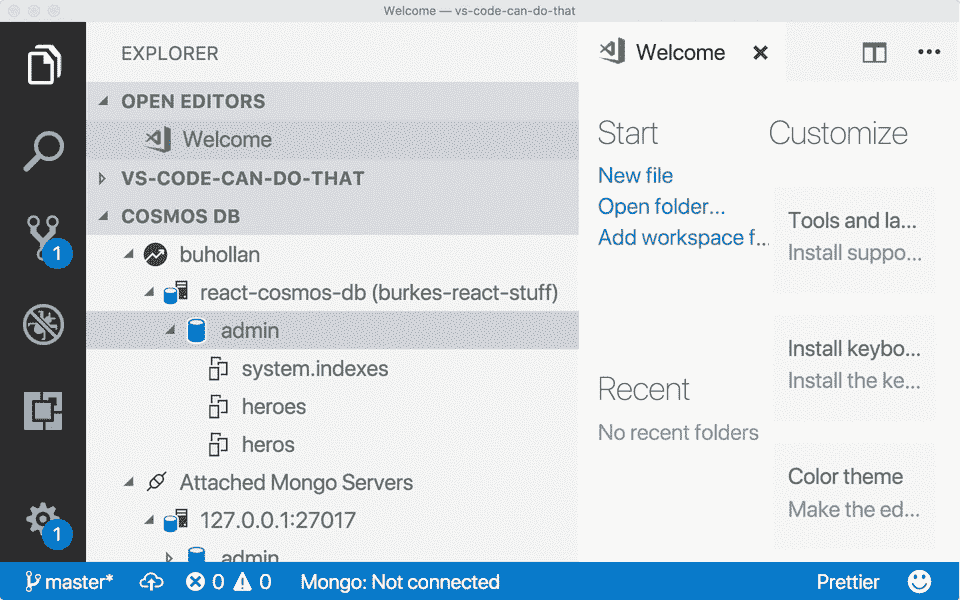
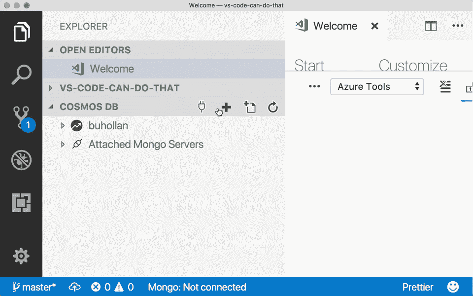
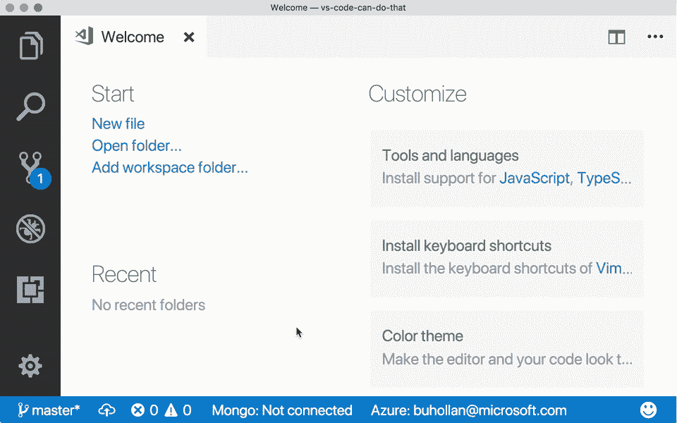
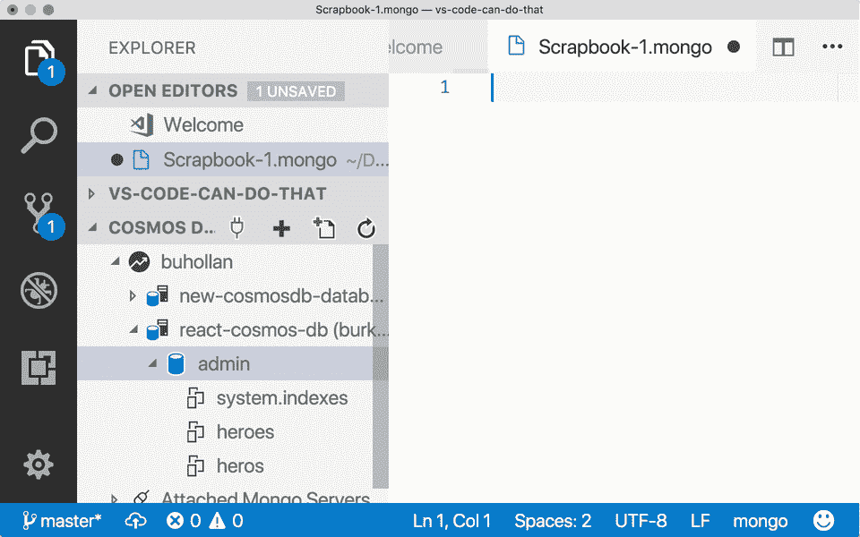
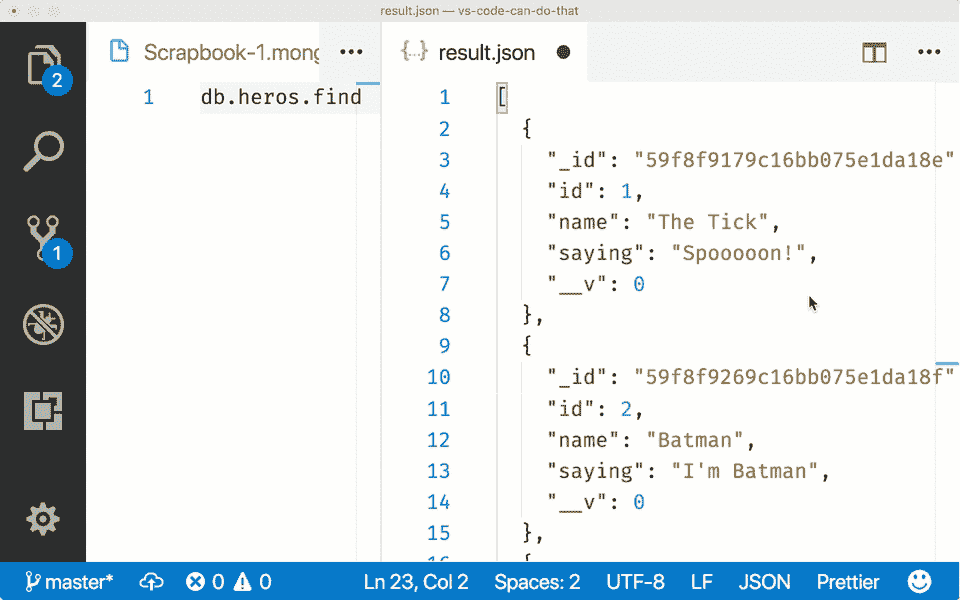

# 将 VS 代码变成黑仔的 MongoDB 管理工具

> 原文：<https://medium.com/hackernoon/turning-vs-code-into-a-killer-mongodb-admin-tool-2514f1596a6c>

自计算机发明以来，盲目使用数据库是每个人最不喜欢的开发部分。这就是我们为 [MongoDB](https://hackernoon.com/tagged/mongodb) 提供数据库管理[工具](https://hackernoon.com/tagged/tools)的原因。然而，在文本编辑器和数据库管理工具之间切换会有一点破坏性。有点像你四岁的孩子走进来，而你正在接受新闻采访。


I love the walk. Such swagger.

但是您知道您可以将 Visual Studio 代码变成一个杀手级 MongoDB 管理工具吗？你可以，你所需要的就是 [Cosmos DB 扩展](https://marketplace.visualstudio.com/items?itemName=ms-azuretools.vscode-cosmosdb)。

# Cosmos DB 扩展

CosmosDB 扩展是由 Microsoft 创建的，以便在 Visual Studio 代码中更容易管理和使用 CosmosDB 数据库。但是由于 CosmosDB 支持 MongoDB API，所以该扩展可以完美地用于任何 MongoDB 数据库。

本文将把 CosmosDB 视为另一个 MongoDB 数据库。你可以在这里得到一个免费的 Azure CosmosDB 数据库。

> 注意，您需要在本地安装 MongoDB 和 Mongo Shell，这样扩展才能工作。社区版会工作得很好，你可以在这里找到它和安装说明。

通过搜索“Cosmos ”,从扩展库中安装 Cosmos DB 扩展。



一旦安装了扩展，您就可以在 Azure 中看到您的任何 CosmosDB 实例，但是您也可以连接到任何 MongoDB 实例——无论是本地的还是远程的。



您只需在边栏中选择收藏，就可以浏览收藏中的数据。



如果使用的是 CosmosDB，可以直接从扩展在 Azure 中创建新的 CosmosDB 数据库。



# Mongo 剪贴簿

Mongo 剪贴簿是测试查询和在 VS 代码中本地处理数据的好方法。创建一个新的剪贴簿，打开命令调板(⌘ + ⇧ + P)和类型“蒙戈”。你会看到一个 Mongo 数据库剪贴簿的选项…



如果 VS 代码询问您的 Mongo DB Shell 路径，您可以在您的用户设置文件(⌘,).在 Mac 上，我的路径是`/usr/local/bin/mongo`。

```
"mongo.shell.path": "/usr/local/bin/mongo"
```

您需要确保您连接到一个 MongoDB 实例，以便使用您的剪贴簿。右键单击侧栏中的一个 MongoDB 数据库，然后选择“Connect”。剪贴簿不仅为所有可用的 MongoDB 方法提供了智能感知，还为您的集合提供了智能感知。

要执行命令，打开命令面板(⌘ + ⇧ + P)，输入“执行”找到“MongoDB:执行命令”动作。或者，你可以只使用⌘ + ⇧ +'键盘快捷键。结果显示在右边的新窗格中。



实际上可以就地编辑这些结果。只需在结果窗格中对文档进行更改，右键单击并选择“更新”。这些更改将被保存到数据库中。



您还可以使用该扩展来打开一个新的 Mongo Shell 会话(集成终端)，通过 URL 连接到 MongoDB 数据库，以及我们在这里已经讨论过的许多其他操作。

# 黑仔

Visual Studio 代码的 CosmosDB 扩展也将您的文本编辑器变成了一个杀手级的 MongoDB 管理工具。这很好，因为使用数据库的最佳位置就是您编写所有代码的地方。