# 教程:在 AWS 上创建和管理 Node.js 服务器，第 1 部分

> 原文：<https://medium.com/hackernoon/tutorial-creating-and-managing-a-node-js-server-on-aws-part-1-d67367ac5171>

# 介绍

运行服务器的方式有很多种，也有很多云平台可以做到这一点。要开始这个系列教程，我将从使用 AWS (Amazon Web Services)管理 EC2 服务器开始，这是最基本的，也可能是运行 Node.js 应用程序最常见的方式。

本教程系列旨在帮助更好地理解基于云的服务器，尽管会有一些小部分展示如何设置一个简单的 Node.js 应用程序。

我发现大多数配置 AWS 或云服务器的教程通常需要相当多的知识，而且可能会令人望而生畏。在很大程度上，字里行间有相当多的含义需要理解。我希望这很容易做到。为了使它尽可能简单，我将考虑 Mac 用户来编写它，但是如果你使用 Linux，那么它将不是一个大问题，我们将仅仅使用 bash 和一个文本编辑器。

这一部分将涵盖

*   启动 AWS 服务器
*   SSH 到您的服务器
*   安装 Node.js
*   创建用静态消息响应的公共 HTTP 端点

# 创建和启动服务器

如果你还没有创建 AWS 账户，打开[https://aws.amazon.com/](https://aws.amazon.com/)，然后选择 ***创建 AWS 账户*** 。按照步骤进行帐户设置。

登录到您的 AWS 帐户后，我们将创建一台 EC2 机器。EC2 代表*亚马逊弹性计算云。*云计算只是亚马逊数据中心中连接到互联网的一批计算机，可以通过使用 AWS 仪表板进行控制。我们将从这些机器中挑选一台，安装好供我们使用。

点击导航栏上的 ***【服务】*** ，选择 ***计算*** 类别下的 EC2。点击 ***启动实例*** 。你将会看到一大堆不同图片的选项。映像是硬盘驱动器的精确副本，可以轻松地加载到空硬盘驱动器上，在这种情况下，它们被用作预设，以便轻松设置您的机器。如果没有至少一个操作系统和 SSH，甚至不可能配置实例，所以一些预置软件是必要的。

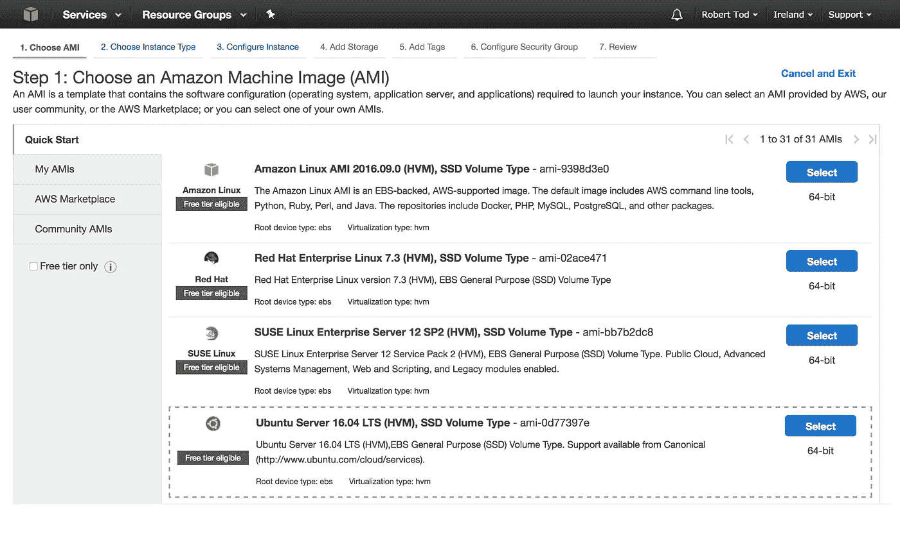

Selecting an image

这些选项包括不同版本的 Windows 和 Linux。大多数服务器运行 Linux，这是开发 Node.js 的一个很好的选择，Windows 服务器只对一些特殊的应用程序有用，比如。净*颤栗*。对于我们将在本教程中做的基本事情，Linux 映像之间没有太大的区别。我选择使用 ***Ubuntu Server*** ，因为它被广泛使用，有大量的指南和大量关于堆栈溢出的问题和答案。

一旦选择了一个图像，我们需要选择一个实例类型。注意，这是一个 ***虚拟服务器*** ，带 ***虚拟 CPU***。虚拟化意味着，虽然看起来我们连接并配置了一台计算机，但实际上 Amazon 将在同一台计算机上运行多个实例，而假装不是这样，这对于扩展和定价来说非常好。让我们选择 ***t2.micro*** ，它符合[免费层](https://aws.amazon.com/free/)的条件，因此如果您的帐户不到 12 个月，您可以免费运行您的服务器。感谢亚马逊！

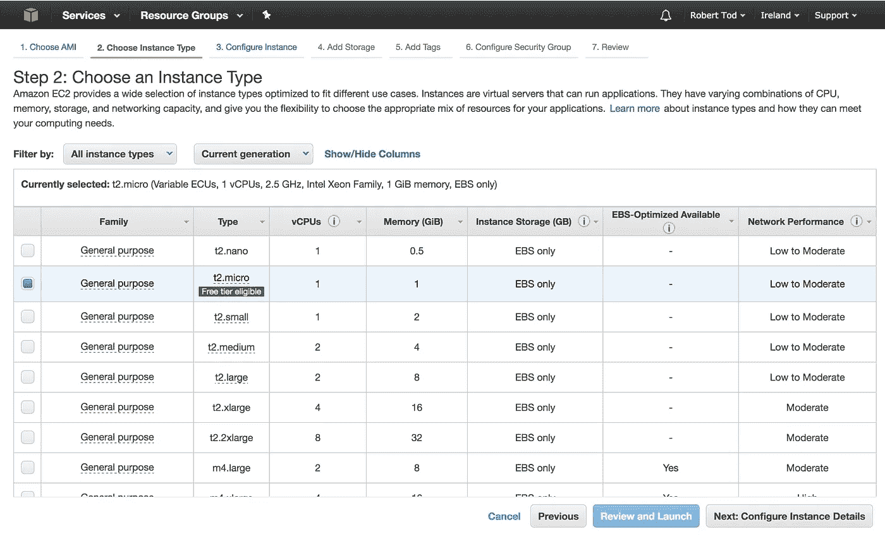

Selecting an instance type

选择实例类型后，点击 ***下一步:配置实例详细信息*** 。接下来的页面更复杂，但是你现在可以忽略它的大部分，我们以后会探索这些选项。

点击 ***下一步:添加存储*** 。默认是 8GB 的固态硬盘，这对我们来说很好。点击 ***下一步:添加标签*** 。我们不需要任何标签，但是当你有大量的实例，并且你需要过滤和搜索它们时，它们是有用的。

点击 ***下一步:配置安全组*** 。安全组是您的服务器的配置，告诉它应该将哪些端口暴露给特定类型流量的哪些 IP 地址。给小组起个有意义的名字，我选了 ***辅导组*** 。

要运行我们的应用程序，我们需要 SSH 访问，默认情况下它位于端口 22，使用 TCP 协议。亚马逊默认为我们添加了这个。有一个关于源是`0.0.0.0/0`的警告，它允许我们从任何 IP 地址进行 SSH，但是这没问题。如果您从 VPN 或公司网络部署和配置您的应用程序，那么您可以只限制该 IP 的 SSH 访问，这是在生产中运行某些东西时的一个很好的安全预防措施，但是 SSH 访问需要正确的 SSH 密钥，因此即使没有这项措施也是完全安全的。

因为我们还想为一个应用程序提供服务，所以我们需要公开一个 HTTP 端口，默认情况下这是端口 80(但是浏览器会去掉这个端口，所以你在 URL 中看不到它)。点击 ***添加规则*** 并选择类型为 ***HTTP*** ，默认设置将使用 TCP 作为协议，并向所有 IP 开放端口 80。

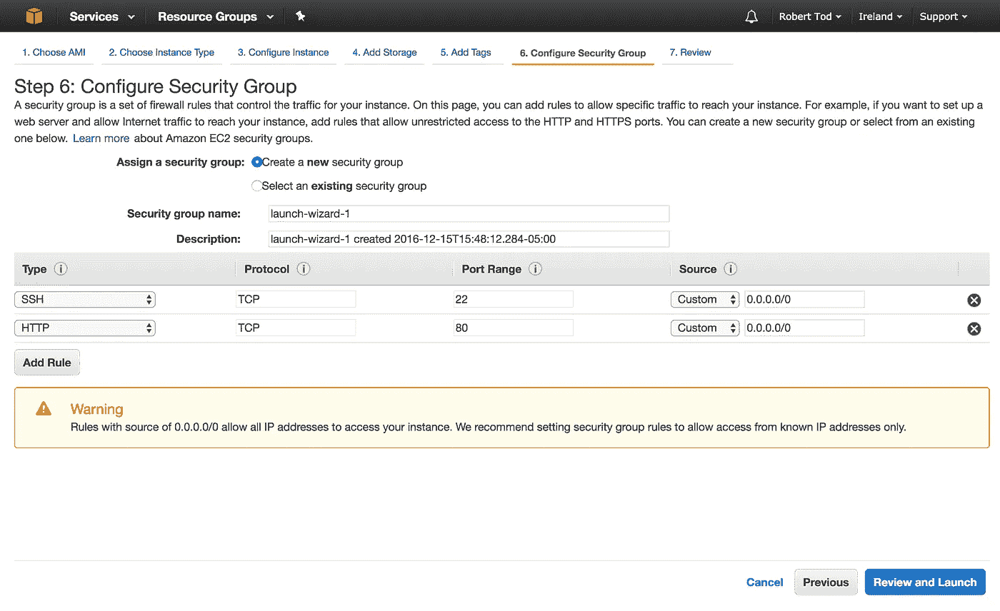

Configuring a security group

要启动实例，点击 ***查看并启动，*** 然后点击 ***启动*** 。将提示您设置一个 SSH 密钥，这将允许您访问实例。选择 ***创建新的密钥对*** ，并给密钥命名，我将其命名为“教程”。点击 ***下载密钥对*** 。这将下载一个. pem 文件，该文件可用于 SSH 到服务器。请妥善保管该文件，因为任何人都可以使用它连接到您的服务器，如果您丢失了该文件，您需要重新生成一个文件。

点击 ***启动实例*** 。点击 ***查看实例*** 。呜！您的实例应该正在启动。一旦 ***实例状态*** 为 ***运行*** 那么你就准备好 SSH 进入了。

***注意:*** 不运行实例时，记得停止它！为此只需右键点击**下的*实例，在*实例状态下**点击 ***停止*** 。

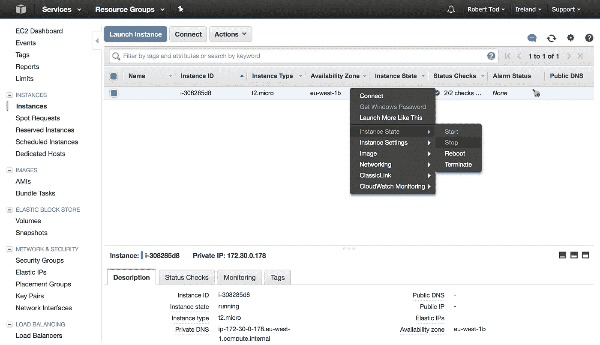

Stopping an instance

# SSH 到您的服务器

通常，放置`.pem`文件的正确位置是在用户目录下的`.ssh`文件夹中。`.ssh`文件夹是一个隐藏文件夹，在 finder open terminal 中打开并执行`open`命令。

```
# The open command will open the
# given path using the default system
# application for the file type. For
# folders it uses finder!
$ open ~/.ssh
```

一旦`.pem`文件在你的 ssh 文件夹中，使用`chmod`来设置权限，这样它就可以被用作一个密钥。

```
$ chmod 400 ~/.ssh/whatever-your-key-name-is.pem
```

对于 SSH，我们需要一个用户名、一个地址和一个密钥。当我们在 EC2 instances 仪表板中单击我们的实例时，该地址是可用的。

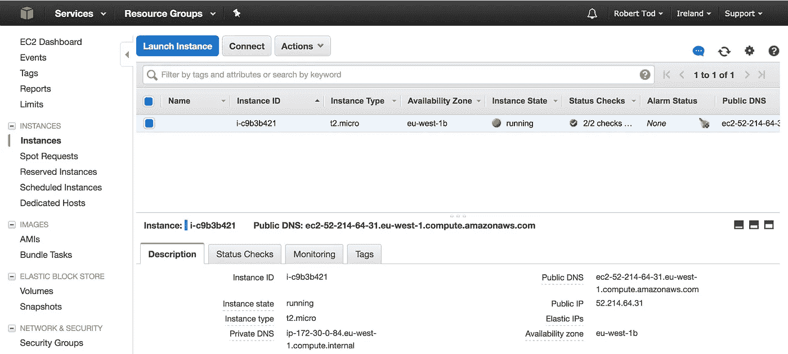

Instance details

我设置的实例有一个我可以用来连接的公共 IP `52.214.64.31`，使用`-i`标志将`.pem`文件作为密钥。

```
# Don't actually run this command
$ ssh -i ~/.ssh/whatever-your-key-name-is.pem 52.214.64.3
```

然而，更正确的做法是使用公共 DNS(唯一真正的区别是，当您从 EC2 机器连接到 EC2 机器时，DNS 将解析为私有 IP，而不是公共 IP)。

```
# Don't run this command either
$ ssh -i ~/.ssh/whatever-your-key-name-is.pem ec2-52-214-64-31.eu-west-1.compute.amazonaws.com
```

快到了。默认情况下，在没有用户名的情况下连接到您的实例会尝试以`root`的身份登录，这通常是不允许的。通过右键单击您的实例并选择 ***连接*** ，我们可以看到正确的用户名是什么。这取决于你选择的图片，对于 ubuntu 用户名默认为`ubuntu`。你可以在 ***示例中看到用户名*** 部分的对话，它是`@`符号之前的部分。

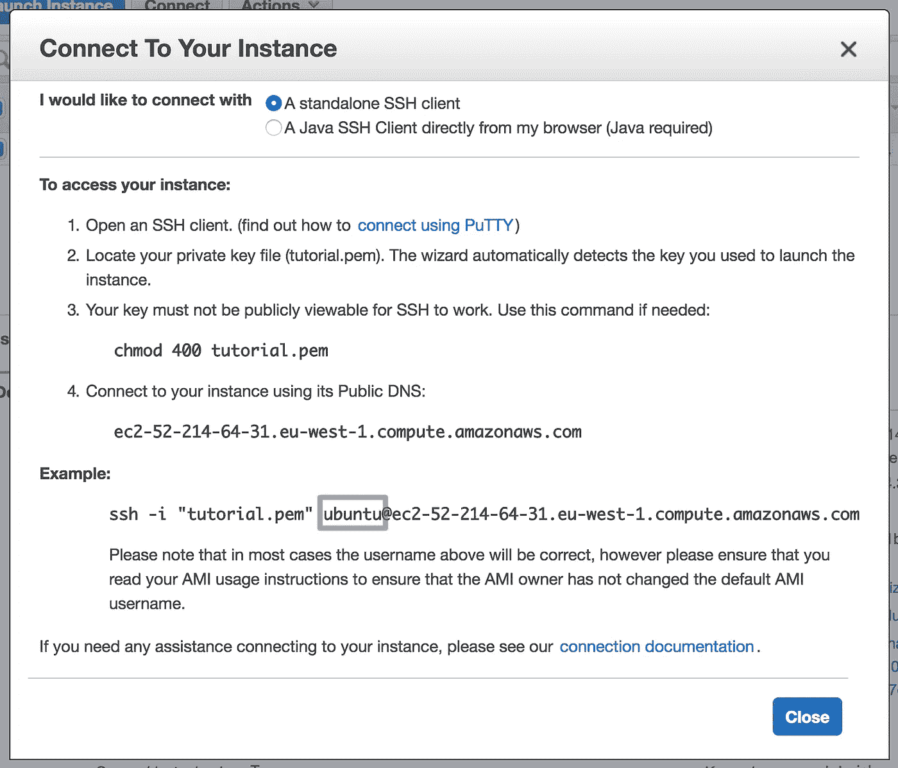

Finding the SSH username

要进行连接，SSH 命令应该类似于

```
# Fill in your specific details for this to work.
$ ssh -i ~/.ssh/whatever-your-key-name-is.pem ubuntu@ec2-52-214-64-31.eu-west-1.compute.amazonaws.com
```

这应该会将您连接到您的实例，只需在提示时键入`yes`，以便您可以将您的实例添加为已知主机。你接通了！

# 安装节点和系统依赖项

在 SSH 会话中，首先要做的是获取 Node.js。[NVM(节点版本管理器)](https://github.com/creationix/nvm)是安装 Node . js 的一种非常好的方式，如果需要，它允许您轻松地切换版本。

要安装 NVM，只需运行此命令(与 NVM 安装说明相同)。

```
$ curl -o- https://raw.githubusercontent.com/creationix/nvm/v0.32.1/install.sh | bash
```

这个命令从远程 URL 下载一个脚本并运行它。你现在有 NVM 了！但是如果你运行`nvm ls`，你会发现它不存在。这是因为 NVM 给你的`~/.bashrc`加了一些代码。这个文件是一个特殊的文件，在您每次登录到您的实例时都会运行，因此要让 NVM 运行，您可以注销并再次登录。然而，您可以使用`source`命令手动运行该文件。

```
$ source ~/.bashrc
```

现在运行`nvm ls`有效！但是没有安装任何节点版本！要获得最新版本，只需`nvm install <latest version number>`。

```
$ nvm install 7
```

要检查节点是否准备就绪，只需回显版本。

```
$ node --version
```

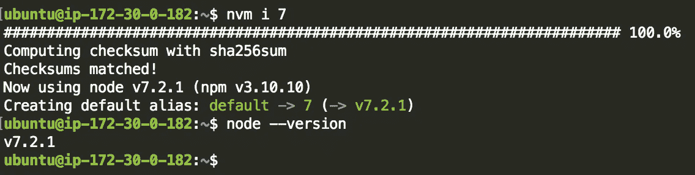

Installing node

Node.js 已安装！

# 创建公共 HTTP 端点

在结束这部分教程之前，我们将创建一个任何人都可以从浏览器请求的公共 URL，以便从服务器获得响应。

为服务器创建一个目录，并将`cd`放入其中。

```
$ mkdir server
$ cd server
```

现在你在你的服务器目录中，你需要`npm init`

```
$ npm init
```

这将创建一个 package.json 文件，用于跟踪我们使用的任何依赖项。`npm init`会询问一系列信息，我倾向于只按`enter`来使用所有的默认值。

运行我们的服务器所需要的就是`express`包。安装`express`并将其添加到`package.json`中。

```
$ npm install express --save-dev
```

注意，现在您应该有一个`node_modules`目录和`package.json`

```
$ ls
```

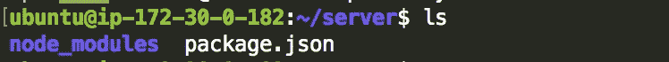

现在我们只需要添加一些代码来运行服务器。我们将使用 nano 在一个`index.js`文件中编写服务器。

```
$ nano index.js
```

我用的服务器只是回应“嘿！”当你向`/`发出请求时。我在端口 3000 上监听请求。

```
const express = require('express')
const app = express()app.get('/', (req, res) => {
  res.send('HEY!')
})app.listen(3000, () => console.log('Server running on port 3000'))
```

按下`ctrl+x`退出，确保通过按下`y`再按下`enter`退出时保存。

现在我们可以使用 node 来启动服务器了！

```
$ node index.js
```

一旦监听，这应该记录“服务器在端口 3000 上运行”。您可能已经注意到，我们没有将服务器流量开放给端口`3000`，而是开放给端口`80`。端口`80`是一个特权端口，在那里使用 Node.js 运行服务器是不常见的，通常使用路由器更好。如果您将`index.js`文件更改为使用`80`，然后运行`node index.js`，您将会注意到一个权限被拒绝的错误。

在下一个教程中，我们将添加一个路由器来使用端口`80`，但是现在让我们打开端口`3000`，这样我们就可以测试我们的服务器了。

让您的服务器保持运行，并转到 EC2 控制台中的**安全组**选项卡。右键单击您设置的安全组，然后单击 ***编辑入站规则*** 。点击 ***添加规则*** 。这次我们将在端口 3000 上使用一个自定义的 TCP 规则，它对任何地方都开放。

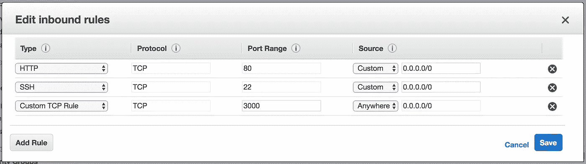

Opening up port 3000 to TCP traffic

单击保存。我们现在应该可以访问我们的服务器了！使用浏览器，使用端口 3000 访问您的公共 DNS URL，您应该会看到`HEY!`响应。

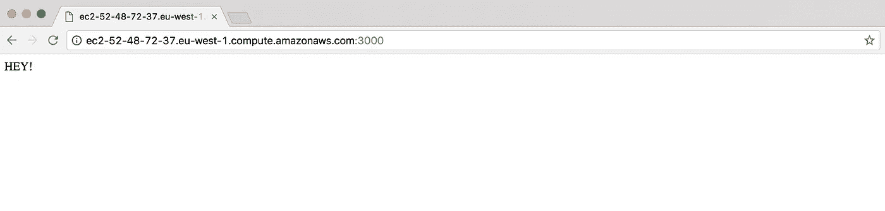

The response from your server

要在我们注销时让服务器继续运行，我们需要按`ctrl+z`来暂停这个过程(这只在您的服务器正在运行时有效，`node index.js`)。当您按下`ctrl+z`时，您将看到所有作业，在这种情况下，只有暂停的 Node.js 作业。

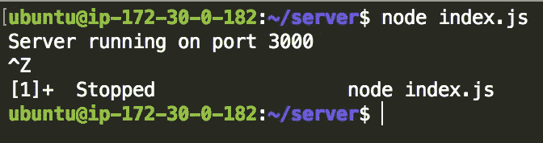

你可以看到`node index.js`的工号是 1(如`[1]+`所示)。要在后台运行，使用`bg`命令。

```
$ bg %1
```

然后注销

```
$ exit
```

你应该仍然能够访问你的网址，并看到“嘿！”回应。

# 结论

如果一切顺利，我们应该有一个简单的 Node.js 应用程序，可以从世界上任何地方的公共 URL 访问它！

要停止实例，只需导航到 EC2 仪表板中的 ***实例*** 选项卡，右键单击您的实例，并在 ***实例*** ***状态*** 中单击 ***停止*** 。

在下一篇教程中，我打算介绍

*   使用 nginx 在端口 80 上运行应用程序
*   使用 PM2 在重启后保持应用程序运行
*   使用 PM2 从本地目录部署应用程序

如果我错过了什么或者有点困惑，请在评论区告诉我！

[第 2 部分现已推出。](/@bobtodski/tutorial-creating-and-managing-a-node-js-server-on-aws-part-2-5fbdea95f8a1#.mnlkymeti)

[](http://bit.ly/HackernoonFB)[](https://goo.gl/k7XYbx)[](https://goo.gl/4ofytp)

> [黑客中午](http://bit.ly/Hackernoon)是黑客如何开始他们的下午。我们是 T21 家庭的一员。我们现在[接受投稿](http://bit.ly/hackernoonsubmission)并乐意[讨论广告&赞助](mailto:partners@amipublications.com)机会。
> 
> 如果你喜欢这个故事，我们推荐你阅读我们的[最新科技故事](http://bit.ly/hackernoonlatestt)和[趋势科技故事](https://hackernoon.com/trending)。直到下一次，不要把世界的现实想当然！

