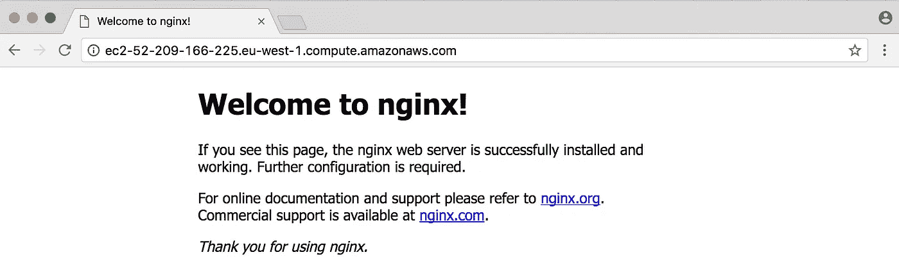
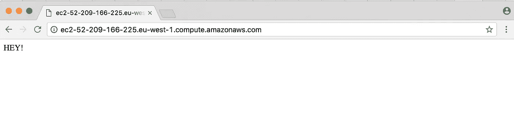
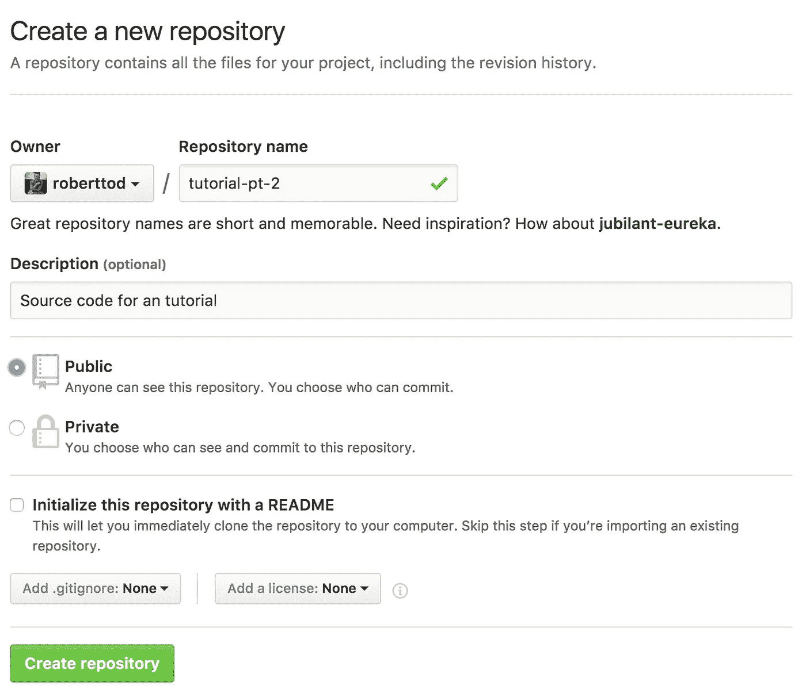
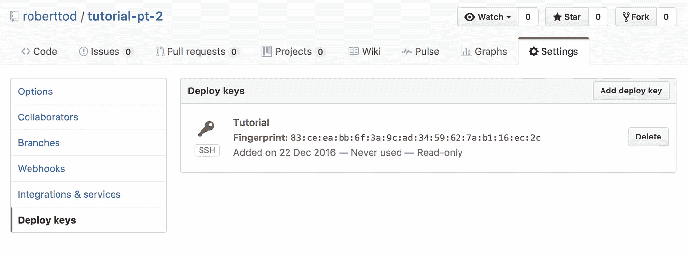

# 教程:在 AWS 上创建和管理 Node.js 服务器，第 2 部分

> 原文：<https://medium.com/hackernoon/tutorial-creating-and-managing-a-node-js-server-on-aws-part-2-5fbdea95f8a1>

在第 1 部分中，我们启动了一个服务器，在端口 3000 上响应 HTTP 请求。在本教程中，我们将看 4 个概念

*   在标准端口上提供 HTTP 流量，`80`
*   保持 Node.js 进程运行
*   将代码部署到服务器中
*   提供一些 HTML

# 在标准端口上提供 HTTP 流量，80

将此 URL 粘贴到新选项卡的 URL 栏中。

```
[http://imgur.com:80/](http://imgur.com:80/)
```

你会注意到`80`被放到了地址栏中。这是因为端口`80` 是 HTTP 流量的默认端口。

HTTPS 交通用港`443`。试试黑客新闻。

```
[https://news.ycombinator.com](https://news.ycombinator.com/)[:443/](https://www.google.com:443/)
```

因为这些端口通常是公共的，所以您需要特殊权限来运行使用它们的进程。此外，在端口`80`或`443`上直接运行 Node.js 并不好，因为你可能想在这些端口上打开一些不同的应用程序。有了路由器，你将能够从端口`80`或`443`向任何你想要的程序发送流量，这取决于传入的 HTTP 请求的报头。

对于路由器来说，很少有很好的选择，但是我发现 nginx 对于大多数事情来说是最好的工具。它非常适合构建您的第一个应用程序，或者当您需要扩展到数百万访问者时。

在开始之前，如果你的服务器已经停止，启动它并 SSH 进入(如上一个教程所示[)。一旦登录，我们就可以安装 ***nginx*** 。](https://hackernoon.com/tutorial-creating-and-managing-a-node-js-server-on-aws-part-1-d67367ac5171)

Ubuntu 自带包管理器， ***apt-get*** 。使用 ***apt-get*** ，我们可以在一个命令中安装 ***nginx*** 。

```
sudo apt-get install nginx
```

大多数 Linux 发行版都有一个包管理器，所以如果 ***apt-get*** 不起作用，就用谷歌搜索你的版本。 ***apt-get*** 在安装后会自动运行 nginx，所以你现在应该让它在端口`80`上运行，通过在浏览器中输入你的公共 DNS URL 进行检查。



Default nginx page

如果这不起作用，您可能需要手动启动它。

```
sudo /etc/init.d/nginx start
```

如果你仍然不能到达服务器，那么检查堆栈溢出或在这里发表评论。

我们需要配置 ***nginx*** 将端口`80`的流量路由到端口`3000`。 ***nginx*** 将 config 放在了`/etc/nginx/sites-available`文件夹中，那里已经有一个默认的 config 服务于我们之前看到的 ***nginx*** 欢迎页面。

您可以使用 cat 查看这个配置。

```
cat /etc/nginx/sites-available/default
```

如何设置 ***nginx*** 配置？配置以任何名称存储在`sites-available`的纯文本文件中。将它们链接到`sites-enabled`文件夹会导致它们在 ***nginx*** 启动时被读取和使用。所有的配置通过 ***nginx*** 组合在一起。

让我们首先从`sites-enabled`中删除默认配置，我们将把它留在`sites-available`中以供参考。

```
sudo rm /etc/nginx/sites-enabled/default
```

在`sites-available`中创建一个配置文件，并随意命名。

```
sudo nano /etc/nginx/sites-available/tutorial
```

下面是我们将要使用的配置。

```
server {
  listen 80;
  server_name tutorial;
  location / {
    proxy_set_header  X-Real-IP  $remote_addr;
    proxy_set_header  Host       $http_host;
    proxy_pass        [http://127.0.0.1:3000;](http://127.0.0.1:3000;)
  }
}
```

这将把所有 HTTP 流量从端口`80`转发到端口`3000`。

链接`sites enabled`中的配置文件(这将使文件看起来像是在`sites-enabled`中实际复制的)。

```
sudo ln -s /etc/nginx/sites-available/tutorial /etc/nginx/sites-enabled/tutorial
```

如果不熟悉符号链接，请在此阅读更多相关内容。

重启 ***nginx*** 让新配置生效。

```
sudo service nginx restart
```

如果自上一教程以来您没有停止/启动服务器，那么您的节点应用程序可能仍在运行。

```
# list background jobs
jobs
```

如果您的应用程序出现，那么没有必要再次运行它。如果它没有运行，那么您需要启动它。

```
node tutorial/index.js
```

一旦服务器开始运行，按下`ctrl+z`，然后作为后台任务恢复运行。

```
bg %1
```

现在使用端口`80`访问您的服务器的公共 DNS URL。



服务器正在端口`80`上运行！

# 保持 Node.js 进程运行

使用`ctrl+z`暂停一个进程，然后在后台运行它，这相当繁琐。此外，这样做不会允许 Node.js 进程在更新或崩溃后重新启动服务器时重新启动。

在继续之前，停止正在运行的节点进程

```
# Nukes all Node processes
killall -9 node
```

为了保持这些进程的运行，我们将使用一个名为 [PM2](http://pm2.keymetrics.io/) 的伟大的 NPM 包。在 SSH 会话中，全局安装 PM2。

```
npm i -g pm2
```

要启动您的服务器，只需使用`pm2`来执行`index.js`。

```
pm2 start tutorial/index.js
```

若要确保 PM2 在服务器重新启动时重新启动

```
pm2 startup
```

这将打印出一行代码，根据您使用的服务器，您需要运行这些代码。运行它输出的代码。

最后，保存当前正在运行的进程，以便它们在 PM2 重新启动时运行。

```
pm2 save
```

就是这样！您可以注销/登录 SSH，甚至重启您的服务器，它将继续在端口 80 上运行。

要列出所有进程，请使用

```
pm2 ls
```

您的进程将有一个非常通用的名字，类似于`index`，如果服务器上还运行着其他一些微服务，这将很难区分。让我们停止这个过程，删除它，用一个更好的名字重新开始。

```
# Use the number listed in pm2 ls
# to stop the daemon
pm2 stop index# Remove it from the list
pm2 delete index# Start it again, but give it a
# catchy name
pm2 start tutorial/index.js --name “Tutorial”
```

太好了！查看 [PM2 文档](http://pm2.keymetrics.io/),看看你还能用流程管理做些什么。

# 将代码部署到服务器中

让我们不要在 SSH 会话中编写代码，而是将代码推送到 Github 中的 git repo，SSH 到服务器中并拉入新代码。

去 [Github](https://github.com/) 或者你最喜欢的源码控制网站，登录并创建一个新的存储库，命名为你喜欢的。如果你不能保密，那就公开吧(没关系，反正没人会看)。



在本地创建一个新的目录，放入你喜欢的代码项目**(顺便说一下，要退出一个 SSH 会话，只需键入`exit`)。我兴致勃勃又充满想象力地给我的命名为“tutorial-pt-2”。**

```
cd ~/Code
mkdir tutorial-pt-2
cd tutorial-pt-2
```

现在设置您的源，进行一次空提交并将其向上推，将您的上游分支设置为主分支。

```
git init
git commit --allow-empty -m "Well this is my first commit, *yay*"# Use your repo's origin URL here
git remote add origin [git@github.com](mailto:git@github.com):roberttod/tutorial-pt-2.git
git push -u origin master
```

[从一个空的提交开始很好](https://coderwall.com/p/m_pgbg/start-git-repos-with-an-empty-commit):)。

像我们在服务器上做的那样，运行`npm init`，然后使用上一篇教程中的相同代码创建一个`index.js`文件。 ***P.S .我故意漏掉了*** `***;***` ***s，检出了*** [***标准样式***](https://github.com/feross/standard) ***。***

```
const express = require('express')
const app = express()
app.get('/', (req, res) => {
  res.send('HEY!')
})app.listen(3000, () => console.log('Server running on port 3000'))
```

NPM 快速安装

```
npm install express --save
```

另外，让我们添加一个`.gitignore`文件，这样我们就不会签入`node_modules`目录。`.DS_Store`文件总是被 OSX 添加到目录中，它们包含文件夹元数据。我们也想忽略这些。

```
node_modules
.DS_Store
```

一般来说，最好只签入你真正需要签入的代码，如果你发现自己的 git repo 中有大量复制的或库代码，那么可能有更好的方法。

现在添加你所有的代码并把它推上来

```
git add .
git commit -m "Ze server."
git push
```

现在我们需要将代码放入服务器。这就是事情有点棘手的地方。

我们需要 SSH 进入服务器，生成一个 SSH 私有/公共密钥对，然后将其作为部署密钥添加到源代码控制中(即 Github)。只有当服务器被允许访问远程 repo 时，它才能够克隆代码并下载更改。

SSH 到您的服务器并生成密钥对。

```
# When prompted, use the default name.
# No need for a pass phrase.
ssh-keygen -t rsa
```

显示文件的内容

```
cat ~/.ssh/id_rsa.pub
```

选择密钥的内容并将其复制到 Github 中。部署键添加到 repo 设置中的 ***部署键*** 部分。



粘贴您的密钥，并将其命名为有意义的内容。

每当您通过 SSH 登录时，您都希望添加密钥，以便使用它们对 Github 进行认证。为此，将这些行添加到您的`~/.bashrc`文件的顶部。

```
# Start the SSH agent
eval `ssh-agent -s`# Add the SSH key
ssh-add
```

这将确保您在登录服务器时使用这些密钥。要在不注销的情况下运行代码，请执行`.bashrc`文件

```
source ~/.bashrc
```

现在我们可以克隆回购协议了！删除服务器和用户目录中以前的任何代码，克隆 repo

```
# You should use your own git URL.
git clone git@github.com:roberttod/tutorial-pt-2.git
```

如果成功的话，它会允许你输入“yes”将 github 添加为一个已知的主机，然后回购将被下载。

在一个美好的世界里，我们喜欢完全避免使用 SSH。对于部署，我们将使用 PM2，以便在服务器上克隆 git，并提供一些额外的功能。

在使用 PM2 之前，将刚刚从 git 中提取的代码删除到服务器中。

```
rm -rf ~/tutorial-pt-2
```

当您仍在 SSH 会话中时，请确保 PM2 上没有正在运行的进程，如果有，请删除它们。

```
pm2 ls# Only do this if a task is still running
pm2 delete tutorial
```

在项目的本地版本中，全局安装 PM2

```
npm i -g pm2
```

现在我们需要添加一个 PM2 可以读取的配置文件，以便它知道如何部署。

PM2 配置在 [PM2 文档](http://pm2.keymetrics.io/docs/usage/application-declaration/)中有完整解释。配置文件可以自动生成，但我更喜欢从头开始创建自己的文件，避免任何我不需要的配置。

配置文件应该被命名为`ecosystem.config.js`，看起来应该像这样

```
module.exports = {
  apps: [{
    name: 'tutorial-2',
    script: './index.js'
  }],
  deploy: {
    production: {
      user: 'ubuntu',
      host: 'ec2-52-209-166-225.eu-west-1.compute.amazonaws.com',
      key: '~/.ssh/tutorial-2.pem',
      ref: 'origin/master',
      repo: '[git@github.com](mailto:git@github.com):roberttod/tutorial-pt-2.git',
      path: '/home/ubuntu/tutorial-2',
      'post-deploy': 'npm install && pm2 startOrRestart ecosystem.config.js'
    }
  }
}
```

您需要在配置文件中添加您自己的主机。

PM2 如何使用这个配置文件？当您运行`pm2 deploy ...`时，PM2 ssh 到您的服务器，将您的 repo 克隆到`path`中指定的目录，然后它在服务器上运行`post-deploy`(因此它使用服务器上全局安装的 PM2 启动您的服务器)。部署之后，您将能够在服务器上运行`pm2 ls`来查看所有正在运行的应用程序，它们的名称将与配置文件中指定的名称相同。

文件保存后，在遥控器上设置目录

```
pm2 deploy ecosystem.config.js production setup
```

如果遇到任何认证问题，回头看看 SSH 代理的设置，确保没有遗漏任何东西。

设置完成后，提交并推送你的更改到 Github，这样当它克隆时就会得到你的`ecosystem.config.js`文件，这个文件将被用来在服务器上使用 PM2 启动你的应用。

```
git add .
git commit -m "Setup PM2"
git push
```

现在您可以运行部署命令了

```
pm2 deploy ecosystem.config.js production
```

这应该会出现一个错误，那就是没有找到`npm`。

出现这种情况的原因是因为服务器的`.bashrc`文件中的一些代码。如果 shell 不是 ***交互*** ，这段代码会停止文件的运行。与使用`ssh`不同，PM2 使用 ***非交互式*** 外壳登录服务器。NVM 设置在`.bashrc`文件中，所以 PM2 没有运行 NVM，这增加了`npm`可执行文件(因此出现了 PM2 的错误)。阅读更多关于交互式/非交互式外壳的信息。

SSH 进入您的服务器并打开`~/.bashrc`文件。排除 ***非交互*** 会话的代码在顶部附近。

```
# If not running interactively, don't do anythingcase $- in
  *i*) ;;
  *) return;;
esac
```

这个代码是一些神奇的巴什狗屎。我们所要做的就是将 NVM 代码移动到这个代码上面，这样它总是会执行。找到下列行，并将其移动到 case 语句的上方

```
export NVM_DIR="/home/ubuntu/.nvm"
[ -s "$NVM_DIR/nvm.sh" ] && . "$NVM_DIR/nvm.sh"  # This loads nvm
```

保存并退出。

回到本地终端，再次尝试运行 PM2 部署

```
pm2 deploy ecosystem.config.js production
```

这次应该管用！并且当您在浏览器中签入时，您的服务器应该仍在运行。

在服务器上使用全局 PM2，在客户机上使用全局 PM2 有点麻烦。如果我们的代码使用 PM2 包的本地版本会更好。为此，向您的`package.json`添加一个`deploy`和`restart`脚本

```
...
  "main": "index.js",
  "scripts": {
    "restart": "pm2 startOrRestart ecosystem.config.js",
    "deploy": "pm2 deploy ecosystem.config.js production",
    "test": "echo \"Error: no test specified\" && exit 1"
  },
  "repository": {
...
```

使用`--save-dev`在本地安装 PM2 并保存

```
npm i pm2 --save-dev
```

对于那些不太熟悉 NPM 的人来说，添加`--save`或`--save-dev`会添加这个包，以及`package.json`的版本号。`package.json`文件中的任何包都会在运行`npm install`时被安装，这发生在 PM2 `post-deploy`。

在部署之前，提交您的所有更改并推送到 git。

当你运行`npm deploy`时，它将使用 PM2 的本地版本。整洁！

```
npm run-script deploy
```

如果你发现你的应用没有运行，检查你服务器上的 PM2 日志，位于`~/.pm2/logs/`。

要确保应用程序在服务器重启时重启，请使用 SSH 重新进入服务器并运行

```
pm2 save
```

唯一运行的 PM2 进程应该是您部署的服务器，因此 PM2 将确保它始终保持运行。

# 提供 HTML

在结束本教程之前，让我们使用我们的部署设置来更改服务器，使其服务于 HTML，而不只是用“嘿”来响应。

删除`/`的路由处理程序，并设置一个静态目录，express 将使用该目录来提供静态文件。

```
const express = require('express')
const app = express()app.use(express.static('public'))
app.listen(3000, () => console.log('Server running on port 3000'))
```

通过用“public”调用`express.static`，静态文件将从`public`目录提供。如果我们在`/public`中添加一个`index.html`，那么这将由 express 在`/`中自动提供(如果我们留下一个自定义的`/`处理程序，那么它将覆盖这个功能)。

在`public/index.html`中保存一个简单的 HTML 文件

```
<!DOCTYPE html>
<html>
  <head>
    <title>Erm hey.</title>
  </head>
  <body>
    
  </body>
</html>
```

提交这些更改(也许您可以通过在本地运行`node index.js`并访问 [http://localhost:3000](http://localhost:3000) 来检查服务器是否仍然工作)。

部署变更

```
npm run-script deploy
```

您的服务器现在将使用您的静态 HTML 页面进行响应。


# 结论

您现在应该有一个简单的 express 应用程序，它很容易部署在 EC2 上，运行在端口`80`上。我公开了我的源代码，以防你想看一看[https://github.com/roberttod/tutorial-pt-2](https://github.com/roberttod/tutorial-pt-2)。

如果你喜欢这个教程，我正在做更多的解释[如何用 MySQL](/@bobtodski/setting-up-node-js-with-a-database-part-1-3f2461bdd77f) 设置节点。

[](http://bit.ly/HackernoonFB)[](https://goo.gl/k7XYbx)[](https://goo.gl/4ofytp)

> [黑客中午](http://bit.ly/Hackernoon)是黑客如何开始他们的下午。我们是 [@AMI](http://bit.ly/atAMIatAMI) 家庭的一员。我们现在[接受投稿](http://bit.ly/hackernoonsubmission)，并乐意[讨论广告&赞助](mailto:partners@amipublications.com)机会。
> 
> 如果你喜欢这个故事，我们推荐你阅读我们的[最新科技故事](http://bit.ly/hackernoonlatestt)和[趋势科技故事](https://hackernoon.com/trending)。直到下一次，不要把世界的现实想当然！

