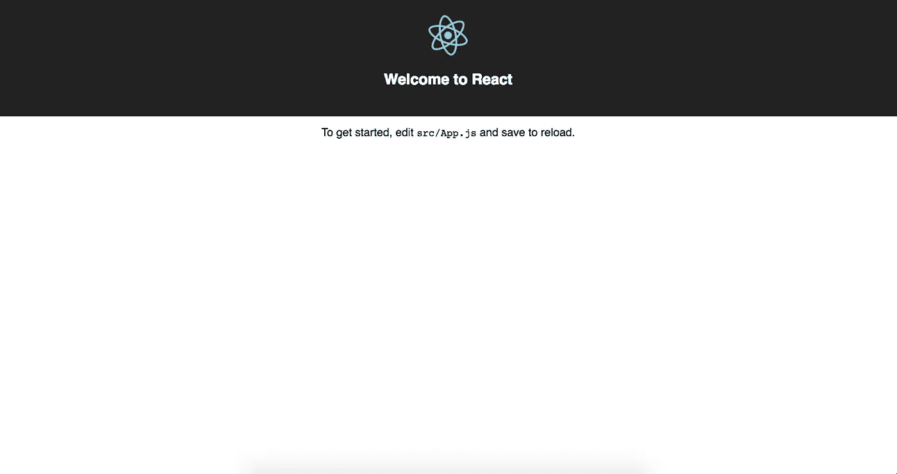

# 教程:如何在 React 中发出 HTTP 请求，第 1 部分

> 原文：<https://medium.com/hackernoon/tutorial-how-to-make-http-requests-in-react-part-1-f7afa3cd0cc8>


你可以在这里找到第二部[，在这里](/@MCapoz/tutorial-how-to-make-http-requests-in-react-part-2-4cfdba3ec65)找到第三部[。](/@MCapoz/tutorial-how-to-make-http-requests-in-react-part-3-daa6b31b66be)

本系列将带您了解如何向 [React.js](https://reactjs.org/) 中的 [Github REST API](https://developer.github.com/v3/) 发出 [HTTP](https://hackernoon.com/tagged/http) 请求。我选择了 [Github](https://hackernoon.com/tagged/github) API，因为它组织良好，不需要我们做任何种类的认证。第 1 部分将重点介绍使用 create-react-app 设置 React 应用程序。

在本教程结束时，您将能够点击一个按钮，向 Github 输入您的用户名，并取回您的名字。

我们开始吧。

# **第一步:建立一个新的应用程序**

首先，我们需要建立我们的项目。我们将从导航到 Github 上的 [create-react-app](https://github.com/facebookincubator/create-react-app) 资源库开始。

我们可以使用 create-react-app 来设置 react 项目，而不必担心构建配置。换句话说，我们可以直接进入编码的好部分，而不必建立像 [webpack](https://webpack.js.org/) 这样的第三方服务，这对不熟悉它的开发人员来说是众所周知的挑战。(如果想了解更多关于如何设置 webpack 的内容，可以阅读我的帖子[如何用 Webpack 和 Babel 设置 D3.js】)。](https://code.likeagirl.io/how-to-set-up-d3-js-with-webpack-and-babel-7bd3f5e20df7)

要使用 create-react-app 创建一个新项目，请使用您的终端。`cd`进入你的根目录。通过键入`npm install -g create-react-app`，您将在您的计算机上全局安装 create-react-app。你可以使用`create-react-app`命令创建一个新的应用程序，就像这样:

```
create-react-app github-requester
```

在上面的命令中，`github-requester`是我为应用程序选择的名称。您可以随意命名您的应用程序。

# 步骤 2:启动服务器

接下来，将`cd`输入到您的应用程序中，并键入`npm start`。这将启动您的服务器，这样您就可以在本地浏览器中查看您的应用程序，网址为 [http://localhost:3000/](http://localhost:3000/) 。

这是可行的，因为 create-react-app 将您的启动脚本设置为`react-scripts start`。如果我们没有使用 create-react-app，我们将不得不自己设置这个和类似的东西。

当您在 [http://localhost:3000/](http://localhost:3000/) 打开页面时，您应该会看到如下所示的页面:



感谢您到目前为止遵循本教程！如果你看到上面的屏幕，你已经正确地设置了项目，并且你已经准备好进入本教程的第 2 部分[。](/@MCapoz/tutorial-how-to-make-http-requests-in-react-part-2-4cfdba3ec65)