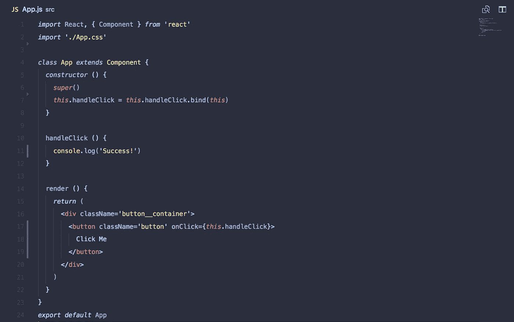
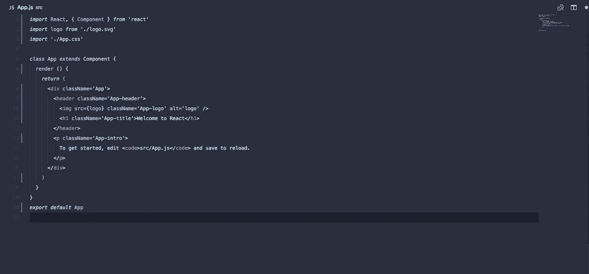
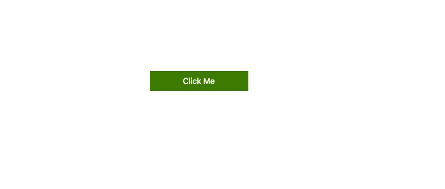
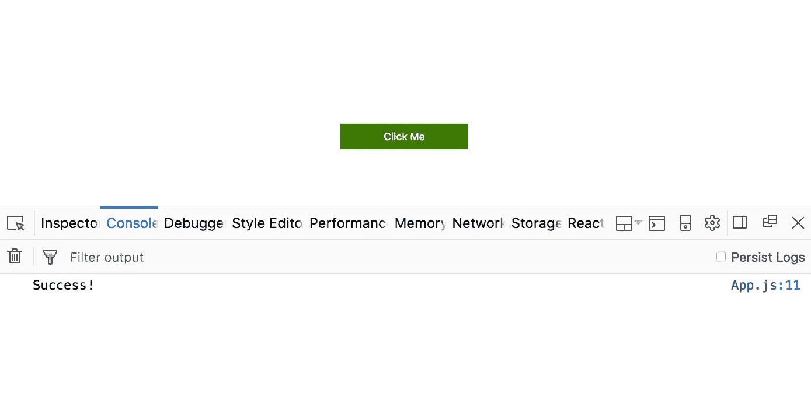

# 教程:如何在 React 中发出 HTTP 请求，第 2 部分

> 原文：<https://medium.com/hackernoon/tutorial-how-to-make-http-requests-in-react-part-2-4cfdba3ec65>



*如果你还没有完成本教程的* [*第 1 部分*](/@MCapoz/tutorial-how-to-make-http-requests-in-react-part-1-f7afa3cd0cc8) *，请在开始第 2 部分之前完成。*

现在我们已经使用 create-react-app 建立了我们的[项目](https://hackernoon.com/tagged/project)，我们可以开始编写一些[代码](https://hackernoon.com/tagged/code)。在您选择的编辑器中打开您的项目，让我们开始删除 create-react-app 为您添加的一些样板文件，因为我们不需要它。

# **步骤 1:删除 create-react-app 样板文件**

当您进入您的`App.js`文件时，它看起来会像这样:



继续删除来自`App.js` 和`App.css`的所有代码，并用下面的代码替换它:

```
*import* React, { Component } *from* 'react'
*import* './App.css'*class* App *extends* Component {
  render () {
    *return* (
      <div className='button__container'>
        <button className='button'>Click Me</button>
      </div>
    )
  }
}*export* *default* App
```

您也可以将这段代码添加到您的`App.css`文件中。

```
.button__container {
  margin-top: 200*px*;
  text-align: center;
}.button {
  background-color:green;
  border: none;
  color: white;
  font-size: 16*px*;
  height: 40*px*;
  width: 200*px*;
}
```

你也可以删除`logo.svg`文件，因为我们不会使用它。现在，当您在终端中运行`npm start`时，您应该会在浏览器中看到:



# **第二步:连接手柄点击功能**

我们的下一步将是设置一个当用户点击按钮时触发的功能。我们首先向按钮添加一个`onClick`事件，如下所示:

```
<button className='button' onClick={*this*.handleClick}>
  Click Me
</button>
```

当按钮被点击时，我们将调用一个名为`handleClick`的函数，该函数被绑定到`this`。让我们继续将`handleClick`绑定到`this`。首先，我们需要在组件中创建一个`constructor`函数。然后，我们将把`handleClick`绑定到它内部的`this`。

```
constructor () {
  super()   this.handleClick = this.handleClick.bind(this)
}
```

现在，我们的文件应该是这样的:

```
*import* React, { Component } *from* 'react'
*import* './App.css'*class* App *extends* Component {
  *constructor* () {
    *super*() *this*.handleClick = *this*.handleClick.bind(*this*)
  } render () {
    *return* (
      <div className='button__container'>
        <button className='button' onClick={*this*.handleClick}>
          Click Me
        </button>
      </div>
    )
  }
}*export* *default* App
```

最后，我们需要定义我们的`handleClick`函数。让我们先按下按钮`console.log`‘成功！’，确保所有东西都连接正确单击按钮时。

```
handleClick () {
  console.log('Success!')
}
```

现在，您的代码应该是这样的:

```
*import* React, { Component } *from* 'react'
*import* './App.css'*class* App *extends* Component {
  *constructor* () {
    *super*() *this*.handleClick = *this*.handleClick.bind(*this*)
  } handleClick () {
    console.log('Success!')
  } render () {
    *return* (
      <div className='button__container'>
        <button className='button' onClick={*this*.handleClick}>
          Click Me
        </button>
      </div>
    )
  }
}*export* *default* App
```

单击按钮后，您应该会在浏览器中看到以下内容:



确保当你点击按钮时，你看到“成功！”出现在您的控制台中。如果你这样做了，这意味着你已经正确地将你的`handleChange`功能连接到按钮上，并且你已经准备好进入本教程的[第 3 部分](/@MCapoz/tutorial-how-to-make-http-requests-in-react-part-3-daa6b31b66be)。