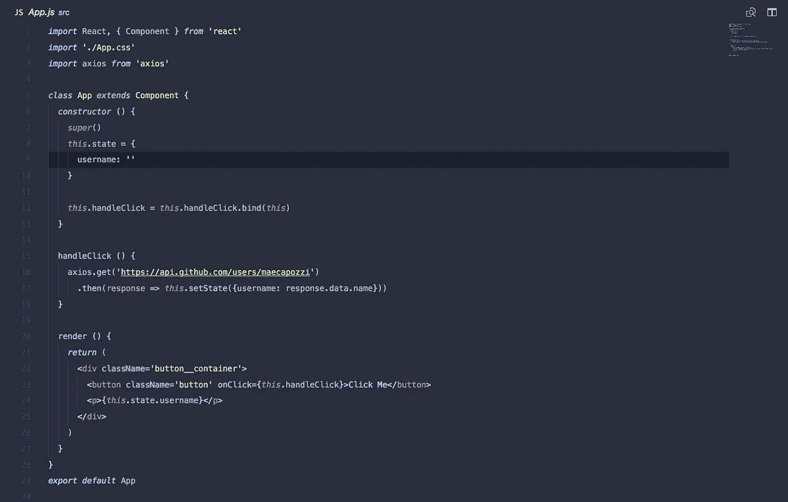
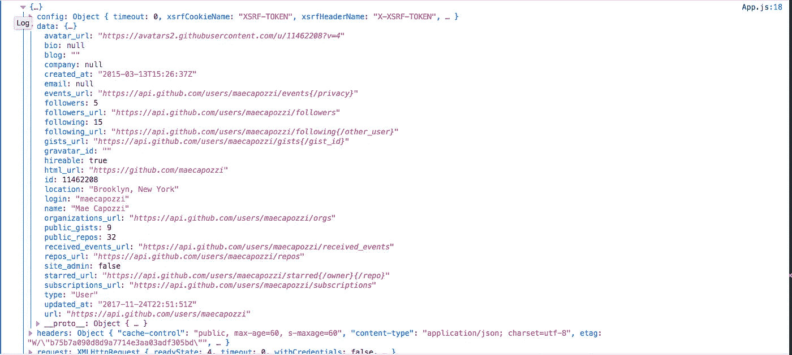

# 教程:如何在 React 中发出 HTTP 请求，第 3 部分

> 原文：<https://medium.com/hackernoon/tutorial-how-to-make-http-requests-in-react-part-3-daa6b31b66be>



*如果您还没有完成本教程的* [*第一部分*](/@MCapoz/tutorial-how-to-make-http-requests-in-react-part-1-f7afa3cd0cc8) *和* [*第二部分*](/@MCapoz/tutorial-how-to-make-http-requests-in-react-part-2-4cfdba3ec65) *，请在开始第三部分之前完成。*

现在我们开始精彩的部分了！到目前为止，我们已经使用 create-react-app 建立了一个新的 React 应用程序，并且连接了我们的组件来记录“成功！”当我们点击按钮时。现在，我们需要发出实际的 [HTTP](https://hackernoon.com/tagged/http) 请求。

当我第一次学习 React 时，我不确定是否有一种内置的方式来发出 HTTP 请求。没有。我们将不得不依靠第三方服务来提出我们的请求。我更喜欢 axios，但也有其他选择，如 Superagent 或 fetch。在本教程中，我们将使用 axios。

# 步骤 1:安装 axios

我们将使用`npm`安装 axios:

```
npm install axios -S
```

一旦我们安装了它，我们就可以看一看[文档](https://github.com/axios/axios)并开始编写我们的第一个 HTTP 请求。**旁注:** Axios 用承诺。如果你不熟悉承诺，你可能想多读一些关于承诺的内容，然后再回来。

快速提醒一下，我们的目标是从`/users/:username`端点获取用户名。

# **第二步:编写一个获取请求**

首先，让我们向组件添加状态。我们将向它添加一个用户名属性，并将其设置为一个空字符串。一旦我们添加了状态，我们的构造函数将如下所示:

```
*constructor* () {
  *super*(*)
  this*.state = {
    username: ''
  } *this*.handleClick = *this*.handleClick.bind(*this*)
}
```

接下来，在我们的`handleClick`函数中，我们将调用 Github 来取回用户。

首先，我们需要将 axios 导入到文件中，以便我们可以使用它。将这一行放在文件的顶部，在您导入`./App.css`的位置的下面。

```
*import* axios *from* 'axios'
```

然后，我们可以开始在`handleClick`函数中构造我们的请求。

```
handleClick () {
  axios.get('https://api.github.com/users/maecapozzi')
    .then(response *=>* console.log(response))
}
```

让我们稍微剖析一下我上面写的东西。我遵循 axios 设定的语法，向 Github 的`/users`端点发出 get 请求。该端点看起来像这样:

```
/users/:username
```

上面的`:username`，代表你喜欢的任何用户名。我把`:username`换成了`maecapozzi`，这是我的用户名。你可以用你自己的来替换它，并取回你自己的数据。

我使用`.then`告诉我的程序等待从 Github 返回数据，然后，我记录响应。

如果您复制上面的[代码](https://hackernoon.com/tagged/code)，您将看到您已经获得了一个表示控制台中所有用户数据的对象。它看起来会像这样:



现在，我需要以对用户有意义的方式显示这些数据。我想从请求中获取用户名。为此，我需要解析该数据，在我的状态上设置 username 属性，然后显示它。

我的`handleClick`函数将如下所示:

```
handleClick () {
  axios.get('https://api.github.com/users/maecapozzi')
    .then(response *=>* *this*.setState({username: response.data.name}))
  }
```

我的`render`函数将如下所示:

```
render () {
  *return* (
    <div className='button__container'>
      <button className='button' onClick={*this*.handleClick}>
        Click Me
      </button>
      <p>{*this*.state.username}</p>
    </div>
  )
}
```

让我来介绍一下这个应用程序是如何工作的。

1.  用户点击一个按钮。按钮上有一个 onClick 事件。
2.  onClick 事件触发 handleClick 函数。
3.  handleClick 函数向 Github API 发出请求，请求发送给它的用户名的用户数据。在本例中，它返回用户名“maecapozzi”的数据
4.  handleClick 使用承诺等待从 Github 返回数据。
5.  handleClick 用从 Github API 返回的名称更新 state 上的 username 属性。
6.  `<p>` 标签显示`this.state.username`是什么。当按钮没有被点击时，它将返回一个空字符串，但是一旦按钮被点击并且请求被完成，它将显示用户名。

现在，在你的屏幕上，一旦你点击了你的按钮，你应该有看起来像这样的东西:

现在你知道了！您已经在 React 中发出了第一个 HTTP 请求！我在下面列出了整个组件的要点。你也可以在这里找到这个代码，如果你想克隆它的话。

*如果您有任何问题或评论，请告诉我，如果本教程对您有所帮助，请鼓掌！*