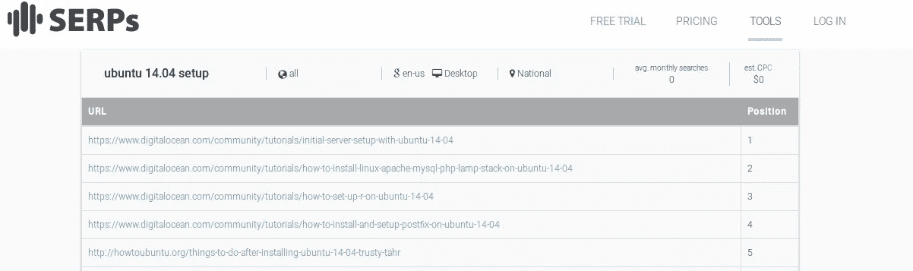
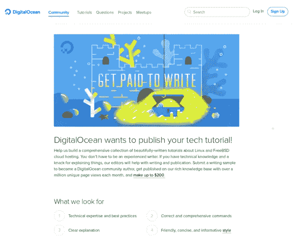

# 教程。通往客户的路❤

> 原文：<https://medium.com/hackernoon/tutorials-the-way-to-your-clients-572dad2f847c>

## ...如何帮助你的潜在客户的工作

你一直在努力做你的**服务** ( [API](https://en.wikipedia.org/wiki/Application_programming_interface) ， [Pass](https://en.wikipedia.org/wiki/Platform_as_a_service) ， [Iass](http://searchcloudcomputing.techtarget.com/definition/Infrastructure-as-a-Service-IaaS) ， [Saas](https://en.wikipedia.org/wiki/Software_as_a_service) ，)但是然而你似乎得不到一点战斗的机会。

你的竞争对手正在碾压你，因为他们可以支付那些昂贵的关键词，如“安装 ubuntu 14.04”或“发送短信 php”。
但是你发现自己被孤立于市场之外，因为那些
*“我们的服务是分发 _ _ _ _ 世界”*俗气的标语不起作用？

## 你能做些什么来让你的网页获得 1400 万的浏览量呢？

> 如果告诉你，一群非常聪明的人一直在黑系统，以获得超过 300 万的关于他们自己服务的文章的浏览量。

你要有多优秀才能通过一个非常小众的关键词，比如“安装 ubuntu 14.04”，获得超过一百万人的关注？

# 教程，逐步教程。

创造独特的内容，帮助你的潜在客户节省时间，并给他的老板和/或客户留下深刻印象。

开始一步一步地解释你的服务是什么，并详细说明你的潜在客户如何在他的环境/系统中实现它。

使其通用，并适用于除您自己的服务之外的不同服务。

记住，你和你的团队建立的教程只是解决了他们的问题，让他们的老板和/或客户高兴。你为他们节省了大量时间，他们因此而爱你！

> 如果他们相信你能节省他们的时间，他们中的一些人肯定会把他们的钱托付给你。

许多科技公司一直在使用这种方法。
例如[digitalocean.com](http://digitalocean.com)制作了超过 [1682 个教程](https://www.digitalocean.com/community/tutorials?primary_filter=popular)，
其中 14 个有超过 100 万的浏览量**每个**！

他们最受欢迎的有 310 万次观看。想象一下，如果你写了一篇 [*的博客，吸引了 300 万次浏览*](https://www.digitalocean.com/community/tutorials/how-to-install-linux-apache-mysql-php-lamp-stack-on-ubuntu) *和数百条评论，你会有多开心。*

# 将某些短语与您的公司相关联

关键字排名显示了搜索 ***ubuntu 14.04 设置*** 时提供的前五个结果，令人惊讶的是前四个是 **digitalocean 的教程！**

这需要数字海洋团队做一些严肃的工作。
他们必须设身处地为客户着想，了解他们在维护和配置**虚拟专用服务器(VPS)**时的日常工作。

DigitalOcean 主动推动社区
帮助他们编写教程。

[**Twilio**](http://www.twilio.com) 是另一家真正致力于[构建教程](https://www.twilio.com/docs/tutorials?order_by=-popularity_rank)的公司，帮助他们跨过那座桥梁进入**电信世界。**

> 每天都有数百人决定在这一天第一次设置他们的 VPS，或者他们需要启用发送短信的新功能，但他们使用 Laravel，却不知道如何操作…

你会成为他们的导师，还是会让其他人把他们引入这个新世界……这取决于你。

> [黑客中午](http://bit.ly/Hackernoon)是黑客如何开始他们的下午。我们是 [@AMI](http://bit.ly/atAMIatAMI) 家庭的一员。我们现在[接受投稿](http://bit.ly/hackernoonsubmission)并乐意[讨论广告&赞助](mailto:partners@amipublications.com)机会。
> 
> 如果你喜欢这个故事，我们推荐你阅读我们的[最新科技故事](http://bit.ly/hackernoonlatestt)和[趋势科技故事](https://hackernoon.com/trending)。直到下一次，不要把世界的现实想当然！

