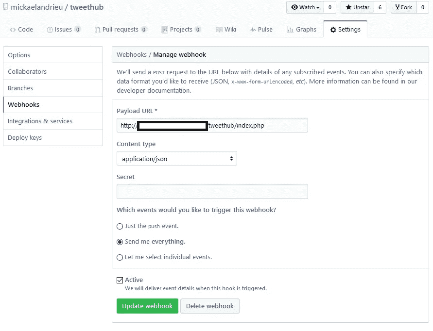

# TweetHub，Twitter 上缺失的 GitHub 发布通知！

> 原文：<https://medium.com/hackernoon/tweethub-the-github-release-notifier-on-twitter-10fdc37819a>

您收到过多少次关于新版本中已经修复的错误的问题？

有多少次，当你的客户可以享受最新版本的官方错误修复和新功能时，他们自己修复了一个错误？

在与一些 [Akeneo](https://www.akeneo.com/) 开发者讨论时，他们问我:“我们如何知道< amazing-Akeneo-package >的新版本何时发布？”。

这非常简单，因为 GitHub 会为存储库或组织中的每个操作分派事件..所以我在两个小时内做了一个极简的机器人，免费提供这个功能，因为我喜欢开源，你知道:)

TweetHub logo

# 多给我讲讲！

当然，你需要从[发布页面](https://github.com/loveOSS/kimeo/releases)和一个安装了 [Composer](https://getcomposer.org/) 的支持 PHP 的环境中获取档案:*你不需要了解 PHP* 。

然后使用 Composer: `composer install`安装依赖项，这将创建一个`vendor`文件夹并配置类自动加载器。

然后复制/粘贴分发的`.env.dist`文件并用 Twitter 凭证填充它(要获得凭证，您必须在 Twitter 上注册一个新的[应用程序](https://apps.twitter.com/))。

最后，在任何允许外部公共访问的服务器上托管 PHP 脚本(例如在 [Heroku](https://devcenter.heroku.com/articles/getting-started-with-php) 上)，并注册 [GitHub webhook](https://developer.github.com/webhooks/creating/#setting-up-a-webhook) :

Protip: select only “**Release**” events to not spam your PHP script for nothing

And here you go! Amazing, right?

## 你推特消息里的这个@表情是什么 f*ck？

嗯，我创建的`MicroEngine` [类](https://github.com/mickaelandrieu/tweethub/blob/master/src/MicroEngine.php)允许从 GitHub API 访问[发布对象](https://developer.github.com/v3/activity/events/types/#releaseevent)包含的每个数据(你只需要使用 Camel case 而不是 Snake case)。您可以在我用来将 GitHub Json 响应映射到开发人员可读的 Release 对象的 [PHP 项目](https://github.com/Lp-digital/github-event-parser/blob/master/Entity/Release.php)中找到可用属性列表。

在我的例子中，`@htmlUrl`从 GitHub release 中检索`html_url`属性，即 release HTML 页面 url！

## 我要投稿！

请不要。说真的，我没有太多的时间花在这种婴儿项目上，我鼓励你像我一样叉它并从中获得乐趣:)

**大家编码快乐！**

PS:如果你有什么要分享的，可以在这里随意做，在 GitHub 或者 Twitter 上；)

> [黑客中午](http://bit.ly/Hackernoon)是黑客如何开始他们的下午。我们是 [@AMI](http://bit.ly/atAMIatAMI) 家庭的一员。我们现在[接受投稿](http://bit.ly/hackernoonsubmission)并乐意[讨论广告&赞助](mailto:partners@amipublications.com)机会。
> 
> 如果你喜欢这个故事，我们推荐你阅读我们的[最新科技故事](http://bit.ly/hackernoonlatestt)和[趋势科技故事](https://hackernoon.com/trending)。直到下一次，不要把世界的现实想当然！

