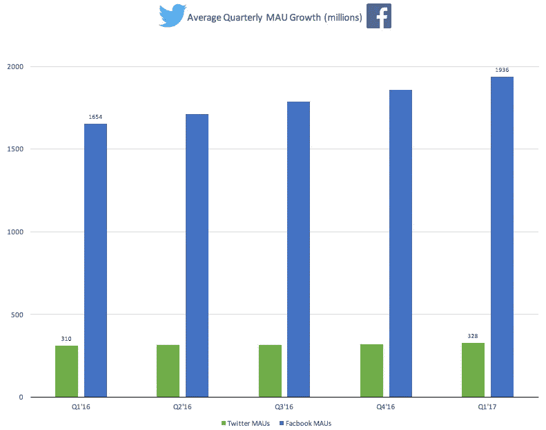
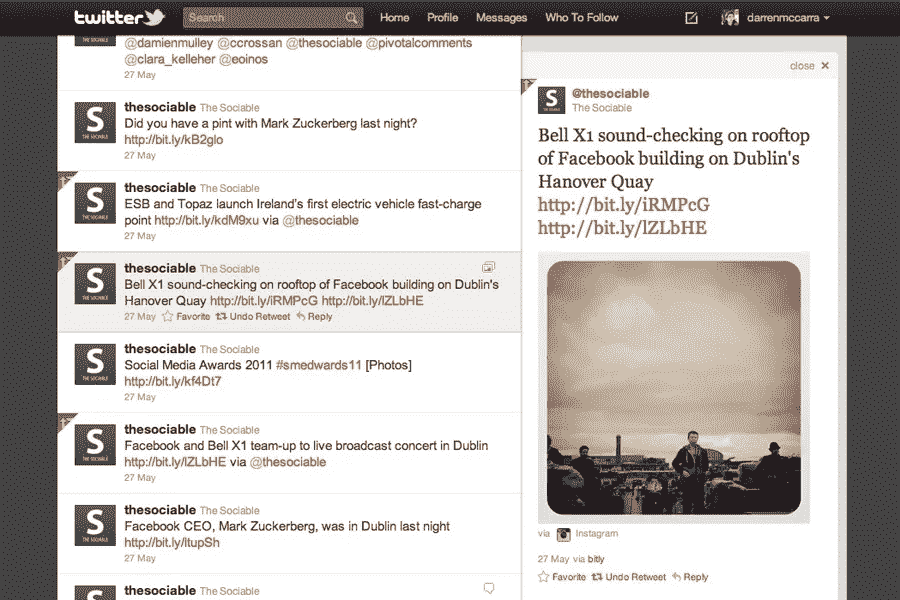

# Twitter & 3 产品“如果”。

> 原文：<https://medium.com/hackernoon/twitter-3-product-what-ifs-a895a0222346>

杰森·科斯塔

我有偏见，因为我在那里工作过一段时间，但我一直支持 Twitter。它是世界上最典型的通讯工具之一，它仍然是******实时信息平台。我想看到那家公司赢，因为原始产品太好了。也就是说，Twitter 的估值正在接近个位数，越来越不清楚该公司将如何在服务中引入非线性产品变化，以某种方式带来新用户(并唤醒休眠用户)。

*(*[*Twitter’s*](https://investor.twitterinc.com/results.cfm) *&* [*FB’s*](https://investor.fb.com/financials/?section=quarterlyearnings) *MAU growth, as pulled from their Q1 ’17 investor deck)*

将 Twitter 的增长率(约 1.4%，平均季度环比)与脸书相比，后者的用户基数是 Twitter 的五倍多，但仍以约 4%的速度增长。下面是对三个产品失误的反思，在我看来，这些失误极大地影响了 Twitter 作为一家公司的发展轨迹。

# 错过媒体船

包含照片的推文与纯文本推文相比，其参与度统计数据令人震惊。不可否认的是，人们更多地关注附有媒体的推文。但尽管从内部数据中了解到这一点，照片仍然被归入整合到网络中的第三方服务，如 TwitPic、YFrog 和 Instagram。直到 2011 年末，Twitter 才把照片作为第一方，成为移动产品的原生功能。

说到 insta gram(2010 年中期，在照片项目转型之前，它被称为 Burbn)，这项服务正在以疯狂的速度增长。在 Twitter 内部，人们可以看到他们的 Instagram 账户与 Twitter 连接的用户数量有所增长，这是 Insta 整体增长的一个代表。

Twitter 错过了收购 Instagram、将该服务整合到产品和公司中，以及优先考虑移动服务原生照片的机会。这可能会使 Twitter 在拥有移动照片空间方面处于非常有竞争力的地位，尤其是考虑到脸书当时仍然信奉 HTML5 的宗教。照片是社交移动领域的一次重大范式转变，错过一次精彩的原生照片体验是一大损失。

# 对社交过敏

为了更好地与脸书区分开来，Twitter 将始终把自己定位为市场上事实上的“兴趣图”，避开 FB 吹捧的“社交图”的绰号。这是一个合理的营销策略，给了用户另一个理由，除了他们的 FB 档案之外，还有一个单独的 Twitter 账户。最终这导致了身份危机，并最终分散了公司对用户体验的关注。

Twitter 导入用户的电子邮件联系人和移动地址簿来驱动图形密度的能力严重落后于脸书。2010 年，脸书甚至收购了马来西亚的一个电子邮件抓取团队( [Octazen](https://techcrunch.com/2010/02/19/octazen-what-the-heck-did-facebook-just-buy-exactly-and-why/) )，仅仅是为了帮助 FB 绘制整个社交图谱。Twitter 不一定需要走那么远，但它确实需要做更多的事情，将人们与他们的现实生活社会关系联系起来——即使最初的 Twitter NUX 流量本身专注于主题而不是人。

随着该公司花更多时间评估用户数据，事实证明，那些关注与他们有社交关系的用户的人比那些不关注他们的人更积极，保留得更好。你收到的那些关于“你地址簿中的某人 X 刚刚加入了这项服务——打个招呼”——的推送通知，结果证明它们真的有效！这些有助于提高网络密度和影响保持率。人们喜欢与他们的朋友互动，而不仅仅是关注名人、政治家和运动员(这些显然也是网络中的重要节点)。

拥有一个大的“关注”图并进行删减，比拥有一个几乎没有社会价值的图要好得多。在 Twitter 上认识和联系现实生活中的朋友太难了。当有人走进一个聚会，并立即认出他们的一个或多个朋友时，他们会对留下来感到更舒服。

# 作为圣牛的时间线

早期，由于其实时性，Twitter 采用了一种确定性的倒序时间线，将最近的推文显示在顶部。随着时间的推移，该公司坚持这种方法，并没有探索算法排序的流可能会是什么样子。脸书透露，他们早在 2010 年就和 EdgeRank 一起这么做了。有足够的机会将推文捆绑成有趣的和基于社会的故事。相反，家庭时间线被视为一个只需保持运行的基础设施。

有许多关于简化的、基于兴趣的推文摘要可能会是什么样子的对话——这可能会让 Twitter 通过集群时间线等东西更接近电视频道(这仍然是在直播视频流获得动力之前很久)。今天看到的*“万一你错过了”*推文摘要是对家庭时间轴的一个很好的注入，希望该公司能继续在那里推进边界。例如，如果一个给定的用户是一个篮球迷(Twitter 有数据知道这一点)，那么向该用户展示一些难以置信的体育特定的对话，这些对话只在 Twitter 上*展开*。

当时一个有趣的玩法是收购 prism 和 Dataminr，然后让这两个团队分别运行时间轴和通知。prism 做了一项令人难以置信的工作，根据特定用户的兴趣，将 Twitter 上最吸引人的内容整理成个性化摘要。DataMinr 通过分析 Twitter firehose 进行了令人印象深刻的事件检测。如果被收购，Dataminr 可以通过主动通知用户来压缩与基于兴趣的事件进行交互的时间。棱镜可以使故事和相关媒体围绕上述事件浮出水面。

从通知到 Tweet 浏览再到媒体消费，这将是一个完整的故事(与今天相比，这将使通知作为移动产品载体更加独特)。但是我离题了:核心问题是没有足够的界限来推动家庭时间线产品的发展。家庭时间轴应该是 Twitter 帮助用户联系他们的兴趣，并发现他们周围的世界正在发生什么的主要表面区域。

**回望过去**

回顾过去并发表意见总是很容易的——后知之明是 20/20。有很多关于“如果 Twitter 这样做或者那样做”的帖子，但是说实话，没有人真的知道如果 Twitter 当时完美地执行，还会发生什么。脸书已经变得更加强大，给他们的竞争对手[带来了各种各样的问题](/ggv-capital/embrace-and-extend-e7291da39534)。但我相信，如果 Twitter 钉上了照片，让这种体验更具社会性，并扩展了家庭时间线——我们今天会有一场非常不同的关于 Twitter 的对话。当谈到市场机会时，公司有一个时间窗口，团队必须无情地执行以保持窗口打开。

*   你必须快速移动*，尤其是当你有一个更大的竞争对手瞄准你的时候*
*   *没有什么是神圣的，所以不要害怕试验和改进你的产品*
*   *你必须能够读懂产品领域，看到宏观趋势的走向*
*   *不要试图将自己与竞争对手区别太大，否则会导致产品认同危机*
*   *如果你的产品是主流产品，那就让它平易近人、显而易见、简单易用*

*同样重要的是——你不能每六个月就重新设定策略。你必须选择一条进场路线并加倍下注。不过，这是一个组织问题，而不是直接的产品问题，所以我将留到以后再深入探讨这个问题。这篇文章纯粹是为了反思我个人认为对公司影响最大的一系列战略产品环境。当其他人正在建立自己的公司和产品时，希望他们可以从这些学习中受益。*

*Jason Costa 目前是 GGV 资本投资公司的 EIR。这篇文章是正在进行的系列文章的一部分，旨在探索消费产品开发、平台分析和策略等主题。*