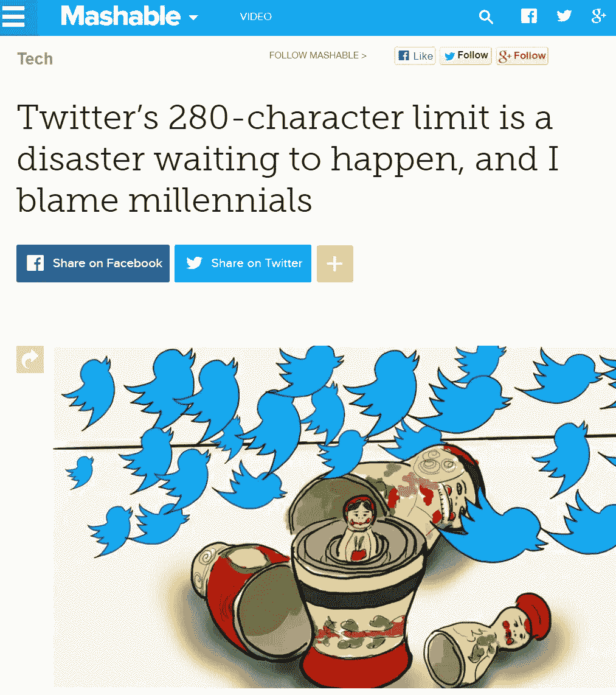
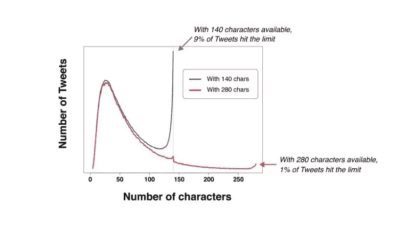

# 推特很好——别抱怨了

> 原文：<https://medium.com/hackernoon/twitter-is-fine-stop-complaining-1b45fa23ca68>

## 用户不讨厌 280 个字符

[Twitter](https://hackernoon.com/tagged/twitter) 几周前决定使用 280 个字符，当时有哪些反应？这是一个坏主意，没有人会读它，Vox 是**确定**用户讨厌它，股票价格会受到影响，我最喜欢的:*千禧一代*导致它:

[“Generating 280 characters for a simple idea will probably exhaust me”](http://mashable.com/2017/11/07/280-characters-ruins-twitter/#) — says writer and editor of Mashable, who has a [1298 characters bio](http://mashable.com/author/lance-ulanoff/) AND has a [post about his 203 characters tweet that went viral](http://mashable.com/2017/12/03/anatomy-of-my-viral-tweet/#k537EiWdoOqj).

这有什么意义吗？至少那些抱怨的人只是为了点击而抱怨。然而这是一件坏事，它减缓了创新。让我们来打破一些关于 280 个字符的神话:

## 推文不需要超过 140 个字符

新的限制实施后，最多允许少发 9 次推文。从这些数据中只能推断出一件事:用户现在更喜欢不被限制在 140 个字符以内。

[Source](http://www.adweek.com/digital/holly-pavlika-collective-bias-guest-post-280-character-tweets/), where it explains further the relationship with 280 characters.

## 更多的角色导致更少的交互性

大多数投诉都是在杰克·多西宣布 280 英镑的限制后发生的，但是没有数据支持，甚至没有任何理由。但是时间是王道，过了一会儿，数据就清楚了:超过 140 个字符的推文获得了 50%的赞和转发。

## “为什么这样做而不是 _____”

我认为最奇怪的行为来自所谓的专家。他们中的一些人暗示，当 Twitter 决定增加 tweet 的大小时，不会自动出现其他创新。《连线》有一篇可爱的文章:“[Twitter 应该做的 6 件事，而不是 280 个字符](http://www.wired.co.uk/article/twitter-280-characters-problems)”。

就在下一周，Twitter 实现了 threads，并正在考虑新的功能，此前这一功能也受到了投资者的好评。

Twitter 很好，股价上涨，用户在平台上越来越互动。为什么人们还在抱怨？

因为他们习惯了。

这就是创新放缓的原因，[悲观主义者存档](https://medium.com/u/e1292256feae?source=post_page-----1b45fa23ca68--------------------------------)很好地解释了为什么这种行为如此普遍，甚至是自然的。