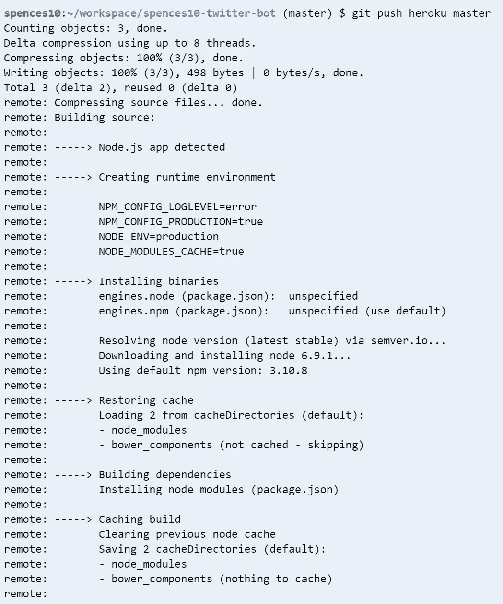
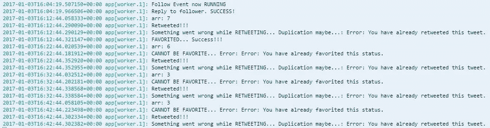

# Twitter McTwitBot

> 原文：<https://medium.com/hackernoon/twitter-mctwitbot-4d15cd005dc0>


我必须说这样做很棒，也很好地介绍了 [node.js](https://nodejs.org/en/) 和 [npm](https://www.npmjs.com/) 。

我从在 [GitHub](https://github.com/) 上找到它开始这样做，我想我是在 bootstrap 中寻找 Twitter 图标，当我在使用我的[随机报价生成器](http://codepen.io/spences10/full/dOaYbP/)时，我偶然发现了 [twitter-bot-bootstrap](https://github.com/mobeets/twitter-bot-bootstrap) (正如你所做的那样)，所以在停止了我在 FreeCodeCamp 上的进展后(🔥我决定尝试一下 Twitter 机器人，并设法创建了它，并将其添加到了 Heroku🎉

不过，这款应用并没有预期的那么好🙁所以我决定看看他为我刚好参加的 [#100DaysOfCode](https://medium.freecodecamp.com/start-2017-with-the-100daysofcode-improved-and-updated-18ce604b237b) 挑战赛创造的[@ amani 自己](https://twitter.com/amanhimself)的 Twitter 机器人。

因此，有了他伟大的文档[在这里](https://hackernoon.com/create-a-simple-twitter-bot-with-node-js-5b14eb006c08)和[在这里](https://community.risingstack.com/how-to-make-a-twitter-bot-with-node-js/)，我设法拼凑出了我自己的推特机器人，我在我的 [@ScottDevTweets](https://twitter.com/ScottDevTweets) 推特账户上使用它

> *如果你对帖子名称* [*有疑问，点击这里*](https://en.wikipedia.org/wiki/RRS_Sir_David_Attenborough#Boaty_McBoatface_Naming_Controversy) *。*

# 使用的技术

前言不碍事，现在我可以走了。

# 云 9

我喜欢这个开发环境，当我试图在我的 windows 机器上安装 Ruby 时，以及第一次在我的计算机上安装 Node.js 后，我很快成为了一个 [c9](https://c9.io/?redirect=0) 的粉丝。

# 节点. js

我已经在我的 c9 环境中安装了这个，所以我只需要`npm install --save twit`然后我就可以启动并运行了

# 赫罗库

直到我开始这个项目，我才真正了解 Heroku 是什么，但是一旦我阅读了指南，它就变得非常简单，并且在尝试安装之前，我已经在 c9 上安装了 [Heroku CLI](https://devcenter.heroku.com/articles/heroku-cli) 。

# 开源代码库

你可以直接从你的 c9 环境部署到 Heroku，还有很多其他的集成工具可以使用，我还没有时间去研究。将您的代码放在某个地方的存储库中是一个很好的做法，GitHub 被广泛使用。

# 推特

您需要从 [Twitter 开发门户](https://apps.twitter.com/app/new)设置一个 Twitter 应用程序

以上所有信息都是对 Aman 提供的指南的补充，我现在要经历的事情是我在 Heroku 部署的经验，你可能想在其他地方托管应用程序。

# 我的方法

使用`node bot.js`进行本地测试，在[@ aman Ishi](https://twitter.com/amanhimself)的例子中，它会立即发送 tweet 和 favourite，然后启动计时器。

部署到 Heroku `git push heroku master`

这是在我用 commit 消息将更改添加到 Git 并将更改推送到我的 repo 之后，终端命令如下:

```
$ git add . $ git commit -m 'my detailed commit message' $ git push origin master $ git push heroku master
```

最后一个命令将在 Heroku 上为您构建应用程序，输出如下:



> *我知道这不是 GitHub 的标准做法，我正在了解如何分支和使用拉请求，所以请多包涵🙂*

我遇到的第一个问题是 Heroku `Procfile`，我不明白它为什么一直超时，这是因为它试图运行默认的`web`进程，而不是机器人需要的`worker`进程。

在第 1 部分建立了基本框架后，我开始摆弄机器人使用的计时和查询字符串，这是事情开始有点偏离轨道的地方



有很长一段时间，我不明白为什么我会得到这么多错误，通过代码中的大量`console.log(var)`,我得出结论，我使用的查询字符串:

```
var queryString = '#100DaysOfCode, #GitHub, #VSCode';
```

您可以通过键入以下命令在应用运行时从 Heroku 获取日志:

这将从 Heroku 返回您的日志，因此您可以在其中添加您想要的所有调试行，以确定发生了什么。

我看到了图中的错误，所以我开始使用查询字符串，一次只使用一个值，这不会导致任何错误，所以我决定通过添加下面的要点来一次传递一个值。

这很有效，过了一段时间，同样的错误开始出现，然后我注意到`retweet`和`favoriteTweet`在一个计时器上，但是使用了来自`queryString`的相同随机文本，这与前一段代码的使用一样多，因为它是一次性初始化[或初始化]，所以相同的字符串被多次使用，导致了错误。

所以在绞尽脑汁和摆弄代码之后，[并且无数次发推文] Aman 建议我使用 npm 包[unique-random-array](https://www.npmjs.com/package/unique-random-array)从字符串列表中返回一个随机的字符串值。

所以我在里面加了`var`:

```
var uniqueRandomArray = require('unique-random-array');
```

构建了查询字符串:

```
var queryString = uniqueRandomArray([ '100daysofcode', 'freecodecamp', 'github', 'vscode', 'visual studio code', 'nodejs', 'node.js', 'vuejs', 'vue.js', 'inferno_js', 'inferno.js', 'jekyll' ]);
```

然后只是用`queryString()`方法替换了`queryString`弦。

一些其他需要注意的事情是我在玩机器人时发现的`retweet`和`favoriteTweet`功能`params`是`result_type:`选项，这里是我从 Twitter 开发门户粘贴的评论副本:

```
// result_type: options, mixed, recent, popular // * mixed : Include both popular and real time results in the response. // * recent : return only the most recent results in the response // * popular : return only the most popular results in the response.
```

下一步可以使用`unique-random-array`包来改变这个值。

目前为止，我仍然有一个奇怪的 bug，如果我跟踪某人，然后有人跟踪我，机器人会决定向自己发送推文！


# 接下来

更多关于`.stream()`功能的东西，比如自动回复和更好的回复。

*原载于 2017 年 1 月 4 日*[*blog . Scotts pence . me*](https://blog.scottspence.me/twitter-mctwitbot/)*。*