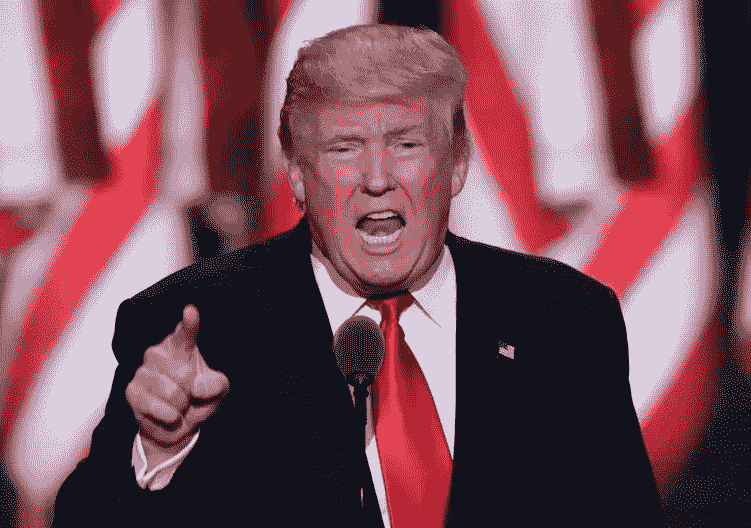

# 推特更新了特朗普时代的服务条款

> 原文：<https://medium.com/hackernoon/twitter-updates-its-terms-of-service-for-the-trump-era-291df7dc2385>

# 1.谁可以使用服务

只有当您同意与推特签订一份具有约束力的合同，并且根据适用司法管辖区的法律，您不是被禁止接受服务的人时，您才可以使用服务。无论如何，你必须年满 13 岁才能使用“服务” ***或一个国家的领导人，他承认在你以“T2”***的名义单独举办的假选美比赛中，未成年模特被换衣服时，他会走进来。如果您代表公司、组织、政府或其他法律实体接受本条款并使用服务，您即代表并保证您有权这样做， ***除非您是一名公开当选的联邦官员，失去了普选权，与敌对的外国势力勾结，无法欢笑、悲伤或最基本的人类移情表达，因为您的灵魂，如果这种东西存在的话，已经被仇恨和贪婪的邪恶凝结不可逆转地玷污了。***

# 2.隐私

我们的隐私政策描述了当您使用我们的服务时，我们如何处理您提供给我们的信息。您理解 ***(如果您是一个幼稚的反社会者，很少有事情会发生)*** 您通过使用本服务同意收集和使用该信息，包括将该信息转移到美国、爱尔兰和/或其他国家，供推特及其附属机构存储、处理和使用。 ***我们继续接受卢布。***

# 3.服务内容

您对使用服务和提供的任何内容负责，包括遵守适用的法律、法规和条例。 ***您只应该提供您觉得可以与他人分享的内容，除非您试图骚扰或口头攻击女性，我们对*** 完全没意见。

对通过服务发布的或您通过服务获得的任何内容或材料的任何使用或依赖，风险由您自行承担。我们不认可、支持、代表或保证通过服务发布的任何内容或通信的完整性、真实性、准确性或可靠性，也不认可通过服务表达的任何观点。您了解，通过使用这些服务，您可能会接触到可能具有攻击性、有害、不准确或不适当的内容，或者在某些情况下，可能会接触到贴错标签或具有欺骗性的帖子。所有内容由创建此类内容的人全权负责。我们可能不会监控或控制通过服务发布的内容，我们也不对这些内容负责。如果你是名副其实的纳粹分子，我们会尽我们所能来验证你。请告诉我们更多关于你的种族灭绝计划！

Twitter 尊重他人的知识产权，并希望用户也能这样做。我们保留删除被指控侵权内容的权利，无需事先通知，由我们自行决定，并且不对您承担任何责任。 ***尤其是你，罗丝·麦高恩。你可以去操你自己。*** 我们将根据我们的版权政策，对符合适用法律并适当提供给我们的涉嫌侵犯版权的通知做出回应。
您保留在服务上或通过服务提交、张贴或展示任何内容的权利， ***因为如果您不这样做，那将是愚蠢的。*** 你的就是你的——你拥有你的内容(你的照片和视频也是内容的一部分)。

Twitter 为生态系统合作伙伴如何在服务上与你的内容互动制定了一套不断发展的规则。这些规则的存在是为了实现一个考虑到你的权利的开放生态系统。您理解我们可能会在我们和我们的合作伙伴分发、联合、发布或广播您的内容时修改或改编您的内容，和/或对您的内容进行更改，以使内容适应不同的媒体。例如，你可以发微博说“祝我妈妈生日快乐！”我们可以改成“妈妈，吃一碗屎！” 您声明并保证，您拥有对您提交的任何内容授予此处授予的权利所需的所有权利、权力和权限。

# 4.一般

加利福尼亚州的法律(不包括其法律选择条款)将管辖这些条款以及您和 Twitter 之间发生的任何争议。与这些条款或服务相关的所有争议将仅提交至位于美国加利福尼亚州旧金山县的联邦或州法院，您同意个人管辖权，并放弃对不便审理的任何异议。

如果您是美国的联邦、州或地方政府实体，以您的官方身份使用服务，并且在法律上无法接受上述管辖法律、管辖权或管辖地条款，则这些条款不适用于您， ***其他法律或普通礼仪标准也不适用。*** 对于此类美国联邦政府实体，这些条款及任何相关行为将受美国法律管辖(不涉及法律冲突)，如果没有联邦法律，则在联邦法律允许的范围内，受加利福尼亚州法律管辖(不包括法律选择)。

**生效:**从现在开始直到这个可怕的地狱场景结束。