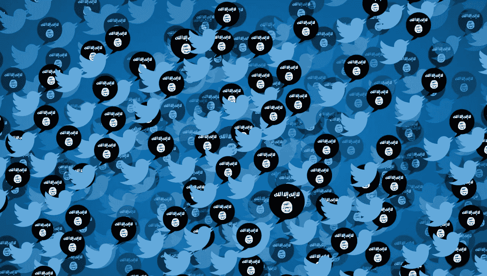
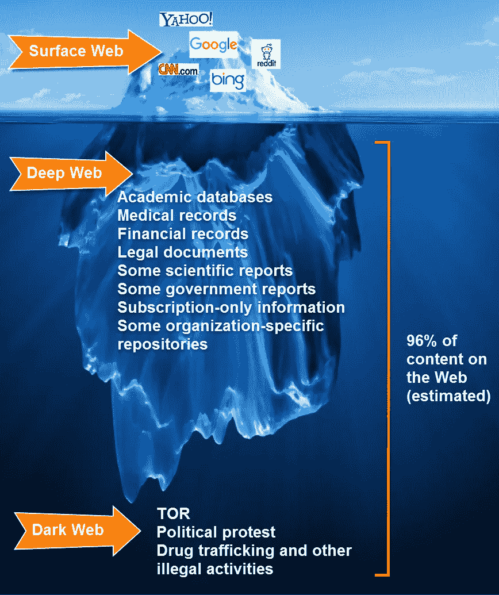

# Twitter 对抗 ISIS 的努力

> 原文：<https://medium.com/hackernoon/twitters-efforts-to-counter-isis-afca542472b5>

## 自去年以来，该公司共暂停了 36 万个与恐怖主义有关的账户。

> 我们强烈谴责这些行为，并继续致力于消除我们平台上的暴力或恐怖主义宣传。

自 2015 年年中以来，Twitter 已经暂停了 36 万个威胁或宣扬恐怖主义行为的账户，这些账户主要与 ISIS 有关。Twitter 公共政策昨天宣布，第一批 125，000 个账户于 2016 年 2 月被暂停，此后又有 235，000 个账户被暂停。

Twitter 已经扩大了其在平台上打击暴力极端主义的能力、团队和工具，包括与其他社交媒体公司分享识别恐怖主义内容的信息和最佳做法。

> 自去年以来，每日停课次数增加了 80%以上，恐怖袭击后停课次数激增。我们暂停报告账户的响应时间、这些账户在 Twitter 上的时间以及它们积累的关注者数量都大幅减少。

[Twitter 公共政策](https://medium.com/u/6f50810b16a8?source=post_page-----afca542472b5--------------------------------)也扩大了与政府和致力于在线打击暴力极端主义(CVE)的组织的合作。在过去的一年里，Twitter 参加了许多 CVE 会议，包括最近在 7 月举行的打击 ISIS 全球联盟 T4 峰会，并与英国的 [Imams Online](https://medium.com/u/28c55c7a7e94?source=post_page-----afca542472b5--------------------------------) 和阿联酋的 Sawab Center 等组织合作，以增强可信的非政府组织反对暴力极端主义的声音。

在过去的一年中，ISIS 和其他相关的恐怖组织至少两次针对 Twitter 的创始人[杰克·多西](https://medium.com/u/ab69c5472679?source=post_page-----afca542472b5--------------------------------)，早在二月份，多尔西和脸书的创始人马克·扎克伯格都受到了一个自称*哈里发之子军*的组织的威胁，正如 CNN[希望之王](https://medium.com/u/8be95fcb46a3?source=post_page-----afca542472b5--------------------------------)所报道的[。](http://money.cnn.com/2016/02/24/technology/isis-mark-zuckerberg/)

Via [http://tamucc.libguides.com/deepweb](http://tamucc.libguides.com/deepweb)

尽管事实上只有一小部分与恐怖有关的活动发生在*公开网络*上——其中大部分是在所谓的*暗网*上进行的——全球打击在线暴力极端主义的努力在破解社交媒体平台上恐怖组织的叙事和影响方面发挥了重要作用，这也要归功于 Twitter 和脸书等科技公司的努力。

> 我们必须继续努力，在全球范围内反击达伊沙的信息，并强调达伊沙的许多罪行绝对没有任何根据，在宗教、逻辑、历史或法律上都没有正当理由。现在，我们迄今采取的这些举措正在产生影响。
> — [美国国务卿约翰·克里](https://medium.com/u/7a679fb954db?source=post_page-----afca542472b5--------------------------------)

美国国务院全球参与中心最近的一项研究表明，正如公共外交和公共事务副部长理查德·斯坦格尔在 6 月份强调的那样，互联网上反 ISIS 的内容远远超过了支持 ISIS 的内容。

Sawab 中心在 2016 年 7 月的一条推文中表示，仅在 Twitter 上，与 ISIS 相关的流量在过去两年中就减少了 45%。

> [黑客中午](http://bit.ly/Hackernoon)是黑客如何开始他们的下午。我们是阿妹家庭的一员。我们现在[接受投稿](http://bit.ly/hackernoonsubmission)并乐意[讨论广告&赞助](mailto:partners@amipublications.com)机会。
> 
> 如果你喜欢这个故事，我们推荐你阅读我们的[最新科技故事](http://bit.ly/hackernoonlatestt)和[趋势科技故事](https://hackernoon.com/trending)。直到下一次，不要把世界的现实想当然！

