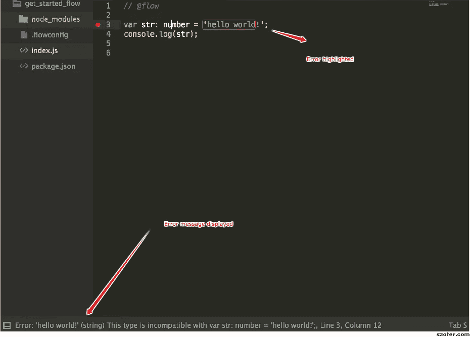
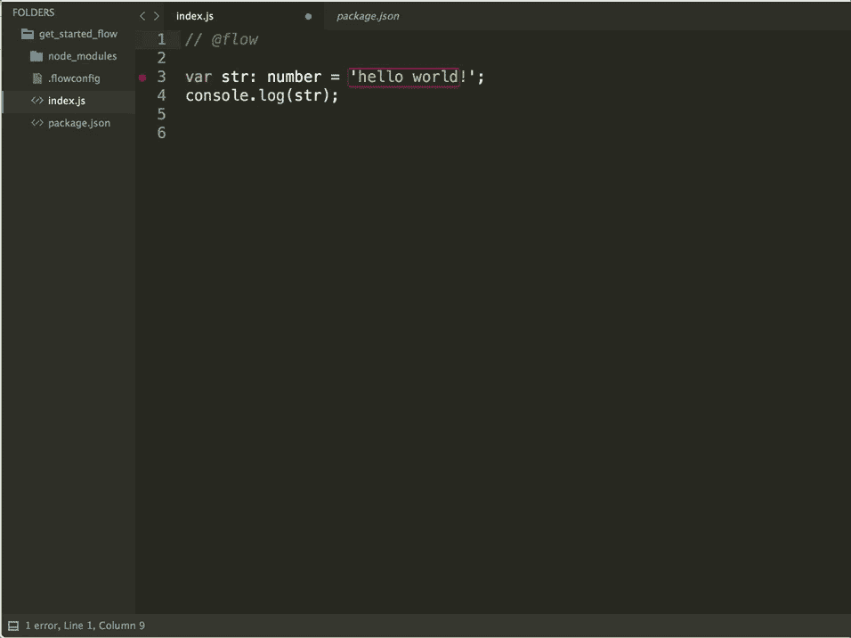
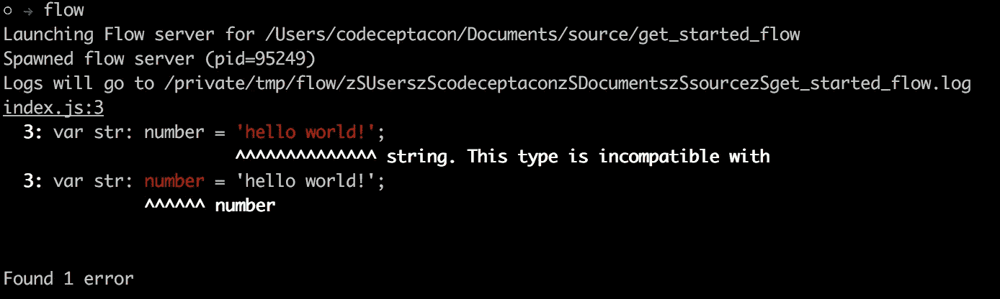

# JavaScript 中的类型检查:Flow 入门。

> 原文：<https://medium.com/hackernoon/type-checking-in-javascript-getting-started-with-flow-8532c11aceb3>


Just flow with the flow.

由脸书团队(开源)为 JavaScript 开发人员设计的 Flow 是一个静态类型检查器，可以在应用程序运行前捕捉常见错误。

# 什么是静态类型检查器？

*这通常意味着变量的类型在编译时是已知的。对于一些语言，这意味着你作为程序员必须指定每个变量的类型(例如:Java，C，c++)；其他语言提供了某种形式的类型推断，即类型系统推断变量类型的能力(例如:OCaml、Haskell、Scala)——*[*stack overflow*](http://stackoverflow.com/a/1517670/6752055)*。*

当您编写代码时，Flow 通过检查更改和分析代码的正确性来与您的代码编辑器集成。Flow 不仅指出了代码中的错误，还提供了关于代码错误的上下文。

在这篇文章中，我们将深入探讨流动的平稳性，看看它如何对我们有益。确保您已经安装了 [NodeJS](http://nodejs.org) 。

拿出你的代码编辑器，我会使用 [Sublime-text](http://sublimetext.com) ，因为那是我的代码编辑器。还有对其他编辑器的支持，如 [vim](https://github.com/flowtype/vim-flow) 、 [emacs](https://github.com/flowtype/flow-for-emacs) 和[核素](https://nuclide.io/docs/languages/flow/)。

使用 Sublime-text，你需要安装一个 sublimeLinter 包来让 Flow 正确工作，这就是 [SublimeLinter-Flow](https://github.com/SublimeLinter/SublimeLinter-flow) 。

## 开始很容易:

1.  创建新的项目文件夹或打开现有的项目。
2.  *在你的项目根目录下创建一个* `*.flowconfig*` 文件。
3.  `*npm install --save-dev flow-bin*`
4.  创建一个新文件`index.js`或者打开你的任何 JS 文件。就在顶部添加这个小小的 JavaScript 注释`// @flow`，就这样。

在`index.js`文件中添加以下代码片段作为开始:

```
var str: number = 'hello world!';
console.log(str);
```

在您的代码编辑器中，如果您使用的是 Sublime 文本，您应该会看到类似下面这样的内容。



Error messages displayed.

我们在这里做的是添加一个小的类型错误，我们期望`str`是一个数字，但是我们给它分配了一个字符串。

为了展示 Flow 一直守护着您的代码，取出`//@flow`注释，看看会发生什么。错误突出显示消失了。



Removing the flow comments triggers either to watch for errors or not.

您还可以通过运行命令`flow`来检查终端中的错误，您会得到一个日志，显示错误发生的位置。



Error log typing flow in the command line.

如果你有一个现有的项目或者你创建了一个新的项目。如果您在您的终端上运行您的项目或`node index.js`，您将得到与`flow`显示的不同的错误。

```
var str: number = 'hello world!';
       ^
SyntaxError: Unexpected token :
```

这是因为我们需要添加 *Babel* 和一个 *Babel 插件*来帮助我们传输代码。

1.  安装 *babel-cli* 如果你还没有的话`npm install -g babel-cli`
2.  `npm install —-save-dev babel-plugin-transform-flow-strip-types`
3.  在项目根目录下创建一个`.babelrc`文件，并添加`{"plugins: ["transform-flow-strip-types"]}`
4.  在您的终端中，运行`babel-node index.js`

如果您注意到，即使有错误流抱怨，它也被忽略了。意思是“心流”不会阻止你在其他事情上走得更远。但是建议在投入生产之前修复您的错误:)。

现在来纠正我们的错误，让 Flow 停止对我们发送错误类型的咆哮。我们所要做的就是将`number`改为`string`

```
var str: string = 'hello world!';
console.log(str);
```

## Flow 支持许多其他类型，例如:

*   [布尔型](https://flowtype.org/docs/builtins.html#boolean)
*   [编号](https://flowtype.org/docs/builtins.html#mixed)
*   [弦](https://flowtype.org/docs/builtins.html#string)
*   [空值](https://flowtype.org/docs/builtins.html#null-and-void)
*   [作废](https://flowtype.org/docs/builtins.html#null-and-void)

还有[更有](https://flowtype.org/docs/quick-reference.html#primitives)，一定要查出来。

# 最后一个例子:

Flow 还支持函数参数中的类型检查。

```
function doggy(x: number) {
 return x + 1;
}
```

这意味着，我们声明一个函数，我们期望一个数字作为参数。

如果我们调用这个函数:

```
doggy(3) // flow displays no errors
doggy("hola!") // we seem to enjoy flows error colors here.
```


Just one last example.

# 最后一个例子:

与心流打交道已经有一段时间了，我还没有涵盖心流提供的所有好处，但这是我迄今为止最喜欢的，请在评论中分享你喜欢心流的地方，以帮助其他人了解更多。

Flow 允许我们定义一个函数以及我们期望的返回值。无论函数类型是什么，异步，生成器，流都是兼容的。

```
function doggy(x: number): number {
 return "c";// throws error because a string is returned.
}function catty(x: number): number {
 return 3; //throws no error because a number is returned
}
```

## 终于！

检查 Reac t 的[流程。](https://flowtype.org/docs/react.html#_)

使用这种类型检查，有一些优点，比如更好的生产率、更可读的代码和按流自动完成。干杯！

[](http://bit.ly/HackernoonFB)[](https://goo.gl/k7XYbx)[](https://goo.gl/4ofytp)

> [黑客中午](http://bit.ly/Hackernoon)是黑客如何开始他们的下午。我们是 [@AMI](http://bit.ly/atAMIatAMI) 家庭的一员。我们现在[接受投稿](http://bit.ly/hackernoonsubmission)并乐意[讨论广告&赞助](mailto:partners@amipublications.com)机会。
> 
> 如果你喜欢这个故事，我们推荐你阅读我们的[最新科技故事](http://bit.ly/hackernoonlatestt)和[趋势科技故事](https://hackernoon.com/trending)。直到下一次，不要把世界的现实想当然！

