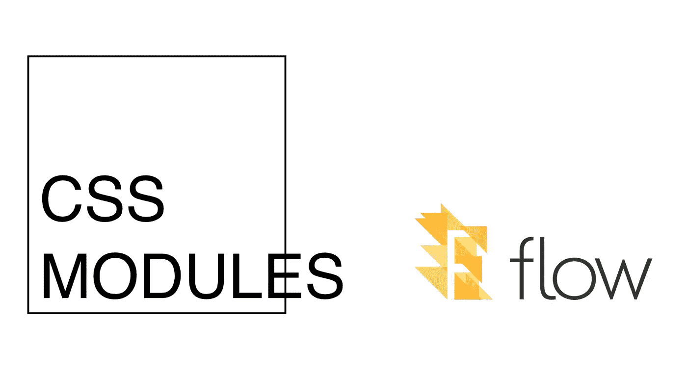

# 带流的类型安全 CSS 模块

> 原文：<https://medium.com/hackernoon/type-safe-css-modules-with-flow-dd95e761bbe5>



CSS Modules + Flow = type safety and editor autocompletion

我一直梦想着使用 [CSS 模块](https://github.com/css-modules/css-modules)时的类型安全和编辑器自动完成。这个有几个打字稿工具(见[这个](/@sapegin/css-modules-with-typescript-and-webpack-6b221ebe5f10)和[这个](https://github.com/Quramy/typed-css-modules))，但是我没有找到任何针对[流](https://flow.org/)的实体工具。

*TL；我做了一些* [*的新工具*](https://github.com/skovhus/css-modules-flow-types) *，当我在一个代码库上试用它们时，Flow 发现* ***有很多死代码(和潜在的 bug)****…*😬

# 问题

很容易拼错类名或忘记更新。移除. css 文件中的类后的 js 使用者。例如，类`foo`可能没有在`Button.css`中定义:

```
/* @flow */
import styles from './Button.css';const Button = () => <button className={styles.foo} />;
```

# 解决方法

为了教授关于 CSS 模块文件的流程，我们可以创建一个定义文件`Button.css.flow`，包含由`Button.css`暴露的类名。通过这样做，我们可以:

*   显示不存在的类的使用的静态类型检查
*   CSS 类的编辑器自动完成(用于支持流的编辑器)

来产生这些。流文件我在想两个用例。一个使用简单的 CLI，另一个使用 webpack。

# 解决方案:CLI

css-modules-flow-types-cli 是一个快速生成的 cli。流文件。

让我们安装它:

```
npm install --save-dev css-modules-flow-types-cli# Or
yarn install -D css-modules-flow-types-cli
```

然后在您的源目录上运行 CLI:

```
css-modules-flow-types src
```

我建议在您的 CI 系统(如 Travis 或 Circle)上使用 CLI 来确保所有。在运行流之前，流文件是最新的。这将在部署之前捕获潜在的样式错误。

另一个用例是开发和更改 CSS 模块文件时的快速反馈循环。CLI 为此提供了一个观察模式，但是我自己希望避免在开发时需要运行另一个工具。因为很多人已经运行了 webpack，所以我做了一个小的加载器来使用 style-loader 的令牌。

# 解决方案:webpack 加载器

[CSS-modules-flow-types-loader](https://www.npmjs.com/package/css-modules-flow-types-loader)是 webpack loader keeping。通过使用来自`style-loader`的令牌更新的流文件。我建议在作为 webpack-dev-server 设置的一部分进行开发时使用它。这将会稍微降低速度，因为加载程序可能需要写很多文件。

要开始使用:

```
npm install --save-dev css-modules-flow-types-loader
```

然后更新您的 webpack 配置:

```
{
  test: /**\.**css$/,  // or the file format you are using
  use: [
    'style-loader',
    'css-modules-flow-types-loader',  // right after style-loader
    // Other loaders like css-loader after this:
    ...
  ]
}
```

然后坐下来享受 CSS 模块被流进行类型检查。🍺

请让我知道你的想法…并给 github 一个小⭐️。

[](https://github.com/skovhus/css-modules-flow-types) [## skov HUS/CSS-模块-流程-类型

### css-modules-flow-types -使用 Webpack loader 或 CLI 从 css 模块文件创建流类型定义👾

github.com](https://github.com/skovhus/css-modules-flow-types) [](http://bit.ly/HackernoonFB)[](https://goo.gl/k7XYbx)[](https://goo.gl/4ofytp)

> [黑客中午](http://bit.ly/Hackernoon)是黑客如何开始他们的下午。我们是 [@AMI](http://bit.ly/atAMIatAMI) 家庭的一员。我们现在[接受投稿](http://bit.ly/hackernoonsubmission)并乐意[讨论广告&赞助](mailto:partners@amipublications.com)机会。
> 
> 如果你喜欢这个故事，我们推荐你阅读我们的[最新科技故事](http://bit.ly/hackernoonlatestt)和[趋势科技故事](https://hackernoon.com/trending)。直到下一次，不要把世界的现实想当然！

