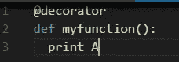
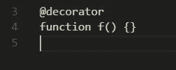
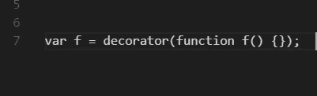
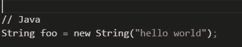
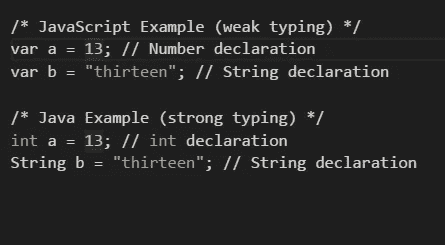
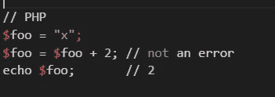
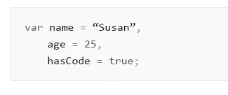
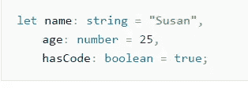

# TypeScript 与 JavaScript

> 原文：<https://medium.com/hackernoon/typescript-vs-javascript-b568bc4a4e58>

Picture Taken By WikiImages

# 什么是 TypeScript？

2017 年 4 月 27 日，你醒来开始你的早晨例行公事，现在是凌晨 4:05，所以你还没有看到它。早上 6 点前没有屏幕时间。个人政策。你冥想。你健身，你做早餐。这一次，你决定在阅读书籍的例行程序中滑一小会儿。你肯定有段时间没做过了。现在是早上 8:00，你还没检查手机屏幕。你一心想着先去办公室。你还是看不到它。终于，晨会结束了，你恢复了理智，为了什么？一个小时？可能在另一个会议前半小时。
然后你拿起手机查看你认为是 Twitter 的通知。这时你的眼睛会捕捉到它。

> **宣布打字稿 2.3**
> 
> 今天，我们很高兴为您带来我们最新发布的 TypeScript 2.3！
> 
> 对于那些不熟悉的人来说，TypeScript 是 JavaScript 的超集，为用户带来了可选的静态类型和可靠的工具。通过对代码进行类型检查，使用 TypeScript 有助于避免人们在编写 JavaScript 时经常遇到的令人痛苦的错误。TypeScript 实际上可以在不保存文件的情况下报告问题，并利用类型系统帮助您更快地编写代码。这将带来真正棒的编辑体验，让您有时间思考和测试真正重要的东西。
> 
> ……..

你想知道，这到底是什么？你刚刚经历了 React/Redux 的地狱，你仍然在 Vue.js 中挣扎。不知何故，你已经弄清楚 Angular 了。好吧，好吧，假设你真的没有选择，你在工作中学习。没有结果意味着你的工作会受到影响。所以你学会了角度。

你会想到为了学习这个闪亮的新事物你必须经历的压力。几天后你查看 JavaScrip 的这个 [***严格语法超集的用法，你会发现它背后有一大群开发者。人们喜欢这个东西吗？现在，作为一名聪明的开发人员，你知道***](https://en.wikipedia.org/wiki/TypeScript)***[除了跟上市场](https://blog.codinghorror.com/so-you-want-to-be-a-programmer/)之外，你没有别的工作，就像 Chad Fowler 在他仍然很有意义的书[中提到的那样](https://www.amazon.com/Passionate-Programmer-Remarkable-Development-Pragmatic/dp/1934356344)。我完全理解你的感受。但是我个人觉得[打字稿](http://www.typescriptlang.org/)已经留下来了。***

# 但是这个 JavaScript 到底是什么呢？

JavaScript 是一种非常动态的编程语言，每个人都被它所吸引，因为它不像 C++那样“容纳他们”。它的**不定型的**本性和它独特的 ***原型遗传*** 是完美的诱饵。在微软发布 TypeScript 仅仅几天后，为了证明我对此的直觉，Angular 选择了它，并放弃了另一个可用的选项 plain [ES6](https://es6.io/) 。最初，他们的想法是使用 actionScript，这是一种 javascript 脚本语言，它扩展了 Typescript，并在 forerunner TypeScript 整整两年后由 Google 的 [AngularJS](https://en.wikipedia.org/wiki/AngularJS) 团队发布。事实上，它将作为扩展在 TypeScript 上运行。

从那以后，一个[装饰提议](https://github.com/wycats/javascript-decorators)出现在了 ES 上，看起来和最初的 actionScript 非常接近。但是在我们草率行事之前。ES 利用的这个装饰提议是什么？

装潢师是:

*   一种表达
*   计算出一个函数
*   它将目标、名称和装饰描述符作为参数
*   并且可选地返回装饰描述符以安装在目标对象上

在这里阅读更多**。但是，如果您在完成本文之前不想进入另一个页面，装饰器基本上是一个高阶函数？高阶函数“接受”另一个函数，当它运行时，它扩展了后一个函数的行为，而没有显式地修改它。**

****

**UA very simple python decorator**

**因此，如果我们的函数 myFunction(作为一个更高的函数)在这里接受一个函数，它不一定会修改那个函数，尽管输出会有所不同。**

**让我讨厌装修工的第一件事是“@”标志。我立刻感觉自己在阅读 JavaScript 之外的另一种语言。我相信这也是很多其他人的经历。无论哪种方式，' *@`* '告诉解析器，该符号后面的所有内容(代码块中的)都是装饰符。现在听起来很容易？它只是简单地直接与计算机对话，即将发生的是，一个函数将被另一个函数修饰，结果将被传回。**

**电脑说。明白了！好吧，继续。然后，计算机将该代码块视为一种不同的功能，有点像父母对待最喜欢的孩子的方式，由于“父母”的这种特殊关注，它变成了一种功能，可以做一些很酷的事情，如记忆、认证、记录等等。同样，我现在不会深入讨论这个问题的细节，但是当你想到装饰师时，请把他们想成这样:**

****

**A decorator at work**

**…而不是这个火车残骸。**

****

**假设你有几个函数，你想把它们包装起来。编写和维护这样的程序将是一场噩梦。当然，关于 ES6，你仍然需要处理在 ES 中输入的[。而 TypeScript 在那里是一个天然的契合点(在打字的时候)。你可以用像](https://en.wikipedia.org/wiki/Programming_language#Type_system)[流](http://flowtype.org/)这样的解决方案来补充 ES，最终得到渐进的输入。也许我们会看到两个更大的营地。一个给 ES(巴别塔男生)，一个给 TS。**

# ****什么是静态 vs 动态类型？****

**打字从来都是关于程序中的变量。如果我创建一个静态类型语言，我不需要立即告诉编译器这个特定的整数，并且永远是一个整数。它将是我在程序中存储的内容，即使我在编码时忘记了，并通过将它传递给另一个类或其他东西来更改它的值。许多好的语言例子是 C、C++、Java。另一方面，动态类型与上面所说的正好相反。Ruby、Perl，当然还有我们的海报男孩:JavaScript。这并不意味着这些语言中的任何一种天生就弱或不好。这应该是重点。**

****Java 示例(静态和强类型)****

****

**系统不可能在评估‘foo’的值时出错。**

****Javascript 示例(动态和强类型)****

****

**与 Java 或 C++这两种强类型语言相反， **Javascript 足够智能**知道/解释你想要使用什么类型的变量。但是由于这造成或者可能造成代码质量的松懈，它也被称为**弱类型语言。但是我们知道得更清楚。尤其是如果你遵循最佳实践。****

****PHP 示例(静态和弱类型)****

****

**在这两者之间，它们只是编码的范例方式，并不意味着静态类型不好或者动态类型好。你唯一应该注意的魔鬼应该是弱类型语言和强类型语言。如果忽略了专注于改善用户生活的脚本语言，你会失去什么。**

*   ****通用函数&多态性****
*   ****高阶函数****
*   ****物体构成****

**又来了。动态类型不进行类型检查。关于这个话题，请查看这篇文章，文章说[动态类型不是弱类型](https://blogs.agilefaqs.com/2011/07/11/dynamic-typing-is-not-weak-typing/)退一步讲，如果我们把硬币的两面结合起来，也就是说，我们把 C++变成 C++的原因引入到 Javascript 中，会怎么样？**

*   **速度:静态语言通常更快**
*   **效率/有效静态语言让程序员更负责任。动态编程有时会产生道德风险，并鼓励不良的编程习惯**

**下面是动态类型化的 JavaScript**

********

****这是强类型的 Javascript****

********

****那就是打字稿！****

****如果这篇文章让 Typescript 听起来很有趣，你可以更深入地研究 Typescript，看看它是否是你想要投入时间和精力的东西。这只是一篇非常简短的文章，以非常外围的方式谈论这些工具。****

****‘****

************************

> ****[黑客中午](http://bit.ly/Hackernoon)是黑客如何开始他们的下午。我们是阿妹家庭的一员。我们现在[接受投稿](http://bit.ly/hackernoonsubmission)并乐意[讨论广告&赞助](mailto:partners@amipublications.com)的机会。****
> 
> ****如果你喜欢这个故事，我们推荐你阅读我们的[最新科技故事](http://bit.ly/hackernoonlatestt)和[趋势科技故事](https://hackernoon.com/trending)。直到下一次，不要把世界的现实想当然！****

********