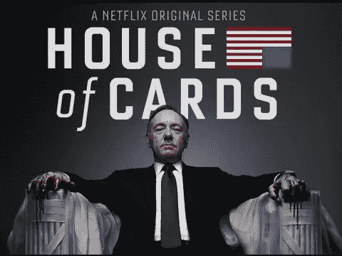

# 优步要 0 了，Benchmark 也知道！[演示]

> 原文：<https://medium.com/hackernoon/uber-is-going-to-0-and-benchmark-knows-it-presentation-cc873aa8d73b>

The bigger they are, the harder they fall

> 先发制人是一种策略，而不是目标。做最后一步棋要好得多。*——*[*【彼得·泰尔】*](https://medium.com/u/9cf92d7ac2b7?source=post_page-----cc873aa8d73b--------------------------------)

这和性骚扰没有关系。优步的商业模式已经崩溃，而 Airbnb 的商业模式要好 100 倍。

让我解释一下…

# 结束语

你怎么想呢?优步被拧了吗？你更愿意经营优步还是 Airbnb？达拉能拯救优步及其商业模式吗？

这些问题并没有被技术社区充分考虑。优步可以说是风险投资史上最成功的例子(至少在首次公开募股之前)。

他们越大，摔得越重…胃口也越大。我不看好优步，但非常看好 Airbnb。

想法？…

**奖励:** [关于 5 种网络效应以及如何破解它们的文章…](/p/a5b54745eed2)

# 学到了什么？单击👏说“谢谢！”并帮助他人找到这篇文章。