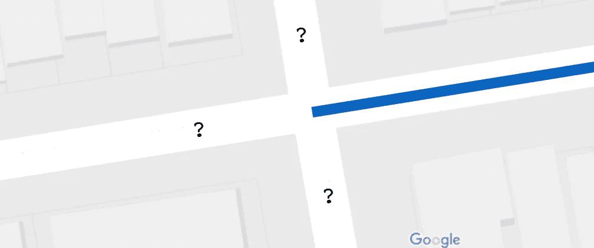
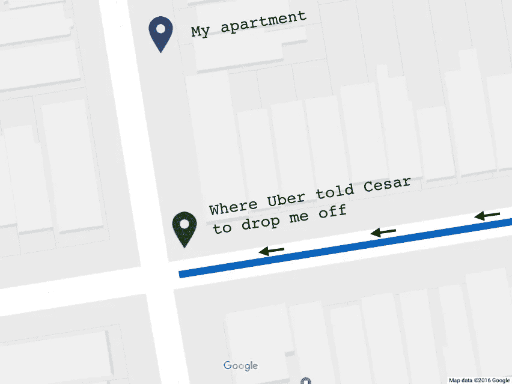
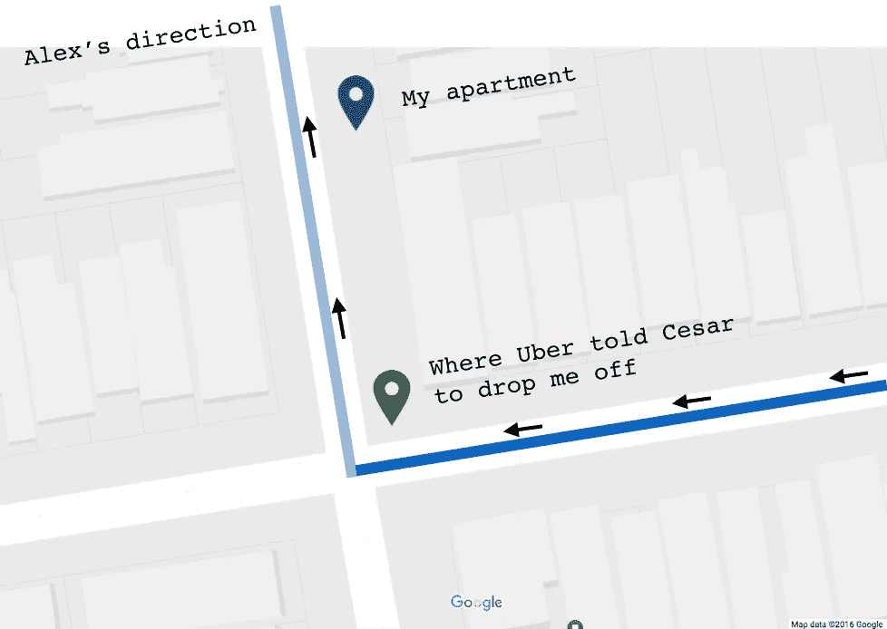
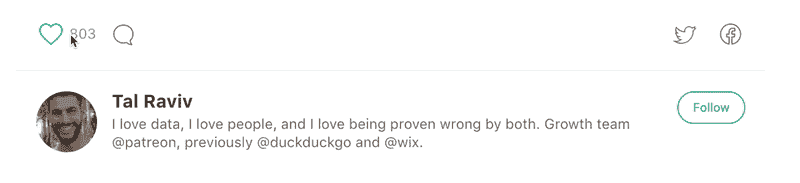

# 优步命令我的司机做一些完全不合逻辑的事情；他们是对的

> 原文：<https://medium.com/hackernoon/uber-ordered-my-driver-to-do-something-totally-illogical-and-they-were-right-a32a358022df>

我汗流浃背，臭烘烘，刚练完柔术。圣诞节后两天，旧金山的索玛社区成了一座鬼城。Lyft 没有通过。*品牌忠诚度只到此为止——负荷* [*优步*](https://hackernoon.com/tagged/uber) *。*

塞萨尔停了下来。坐在后座的是亚历克斯和+1，他们*和*在过去的 24 小时里见过面。他们仍然处于这样的阶段，在彼此的手机上描述随机照片显然是一种有趣的互动。

塞萨尔驱车直上特克，向 NoPa 驶去。当我们接近我的公寓时，我注意到他的导航上有些东西…

# 别针在角落里

塞萨尔的应用程序告诉他让我在离我三栋房子的拐角处下车。不要在我家门口。

我参加聚会肯定要迟到了，但这真是太聪明了。

*四舍五入到最近的角。那会节省多少汽油、时间、生命、司机和一切？不，说真的，让我们变得书呆子:*

*   假设 SF 中的每个块有大约 8 个地址
*   假设其中 6 个不在拐角处:那就是 75%
*   假设 33%的情况下，一个司机拐进一个街区“在家门口”并不是在去下一个乘客的路上(一辆车接近一个十字路口大致有三种选择)。
*   假设每次司机不得不拐进一个街区“在家门口”时，他们的行程就增加了 0.1 英里

…那是…

每位优步拼车乘客可节省 0.025 英里。在城市电网中，大约需要 1-2 分钟。还不错。(请戳数学中漏洞；我要一个数量级。)

我一直想知道拼车公司什么时候会开始这么做。这就像凭空创造司机一样。但是，这也有一个明显的不利方面——您降低了客户的生活水平。众所周知，付费用户最不能容忍的就是服务质量下降。

尽管效率很高，但在拐角处下车，内心还是有点受伤。它提醒我，我正在使用预算选项。和优步池将不可避免地，逐渐倒退，尽可能接近公共交通的需求曲线将允许这诱人的 5.00 美元。

然而，在这种侮辱被理解之前，更有趣的事情发生了。我在塞萨尔的屏幕上注意到，尽管他让我在拐角处下车，但应用程序仍然要求他向右转。他会开车经过我家门口。

然而应用程序告诉他让我在街角下车。

它为什么会这样做？为什么要把我放在更远的地方，当你真的经过我家的时候？

**因为优步真的有人考虑清楚了。**

看，无论是哪个[产品经理](https://hackernoon.com/tagged/product-manager)(或义务警员工程师)做出了那个明智的决定，他们意识到如果*有时*司机让我们这些乘客在街角下车，但*其他时候*他们让你在自己家门口下车，这对乘客来说会非常困惑。在“弯道超车”时，车手们会认为他们的司机在偷懒，这让他们付出了代价。

这会让司机看起来很糟糕。非常糟糕。大约 50%的时候。

只要乘客们还抱着希望，希望自己能被送到家门口，失望就会持续下去。这只会让适应新的、更低标准的服务变得更加困难。

因此，有了这个决定，优步选择了一致性而不是实用性。在双边平台中，他们优先考虑各方之间一致的期望。他们优先考虑让司机在乘客面前看起来更好。是的，虽然远非无私，但优步对他们的司机做得很好。

优步选择了所有这些东西，而不是基本的、合乎逻辑的用户体验。当我在人行道上艰难跋涉时，我心想，他们选择了正确的道路。

知道谁的手艺会从这篇文章中受益吗？单击💚让更多像你一样的专业人士看到这篇文章。*提示俗气的教学动画:*

> [黑客中午](http://bit.ly/Hackernoon)是黑客如何开始他们的下午。我们是 T21 家庭的一员。我们现在[接受投稿](http://bit.ly/hackernoonsubmission)并乐意[讨论广告&赞助](mailto:partners@amipublications.com)机会。
> 
> 如果你喜欢这个故事，我们推荐你阅读我们的[最新科技故事](http://bit.ly/hackernoonlatestt)和[趋势科技故事](https://hackernoon.com/trending)。直到下一次，不要把世界的现实想当然！

