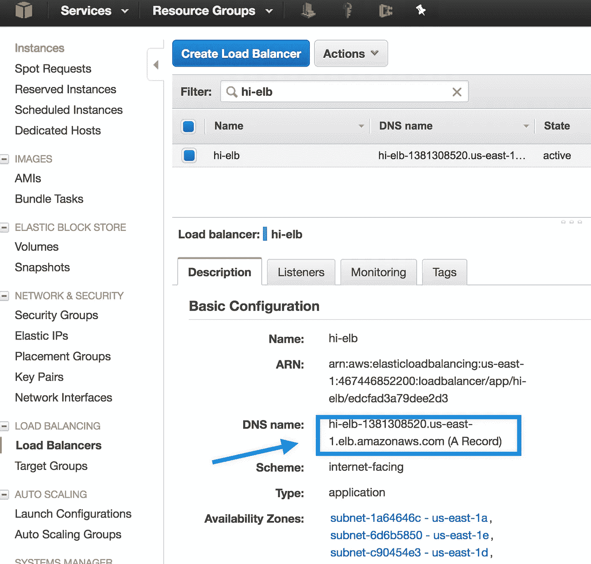
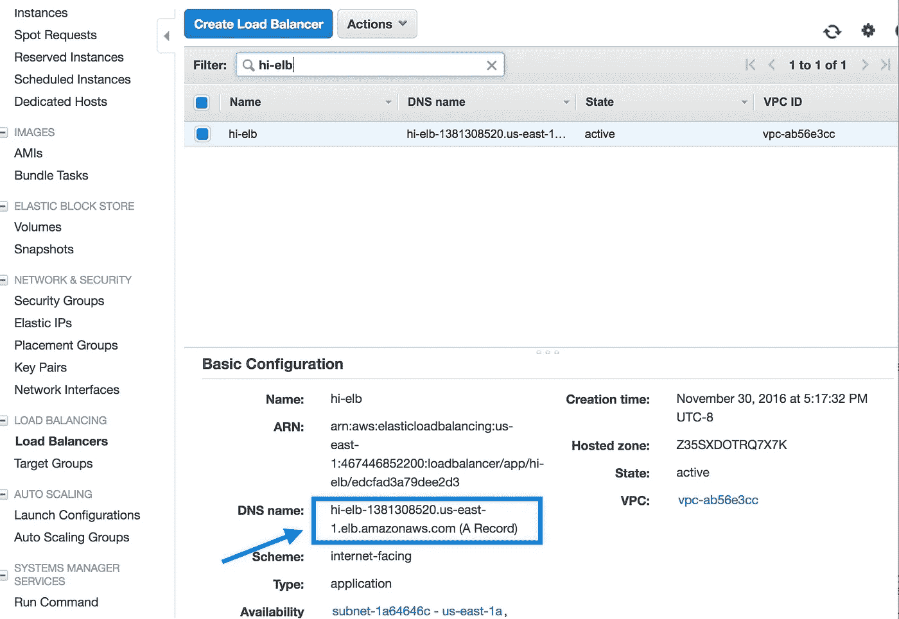

# Ufo —轻松构建 Docker 映像并将容器部署到 AWS ECS

> 原文：<https://medium.com/hackernoon/ufo-easily-build-docker-containers-and-ship-them-to-aws-ecs-15556a2b39f>


**更新**:做了一个关于 ufo 的[演示](https://www.meetup.com/SF-DevOps-for-Startups/events/235750382/?eventId=235750382)，幻灯片在这里: [UFO 飞船对于 AWS ECS](http://www.slideshare.net/tongueroo/ufo-ship-for-aws-ecs-70885296) 。

# 快速介绍

[Amazon EC2 容器服务](https://aws.amazon.com/ecs/)，ECS，是一个 [AWS](https://hackernoon.com/tagged/aws) 服务，在 EC2 实例集群上提供和管理 [Docker](https://hackernoon.com/tagged/docker) 容器。与大多数 AWS 服务一样，它很棒，只需要一点工具就可以创建一个流畅的流程。Ufo 是一个简单的工具，它使得构建 Docker 容器并将其运送到 AWS ECS 变得非常容易。

Ufo 提供了一个名为`ufo ship`的命令，它执行以下操作:

1.  构建 docker 映像。
2.  生成并注册 ECS 模板定义。
3.  将 ECS 模板定义部署到指定的服务。

Ufo 部署了一个任务定义，它是通过一个模板生成器创建的，这个模板生成器是**完全可控的**。我们将通过一个简单的例子来展示模板的外观和工作原理。

# 任务定义 ERB 模板和 DSL 生成器

任务定义是从`ufo/templates`文件夹中的 ERB 模板创建的。这里有一个例子:`ufo/templates/main.json.erb`。

```
{
    "family": "<%= [@family](http://twitter.com/family) %>",
    "containerDefinitions": [
        {
            "name": "<%= [@name](http://twitter.com/name) %>",
            "image": "<%= [@image](http://twitter.com/image) %>",
            "cpu": <%= [@cpu](http://twitter.com/cpu) %>,
            <% if [@memory](http://twitter.com/memory) %>
            "memory": <%= [@memory](http://twitter.com/memory) %>,
            <% end %>
            <% if [@memory_reservation](http://twitter.com/memory_reservation) %>
            "memoryReservation": <%= [@memory_reservation](http://twitter.com/memory_reservation) %>,
            <% end %>
            <% if [@container_port](http://twitter.com/container_port) %>
            "portMappings": [
                {
                    "containerPort": "<%= [@container_port](http://twitter.com/container_port) %>",
                    "protocol": "tcp"
                }
            ],
            <% end %>
            "command": <%= [@command](http://twitter.com/command).to_json %>,
            <% if [@environment](http://twitter.com/environment) %>
            "environment": <%= [@environment](http://twitter.com/environment).to_json %>,
            <% end %>
            "essential": true
        }
    ]
}
```

要使用的 ERB 模板在`ufo/task_definitions.rb`中用`source`方法指定。Ufo 在评估`ufo/task_definition.rb`中的`task_definition`块时加载 ERB 模板。

```
task_definition "hi-web" do
  source "main" # will use ufo/templates/main.json.erb
  variables(
    family: task_definition_name,
    # image: tongueroo/hi:ufo-[timestamp]-[sha]
    image: helper.full_image_name, 
    environment: helper.env_file('.env.prod')
    name: "web",
    container_port: helper.dockerfile_port,
    command: ["bin/web"]
  )
end
```

正如你在上面看到的，`task_definitions.rb`文件有一些特殊的变量和帮助方法。这些帮助器方法提供了项目中有用的上下文信息，因此您不必在多个地方复制、粘贴和更新代码。例如，其中一个变量在项目的 docker 文件中提供了公开的端口。以下是一些重要的例子:

*   **helper . full _ image _ name**—UFO 构建的完整 docker 映像名称。docker 图像名的“基本”部分在 ufo/settings.yml 中定义，例如，基本部分是“tongueroo/hi”，完整的图像名是 tongueroo/hi:UFO-[timestamp]-[sha]。因此，基本名称不包括 Docker 标记，完整的图像名称包括标记。
*   **helper.dockerfile_port** —从项目的 dockerfile 中提取的暴露端口。
*   **helper.env_file** —该方法采用一个。env 文件，包含环境变量的简单键值列表，并将列表转换为适当的任务定义 json 格式。

提供这些特殊帮助方法的两个类在 [ufo/dsl.rb](https://github.com/tongueroo/ufo/blob/master/lib/ufo/dsl.rb) 和 [ufo/dsl/helper.rb](https://github.com/tongueroo/ufo/blob/master/lib/ufo/dsl/helper.rb) 中。有关特殊变量和方法的完整列表，请参考这些类。

# 用法示例

一个例子将展示使用 ufo 是多么容易。该项目的官方文件提供了更多细节:[http://ufoships.com](http://ufoships.com/)。

这个例子是一个演示 rails 应用程序，它返回 rails 欢迎页面。我还创建了`bin/worker`和`bin/clock`脚本，它们运行一个无限循环来模拟工人和时钟进程进行测试。演示项目的完整源代码可以在 GitHub 上找到: [tongueroo/hi](https://github.com/tongueroo/hi) 。

# 在 Mac OSX 本地测试演示项目

让我们设置应用程序，安装依赖项并启动 web 流程。

```
$ git clone [https://github.com/tongueroo/hi](https://github.com/tongueroo/hi.git)
$ cd hi
$ bundle
$ bin/web # start the web server
```

让我们卷曲为 200 响应代码。

```
$ curl -svo /dev/null localhost:3000 2>&1 | grep ‘< HTTP’
< HTTP/1.1 200 OK 
$
```

# 用 Docker 构建和测试演示项目

现在让我们用 ufo 构建 docker 映像，并测试它在本地的工作情况。我只展示了一些 shell 输出，以保持粘贴的大小较小，并在上下文中有用。

```
$ ufo init --app hi --image tongueroo/hi
Setting up ufo project…
created: ./bin/deploy
exists: ./Dockerfile
created: ./ufo/settings.yml
created: ./ufo/task_definitions.rb
created: ./ufo/templates/main.json.erb
created: ./.env
Starter ufo files created.
$ ufo docker build
$ docker images | grep “tongueroo/hi”
tongueroo/hi ufo-2016–11–30T16–25–26-e1d57ce e511ec8a328a About a minute ago 826.8 MB
$ docker run -d -p 3000:3000 — name hi tongueroo/hi:ufo-2016–11–30T16–25–26-e1d57ce
$ docker ps
$ curl -svo /dev/null localhost:3000 2>&1 | grep ‘< HTTP’
< HTTP/1.1 200 OK 
$ docker stop hi ; docker rm hi
$
```

在上面的代码片段中，我运行了两个 ufo 命令:`ufo init`和`ufo docker build`。让我们回顾一下`ufo init`创建的一些文件:

*   bin/deploy——包装器部署脚本，展示了如何使用 ufo 同时将 3 个常见的 web、worker 和 clock 进程部署为服务。
*   ufo/settings.yml —这是您设置要构建的 Docker 图像名称的地方。有一个 service_cluster 映射选项，您可以使用它来避免总是在 CLI 中提供`--cluster`选项。这很方便。
*   UFO/task _ definitions . Rb-这是您定义要替换到 ERB 模板中的变量的地方。
*   UFO/templates/main . JSON . erb-这是任务定义 erb 模板。您可以对此进行修改，并完全控制注册到 ECS 的任务定义模板。
*   。env——开胃菜。如果项目中不存在 env 文件，则会提供一个。如果对您的需求更有意义，您可以将其重命名为`.env.prod`和`.env.stag`。如果重命名`.env`文件，记得更新`task_definitions.rb`中的 env_file 行。

`ufo docker build`命令创建了一个 tongueroo/hi:UFO-2016–11–30t 16–25–26-E1 d 57 ce Docker 映像。

# 将 Docker 映像发送到 ECS

让我们将 web 流程作为 ECS 服务发布。首先，创建一个名为`stag`的 ECS 集群，我们将使用它将 web 服务发送到那里。您还需要与 web 服务相关联的 ELB 目标群体，以便从世界任何地方都可以访问该应用程序。我已经为这个例子创建了一个`stag`集群，一个“hi-elb”和“hi-target-group”。你可以从负载平衡/目标组中抓取目标组 ARN:



您只需要在第一次使用 ufo 部署时提供 ELB 目标组 ARN，因为您无法在以后更新 ECS 服务的目标组。如果要更改目标组，则必须创建并部署新的服务。这是一个 AWS ECS 设计决策。

# 飞碟船

现在我们可以用`ufo ship`将 docker 容器运送到 ECS！

```
$ ufo ship hi-web --cluster stag --target-group=arn:aws:elasticloadbalancing:us-east-1:467446852200:targetgroup/hi-target-group/f61e87b3c4761922
Building docker image with:
  docker build -t tongueroo/hi:ufo-2016-12-01T07-37-53-e1d57ce -f Dockerfile .
Docker image tongueroo/hi:ufo-2016-12-01T07-38-32-e1d57ce built.  Took 2s.
Pushed tongueroo/hi:ufo-2016-12-01T07-38-32-e1d57ce docker image. Took 4s.
Building Task Definitions...
Generating Task Definitions:
Generated task definition at: ./ufo/output/hi-web.json
Generated task definition at: ./ufo/output/hi-worker.json
Generated task definition at: ./ufo/output/hi-clock.json
Task Definitions built in ufo/output.
hi-web task definition registered.
Shipping hi-web...
hi-web service created on stag cluster
Waiting for deployment of task definition hi-web:3 to complete
...........
Time waiting for ECS deployment: 58s.
Software shipped!
```

让我们检查并回顾一下`ufo ship`命令实际上做了什么。首先，它构建了名为`tongueroo/hi:ufo-2016-12-01T07-37-53-ec1d57ce`的 docker 映像。可以用`docker images`查一下。

```
$ docker images                                                   ufo-2016-12-01T07-38-32-e1d57ce    a9e97fa264ab        5 minutes ago       826.8 MB
$
```

其次，ufo 在 ufo/output 文件夹中生成了所有的任务定义，并且只注册了一个已部署的任务定义:hi-web。让我们来看看生成的任务定义之一:`ufo/output/hi-web.json`。

```
{
  "family": "hi-web",
  "containerDefinitions": [
    {
      "name": "web",
      "image": "tongueroo/hi:ufo-2016-12-01T08-07-08-e1d57ce",
      "cpu": 128,
      "memoryReservation": 256,
      "portMappings": [
        {
          "containerPort": "3000",
          "protocol": "tcp"
        }
      ],
      "command": [
        "bin/web"
      ],
      "environment": [
        {
          "name": "ADMIN_PASSWORD",
          "value": "secret"
        }
      ],
      "essential": true
    }
  ]
}
```

第三，ufo 将新注册的 hi-web:3 任务定义部署到 ECS。

# 确认它有效

从 EC2 控制台/负载平衡/负载平衡器获取 ELB DNS 端点。



确认应用程序已启动 curl:

```
$ curl -svo /dev/null hi-elb-1381308520.us-east-1.elb.amazonaws.com 2>&1 | grep '< HTTP'
< HTTP/1.1 200 OK
$
```

就是这样！此 [tongueroo/hi](https://github.com/tongueroo/hi) 应用程序的 web 流程已部署到 ECS。

# 使用绑定/部署

当我们在这个例子的开头使用`ufo init`时，它生成了一个`bin/deploy`脚本。这个脚本一次性处理 web、worker 和 clock 等常见应用程序进程的部署。这些进程通常使用相同的代码库，即:相同的 docker 映像，但运行时设置略有不同。例如，web 进程的 docker run 命令可以是 [puma](http://puma.io/) ，而工作进程的命令可以是 [sidekiq](http://sidekiq.org/) 。环境变量有时也不同。

让我们快速测试一下，确保 worker 和 clock 进程首先在本地工作。worker 和 clock 进程脚本实际上是模拟出来的，只是简单的无限 bash 循环。这就是我们需要测试的东西。这里有一个快速的本地测试:

```
$ bin/worker 
+ true
+ echo 'fake worker process running...'
fake worker process running...
+ sleep 5
^C
$ bin/clock 
+ true
+ echo 'fake clock process running...'
fake clock process running...
+ sleep 5
^C
$
```

现在让我们来看看`bin/deploy`的剧本。

```
#!/bin/bash -xeufo ships hi-{web,clock,worker}-stag --cluster stag
```

bin/deploy 包装器脚本只调用`ufo ships`命令，该命令用于构建 1 个 docker 映像并将其发送给多个 ECS 服务。现在，让我们将所有 3 个流程作为服务交付给 ECS！

```
bin/deploy # deploys clock, worker and web!
```

# 摘要

ufo 工具自动构建 docker 映像，注册 ECS 任务定义，并将容器部署到 ECS 服务。项目页面可在 GitHub 上的 [tongueroo/ufo](https://github.com/tongueroo/ufo) 获得。试试吧，让我知道你的想法！

> 谢谢你读到这里。如果你觉得这篇文章有用，如果你推荐这篇文章(点击拍手按钮)让其他人也能找到它，我会非常感激！还有，在 [LinkedIn](https://www.linkedin.com/in/tongueroo/) 上和我联系。

[](http://bit.ly/HackernoonFB)[](https://goo.gl/k7XYbx)[](https://goo.gl/4ofytp)

> [黑客中午](http://bit.ly/Hackernoon)是黑客如何开始他们的下午。我们是 AMI 家庭的一员。我们现在[接受投稿](http://bit.ly/hackernoonsubmission)并乐意[讨论广告&赞助](mailto:partners@amipublications.com)机会。
> 
> 如果你喜欢这个故事，我们推荐你阅读我们的[最新科技故事](http://bit.ly/hackernoonlatestt)和[趋势科技故事](https://hackernoon.com/trending)。直到下一次，不要把世界的现实想当然！

