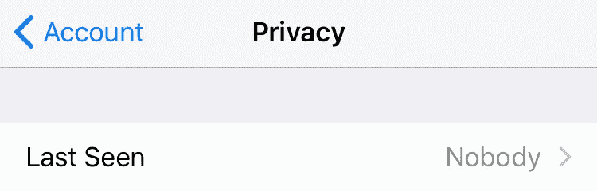
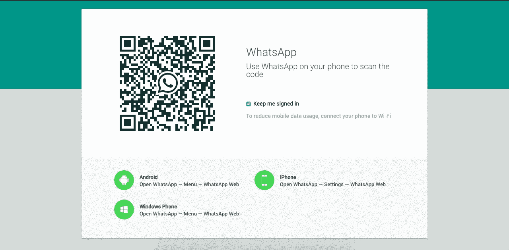
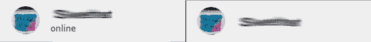
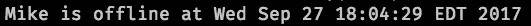

# 哦，我破坏了 WhatsApp 的“最后一次看到”功能了吗？

> 原文：<https://medium.com/hackernoon/uhoh-did-i-break-whatsapps-last-seen-feature-dbde54ecf79b>

***更新:*** *这是我在 2017 年 9 月做的一个概念验证。我没想到这个项目会有如此大的反响。正如许多人提到的，代码不再工作了，因为 WhatsApp Web 一直在改变它的代码。但是，我鼓励您在 GitHub* *上分叉* [*我的项目，让它为您自己的需要工作。*](https://github.com/mnafees/UhOh)

自从我 12 岁开始编程以来，我总是喜欢破坏东西，而不是创造东西。从那时起，尝试深入一个软件的功能，尝试各种方法来破坏一个特性就成了一种爱好。既然我已经告诉你了，你一定已经猜到这篇文章是关于破坏一个软件的特性的。但更重要的是，这也是我试图(或者你可以说是一个概念验证)向你展示如今没有什么是私人的，如果你知道如何闯入什么，那么你知道如何闯入它。

对于这个特殊的尝试，我试图打破 WhatsApp 给你的隐私功能之一。我经常使用 WhatsApp 与家人和朋友交流，几乎一整天都是如此，这是一款非常棒的软件。和许多其他通讯应用一样，WhatsApp 也赋予你控制隐私的权利。其中一个功能是隐藏你的“最后一次被看到”状态。

WhatsApp gives you the ability to hide your “Last Seen” status from others

而且效果很好！我总是把这个设置为“无名小卒”，因为我不想让别人知道我最后一次上网是什么时候，而且我相信数百万其他人也是这样做的。但它有那么安全吗？我能不打破它吗？嗯，这是我开始深入研究的时候。

The homepage for web.whatsapp.com

事实证明，WhatsApp 也有一个网络界面，可以用来直接从你的浏览器聊天。太好了！在这里，我可以很容易地查看源代码，找到它的底层工作原理。我就是这么做的。我浏览了所有让 WhatsApp 网络工作的脚本，发现了一些有趣的东西。如果你在网站上浏览 JS 控制台，输入 *Store* 并按回车键，你会看到一个特定的输出。这就是 WhatsApp Web 在你的浏览器上存储和检索内容的方式。它有一个'*商店'*对象。*商店类型。Presence.models* 瞧！现在，您可以查看联系人的一些详细信息。其中一个小细节是检查用户是否在线，类似于 *__x_isOnline* ，发现这一点后，我非常高兴我可能已经找到了“最后一次看到”隐私功能的解决方法，只需记录用户何时在线以及何时离线。但是经过一些实验后，我发现这不是一个可靠的方法。为什么？因为当我试图用我的定制 JS 代码摆弄 param *__x_isOnline* 时，它消失了。( ***PS。*** *如果你明白这是为什么那么请告诉我！)*

A user has the “online” label to indicate his/her presence

但我显然不会这么轻易放弃。我想，如果我试着一次只锁定一个联系人，然后玩玩 DOM 会怎么样。因此，当用户上网时，他/她在网页中的名字下面会有一个“在线”标签。所以我做了同样的事情，继续查看 DOM 的变化，并相应地记录活动。成功了！我可以看到我在 WhatsApp 上的某个联系人何时上线，何时下线。因此，即使他/她打开了“最后一次看到”隐私选项，我仍然可以跟踪他/她何时上线和下线。这很可怕，对吧？这是我写的一小段代码。

Kind of the same as your “Last Seen” eh?

我称这个小黑客为“ [UhOh](https://github.com/mnafees/UhOh) ”，因为啊哈，我刚刚使用 WhatsApp 自己的网络客户端破坏了它的“上次查看”隐私功能吗？

# 它是如何工作的

对于所有的程序员，我用[木偶师](https://github.com/GoogleChrome/puppeteer)来做这件事。是谷歌 Chrome 团队自己发布的 Chrome 无头节点 API。我简单地自动化了打开浏览器页面的过程，前往 https://web.whatsapp.com 的，选择我想要数据的联系人，并开始“观察”DOM 操作。所有这些都是自动发生的，您可以在控制台中获得日志。更多技术细节可以在我的 GitHub 回购[这里](https://github.com/mnafees/UhOh/blob/master/README.md)找到。

所以我在这里的尝试并不是要吓唬人，而是要告诉你“隐私”的概念在当今世界并不是一个非常正确的概念。事情很容易被破坏，你可以通过几行代码被跟踪，而你甚至可能不知道。