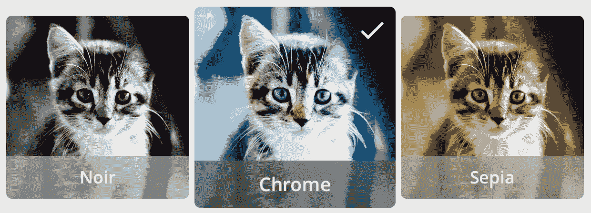
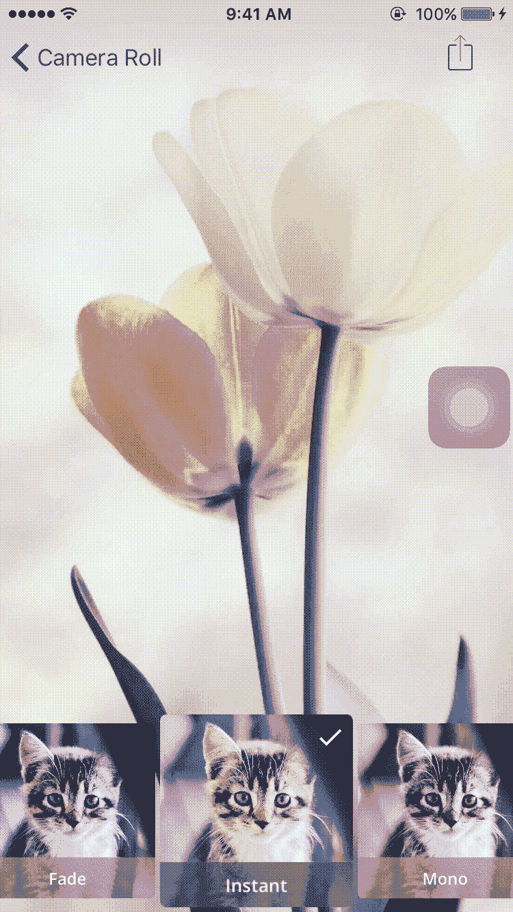

# UICollectionViewCell 选择变得简单..！！

> 原文：<https://medium.com/hackernoon/uicollectionviewcell-selection-made-easy-41dae148379d>

我已经和 *UICollectionView* 和 *UICollectionViewCell* 安静的工作了很长时间。

显示对特定*集合视图单元格*的选择是使用集合视图的人经常面临的问题。我指的是类似这样的事情，

# 如何？

在您的自定义 *UICollectionViewCell* 子类中，只需覆盖 ***isSelected*** 属性，即

***isSelected*** 是 *UICollectionViewCell 的*存储属性，表示单元格的选择状态。当用户从突出显示的单元格中抬起时，选择的状态被切换。

在您的 *UICollectionViewCell* 子类中，您只需要覆盖这个属性并提供您的自定义实现。**示例**:您可以在上面设置*属性观察者*，这样您就可以在特定单元格的属性发生任何变化时得到通知，即

# isSelected 如何作品？

每当用户选择特定的 *UICollectionViewCell* 时:

1.  ***is selected = true***，为选中的单元格。
2.  ***is selected = false***，对于 *UICollectionView* 中的其余单元格。

因此，结果是，每次用户选择一个单元格时，所有单元格的 *isSelected* 将被设置为*真/假*。

# 如何根据单元格的选择状态做出响应？

为了达到期望的结果:

现在，为了显示一个单元格何时被选中/取消选中，您只需要根据您的需求更改单元格的一些属性。

**例如:**

我使用了单元格的*变换、backgroundColor 和一个自定义 imageView isHidden state* 属性来突出单元格的选择状态。你也可以根据自己的需要使用其他的。

# 促销

别忘了阅读我的其他文章:

1.  [拖动&放入收藏&表— iOS 11](/@p.gpt10/drag-it-drop-it-in-collection-table-ios-11-6bd28795b313)
2.  [Swift 4 中关于 Codable 的一切](https://hackernoon.com/everything-about-codable-in-swift-4-97d0e18a2999)
3.  [用渐变给它上色——iOS](https://hackernoon.com/color-it-with-gradients-ios-a4b374c3c79f)
4.  [你一直想知道的关于 iOS 中通知的一切](https://medium.freecodecamp.org/ios-10-notifications-inshorts-all-in-one-ad727e03983a)
5.  [关于 iOS 10 中的今日扩展(Widget)你需要知道的一切](https://hackernoon.com/app-extensions-and-today-extensions-widget-in-ios-10-e2d9fd9957a8)
6.  [选择性添加&移除渐变— UICollectionViewCell](https://hackernoon.com/selectively-add-remove-gradient-uicollectionviewcell-7e8f5464926a)

更多关于 *UICollectionView* 和 *UICollectionViewCell* 的信息，敬请关注本空间。如果你有任何疑问，请随时提出。