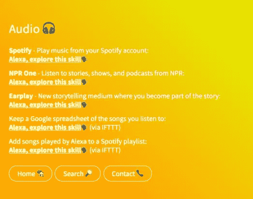
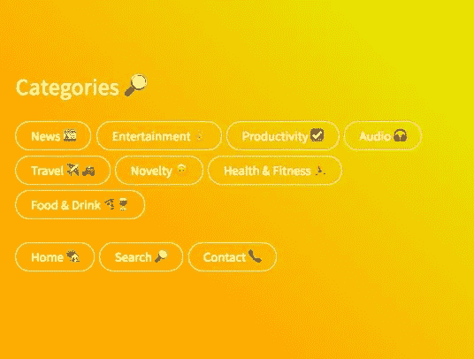

# 语音助手

> 原文：<https://medium.com/hackernoon/ultimate-guide-to-voice-assistants-def7d515a27f>

Image credit — [CNET: Kids try to stump Alexa](https://www.cnet.com/videos/kids-try-to-stump-alexa/)

对于阅读这篇文章的人来说，这并不奇怪(谢谢！)，人们对“[语音助手](https://hackernoon.com/tagged/voice-assistants)的兴趣和应用正在迅速增长。亚马逊 Alexa [最近达到了 10，000 个技能](https://www.wired.com/2017/02/amazon-alexa-hits-10000-skills-plenty-room-grow/)，并且有传言说[将推动下一个 10，000 个技能的采用](http://venturebeat.com/2017/02/25/heres-what-will-drive-adoption-for-another-10000-amazon-alexa-skills/)。我不会深入细节和讨论诸如[保留](http://www.recode.net/2017/1/23/14340966/voicelabs-report-alexa-google-assistant-echo-apps-discovery-problem)之类的问题。这不是这篇文章的内容。

> 有大量的资源和工具、大量很酷的产品、框架、文章和人可以帮助你了解这个领域。

# 💫这里有一些我觉得特别有用的💫

> [这个帖子也在 GitHub 上，公开征求建议，只需提交一个拉取请求](https://github.com/bentossell/ultimate-guide-to-voice-assistants)

[The 2017 Voice Report](http://voicelabs.co/2017/01/15/the-2017-voice-report/) by VoiceLabs

# 🤔这个怎么用

**📰新闻**:关于语音助手的[时事通讯](https://hackernoon.com/tagged/newsletter)很少。马特·哈特曼在我看来做得最好。

> (*我也在考虑开一家——如果你感兴趣，就在下面报名吧！)*

**🍜初创公司:看到在这些领域运营的公司总是很有趣。它们被分成不同的类别，所以你可以很容易地跳到“建筑”、“产品”、“分析”等。如果你认为还有一些需要补充的，[**在这里告诉我**](https://twitter.com/bentossell) **。****

**🤑融资:**这只是概述一些目前非常专注于该领域的公司/基金。还是那句话，如果我错过了一些值得做的事情，[**在这里告诉我**](https://twitter.com/bentossell) **。**

**👥这些是我追随和遇到的一些很棒的人。我把它们都链接起来了，你应该看看。如果我错过了一些有意义的事情，你可以在这里用 [**告诉我**](https://twitter.com/bentossell) **。****

# 享受😊！

## 🚀我推出了一些东西:

## [Skills . wtf——一个寻找最好的 Alexa 技能的网站](https://skills.wtf/)

## 🚀另外，在这篇文章的最后，我添加了一个关于我正在做的实验的小注释。一个有助于促进联系的社区；

> -获得一项技能/为个人/公司创造技能
> -找到活跃在该领域的投资者
> -介绍给其他活跃的爱好者
> -与他人交流想法
> -来自经验丰富的个人的建议&指导
> -帮助你建立
> 的资源和工具-发现有趣的产品和公司

# 📰新闻

## 🗞时事通讯

 [## 听到声音- Revue

### 听到声音——本周关于语音计算应用的新闻，直接发送到你的收件箱。...

www.getrevue.co](https://www.getrevue.co/profile/hearingvoices) 

[亚马逊官方 Alexa 开发者简讯](https://developer.amazon.com/alexa-skills-kit/alexa-developer-newsletter-subscription)

 [## 由谷歌制造

### 你可以完全控制何时让 Google Home 响应你的语音命令。它的光亮状态告诉你…

madeby.google.com](https://madeby.google.com/home/learn/) 

> *(一般 Google 新闻+ Google Home。页底订阅)*

## 🖥网站/来源

 [## Alexa -中等

### 阅读关于 Alexa 的文章。每天，成千上万的声音在媒体上阅读、写作和分享关于 Alexa 的重要故事…

medium.com](/tag/alexa)  [## 语音助手-中等

### 阅读关于语音助手的文章。每天，成千上万的声音在媒体上阅读、书写和分享重要的故事…

medium.com](/tag/voice-assistant)  [## 亚马逊回声媒体

### 阅读关于亚马逊 Echo 的文章。每天，成千上万的声音在媒体上阅读、书写和分享关于…的重要故事

medium.com](/tag/amazon-echo)  [## Google 主页-中等

### 阅读关于谷歌主页的文章。每天，成千上万的声音在媒体上阅读、书写和分享关于…的重要故事

medium.com](/tag/google-home)  [## Siri -中等

### 阅读关于 Siri 的文章。每天，成千上万的声音在 Medium 上阅读、书写和分享关于 Siri 的重要故事。

medium.com](/tag/siri)  [## 声音媒介

### 阅读关于声音的文章。每天，成千上万的声音在媒体上阅读、书写和分享关于声音的重要故事…

medium.com](/tag/voice)  [## 语音助手 _on_VentureBeat

venturebeat.com](http://venturebeat.com/search/?q=voice%20assistant)  [## 亚马逊 Alexa * /r/alexa

### 亚马逊语音驱动设备如 Echo、FireTV 等背后的大脑。

www.reddit.com](https://www.reddit.com/r/alexa/)  [## Amazon Echo |一个将物联网带到您家中的语音命令系统* /r…

### r/AmazonEcho 是一个以 AmazonEcho 为中心的社区，或者我们喜欢称她为 Alexa。Alexa 是专为…

www.reddit.com](https://www.reddit.com/r/amazonecho/)  [## 一切 Google Home * /r/googlehome

### 一切谷歌主页:提示，错误，新功能，请求等。

www.reddit.com](https://www.reddit.com/r/googlehome/)  [## 语音助手

### 有线是实现明天的地方

www.wired.com](https://www.wired.com/?s=voice+assistant)  [## Alexa | TechCrunch

### 即使在智能手表出现之前，我也没有戴手表。我没有买苹果手表或 Pebble，尽管…

techcrunch.com](https://techcrunch.com/tag/alexa/)  [## 谷歌主页| TechCrunch

### Google Home 是谷歌对亚马逊语音回声设备系列的回应。在 I/O 上宣布 Home 之后…

techcrunch.com](https://techcrunch.com/tag/google-home/)  [## 博客

### 了解语音应用、亚马逊 Alexa 和谷歌助手创新。一个免提的世界即将到来，加入进来！

voicelabs.co](http://voicelabs.co/blog/)  [## @ ReadMultiplex

### 多元化-过去、现在、未来的技术研究+见解☂️

readmultiplex.com](http://readmultiplex.com/)  [## 新闻报道-声音-第一产业

### 阅读最新的亚马逊 Alexa 和谷歌助手新闻，谈论语音优先的最新发展…

voicelabs.co](http://voicelabs.co/press/) 

## 📜空间中的一般新闻(非特定语音)

 [## 技术上有感觉

### 为您带来最新的人工智能、机器人和神经技术

inside.com](https://inside.com/technically-sentient)  [## 僵尸出版物

### 聊天机器人的一切。僵尸名单的制作者

botpublication.com](https://botpublication.com)  [## GoMainstrm

### 将技术与大众联系起来

gomainstrm.com](http://gomainstrm.com/)  [## 聊天机器人杂志

### 聊天机器人、AI、NLP、Facebook Messenger、Slack、Telegram 等等。

chatbotsmagazine.com](https://chatbotsmagazine.com)  [## 阿比·琼斯的《对话界面上的文字》

### 编辑描述

tinyletter.com](http://tinyletter.com/locutius)  [## 奥莱利机器人播客的想法和资源。

### O'Reilly Bots 播客涵盖了对话式用户界面、人工智能和消息传递方面的进展…

www.oreilly.com](https://www.oreilly.com/topics/oreilly-bots-podcast) 

[信息周刊](http://www.messagingweekly.com/)—[接吻](https://smooch.io/)团队策划

[聊天机器人周刊](http://www.chatbotsweekly.com/)——由 [Omar Pera](https://twitter.com/ompemi) 和 [Reply.ai](https://www.reply.ai/) 团队策划

# 🍜创业公司

## 🗣平台

 [## 对 Google 的操作|对 Google 的操作| Google 开发者

### 谷歌上的动作让开发者为谷歌助手建立体验。

developers.google.com](https://developers.google.com/actions/)  [## 寻找有经验的技能建设者和工具

### 寻找在设计，开发和优化 Alexa 技能方面具有专业知识的公司，从代理和开发到…

developer.amazon.com](https://developer.amazon.com/alexa/agencies-and-tools)  [## 首页-迈克罗夫特

### 我是开源的，这意味着你可以把我的智慧放进你自己设计的设备里。给你的冰箱启用语音功能…

mycroft.ai](https://mycroft.ai/)  [## Cortana -认识你的私人助理-微软-全球

### Cortana 是你的私人助理，随时准备在任何情况下帮助你。看看世界上最私人的…

www.microsoft.com](https://www.microsoft.com/en/mobile/experiences/cortana/)  [## iOS - Siri -苹果(英国)

### 苹果 iPhone、iPad 和 iPod touch 上的 Siri 可以让你用语音发送信息、打电话、设置提醒等等。

www.apple.com](http://www.apple.com/uk/ios/siri/)  [## Viv

### Viv 是一个人工智能平台，使开发人员能够创建一个智能的对话界面…

viv.ai](http://viv.ai/) 

## 👔公司

[Capito 系统](http://www.capitosystems.com/)

[认知密码——西尔维娅](http://www.silvia4u.com/)

[Mindmeld](https://www.mindmeld.com/)

[细微差别](http://www.nuance.com/index.htm)

[Verbio](https://www.verbio.com/)

[渡鸦科技](https://www.raventech.com/box) ( [Acq by 百度](https://www.bloomberg.com/gadfly/articles/2017-02-16/baidu-failing-fast-is-a-smart-move-to-build-a-future?cmpid=socialflow-twitter-business&utm_content=business&utm_campaign=socialflow-organic&utm_source=twitter&utm_medium=social))

[移动语音](http://www.chumenwenwen.com/en/site/index.html)

## ☁️云服务

[亚马逊 Lex](https://aws.amazon.com/lex/)

[亚马逊波利](https://aws.amazon.com/polly/)

[谷歌云平台](https://cloud.google.com/)

[微软认知服务](https://www.microsoft.com/cognitive-services/en-us/)

## 🛠大厦

## -SDK 和框架

[协助](http://www.assi.st/)

[Alexa 技能包](https://developer.amazon.com/alexa-skills-kit)

[拉线](https://www.pullstring.com/build_alexa_skills_fast)

[可交谈的](http://conversable.com/)

[预订工具](https://bespoken.tools/for-alexa-skills-kit)

[谷歌助手 API . ai](https://api.ai/google-assistant/)

[亚马逊 Alexa 的 API . ai](https://docs.api.ai/docs/alexa-integration)

[Kitt.ai](http://kitt.ai/)

[Sayspring](http://www.sayspring.com/)

[Houndify](https://www.houndify.com/)

[Smartly.ai](http://smartly.ai/)

[五味杂陈](https://gomix.com/)

[iftt](https://ifttt.com/amazon_alexa)

[马赛克](https://saymosaic.com/)

## -临时演员

布莱恩·多诺霍的这篇文章是一个很好的开始:

 [## 建立你的第一个 Alexa 技能

### 昨晚，betaworks 和亚马逊举办了第一次纽约亚马逊 Alexa Meetup，将 Alexa 用户和爱好者聚集在一起…

medium.com](/@bthdonohue/build-your-first-alexa-skill-8a37dc3103d6) 

[亚历山大港](https://alexatutorial.com/)

[如何通过 Rocket Insights 建立你的第一个亚马逊 Alexa 技能(电子书)](http://www.rocketinsights.com/work/alexa/)

 [## Alexa，午餐吃什么？

### 在 10 分钟内建立你的第一个自定义技能(不需要编程经验)。

iot-for-all.com](https://iot-for-all.com/alexa-whats-for-lunch-fb02062e54b9)  [## 用 Node.js 和 StdLib 在 7 分钟内建立 Alexa 技能

### 在 StdLib(“标准库”)，我们允许开发人员将 Node.js 中编写的函数部署为无限可扩展的 API…

hackernoon.com](https://hackernoon.com/build-an-alexa-skill-in-7-minutes-flat-with-node-js-and-stdlib-70611f58c37f)  [## Alexa-消息生成器

### Alexa 回复的简单生成器。

www.npmjs.com](https://www.npmjs.com/package/alexa-message-builder) 

## 💼代理

[Xandra](https://www.xandra.com/)

[协助](http://www.assi.st/)

[下雨](https://rain.agency/alexa/)

[移动城市](https://www.mobiquityinc.com/alexa)

[火柴盒](http://matchboxmobile.com/)

[至](http://www.solstice.com/alexa?utm_source=Amazon%20Alexa%20Partner%20Page&utm_campaign=Amazon%20Alexa%20Partner%20Page)

SciFutures

[VaynerMedia](http://www.vaynermedia.com/)

[威特林戈公司](http://www.witlingo.com/)

[AKQA](http://www.akqa.com/work/jamie-oliver/amazon-alexa-skill/)

[海雀](https://www.razorfish.com/)

[巨型勺子](http://www.giantspoon.com/)

[Iconmobile](http://www.iconmobile.com/)

[新闻周期解决方案](http://newscycle.com/mobile)

[眨眼](https://blinkux.com/alexa)

[精神共享](http://www.mindshareintheloop.com/)

[部落规模](http://www.tribalscale.com/)

[沃拉拉](https://volara.io/)

[矢量图](https://www.vectorform.com/)

[XAPPmedia 公司](https://xappmedia.com/develop-custom-alexa-skills/)

[统一计算机情报公司](http://www.ucic.io/)

[以用户界面为中心](http://www.uicentric.com/)

奥皮罗

[发声](https://www.vocalid.co/)

[熟悉实验室](http://www.conversantlabs.com/)

[语音未来](http://www.futureofvoice.com/)

## 📈分析学

[VoiceLabs.co](http://voicelabs.co/)

[Opearlo Analytics](https://analytics.opearlo.com/)

[威特林戈公司](http://www.witlingo.com/)

[仪表板机器人](https://www.dashbot.io/)

[僵尸分析](http://botanalytics.co/)

## 🎙产品

[iOS](https://itunes.apple.com/us/app/amazon-alexa/id944011620?mt=8) 和 [Android](https://play.google.com/store/apps/details?id=com.amazon.dee.app) 上的 Alexa 技能商店应用

[非官方的 Alexa 技能商店](https://www.alexaskillstore.com/)

[OK Google](http://ok-google.io/) —你可以向谷歌语音助手询问的命令列表

[完成](https://clinc.com/finie.html)

## 🤖五金器具

[细胞核](https://nucleuslife.com/)

[堵塞声音](https://www.jamaudio.com/jam-voicetm-portable-wifi-and-bluetooth-speaker-with-amazon-alexa)

[艾维](https://helloivee.com/)

[纪博](https://www.jibo.com/)

[Whyd](https://whyd.com/)

[库里](https://www.heykuri.com/)

[猞猁](http://www.ubtrobot.com/news/detail195.html)

[你好彩蛋](http://helloegg.net/)

[部落 IO](http://www.invoxia.com/triby-io/)

[宠物网络](http://www.petnet.io/)

[跟踪器](https://thetrackr.com/)

穆斯林的

[侦察兵警报](https://www.scoutalarm.com/integrations/amazon-echo)

[Garageio](https://garageio.com/workswith/echo)

玩具邮件

生态蜜蜂

[亮度](https://lumahome.com/alexa/)

[环](https://ring.com/)

[地中海实验室](https://www.thalmic.com/)

[具体化](http://www.embodied.me/)

[小猫头鹰](http://www.owletcare.com/)

[夜行者](http://vespermems.com/)

# 🤑筹款

[Alexa 基金](https://developer.amazon.com/alexa-fund)

[由 Techstars 提供支持的 Alexa 加速器](http://www.techstars.com/content/accelerators/announcing-alexa-accelerator-powered-techstars/)

[光速创投](http://lsvp.com/)

[启动资金](http://www.launchcapital.com/)

[NextView Ventures](http://nextviewventures.com/)

[Betaworks](https://betaworks.com/voicecamp/)——[在 beta works 的语音营获得 Alexa 团队的支持](https://developer.amazon.com/blogs/post/8255d18f-b14a-4996-8ee6-e09719238ace/get-support-from-the-alexa-team-at-betaworks-voicecamp)

 [## 语音营

### voicecamp 是一个为任何在对话界面生态系统中构建的人设计的程序。

betaworks.com](https://betaworks.com/voicecamp/) 

## 💵Alexa 基金(公布的所有公司)

[苏特罗](https://mysutro.com/)

[发票](http://www.invoxia.com/)

[Petnet](http://www.petnet.io/)

[拉奇奥](http://rachio.com/)

[mojio](https://www.moj.io/)

[跟踪器](https://thetrackr.com/)

[穆斯林的](http://www.musaic.com/)

[侦察报警](https://www.scoutalarm.com/integrations/amazon-echo)

Garageio

玩具邮件

[龙的创新](https://www.dragoninnovation.com/)

[凯特·艾](http://kitt.ai/)

生态蜜蜂

[亮度](https://lumahome.com/alexa/)

[环](https://ring.com/)

[细胞核](https://nucleuslife.com/)

[定义人群](https://www.definedcrowd.com/en-us/)

[晚祷](http://vespermems.com/)

# 👥人员和帖子

> [机器学习的非技术性指南&人工智能](https://medium.com/u/5c6977d2a94f#.gg8xdh2yb)中“借用”了这个模板，这是一个很棒的帖子&时事通讯，我用它来学习机器学习。感谢[山姆·德布鲁姆](https://medium.com/u/f3a886c9aaff?source=post_page-----def7d515a27f--------------------------------) *🙌*

> [黑客中午](http://bit.ly/Hackernoon)是黑客如何开始他们的下午。我们是 [@AMI](http://bit.ly/atAMIatAMI) 家庭的一员。我们现在[接受投稿](http://bit.ly/hackernoonsubmission)，并乐意[讨论广告&赞助](mailto:partners@amipublications.com)机会。
> 
> 如果你喜欢这个故事，我们推荐你阅读我们的[最新科技故事](http://bit.ly/hackernoonlatestt)和[趋势科技故事](https://hackernoon.com/trending)。直到下一次，不要把世界的现实想当然！

