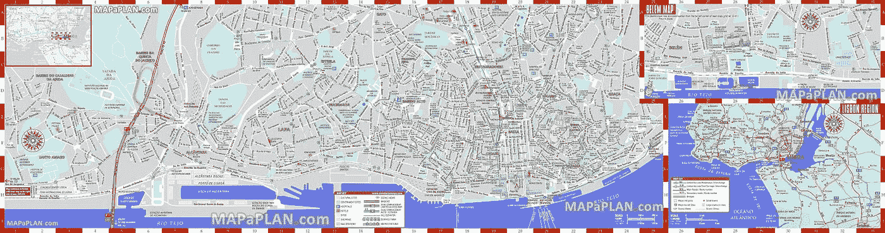
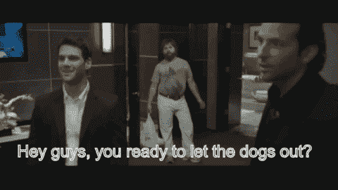
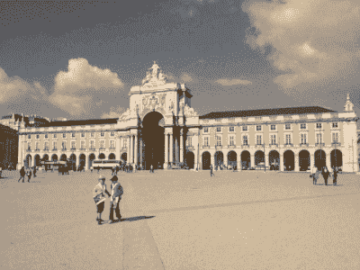

# 会议终极生存指南|网络峰会 2021

> 原文：<https://medium.com/hackernoon/ultimate-survival-guide-for-conferences-web-summit-2017-lisbon-portugal-622547956a28>

Paddy Cosgrave, Web Summit CEO

很容易理解为什么[网络峰会选择里斯本](https://blog.websummit.com/lisbon-the-startup-city-guide/)作为它的所在地。里斯本横跨 7 座小山，以其令人惊叹的建筑、美味的食物、法多音乐、海岸风景和放松的氛围而闻名。查看我更新的 [**参加 Covid 世界**](https://www.linkedin.com/pulse/ultimate-guide-web-summit-2021-rachel-jacobs) 网络峰会的指南。

Source: [mapaplan.com](http://www.mapaplan.com/travel-map/lisbon-portugal-city-top-tourist-attractions-printable-street-plan/lisbon-top-tourist-attractions-map.htm) (check out their interactive maps)

# 在会议之前

Fail to plan, and plan to fail!

以下是我的建议清单，以确保你在参加 2021 年网络峰会前尽可能做好准备。

# 会议结束后

Don’t forget to nurture your new contacts!

人们在参加活动时犯的最大错误之一是忘记跟进。如果你没有从活动中得到任何东西，那么这很可能是浪费时间。这是我的电子邮件[模板](https://www.linkedin.com/pulse/ultimate-guide-web-summit-2021-rachel-jacobs)，用于事后跟进。

# 游览里斯本的快速提示

Praça do Comércio (Central square)

里斯本有丰富的景点、美丽的海滩、博物馆和覆盖着华丽瓷砖的建筑，令人大饱眼福。我在这里整理了一张[清单](https://www.linkedin.com/pulse/ultimate-guide-web-summit-2021-rachel-jacobs)，列出了一些你在里斯本期间必去的地方、有用的建议和想法。

Mic Drop!

所以，你有它！一个全面的'里斯本最终指南'给任何参加今年网络峰会的人。