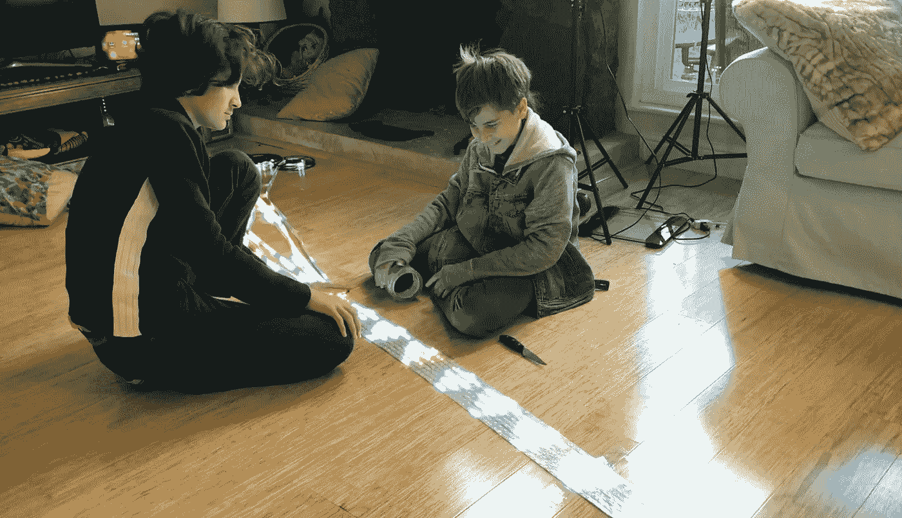

# 令人难以置信的巨大 LED 圣诞灯在这个假期来到我们家

> 原文：<https://medium.com/hackernoon/unbelievably-huge-led-christmas-lights-coming-to-our-house-this-holiday-season-7028c24a9036>

圣诞节就要到了，你知道我们必须建造一些东西，让整个社区都沉浸在圣诞节的气氛中！那么，我们是如何实现这一目标的呢？答案是 Arduino Mega，如果你是一个创造者，这是一个完美的工具！

我们在诺瓦托的房子现在被巨大的白色发光的太空入侵者和明亮的绿色圣诞树所覆盖！我们还有显示“圣诞快乐”和“新年快乐”等信息的文本我们正式成为了附近科技装饰最先进的房子。

就我个人而言，我最喜欢的部分是我们在许多灯光上的弹出效果——基本上灯光一个接一个地“爆炸”,直到房子的整个侧面都是黑暗的。

> 该项目的总预算约为 400 美元。对于 16 个 LED 灯带中的 4800 盏灯来说还不错。

这个节日 DIY 项目需要的硬件。

## 16 个 LED 灯带，WS2812b，16.4 英尺。

两条线焊接在一起，覆盖整个屋顶。8 根线相互固定在一起。最终，你会得到一个 32.8 英尺长的屏幕。

## 3 个 5V 400W 电源

一个在屏幕的两边，第三个在中间。

## Arduino Mega 2560

## Arduino Mega Proto 盾 2560

## 8 个 500 欧姆电阻器

将数据从 Arduino 传输到 LED 灯带。

## LED 条形连接器

连接到 Arduino 试验板护罩

## 电线

## 3 个 1000 微法* 10V 的电容器

保护 LED 灯免受电压峰值的影响。

如果 LED 灯带中的任何元件损坏，您可以切除故障部分，然后重新连接灯带，使其正常工作。我知道这些是因为它发生在我身上！

这里有一个简短的 [Arduino 草图](https://github.com/ilya000/MacroMarquee/)你将需要使整个工作！

我对启发我的那个人开发的 Arduino 草图做了一些编辑。[这是他的 LED 项目的链接](https://wp.josh.com/2016/05/20/huge-scrolling-arduino-led-sign/)！

*我叫 Savva Osipov，我和我的父亲正在为我们计划在 1 月份推出的项目进行 Kickstarter 宣传活动。如果你对* [*学习*](https://hackernoon.com/tagged/learning) *g 更感兴趣并了解最新动态，请订阅我的 YouTube 频道或* [*脸书页面*](https://www.facebook.com/SavvaOsipov) *，你将是第一个知道新闻和更新的人！*