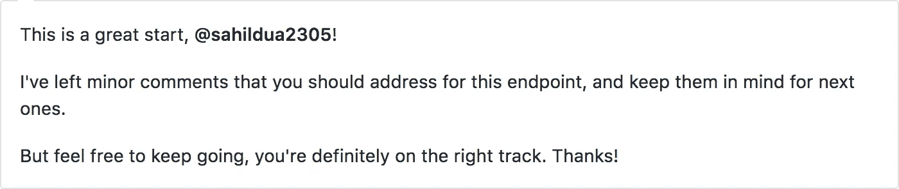
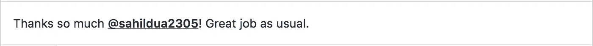

# 学习新编程语言的非常规方式

> 原文：<https://medium.com/hackernoon/unconventional-way-of-learning-a-new-programming-language-e4d1f600342c>

这里有 500 多种[编程](https://hackernoon.com/tagged/programming)语言。因此，对你来说，今天开始[学习](https://hackernoon.com/tagged/learning)一门新的编程语言是很正常的。有可能你知道 **C++** 和 **Java** 但是你的工作需要 **Python** 或者**你精通 **Python** 你需要在工作中用 **Java** 编码。或者你想学习这种很酷的语言只是为了扩展你的专业知识。**

如果你想学习一门新的编程语言，你有什么选择？

*   从一些在线教程或
*   从一些在线(MOOC)课程中学习

你们中的一些人甚至可能认为学习一门新语言的最好方法实际上如下:

*   学习新编程语言的语法
*   使用该语言构建一些个人项目

很公平！这可以确保你应用你从学习你想学的语言语法中学到的知识。

在学习不同语言的同时，我已经开发了 20 多个迷你项目。相信我，当你为你的个人项目写代码的时候，可能是一个周末项目或者一个通宵的快速黑客，你写代码是为了完成一些事情。你关心的只是——“我的代码有用吗？”。你几乎不关心代码的质量。

> “任何傻瓜都能写出计算机能理解的代码。优秀的程序员会写出人类能理解的代码。”——(马丁·福勒)

那么，如何学习你正在努力学习的新编程语言的良好实践呢？

# 为该语言的开源项目做贡献。

惊讶吗？你们中的一些人可能会想——“但是等等，开源很难。只有我们精通这种语言，我们才能为开源项目做出贡献，对吗？”。答案是否定的。

我给你讲个故事吧。

去年，我得到了一份来自 Booking.com 的全职工作，我知道我将从事 Perl(这是他们主要的后端语言)。2016 年 6 月，当我获得大学学位时，我开始学习 Perl，以便为大学毕业后的第一份工作做准备。因为我要在七月的第二周加入，我大概有一个月的时间。

我开始阅读 Perl 的语法，并开始理解该语言的一些常见模式。现在，我真的想用 Perl 来构建一些东西，这样我就可以应用我的语言知识并实践各种语言概念。当我在寻找用 Perl 构建一些东西的想法时，我在 GitHub 上偶然发现了 DuckDuckGo 的开源组织。我注意到一些开放的项目是用 Perl 编写的。我看了一下这些问题，发现了许多“初学者”问题。我立即开始处理它们，并提交了几个拉取请求。快进到今天，我是他们几个开放项目的主要贡献者之一，也是 DuckDuckGo 的 20 个开源社区领导者之一。

> 故事的寓意——我最终通过参与用 Perl 编写的开源项目学习了 Perl。

# 那么，为什么会成功呢？

在我学会 Perl 的语法之后，我开始为开源项目做贡献。在这样做的时候，我总是习惯于查看现有的模块。我曾经注意到 Perl 中使用的模式。因此，我开始在自己的代码中收集这些好的实践，它帮助我学习如何用 Perl 编写好的代码。

这不仅仅是巧合；让我告诉你另一个故事，以获得更多的相关性。

最近，当我在 Booking.com 工作的时候，我接了一些任务，其中包括开发一个用 Go 语言编写的服务(添加一个新特性)。这是我和我的队友的对话—

> **我:**我真的很喜欢这个任务。我想继续努力。你怎么想？
> 
> **他:**是的，的确很有趣。但是，这需要围棋知识。你知道围棋吗？
> 
> **我:**没有
> 
> **他:**你想学围棋吗？
> 
> **我:**对！
> 
> **他:***微笑*好了！

所以我就在那里——在学习另一种编程语言的边缘——开始！

我开始阅读关于 Go 的语法，并在他们的官方网站上找到了一个非常棒的初学者语言之旅。它足以让我熟悉这门语言的所有基本概念。

我又一次开始在 Go 中寻找有一些“初学者”或“容易解决”问题的开源项目。我找到了 Google 的一个项目，它基本上是 GitHub 的 REST API 的 Go 包装器。

在我开始学习围棋的两天后，我有了我的第一个项目公关。

My contribution graph for last 1 year ([https://github.com/sahildua2305](https://github.com/sahildua2305))

# 开源有什么帮助？

所以现在你可能想知道开源贡献如何帮助你学习一门语言的良好实践。它有许多方面。让我们逐一讨论。

## **代码质量**

大多数好的开源项目都有严格的编码指导方针，为了合并代码，你必须遵守这些指导方针。这将帮助你适应这些指导方针，从而写出高质量的代码，即使你只是在学习这门语言。

不仅如此，您还有机会看看代码的其余部分，看看它写得和/或记录得有多好。

## 代码审查

开源贡献最好的部分是代码审查。当你推进你的代码时，你从与那个项目相关的专家那里得到反馈，因此它给你一个机会来提高你对语言的理解。

这就像获得一个免费的关于如何写好代码的个人指导。

## 欣赏

First comment on my first PR in Go Lang ([https://github.com/google/go-github/pull/497](https://github.com/google/go-github/pull/497))

我们，作为软件开发人员，真的需要对我们的工作的欣赏；开源社区确保你有足够的资源。在我整个开源贡献的经历中，我从来没有收到过哪怕是一个侮辱或者打击积极性的评论。每个人都超级鼓励和乐于助人。

Another comment by someone in DuckDuckGo community

所以下次你想学一门新语言，大胆尝试吧！找到一个开源项目，并在学习该语言及其细微差别的道路上前进；)

一定要让我知道这种非传统的方式对你有什么作用。另外，如果你认为这篇文章对某人有用，请推荐(❤)这篇文章。

请随意分享其他对你非常有效的方法。推文/关注我 [@sahildua2305](https://twitter.com/sahildua2305) 。

> [黑客中午](http://bit.ly/Hackernoon)是黑客如何开始他们的下午。我们是 [@AMI](http://bit.ly/atAMIatAMI) 家庭的一员。我们现在[接受投稿](http://bit.ly/hackernoonsubmission)并乐意[讨论广告&赞助](mailto:partners@amipublications.com)机会。
> 
> 如果你喜欢这个故事，我们推荐你阅读我们的[最新科技故事](http://bit.ly/hackernoonlatestt)和[趋势科技故事](https://hackernoon.com/trending)。直到下一次，不要把世界的现实想当然！

