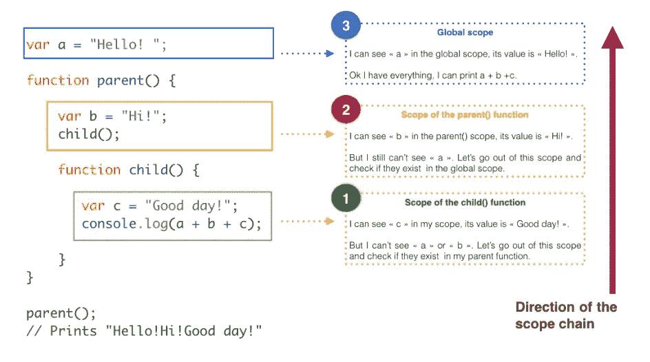

# 轻松理解 JavaScript 变量范围

> 原文：<https://medium.com/hackernoon/understand-javascript-variable-scope-with-ease-221a6d41dc43>

## 因为在 JavaScript 中，范围就在你周围

在 [JavaScript](https://hackernoon.com/tagged/javascript) 中，作用域决定了你的[程序](https://hackernoon.com/tagged/program)可以在哪里看到和使用某些变量。

换句话说，**引用一个变量的范围等于回答这个问题:“我们在哪里可以访问这个特定的变量？”**。

# 全球和本地范围

范围可以是双重的:全局的或局部的。

**全局**:在函数外*定义的变量是全局的，可以从代码中的任何地方访问。*

**局部**:函数内*定义的变量只被认为是该函数的局部变量。该函数之外的任何代码都不能访问或使用它。*

[https://unsplash.com/](https://unsplash.com/)

把全球范围想象成地球大气层之外的外层空间:它不属于任何国家，任何人都可以在那里找到任何东西。

[https://unsplash.com/](https://unsplash.com/)

现在把局部范围想象成在美国境内定义的空间。现在不同了:你在这里能找到的一切都属于美国，而且只属于美国。

作为一个来自外界的人，你没有权利访问和要求你在这些边界内找到的资源。

然而，作为一个来自美国的人，你仍然可以接触到外太空的一切，全球范围的。

Javascript 中变量的作用域基本上是相同的:

**内部(局部)作用域中的变量不能被外部(全局)作用域看到或使用，但是定义在外部(全局)作用域中的变量可以被内部(局部)作用域看到和使用。**

> **内部(局部)作用域中的变量不能被外部(全局)作用域看到或使用，但是定义在外部(全局)作用域中的变量可以被内部(局部)作用域看到和使用。**

这是一个全局和局部范围的例子:

这里发生了什么？我们知道在函数中声明的变量是局部变量，并且只能在函数中访问。

在`sayHello`函数内部，在这个局部范围内，`greeting`等于“嗨，我是局部变量”。

所以当我们调用函数`sayHello`时，`greeting`的值就是在局部范围内定义的值。

然而，当我们简单地从全局范围记录`greeting`变量时，我们不在任何函数内部，程序得到我们全局定义的变量的值:“嗨，我是一个全局变量”。

这很重要:**当我们创建一个函数时，它有自己的范围，自己的一组变量。**

> 当我们创建一个函数时，它有自己的范围，自己的变量集。

然而，正如我们之前所说的，这并不意味着在函数内部我们不能访问在函数外部定义的变量:

我们在这里看到的是，当我们在函数的外部定义变量*时，我们仍然可以在该函数的*内部访问它*。*

总而言之:**如果我们在函数外部声明一个变量，我们可以从函数内部访问它，但是反过来就不一样了**。

> **如果我们在函数外部声明一个变量，我们可以从函数内部访问它，但反之则不然**

# 函数内部的函数

但是如果在另一个函数中创建一个函数会发生什么呢？

[https://unsplash.com/](https://unsplash.com/)

我的朋友，如果你这样做，你实际上创建了两个作用域，它们的行为如下:

子函数将能够看到所有父函数的所有变量，但是父函数永远不会知道在它的子函数中声明的变量。

换句话说，所谓的**范围链**(JavaScript 在寻找变量的存在和值时采用的路径)只在一个方向上起作用:从它被调用的位置到父函数，最后到全局范围。

例如，如果我们从一个嵌套在另一个函数中的函数中寻找位于不同作用域的变量，JavaScript 会这样做:

The Scope Chain

我从全局作用域中调用函数`parent`，它被提示运行`child`函数，该函数反过来负责打印在不同作用域中声明的 3 个变量的 3 个值。

为了确定这三个变量中每一个的存在和值，JavaScript 从`child`函数内部(当时正在执行的最里面的作用域)开始，向上一级直到找到所有的变量或者找到全局作用域。

> JavaScript 从`child`函数的内部开始(当时正在执行的最里面的作用域),向上一级直到找到所有变量或者找到全局作用域。

一旦找到第一个匹配，这个范围搜索就会停止，这意味着如果所有三个变量`a`、`b`和`c`都在`child`函数中声明，JavaScript 就不会觉得有必要向上搜索，执行就会在`child`函数的范围内停止。

# `var`关键字

考虑以下代码:

哎？！为什么`myVariable`的值取本地定义的值？全局变量被局部变量覆盖。为什么？

注意在这个例子中，我们的`sayHello()`函数中的`myVariable`没有以`var`关键字作为前缀:

**如果一个局部变量没有用** `**var**` **关键字声明就被使用，它就成为一个全局变量。**

> **如果一个局部变量没有用** `**var**` **关键字声明就被使用，它就变成了一个全局变量。**

遵循这个规则，当`sayHello()`函数运行时，gobal 变量被重新分配一个新值。因此，`myVariable`在`sayHello`运行前后具有不同的值。

这也意味着局部作用域中的变量可以和全局作用域中的变量同名:如果它们都用`var`关键字声明，那么它们实际上是两个不同的变量，彼此独立。通过在函数内部的变量前添加`var`，我们创建了一个新的*变量*，它只存在于该函数的作用域中。

我知道这可能有点令人困惑；请记住:

> 在使用局部变量之前，一定要用`var`关键字声明它们，否则你的代码会有不良行为的风险。

# 函数内部变量的优先级

如果在全局作用域和局部作用域中声明了两个同名的变量，哪一个占优势？

当你试图访问函数内部的变量(局部范围)时，局部变量将优先于全局变量。

让我们来演示一下:

`myJob`变量在全局作用域和局部作用域中声明，提示在控制台中记录它。JavaScript 对`myJob`的搜索从函数内部开始并找到它，所以它停止了，而没有尝试在外部范围内寻找。

由于函数内部的`myJob`是局部的，它优先于全局范围内同名的变量。

# 词汇范围

也许你想知道函数中变量的作用域是否会根据程序中调用函数的位置而改变:如果我在声明函数之前或之后运行函数，那么变量在其作用域中会有不同的值吗？

答案是否定的，因为 JavaScript 中的函数在词汇上是*作用域*的:它们在定义它们的**作用域**中运行，而不是在执行它们的**作用域**中运行。

> JavaScript 中的函数在词汇上是有作用域的:它们运行在定义它们的作用域中，而不是执行它们的作用域中。

程序的静态结构、代码作者编写的函数和变量的位置决定了变量的作用域。

让我们考虑这段代码:

`myVariable`的值在两种情况下都是在函数中声明*的变量的值:**它真正独立于函数在*运行*的地方，只依赖于在*声明*的地方的局部作用域。***

# 结论:如何使用范围？

[https://unsplash.com/](https://unsplash.com/)

使用函数的局部范围有助于防止函数之间的意外干扰。例如，它节省了确保在同一个程序中没有名字被用于两个不同目的的耗时工作。

通过在每次编写一个新函数时创建一个局部作用域， **JavaScript 使得将每个函数视为一个自封闭的宇宙成为可能，并且是保持全局作用域干净的一种方式**。

想了解更多？查看我关于 JavaScript 基础的其他文章:

*   [**JavaScript 中的吊装:快速指南**](https://hackernoon.com/hoisting-in-javascript-a-quick-guide-cc4d9597bbd7)
*   [**把头缠在“这个”上**](/@lenafaure/get-your-head-around-this-73c23653b102)
*   [**如何自信地使用 JavaScript 闭包**](/@lenafaure/how-to-use-javascript-closures-with-confidence-85cd1f841a6b)
*   [**掌握 JavaScript**](https://hackernoon.com/grasp-by-value-and-by-reference-in-javascript-7ed75efa1293) 中的“按值”和“按引用”
*   [**JavaScript 中的日期快速手册**](https://hackernoon.com/a-quick-handbook-for-dates-in-javascript-7b71d0ef8e53)
*   [**像老板一样使用 JavaScript 数组**](/@lenafaure/work-with-javascript-arrays-like-a-boss-97207a042e42)

我希望您喜欢这篇关于 JavaScript 范围的介绍。

请随意评论并喜欢这篇文章，以便其他人可以在 Medium 上轻松找到它！

> [黑客中午](http://bit.ly/Hackernoon)是黑客如何开始他们的下午。我们是 [@AMI](http://bit.ly/atAMIatAMI) 家庭的一员。我们现在[接受投稿](http://bit.ly/hackernoonsubmission)，并乐意[讨论广告&赞助](mailto:partners@amipublications.com)机会。
> 
> 如果你喜欢这个故事，我们推荐你阅读我们的[最新科技故事](http://bit.ly/hackernoonlatestt)和[趋势科技故事](https://hackernoon.com/trending)。直到下一次，不要把世界的现实想当然！

