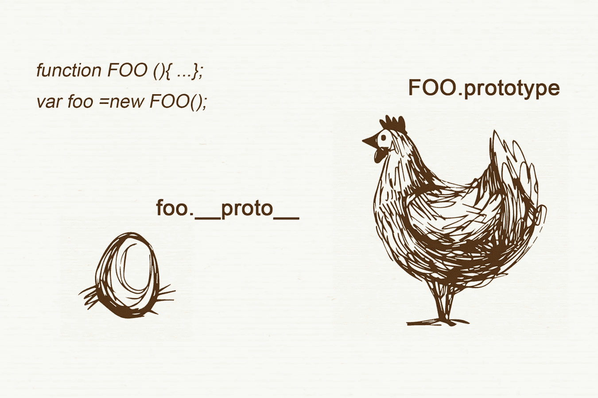
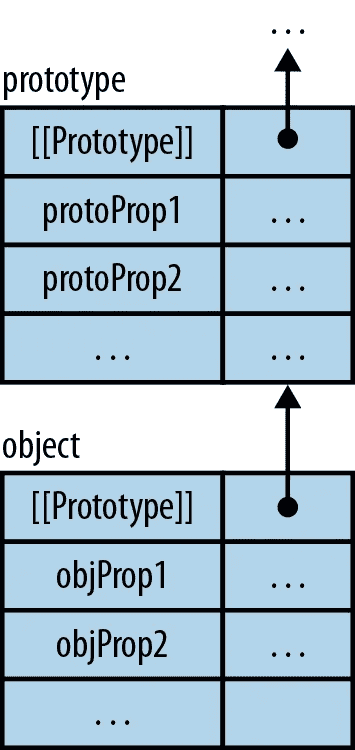
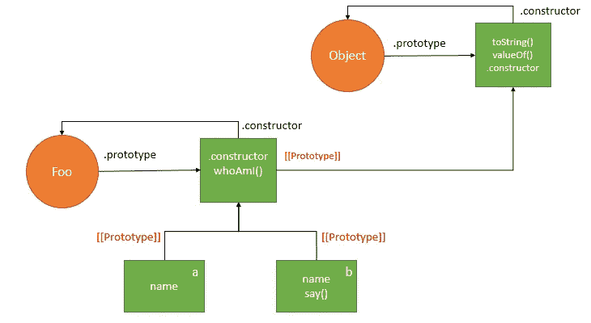
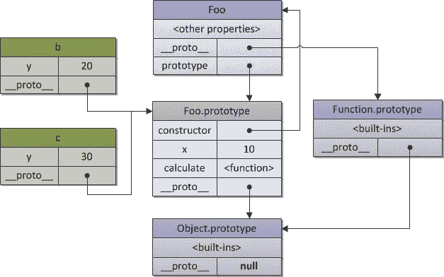
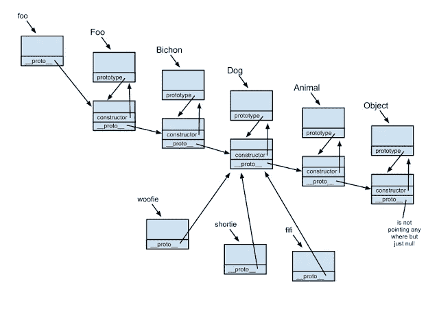
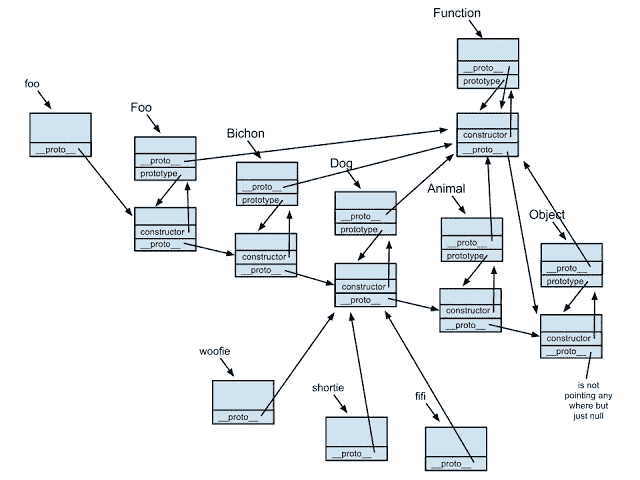

# 幕后 Javascript 继承 __proto__，[[prototype]]和 prototype

> 原文：<https://medium.com/hackernoon/understand-nodejs-javascript-object-inheritance-proto-prototype-class-9bd951700b29>



> 原型是构造函数上的一个属性，它设置将成为构造对象上的 __proto__ 属性的内容。

理解 Javascript 中的继承的关键是理解父母鸡如何进行 Javascript 下蛋过程；Javascript 继承发生在原型继承中，但是传统的类在技术上和概念上是不存在的。

这是一篇关于澄清 Javascript 中 ***原型*** 、 ***__proto__*** 和 ***继承*** 混乱的注释。这里的大部分内容都是从[德米特里·索什尼科夫](http://dmitrysoshnikov.com/)和[肯尼斯·金·卢姆](https://www.blogger.com/profile/01255331129588005020):[http://dmitrysoshnikov.com/ecmascript/javascript-the-core/](http://dmitrysoshnikov.com/ecmascript/javascript-the-core/)
[https://肯尼斯·金·卢姆. blogspot . tw/2012/10/JavaScript s-pseudo-classic . html？show comment = 1484288337339 # c 1393503225616140233](https://kenneth-kin-lum.blogspot.tw/2012/10/javascripts-pseudo-classical.html?showComment=1484288337339#c1393503225616140233)

# 例 0:***[[原型]]*** vs __proto__ vs 原型

[speakingjs.com](http://speakingjs.com/)和[javascripttutorial.com](http://www.javascripttutorial.net/javascript-prototype/)是解释[[prototype]]、__proto__ 和 prototype 从基础到应用的关系的最佳资源，而且非常重要的是他们将这种关系形象化。

> 每个对象都可以有另一个对象作为其原型。那么前一个对象将继承其原型的所有属性。一个对象通过内部属性`*[[Prototype]]*`指定它的原型。由`*[[Prototype]]*`属性连接的对象链被称为*原型链:*



[http://speakingjs.com/es5/ch17.html](http://speakingjs.com/es5/ch17.html)

> 为了了解基于原型(或*原型*)的继承是如何工作的，让我们看一个例子(用发明的语法来指定`[[Prototype]]`属性):

```
**var** proto = {
    describe: **function** () {
        **return** 'name: '+**this**.name;
    }
};
**var** obj = {
    [[Prototype]]: proto,
    name: 'obj'
};> obj.describe
[Function]> obj.describe()
'name: obj'
```

> `__proto__`是`Object.prototype`对象的[访问器属性](http://www.javascripttutorial.net/javascript-objects/#accessor_property)。它公开了一个对象的内部原型链接(`[[Prototype]])`，通过该链接可以访问它([，由 javascripttutorial](http://www.javascripttutorial.net/javascript-prototype/) )。

```
function Foo(name) {
  this.name = name;
}var b = new Foo('b');
var a = new Foo('a');
b.say = function() {
  console.log('Hi from ' + this.whoAmI());
}console.log(a.__proto__ === Foo.prototype); *// true* console.log(a.__proto__ === b.__proto__); *// true*
```



[http://www.javascripttutorial.net/javascript-prototype/](http://www.javascripttutorial.net/javascript-prototype/)

> JavaScript 引擎将`say()`方法添加到`b`对象，而不是`Foo.prototype`对象。
> 
> 如图所示，`a.__proto__`暴露了指向`Foo.prototype`对象的`[[Prototype]]`。同样，`b.__proto__`也指向与`a.__proto__:`相同的对象

# 示例 1:通过构造函数创建对象

这是一个来自 [Dmitr](http://dmitrysoshnikov.com/ecmascript/javascript-the-core/) y 的例子，关于通过构造函数创建对象，它将展示一个**原型**和 **__proto__** 如何在继承机制中工作。

> 除了按照指定的模式创建对象之外，*构造函数*还做了另一件有用的事情——它*自动为新创建的对象设置一个原型对象*。这个原型对象存储在`*ConstructorFunction.prototype*`属性中。
> 
> 例如，我们可以使用构造函数用`*b*`对象重写前面的例子。因此，对象`*a*`(原型)`*Foo.prototype*`的作用是:

用原型 ***x*** 和 ***calculate()*** 创建 Foo 对象

```
**function** Foo(y) {
  **this**.y = y;
}Foo.prototype.x = 10;
Foo.prototype.calculate = **function** (z) {
 **return** **this**.x + **this**.y + z;
};
```

使用对象 Foo 创建实例 b:

```
**var** b = **new** Foo(20);b.calculate(30); // 60console.log(
  b.__proto__ === Foo.prototype, // true
  b.__proto__.calculate === Foo.prototype.calculate // true
  b.__proto__.calculate === b.calculate, // true
  Foo === b.constructor, // true
  Foo === Foo.prototype.constructor, // true
);
```

> 如上所示，b 继承了 Foo()的方法。“Foo.prototype”自动创建一个特殊属性“constructor”，它是对构造函数本身的引用。
> 实例“b”可以通过委托找到它，并用来检查它们的构造函数。



from: [http://dmitrysoshnikov.com/ecmascript/javascript-the-core/](http://dmitrysoshnikov.com/ecmascript/javascript-the-core/)

# 示例 2 : JavaScript 经典继承图

这是 Kenneth 的一个例子，也是关于通过构造函数创建对象的，但是我们关注的是在这些对象和实例系列中的原型链问题。原型对象也只是简单的对象，可能有自己的原型。如果一个原型对它的原型有一个非空的引用，依此类推，这被称为原型链(由 [Dmitr](http://dmitrysoshnikov.com/ecmascript/javascript-the-core/) y)。

下面是 JavaScript 伪经典继承的图表。构造函数 Foo 只是一个假想类的类名。foo 对象是 Foo 的一个实例。



[https://kenneth-kin-lum.blogspot.tw/2012/10/javascripts-pseudo-classical.html?showComment=1484288337339#c1393503225616140233](https://kenneth-kin-lum.blogspot.tw/2012/10/javascripts-pseudo-classical.html?showComment=1484288337339#c1393503225616140233)

现在我们可以从图中看出，为什么当我们从**动物**继承**狗**时，我们会这样做:

```
**function Dog() {} // the usual constructor function**
 **Dog.prototype = new Animal();**
 **Dog.prototype.constructor = Dog;**
```

## new()实例时会发生什么:

> 注意 **Foo.prototype** 中的**原型**不是形成原型链。 **Foo.prototype** *指向*某个原型链中的某个位置，但是 Foo 的这个**原型**属性并不是形成原型链。构成原型链的是指向链上方的 **__proto__** 和 **__proto__** 指向的对象，比如从 **foo。__proto__** ，上至 **foo。__proto__。__proto__** 等等，直到到达空值为止。

## __proto__ 与原型的关系

> JavaScript 的伪经典继承是这样工作的:我是一个构造函数，我只是一个函数，我持有一个原型引用，每当调用 **foo = new Foo()** 时，我会让 **foo。__proto__** 指向我的原型对象。所以 **Foo.prototype** 和 **obj。__proto__** 是两个不同的概念。 **Foo.prototype** 表示当 **Foo** 的对象被创建时，这是新对象的原型链应该指向的点——即 **foo。__proto__** 应该指向 **Foo.prototype** 指向的地方。

## 如果需要添加一个函数呢

> 如果 **woofie** 对象没有 **move** 方法，它将沿着原型链向上，就像任何原型继承场景一样，首先到达由 **woofie 指向的对象。__proto__** ，与 **Dog.prototype** 所指的对象相同。如果方法 **move** 不是该对象的属性(意味着 **Dog** 类没有方法 **move** ，则在原型链中上升一级，即 **woofie。__proto__。__proto__** ，或者同 **Animal.prototype** 。

```
**Animal.prototype.move = function() { ... };**
```



[https://kenneth-kin-lum.blogspot.tw/2012/10/javascripts-pseudo-classical.html?showComment=1484288337339#c1393503225616140233](https://kenneth-kin-lum.blogspot.tw/2012/10/javascripts-pseudo-classical.html?showComment=1484288337339#c1393503225616140233)

> 即使 **foo.constructor === Foo** ，但是**构造函数**的属性并不是 **foo** 自己的属性。它实际上是通过沿着原型链向上到达 **foo 的位置而获得的。__proto__** 正在指向。同样适用于 **Function.constructor** 。当我们看到 **Constructor.prototype** ， **foo 时，这个图可能会很复杂，有时会令人困惑。__proto__** ，**foo . prototype . constructor**。
> 
> 为了验证这个图，请注意，即使 **foo.constructor** 将显示一个值，属性 **constructor** 并不是 **foo** 自己的属性，而是通过跟踪原型链获得的，正如**foo . hasownproperty(" constructor ")**可以看出的那样。

# 注意事项:

一个对象通过内部属性指定它的原型

`**__proto__**`给语言带来了对`[[Prototype]]`的直接访问(由[speakingjs.com](http://speakingjs.com/es5/ch17.html))。

`**prototype**`是 ***对象*** ，当你用`new.`创建一个对象时，用来构建`__proto__`

`**prototype**`在实例本身(或其他对象)上不可用，只在构造函数上可用。

`**prototype**`仅在函数上可用，因为它们是从`Function`和`Object,`复制的，但在其他任何情况下都不可用。然而`**__proto__**`却随处可见。

```
( new Foo ).__proto__ === Foo.prototype  //true
( new Foo ).prototype === undefined      //true
```

***委托原型*** 和 ***串联继承***

```
***Cat.prototype = new Animal();***
//it will properly follow the prototype chain through the inheritance hierarchy.***Cat.prototype = Animal.prototype*** //any runtime changes to the Cat prototype would also affect the Animal
```

**静态属性/功能**在原型上不存在。只有在创建了一个`new`实例时，才会用到`prototype`。

喜欢这个故事？对别人有帮助吗？这有助于我知道你是否想看到更多关于他的主题，并帮助人们在点击下面的 时看到这个故事。

# 参考:

[http://speakingjs.com/es5/index.html](http://speakingjs.com/es5/index.html)

[http://www.javascripttutorial.net/javascript-prototype/](http://www.javascripttutorial.net/javascript-prototype/)

[http://stack overflow . com/questions/9959727/proto-vs-prototype-in-JavaScript](http://stackoverflow.com/questions/9959727/proto-vs-prototype-in-javascript)

[http://dmitrysoshnikov.com/ecmascript/javascript-the-core/](http://dmitrysoshnikov.com/ecmascript/javascript-the-core/)

[https://www . quora . com/What-is-the-difference-_ _ proto _ _-and-prototype](https://www.quora.com/What-is-the-difference-between-__proto__-and-prototype)

[http://www.jisaacks.com/prototype-vs-proto/](http://www.jisaacks.com/prototype-vs-proto/)

[http://Kenneth-kin-lum . blogspot . tw/2012/10/JavaScript s-pseudo-classic . html](http://kenneth-kin-lum.blogspot.tw/2012/10/javascripts-pseudo-classical.html)

[](http://bit.ly/HackernoonFB)[](https://goo.gl/k7XYbx)[](https://goo.gl/4ofytp)

> [黑客中午](http://bit.ly/Hackernoon)是黑客如何开始他们的下午。我们是 [@AMI](http://bit.ly/atAMIatAMI) 家庭的一员。我们现在[接受投稿](http://bit.ly/hackernoonsubmission)并乐意[讨论广告&赞助](mailto:partners@amipublications.com)机会。
> 
> 如果你喜欢这个故事，我们推荐你阅读我们的[最新科技故事](http://bit.ly/hackernoonlatestt)和[趋势科技故事](https://hackernoon.com/trending)。直到下一次，不要把世界的现实想当然！

