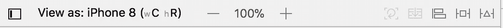
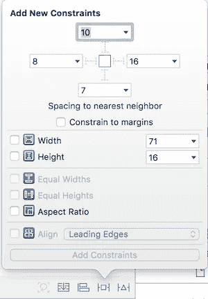
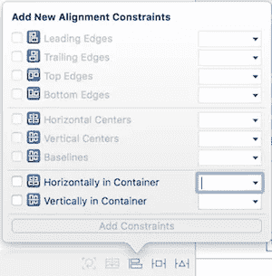
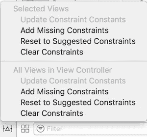

# 了解 Xcode 9 中的自动布局

> 原文：<https://medium.com/hackernoon/understanding-auto-layout-in-xcode-9-2719710f0706>

## 所有你需要知道的关于自动布局

## 什么是自动布局？

自动布局动态计算视图层次结构中所有视图的大小和位置。这是一个 Xcode 特性，在为下一个 [iOS](https://hackernoon.com/tagged/ios) 项目构建用户界面时，你必须知道这个特性。通过正确使用*约束*，您将使您的应用程序能够响应当前存在的任何 iPhone 尺寸。

在本教程中，我将解释自动布局约束以及如何正确应用它们。首先，我想说的是，您可以通过编程或从界面构建器来处理约束。在大多数情况下，您应该专注于使用第二种方法。

# 限制

我敢肯定，你已经看到了这个酒吧上方的控制台区域。这是所有魔法发生的地方。在右侧，您将看到 3 个启用的选项卡。这就是你在处理约束时可能需要的一切。

## 1.添加新约束

我将从中间的标签开始，因为它是最重要的一个。从这里，我们可以为所选视图添加我们需要的约束。基本上，您可以添加位置和大小类型的约束。

## 位置约束

如果从上面的截图可以看到，窗口顶部有 4 条红线。每条线代表我们希望所选视图跟随的一侧。每一行旁边的数字代表我们希望在所选视图和超级视图或其他子视图之间留出多少空白空间。它将与指定边上的任何东西连接。

*   **前导** -跟随左侧的约束。
*   **顶部** -跟随顶部的约束。
*   **底部-** 跟随底部的约束。
*   **尾随-** 跟随右侧的约束。

例如，如果您希望视图始终位于左上角，则需要添加行距和顶部约束。

## 尺寸限制

在位置约束下面，我们可以看到大小约束。它们定义了视图的大小。

*   **宽度** -向所选视图添加静态宽度。
*   **高度** -向所选视图添加静态高度。
*   **等宽** -给所选视图增加一个等于另一个视图宽度的宽度。
*   **等高** -给所选视图增加一个与另一个视图高度相等的高度。
*   **长宽比** -如果你需要你的视图总是方形的，并且有动态的大小，你需要添加一个长宽比约束，值为 1:1。

## 2.添加对齐约束

在第一个选项卡中，您可以向选定的视图添加对齐约束。在大多数情况下，您只需要已启用的。从这里，你可以看到中心。在超级视图中，水平、垂直或两者都有。

例如，在容器中水平选择*，在容器*中垂直选择*，以便在超级视图中居中您选择的视图。*

## 3.解决自动布局问题

自动布局为我们提供了一个帮助部分，可以快速解决我们的约束问题。有两种类型，(1)解决选定视图上的问题，(2)解决视图控制器内所有视图上的问题。

*   **添加缺失的约束** - [Xcode](https://hackernoon.com/tagged/xcode) 会监控你的约束，并给你一个添加缺失约束的选项。请注意，这些约束是建议。这并不意味着他们会适应你的情况。
*   **重置为建议的约束** -该选项将删除所有约束，并应用自己的约束集。这也是一个建议。
*   清除约束- 它会清除你所有的约束。

老实说，我忽略了这个特性，总是试图自己创建约束。我只在必要时使用清除约束选项。这是掌握自动布局的唯一方法。

> [如果您想查看一些自动布局示例，以及在各种情况下如何使用约束，请单击此处。](/@dejanatanasov/auto-layout-ui-examples-2517c7efca25)

## 这就是本教程的内容，如果对你有帮助，请👏或者分享这个故事，让其他像你一样的人也能找到它。感谢您的关注！🚀

## 查看我的最新项目:

 [## 足球比分预测赌注

### 我们提供专业的足球比分预测投注提示，胜率高。每个比赛模拟包含一个…

apps.apple.com](https://apps.apple.com/app/football-score-prediction-bets/id1517623538)  [## 足球博彩技巧和比分——赌进球 Google Play 上的应用程序

### 我们提供高胜率的专业足球技巧。每个比赛模拟包含一个预测，代表…

play.google.com](https://play.google.com/store/apps/details?id=betting.tips.goals)  [## 缩放个人资料图片和故事

### ZoomPic for Instagram 是匿名查看大型高清个人照片和故事的最简单、最方便的方式…

apps.apple.com](https://apps.apple.com/app/zoom-profile-picture-stories/id1514925024)  [## Instagram 的长视频故事

### Instagram 的 Long Story 是一个非常棒的工具，允许您录制或选择任意长度的视频并进行转换…

apps.apple.com](https://apps.apple.com/app/long-video-story-for-instagram/id1511499427) 

## 阅读更多我在媒体上的作品:

 [## 引入干净的 Swift 架构(VIP)

### 忘了 MVC 吧，现在！

hackernoon.com](https://hackernoon.com/introducing-clean-swift-architecture-vip-770a639ad7bf)  [## 使用 Swift 4 在 iOS 上使用 Google Maps SDK 的终极指南

### 许多 iOS 应用程序使用谷歌地图。这是一个非常普遍的特点，所以我决定准备一个终极指南…

medium.freecodecamp.org](https://medium.freecodecamp.org/how-you-can-use-the-google-maps-sdk-with-ios-using-swift-4-a9bba26d9c4d)  [## SWIFT —带有 XIB 文件的自定义 UIView

### 用 XIB 文件定制 UIView 是 iOS 开发中非常常见的做法。自定义 UIView 类不包含 XIB 文件…

medium.com](/theappspace/swift-custom-uiview-with-xib-file-211bb8bbd6eb)  [## 如何将 Spotlight 支持添加到您的 iOS 应用程序

### Swift 教程将使您的应用程序在 Spotlight search 中可用

hackernoon.com](https://hackernoon.com/how-to-add-spotlight-support-to-your-ios-app-4a89054aff89)  [## 核心数据关系

### 理解一对一和一对多关系

hackernoon.com](https://hackernoon.com/core-data-relationships-d813ed66ba8c) 

## 订阅我的时事通讯: