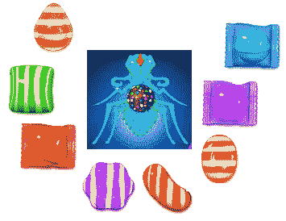

# 理解比特币交易验证:一个儿童故事

> 原文：<https://medium.com/hackernoon/understanding-bitcoin-transaction-verification-a-childrens-story-3d877eb2641c>

很久很久以前，在一个很远很远的地方，有一个奇妙的王国，里面有各种各样的糖果和爱吃糖果的蚂蚁。从美丽的日出到温柔的月落，糖果王国充满了新生儿丰富的笑声，糖果包装纸的褶皱，跳舞的蚂蚁脚的快乐敲击声。

近一百年来，聪明的蚁后统治着它挥舞着触角的居民，这些居民每天都在让王国变得比以往任何时候都更加甜美。通过艰苦的工作和短暂的休息来“犒劳自己”，蚂蚁们努力从他们遍布全国的糖果工厂中生产和分发最好的糖果。

但在这个王国，事情并不总是那么美好。不久前，巧克力溪流的波光粼粼的涟漪和冰糖山令人眼花缭乱的高度隐藏着奸诈，扭曲的路径充满了可怕的野兽和强盗，试图杀死王国的糖高，并将其糖果据为己有。

两只白蚁定期啃咬蜂蜜水坝，淹没整个城镇。卑鄙的 M &模仿蜘蛛会诱捕蚂蚁信使，而**会窃取女王陛下的皇家糖果程序，为邪恶和利益分发假拷贝。**最糟糕的是星爆蝎子，它们会**毒害整个糖果田，毁了它们好几个世代的蚂蚁宝宝。**

Deadly M&Mimic Spider in a nefarious black hat chases ant citizen, intending to duplicate and modify her Majesty’s candygram containing crucial information intended for a neighboring kingdom

这的确是一个黑暗的时代。

# 蚁后与伟大神灵的偶然相遇

由于买不到保卫城堡所需的新棒棒糖大炮，当时年轻的蚁后意识到没有可靠的方法与邻近的王国联系寻求帮助。她的糖果程序似乎从来没有完整地到达目的地，而她的朋友们的回复看起来奇怪而混乱，就好像是外星人写的一样。她永远无法确定什么是真实的，什么是完整的。

如果有一种方法可以安全可靠地传递这些重要的通信信息就好了！糖果王国的生存取决于此。

在她最绝望的时候，蚂蚁传说中说她听到了伟大的蚂蚁精灵 Skitoshi Nak Antmoto 的令人生厌的低语:

> “收起你的蚂蚁眼泪，我的女王。要知道我是 Nak Antmoto，所有渴望纯净、高质量糖果以及准时和无拘无束交付的人的灵魂。请看伟大的地下**糖果链**，**蚂蚁语言的永恒记录**，蚁人已经被祝福**把所有真实的糖果程序放置在无可指责的地方**。”— Skitoshi Nak Antmoto，蚂蚁精神

Never Stop the Praise

圣灵纳克·安托莫看着他所做的一切，看哪，一切都非常好。

随着精神意志在她体内流动，蚁后召集了她的臣民。“赶走仇恨者，”她说，“因为我们要直接去地下！”

蚁后优雅地转动着触角，开始向他们展示这是怎么做到的。她的蚂蚁臣民一个接一个地加入到她的人民的时髦的蜂巢舞蹈中，为了一个共同的目标异常团结。王后和她的人民手挽手一起下到由蚂蚁精灵建造的巨大隧道。道路是清晰的。

# 糖果图收集者

回到今天，蚁后调查了那次彻底改变了糖果王国整个地下景观的宏伟行动。**在** **糖果王国的牛奶巧克力外皮**的深处，蚂蚁们在**辛勤劳作，八条腿的江湖骗子和急于肆虐横行的投机分子鞭长莫及**。

她坐在她的蚂蚁轿子里，看到数百只糖果和她的糖果一起被运进隧道。承蒙纳克·安托莫的恩惠，她王国的所有公民和周围的人现在只需要看一眼糖果链就能看到这些重要信息的真实内容。

她看到收集蚂蚁正在努力工作，把这些重要的信息和它们可爱的皇家印章一起装进它们受祝福的糖果盒里。每只蚂蚁都梦想有一天自己的盒子能被糖果链接受。但仍有许多工作要做，因为伟大的蚂蚁精神给予的同时，也要求…很多。

在整个王国，每只蚂蚁都将他的盒子装满糖果后，他必须前往下一个房间，参加一个盛大的仪式，这是一场需要巨大决心和精神毅力的意志竞赛。只有冠军才能接近无与伦比的糖果链，将他的私人糖果盒载入史册。

大祭祀室的地板上堆满了各种类型、大小和形状的动物饼干。面对入口矗立着一堵巨大的墙，墙前无数群满怀希望的蚂蚁立正。

# 盛大的仪式

伟大的蚂蚁精灵，祝福他，突然显现，移动泥土和石头在巨大的房间墙壁上创造一个奇怪而独特的轮廓。蚂蚁们陷入了疯狂，在房间里爬来爬去，竞相寻找与影子相匹配的合适的动物饼干来解开谜题。女王注意到，有些蚂蚁足够幸运，能够**支付那些昂贵的周末蚂蚁健身房会员费，并能更快地拿起饼干，这给了它们一个优势**。凭借蚂蚁精灵不可知的智慧，尽管混乱，一些幸运的蚂蚁总能设法每 10 分钟找到合适的动物饼干**。**

Very rough approximation of the grand ritual.

一阵突然的声音引起了她的注意。一只蚂蚁胜利地站着，伸出手臂，抓着一个神秘的狗脸饼干(很配！这样的谜题！哇！)完全符合轮廓。伟大的蚂蚁精灵纳克·安托莫在他的许可下密封了盒子，并换上了一个新的拼图，重新设置了授予仪式。“我们有赢家了！”当骄傲的冠军拿起他的密封盒子，大摇大摆地走出房间去迎接他的命运时，灵魂的大嗓门轰隆隆地响了起来。当大批失望的蚂蚁回到前一个房间，拿着新盒子参与下一个谜题时，蚁后悄悄走过，祝他们下次好运。“坐下，”她建议道，“保持谦逊！”

# 结局是尽人皆知的

在最后一个房间里，获胜的蚂蚁胜利地将他的盒子，用仪式完成的标志密封，插到不断增长的糖果链的末端。糖果链满足地嗡嗡作响，祝福下一轮糖果盒，让**仪式重新开始**。快乐的蚂蚁知道，随着链条越来越长，随着他的去世和他的大儿子穿上他的收藏家的斗篷，他装满他已经验证的糖果程序的盒子将成为历史的主要部分，一个站在透明和安全的真实世界与混乱和阴影的虚假世界之间的快照。

一眼望去，王国内外的每一只蚂蚁都会看到存在的每一个糖果程序。在地下深处，有了纳克·安托莫的恩惠，再也不需要冒险的探险或脆弱的联盟了。蜘蛛、白蚁和蝎子在这里没有力量。

他一次拯救一个盒子。蚁后赞许地拍拍他的每一只小蚂蚁脚，给了他一个新的皇家糖果作为奖励。他是个英雄。

# 工作证明:成人无聊版

[比特币](https://hackernoon.com/tagged/bitcoin)背后的[区块链](https://hackernoon.com/tagged/blockchain)技术如此具有革命性，因为有史以来第一次，我们尽可能地接近了“不可信”的数字交易。在我们数字历史的大部分时间里，我们依赖银行、信用合作社和其他中介机构来保护我们的金融信息、决策和交易的安全，结果好坏参半(例如，不负责任的银行行为导致了 2008 年的金融危机，[富国银行](http://www.cnbc.com/2017/05/12/wells-fargo-fake-account-scandal-may-be-bigger-than-thought.html)，[索尼](http://www.dailymail.co.uk/sciencetech/article-1381000/Playstation-Network-hacked-Sony-admits-hackers-stolen-77m-users-credit-card-details.html))。

当你通过任何网站或机构向网上汇款时，这些钱都存储在它的服务器上。它可以访问您的信息，并且它的安全性取决于公司如何防范那些想要破坏其服务器的“白蚁”或使用各种社会工程或欺诈手段来获取您的数据的“蜘蛛”。在地缘政治层面，糟糕的经济政策可能会步“蝎子”的后尘，导致公民财富因恶性通货膨胀或政府没收而消失。

然而，当你发送一个比特币时，关于交易的信息(candygram)最终被发布在区块链(CandyChain)上。这些交易一旦被核实，对每个人都是透明的，如果不付出令人难以置信的弄巧成拙的努力和费用，就无法重写或伪造。

在一个被称为 ***工作证明*** 的过程中，挖掘者(收集蚂蚁)在交易验证中起着核心作用。他们竞相将你的交易和许多其他交易发布到区块链的一个新区块(糖果盒)上。在自己的区块工作的矿工必须使用大量的计算机能力、电力和时间(健身房会员资格)来解决极其困难的密码难题(盛大仪式&动物破解)，然后其他人才能发布自己的区块。

从算法上来说，随着参与者越来越多，谜题变得越来越难，但是从统计上来说，每隔大约 10 分钟就会为每个新的方块找到一个解。因此，你的计算能力越强，你就越有可能“猜”出问题的正确答案。查看由[肖恩](https://medium.com/u/ed3aec4240a9?source=post_page-----3d877eb2641c--------------------------------)撰写的这篇文章和由 [ConsenSys](https://medium.com/u/6c7078bf7b01?source=post_page-----3d877eb2641c--------------------------------) 撰写的[这篇文章](/@ConsenSys/blockchain-underpinnings-hashing-7f4746cbd66b),了解更多关于散列函数保护块的作用的信息。

猜出谜题答案的矿工可以张贴他的区块，并收取交易费和一些比特币作为奖励。随着来自其他矿工的更多块被张贴并在链中“埋葬”他的块，有人返回并修改该事务的机会实际上是不存在的，因为他们将不得不撤销在过去的块上完成的所有密码工作来得到它。

此外，当矿工成功发布他的块时，区块链上的所有其他节点将同步它并处理新状态。这就是为什么区块链被认为是分散的；不像流氓银行可以随意修改你账户里的内容，只有你用你的私钥才能控制你的比特币余额，因为它随时对整个世界可见。任何试图扰乱你的交易的人都会造成与区块链共识的背离，并且会很快被拒绝。

本质上，工作证明系统是一种防御措施，使伪造和欺诈变得困难，但验证却很容易。从“大仪式”或散列函数的构造方式来看，比较问题的解决方案很容易，但找到解决方案却不那么容易。这样看来，比特币系统之所以持有这样的可信度，是因为其背后的所有*工作*。

要了解更多信息，可以考虑直奔出处:[神秘的中本聪](https://bitcoin.org/bitcoin.pdf)撰写的比特币白皮书原文。它只有九页，实际上非常容易理解，可能被认为是本世纪最有影响力的文件之一。

感谢阅读，我希望这个故事能帮助你更好地理解工作证明以及当我们使用比特币时幕后发生的事情。