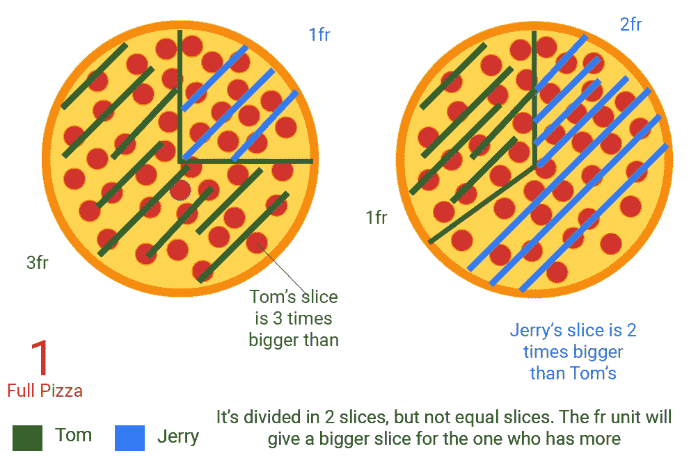
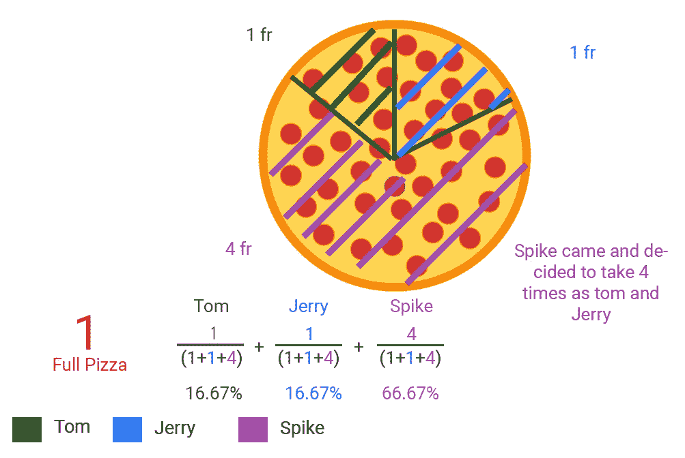
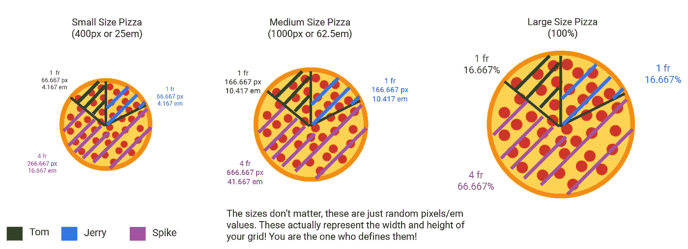
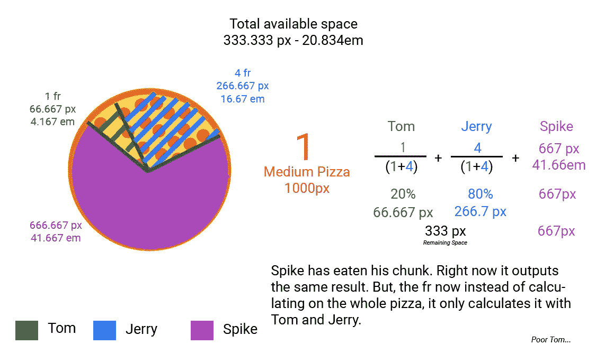
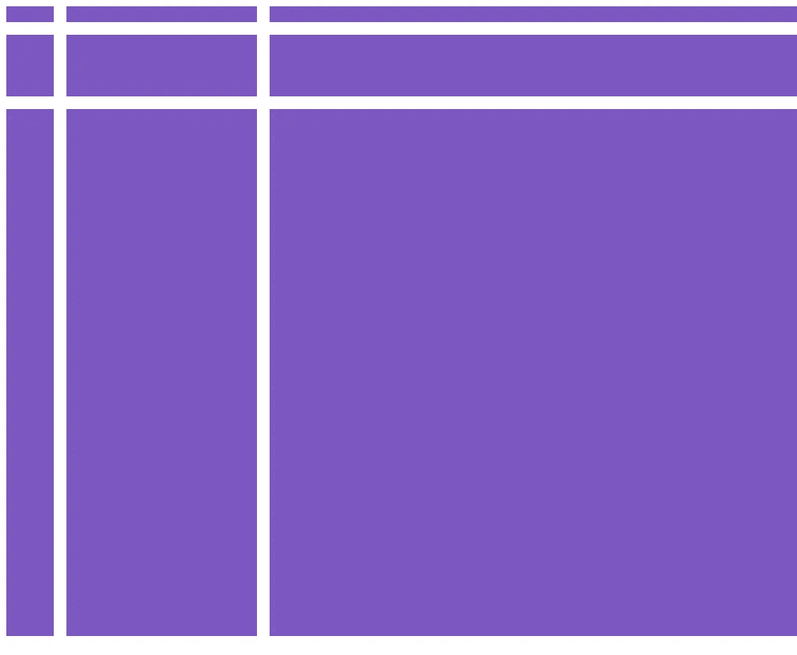
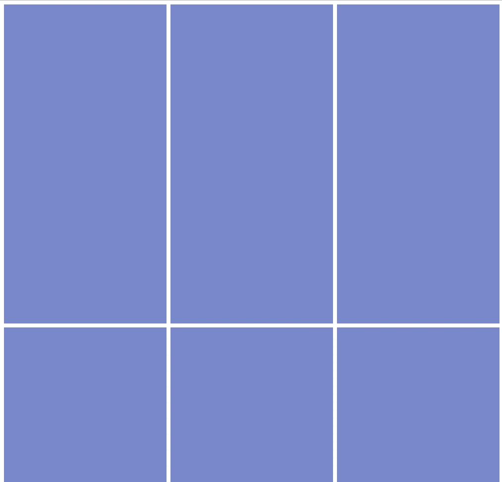

# 理解 CSS 网格分数单位(FR)的简单方法

> 原文：<https://medium.com/hackernoon/understanding-css-grids-fractional-units-fr-the-easy-way-5f43ee008f29>

我们已经看到今年 CSS 网格的快速采用(在撰写本文时，全球接近 80%)。我一直在绞尽脑汁领会这个新提议，因为它附带了一系列[功能](https://css-tricks.com/snippets/css/complete-guide-grid/)，以及随之而来的新测量单位——分数单位(FR)。

[MDN](https://developer.mozilla.org/en-US/docs/Web/CSS/CSS_Grid_Layout/Basic_Concepts_of_Grid_Layout) 定义将小数单位表述为:

> 新的`fr`单元表示网格容器中可用空间的一部分。

好吧，酷。但是**实际上**是什么意思呢？让我们回到 4 年级和 5 年级的数学课，并记住分数。

我不知道他们有没有教过你这个方法，但是一个可视化分数的好方法就是看着披萨。披萨将成为我们的网格。


整个比萨饼代表总的可用空间。现在，*没人吃一片，也没人切片，*所以整个**可用的**披萨是 **1 fr 或 100%** 。

这款披萨的具体表现方式如下:

[CSS](https://hackernoon.com/tagged/css) :

```
// CSS:
.container {
  display: grid;
  grid-template-columns: 1fr;
  grid-template-rows: 1fr;
  grid-gap: 1em;
}
div {
  background-color: #7986CB;
  width: 100%;
  height: 100%;
}
```

HTML:

```
<section class=”container”>
  <div></div> <div></div> <div></div>
  <div></div> <div></div> <div></div>
  <div></div> <div></div> <div></div>
</section>
```

你在顶部看到的代码说:“给我整个披萨”。第一行和第一列占据了 100%的空间。这将创建一个 1 列 1 行的网格。由于每一行和每一列都是 **1fr，并且在空间中没有定义其他列或行**,所以它占用 100%的空间。

**等等夏洛克，那些在<部分>里面的<部分>会怎么样？**

很高兴你问了！嗯，把那些

想象成我们想吃的**披萨片**的*号*，把网格-模板-列和网格-模板-行想象成我们切披萨的片数。

在这种情况下，我们将我们的比萨饼(网格)定义为切一大块(理论上讲，一整块比萨饼就是一大块)。为了更好地说明这一点，请看这一集《猫和老鼠》:

由于我们只有一份，其他的

不会得到他们的份额，也不会被展示！换句话说，你不能给一片不存在的披萨，对吗😉？这意味着那些其他< div > **对于网格**来说是不存在的。

让我们回到汤姆和杰瑞。他们俩都决定吃披萨(斯派克还不知道)。他们在争论如何分享它。合理地说，他们每个人都想要自己的那份，所以他们做的第一件事就是**切披萨**。


比萨饼的切片数量是我们添加到网格模板行和网格模板列中的一系列数字:

```
// CSS:
.container {
  display: grid;
  grid-template-columns: 1fr 1fr;
  grid-template-rows: 1fr 1fr;
  grid-gap: 1em;
}
div {
  background-color: #7986CB;
  width: 100%;
  height: 100%;
}
```

我们已经**把披萨切成了两半。现在我们在 grid-template-columns 和 grid-template-rows 中有 2 个数字，我们让每个数字各占一半！但是看一看！汤姆和杰瑞只是在争论，而**还没有吃**任何披萨片(稍后会有更多内容)！**

谁说当我们把披萨切成两半时，它必须是完美的两半？汤姆非常理解这一点，并正在为更大的份额而争论。他想得到多大的份额，将与他分配给它的 fr 单位成正比。



因此，汤姆给比萨饼切片的数量将影响杰里得到什么。即使披萨被 2 切片(你给 grid-template-columns 和 grid-template-rows 加了多少个数)，*也不代表*需要**切片 50%和 50%。**

汤姆(第 1 列，第 1 行)决定拿三倍于杰里(第 2 列，第 2 行)的量，他会这样定义他的比萨饼或他的网格:

```
// CSS:
.container {
  display: grid;
  // Tom 3fr; Jerry 1fr
  grid-template-columns: 3fr 1fr;
  grid-template-rows: 3fr 1fr;
  grid-gap: 1em;
}
div {
  background-color: #7986CB;
  width: 100%;
  height: 100%;
}
```

另一方面，杰瑞奋起反抗，决定拿两倍于汤姆的钱:

```
// CSS:
.container {
  display: grid;
  grid-template-columns: 1fr 2fr;
  grid-template-rows: 3fr 1fr;
  grid-gap: 1em;
}
div {
  background-color: #7986CB;
  width: 100%;
  height: 100%;
}
```

从数学上来说，网格模板列(或行)中的每个 fr 代表网格模板列和网格模板行中的分数的分母的一部分。每个分子都是分配给它的 fr 单位。换句话说，你要把所有的 fr 单位相加，并把它们作为分母，而每个单独的 fr 将作为分数的分子。

😵😵😵😵😵😵😵😵😵😵😵😵😵😵😵😵😵😵

**哇哦！请用英语！**

最好用例子来解释💡！

如果跟上杰瑞的划分，杰瑞得到的是汤姆的两倍(2fr)，代表了整个披萨的 66.67%，也就是 2/(1+2)。汤姆得到的是杰里的一半(1 fr)，它代表了整个比萨饼的 33.33%，或 1/(1+2)。

*这里有更多快速的例子来帮助你:*

```
// Tom gets 1/(1+4) = 1/(5) = 0.2 = 20%
// Jerry gets 4/(1+4) = 4/5 = 0.8 = 80%
grid-template-columns: 1fr 4fr;// This is the same as the one above:
// Tom gets 2/(2+8) = 2/(10) = 0.2 = 20%
// Jerry gets 8/(2+8) = 8/10 = 0.8 = 80%
grid-template-columns: 2fr 8fr;// Tom gets 3/(3+5) = 3/(8) = 0.375 = 37.5%
// Jerry gets 5/(3+5) = 5/8 = 0.625 = 62.5%
grid-template-columns: 3fr 5fr;grid-template-columns: 1fr 4fr;
```

找到窍门了吗？嗯，我们快到了！

现在，想象一下斯派克加入战斗，想要得到他的那一份。这一次，斯派克的战斗次数是汤姆和杰瑞的 4 倍:



因此，我们**向网格中再添加一列或一行**。

```
// CSS:
.container {
  display: grid;
  // Tom, Jerry, and Spike, respectively
  grid-template-columns: 1fr 1fr 4fr;
  grid-template-rows: 1fr 1fr 4fr;
  grid-gap: 1em;
}
div {
  background-color: #7986CB;
  width: 100%;
  height: 100%;
}
```

这将在列空间中显示第三个 div，在行空间中显示第三个 div:

```
<section class=”container”>
  <div></div> <div></div> <div></div>
  <div></div> <div></div> <div></div>
  <div></div> <div></div> <div></div>
</section>
```

注:到目前为止，**还没有人分一杯羹，只是分了一下**。这很重要！继续阅读…

我们还没有解决的一个争论是…比萨饼有多大。今天，比萨饼有不同的尺寸。这类似于网格的像素/em 宽度(列受到影响)和高度(行受到影响)属性。



假设他们去买了一个中号披萨(嘿，他们没钱了💰！)，宽度= 1000 px。斯派克敲定了他的交易，**吃掉了** **他的那份**。他的切片宽度约为 667 像素~ 41.68 微米

现在，有人**拿走了一片**，代码看起来是这样的:

```
// CSS:
.container {
  display: grid;
  width: 62.5em;
  // Tom, Jerry, and Spike, respectively
  grid-template-columns: 1fr 1fr 41.66em
  grid-template-rows: 1fr 1fr 41.66em;
  grid-gap: 1em;
}
div {
  background-color: #7986CB;
  width: 100%;
  height: 100%;
}
```

现在，上面的代码输出的**和之前的**完全一样。微妙的区别是，现在汤姆和杰里必须为剩下的切片而战，我们已经将网格的总宽度设置为 1000 像素。

杰瑞想让汤姆的生活变得悲惨，他把自己的那份切成了汤姆的 4 倍，结果是



```
// CSS:
.container {
  display: grid;
  width: 62.5em; 
  // Tom, Jerry, and Spike, respectively
  // Spike: 41.67em
  // Jerry: 4fr = 266.67 px
  // Tom: 1fr = 66.67 px
  grid-template-columns: 1fr 4fr 41.66em
  grid-template-rows: 1fr 4fr 41.66em;
  grid-gap: 1em;
}
div {
  background-color: #7986CB;
  width: 100%;
  height: 100%;
}
```

如你所见，*切片和吃你的切片是有区别的*。“切片”使用 fr，而“吃切片”相当于为 grid-template-columns 和 grid-template-rows 分配一个实际的 em/rem/vh/vw/px 值！

将所有这些放在一起:

```
<style>
html, body {
  width: 100%;
  height: 100%;
}section {
  width: 100%;
  height: 100%;
  display: grid;
  grid-template-columns: 1fr 4fr 41.66em;
  grid-template-rows: 1fr 4fr 41.66em;grid-gap: 1em;
}div {
  background-color:#7E57C2;
  width: 100%;
  height: 100%; 
  box-sizing: border-box;
}
</style>
</head><section>
  <div></div>
  <div></div>
  <div></div>
  <div></div>
  <div></div>
  <div></div>
  <div></div>
  <div></div>
  <div></div>
  <div></div>
  <div></div>
  <div></div>
</section>
```



这就是我们生成的 HTML！因为我们还向行中添加了属性，所以它们的显示与上面一样。

```
// CSS:
.container {
  display: grid;
  grid-template-columns: 1fr 1fr
  grid-template-rows: 1fr 2fr 2 fr;
  grid-gap: 1em;
}
div {
  background-color: #7986CB;
  width: 100%;
  height: 100%;
}
```

另一个示例将创建 2 列和 2 行，每一行都有 50%。

```
<style>
html, body {
  width: 100%;
  height: 100%;
}section {
  width: 100%;
  height: 100%;
  display: grid;
  grid-template-columns: 1fr 1fr;
  grid-template-rows: 1fr 1fr;
  grid-gap: 1em;
}div {
  background-color:#7E57C2;
  width: 100%;
  height: 100%; 
  box-sizing: border-box;
}
</style>
</head><section>
  <div></div>
  <div></div>
  <div></div>
  <div></div>
  <div></div>
  <div></div>
  <div></div>
  <div></div>
  <div></div>
  <div></div>
  <div></div>
  <div></div>
</section>
```

当然啦！网格模板列和网格模板行**不需要相同！事实上，大多数时候他们不会。**

你可以看到他们有两种不同的披萨:


```
// CSS:
html, body {
  width:100%;
  height: 100%;
}section {
  display : grid;
  width: 1000px;
  height:100%;
  grid-template-columns: 2fr 2fr 2fr;
  grid-template-rows: 2fr 1fr;
  grid-gap: 0.5em;
}div {
  background-color: #7986CB;
  width: 100%; 
  height: 100%;
}<!-- HTML -->
<section>
    <div></div><div></div><div></div>
    <div></div><div></div><div></div>
</section>
```



就是这样！让我们总结一下:

*   分数单位基于剩余的可用空间。就像切披萨一样。
*   记住，不是因为你把比萨饼切成两三份，它们的大小是一样的！
*   因为你切了披萨，并不意味着它们已经被拿走了！一旦获取了一个比萨饼切片(分配了 px/em/rem/vh/vw 值)，fr 将是剩余比萨饼的 fr！
*   如果您添加的(相当于比萨饼切片)多于您在网格中定义的数量，它们将不会显示。你不能把不存在的比萨饼切片送人。
*   网格-模板-列将受网格的宽度属性影响。
*   grid-template-rows 将受到网格的 height 属性的影响。