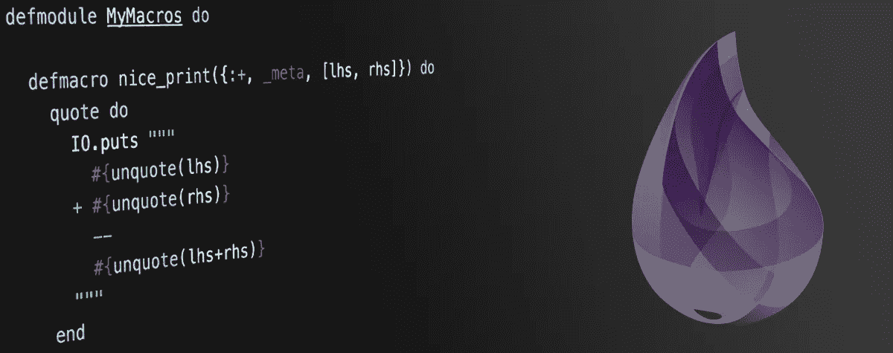
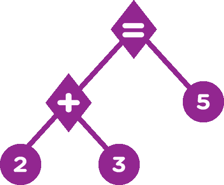
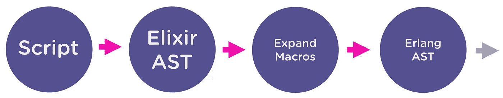

# 了解 Elixir 宏

> 原文：<https://medium.com/hackernoon/understanding-elixir-macros-3464e141434c>



前一段时间，当我第一次研究[药剂](https://hackernoon.com/tagged/elixir)时，我在文档中增加了一章，它与一个叫做**宏的东西有关。**当我研究这个问题时，一些复杂的术语开始出现，然后我就害怕了。比如:

*   元编程
*   抽象语法三
*   酏剂 AST
*   AST 文字
*   引用和取消引用

为了理解**宏**，我们应该对这些新的技术术语的含义有个概念，以及它们与灵药的关系。

# **元编程**

几乎所有的博客、书籍或视频都会说类似写代码 *，*的 ***代码之类的东西但是我真的很喜欢[@ im avery](https://twitter.com/@iamvery)在他的一次演讲中给出的解释。***

> 元编程只是[编程](https://hackernoon.com/tagged/programming) …
> 
> 编程是在一些数据中执行一些工作…
> 
> 数据是对其执行操作的数量。

所以元编程就像有规律的编程。然而，我们执行操作的数据可以是我们想要的任何数据，而不仅仅是语言提供给我们的数据结构。例如:

```
2 + 3
```

我们知道' **2 *'*** ，' **3 *'*** 是数据，' ***+'*** 是运算。然而在元编程中' **+** '也被认为是数据。我们可以操纵它，访问它，做任何我们想做的事情。

# 抽象语法三

当我们编写程序时，负责将我们的代码转换成字节码的编译器需要知道我们程序的语法结构，这样指令才能按照我们定义的那样执行。抽象语法三是表示。让我们看一些非常简单的例子:

```
2 + 3
```


AST (Abstract Syntax Tree)

```
2 + 3 == 5
```



AST (Abstract Syntax Tree)

# 酏剂 AST

Elixir 有自己的方式来表示 AST，这是通过将几乎所有内容转换为一个三元素元组，只是稍微重述一下，Elixir 编译器在产生**之前有一些步骤。光束**文件，这是一个真正简短的模式:



Elixir compiler phases

当使用宏时，我们正在编写脚本并生成 Elixir AST，我们不会触及**扩展宏**和 **Erlang AST** 。但是，很高兴知道这些步骤是存在的。

# AST 文字

像**原子、整数、浮点、字符串、列表**和**二元元组**这样的基本数据结构被认为是*文字。*这意味着当编译器处理那个时，它们在 AST 格式上是相同的。示例:


AST Literal

# **3 个元素元组**

另一方面，其他所有内容都被转换为三元元组，其基本结构如下:

**如果是变量:**

第一个元素是变量**名**，第二项是这个变量存在所需要的**元数据**(*通常为空*)，最后一项是**上下文**。


Variable to Elixir AST

**如果是通话**

第一个元素是函数**名**，第二个只是**元数据**(通常你不会关心这个)，最后一项是**参数**。


Function call to Elixir AST

# 引用

可能在这一点上你正在考虑退出这篇文章，AST 是复杂的嵌套结构。然而，有一些有用的函数(实际上它们也是宏)可以帮助我们管理所有这些结构。

如果你看到*引用*的例子，你可能会明白它是什么以及如何使用它:

```
iex> quote do: 2 + 3
{:+, [context: Elixir, import: Kernel], [2, 3]}
```

我们可以像使用其他函数或宏一样使用它。

```
iex(1)> quote do
...(2)>   if 2 + 3 == 5 do
...(3)>     "this is true"
...(4)>   else
...(5)>     "this is false"
...(6)>   end
...(7)> end{**:if**, [context: Elixir, import: Kernel],
 [{**:==**, [context: Elixir, import: Kernel],
   [{**:+**, [context: Elixir, import: Kernel], [**2**, **3**]}, **5**]},
  [do: **"this is true"**, else: **"this is false"**]]}
```

# 引文止

我首先想到的是:

```
iex(1)> unquote do: {:+, [context: Elixir, import: Kernel], [2, 3]}
"2 + 3"
```

但是，让我们这么说吧，事情并不是这样的。

> 引用和取消引用就像“插入的字符串”

想象下一个代码:

```
iex(1)> name = "George"
**"George"**
iex(2)> "Hello name"
**"Hello name"**
```

我们需要用字符串 **#{}** 评估**变量**名称****

```
iex(1)> name = "George"
**"George"**
iex(2)> "Hello #{name}"
**"Hello George"**
```

对于**引用的表达式**我们使用未引用的。

```
iex(1)> number = 3
iex(2)> quote do: 2 + unquote(number)
{**:+**, [context: Elixir, import: Kernel], [**2**, **3**]}
```

# **宏**

最后，本文的主要思想是向您展示什么是宏，但是正如我在开始时所说的，为了编写宏，我们需要理解一些其他的概念。

让我们定义我们的第一个宏:

```
defmodule MyMacros do **defmacro** nice_print({:+, _meta, [lhs, rhs]}) do
    quote do
      IO.puts """
        #{unquote(lhs)}
      + #{unquote(rhs)}
        --
        #{unquote(lhs+rhs)}
      """
    end
  **end**end
```

看看我们如何立即使用 quote，那是因为宏总是返回一个 Elixir AST，如果你不这样做，你会得到一个错误。

让我们使用那个宏:

```
iex(1)> require MyMacros
[MyMacros]
iex(2)> MyMacros.nice_print 2 + 3
  2
+ 3
  --
  5
```

请注意，我们的宏接收一个三元素元组，在本例中是 **2 + 3** 的 Elixir AST，而不是表达式 5 的求值。为了管理宏，我们拥有的工具不仅仅是这些。

**宏到字符串**

```
iex(1)> expression = quote do: 2 + 3
{:+, [context: Elixir, import: Kernel], [2, 3]}
iex(2)> Macro.to_string(expression)
**“2 + 3”**
```

**Code.eval_quoted**

```
iex(1)> expression = quote do: 2 + 3
{:+, [context: Elixir, import: Kernel], [2, 3]}
iex(2)> Code.eval_quoted(expression)
{**5**, []}
```

# 利弊

在 Chris McCord 的书“**元编程灵丹妙药**”中，他有一节叫做宏规则，他的第一条规则是:

> 不要写宏

但是为什么呢？，它们很强大，很神奇，不是吗？…我想这是第一个原因，它们如此强大，以至于你会沉迷于过度使用它们，而过度使用它们，你的代码会看起来很难看，难以阅读。

在杰西·安德森的一次演讲中，他展示了一段非常有趣的话:

> 代码被阅读的次数比它被编写的次数多得多，这意味着代码的最终成本在于它的阅读。

对我来说，这是真的，我们不必放弃编写漂亮易读的代码的想法。

使用宏的好处是元编程部分，我们可以做一些用普通函数做不到的事情，函数中的参数甚至在我们可以在函数体中使用它们之前就被计算了，而使用宏就不是这样了，因为我们只收到表达式的 Elixir AST 版本。

宏对于隐藏样板文件也很有用，想象一下您必须编写这样的代码

```
case(true) do
  x when x in [false, nil] ->
    false
  _ ->
    true
end
```

而不是这个

```
if true do
  true
else
  false
end
```

因此，对于宏，我们有可能通过在宏内部生成代码来隐藏代码。

希望你了解什么是宏以及如何使用它们，对我来说这个话题真的很棒，因为这是我第一次做元编程。灵丹妙药使其易于阅读和维护。如果你有任何问题，这里是我的推特 [@jorgechavz](https://twitter.com/JorgeChavz) 。谢谢！

# **资源**

宏并没有就此停止，有太多的信息与这个主题相关，我会在这里留下一些链接来帮助我理解这个有趣的主题。

**在 Elixir** [中开始元编程所需的最少知识 https://dock yard . com/blog/2016/08/16/The-minum-knowledge-you-need-start-meta programming-in-Elixir](https://dockyard.com/blog/2016/08/16/the-minumum-knowledge-you-need-to-start-metaprogramming-in-elixir)

不要写宏，但要了解它们是如何工作的——杰西·安德森 https://www.youtube.com/watch?v=Bo48sQDb-hk

**少写，多做(并且玩得开心！)配仙丹宏
视频:**[https://www.youtube.com/watch?v=mkoYqXdXl5Y](https://www.youtube.com/watch?v=mkoYqXdXl5Y)
**幻灯片:**【http://slides.com/chrismccord/elixir-macros#/】T21

**了解仙丹宏**
[http://theerlangelist.com/article/macros_1](http://theerlangelist.com/article/macros_1)