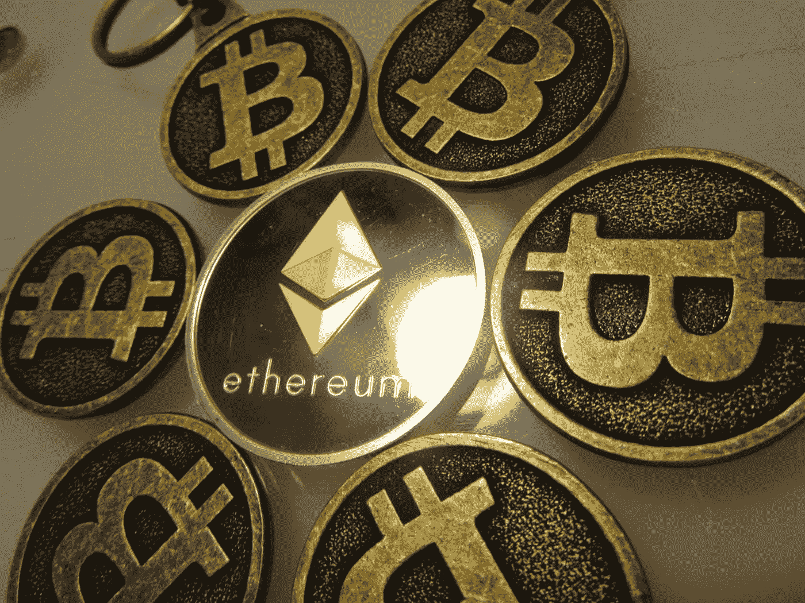
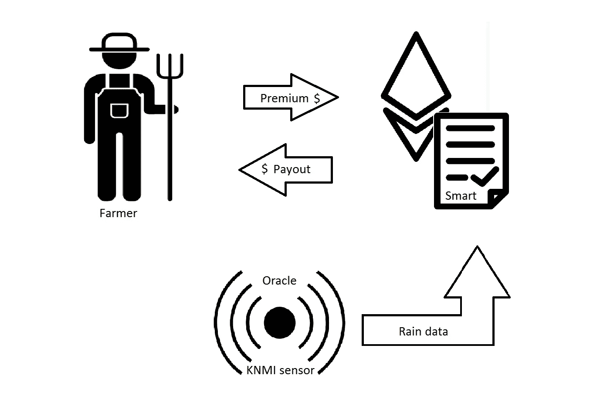
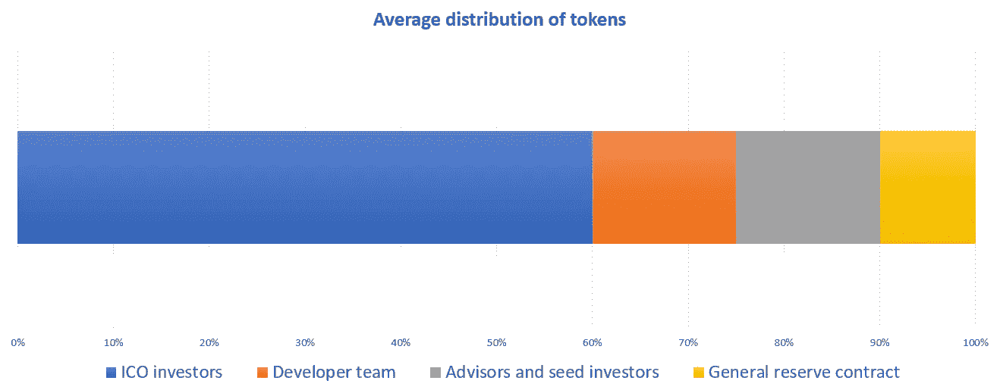
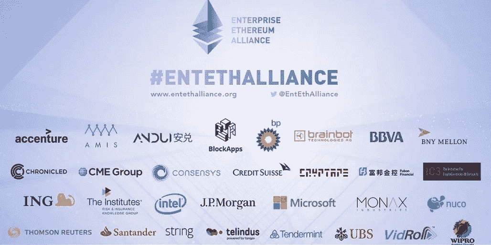

# 理解以太坊——全指南

> 原文：<https://medium.com/hackernoon/understanding-ethereum-a-complete-guide-6f32ea8f5888>

以太坊是最近大肆宣传的主题。有人称赞它是新的互联网或世界计算机，也有人批评它是一个让广泛的骗局和庞氏骗局得以滋生的平台。我在日报上看到一些关于以太坊、智能合约、DApps、DAO、ICO 和代币的消息不灵通的文章，所以是时候分析一下这个主题了。我将提出以太坊可能会成为实现‘价值互联网’的主要协议的论点。

现在是时候仔细看看以太坊是什么，它能实现什么，以及它在未来能扮演什么角色。但首先，我们必须回溯一点。是时候提醒一下分布式账本技术的价值了。

## 分散且“不可信”

简而言之，区块链是一个由全球大量节点保护和维护的数据库。数据存储在数据块中，这些数据块带有时间戳，并相互链接形成一个链。区块链确保存储在链中的所有数据都是安全的，并且永远不可变，这就是区块链如此有趣的原因。通过其共识机制，区块链是[‘不可信’](https://keepingstock.net/explaining-blockchain-how-proof-of-work-enables-trustless-consensus-2abed27f0845)，这意味着人们不必依赖交易对手的可信度。

*不可信，那又怎样？*

区块链第一次实现了一种不需要可信第三方就能在互联网上发送价值的安全方式。这导致了比特币和其他加密货币的兴起。

本质上，比特币交易只是执行一段代码，说明‘A 人’向‘B 人’发送了 X 数量的比特币。这项交易是自动执行的。为了执行，它首先检查个人 A 的数字钱包中是否有足够的比特币，然后将钱发送到 B 的钱包中。这个事务本身就是一段代码，如果满足某个变量，它就会自动执行。这是一份数字合同。这个(智能)契约是一段代码的第一个应用程序，这段代码可以被完全信任以(a)按照它被设计的方式运行，并且(b)是不可变的，不需要控制机构。

*然而，计算机代码可以用来做的远不止这些。*

Vitalik Buterin 很早就意识到，如果加密货币可以通过消除对可信第三方的需求来破坏传统金融，那么智能合约可以破坏更多需要中介提供信任的行业。他开始摆弄比特币的编码(脚本)语言，但发现对于他想象的应用数量来说，它不够灵活。因此，他创造了以太坊。

# 以太坊

以太坊是一个可编程的区块链。像任何区块链一样，以太坊基于点对点网络协议，由世界各地的许多计算机组成。以太坊没有向用户提供使用一些预定义操作(例如比特币交易)的能力，而是允许用户运行几乎任何他们想要的代码。代码存储在区块链上，供其他人与之交互，通常被称为智能合约。

比特币网络中的计算机(节点)维护并更新区块链。在以太坊，他们也运行以太坊虚拟机(EVM)。以太坊虚拟机是一台超级计算机，结合了网络中所有节点的计算能力。这种计算能力用于在区块链上运行用户提交的代码(智能合约)。为了执行这些，EVM 收取很少的交易费来交换智能合约所使用的计算能力。这种费用被称为“汽油”,它是以以太网支付的，这就是为什么以太网不应该真正被视为一种加密货币，而是作为运行网络的石油。

> 以太坊是一台超级计算机，它允许用户运行几乎任何他们想要的代码。

## 智能合同

如前所述，以太坊允许人们在区块链部署智能合约。智能合同是一段自动执行的代码，它定义并执行多方之间的协议。1994 年，尼克·萨伯首次提出了“智能合同”的概念。他推断代码完全能够定义一系列关系、参数和动作。

在以太坊中，智能合约可以用 Solidity 编写，Solidity 是一种以太坊专用的编程语言。这些智能合同可以上传到区块链，并将继续存在。因为区块链是安全的和不可变的，所以人们可以完全相信以太坊上的智能合约会像预期的那样执行。自我执行导致交易对手风险和道德风险基本上从等式中消除，因为合同强制执行其自身的条款。

Vitalik Buterin 在[以太坊的白皮书](https://github.com/ethereum/wiki/wiki/White-Paper)中对智能合约做了如下解释:

*“以太坊中的契约，不应该被视为应该“履行”或“遵守”的东西；相反，它们更像是以太坊执行环境(EVM)内部的“自治代理”，当被消息或事务“戳”到时，总是执行特定的一段代码，并直接控制自己的以太网余额和自己的键/值存储，以跟踪持久变量。*

智能合约可用于各种不同的交易。它们非常适合于简单的交易，在这种交易中，双方的义务可以归结为一组易于验证的要求。以金融产品为例(如衍生品、期货、期权等)。)、简单的消费者交易、物联网数据交换或音乐人或内容创作者按“使用”其知识产权的每分钟自动付费。

再举一个例子，我可以写一份智能合约，作为农民抵御干旱的保险。基本参数如下:

*   如果，来自 KNMI(荷兰皇家气象研究所)的传感器显示，在过去的 3 个月里降雨量不足 6 毫米；和
*   如果用户已存入合同中规定的每月保险费
*   然后，向用户发送金额为 X 的钱。

在我的例子中，KNMI 传感器就像一个“神谕”，为合同的执行获取可信的最新信息。oracle 是一个可信的第三方、传感器或区块链，可以提供合同所需的信息。

*插图 1:农民保险可视化*

## 分散应用

现在，让我们说，不仅仅是一个保险产品，我想在区块链开一家完整的保险公司。我们称之为大宗保险。首先，我会想要不止一个产品，并会编码不止一个智能合同。不同的合同将针对不同的产品和功能进行编码。

以太坊上的智能合约可以相互交互，这对大宗保险非常有帮助。经历了非常干旱的一年，我不希望“农民干旱保险”合同耗尽资金来补偿农民。因此，我可以让我的不同保险产品(智能合约)将保险费发送到一个中央智能合约，该合约将充当一般准备金。如果农民-干旱保险合同得出农民有权获得 X 金额的结论，将向一般储备合同发送消息以支付农民 X 金额，然后自动执行。

BlockSurance 的智能合约是在以太坊的区块链上存储和执行的，这意味着它们是“不可信的”:我的客户不必相信我会知道他们有权获得支付，因为合约会自动执行。我的客户也可以确保这些合同不会被破解或更改，因为区块链是不可变的。只要合同中的代码由以太坊社区审核，以确认它们将按预期/宣传的那样工作，就没有交易对手风险。

当然，大宗保险将需要客户——我希望他们的用户体验尽可能简单。所以，我将建立一个网站，创造一个伟大的用户界面。这个网站将是我的应用程序的前端，而以太坊的区块链和我的智能合约是后端。

如果我做了以上所有的事情，我基本上已经创建了一个分散的应用程序，或 DApp。然而，越来越多的人认为 DApp 不仅是运行在区块链上的应用程序，而且拥有自己的加密令牌。

## 代币

那么什么是代币呢？

代币是一种新型的数字财产，其价值由供求关系决定。令牌向其所有者授予一组权限，这些权限与它为之创建的分布式应用程序相关。例如，令牌可用于项目治理、股权分配或访问为其创建的分散式应用程序。代币千差万别的特点使其法律性质成为一个非常有趣的研究课题。

对于大宗保险，让我们假设我也创建了一个令牌。例如，这个加密令牌可以用于访问 DApp:要使用我的保险，必须用该令牌支付保险费。

此外，如果保险的利润超过了需要，我可以让我的代币持有者投票决定如何处理这笔利润。我可以通过在我的总储备合同中设置一个阈值来做到这一点，如果超过这个阈值，就允许代币持有者每年投票支持:

*   代币持有者之间的利润分配
*   保险费的减少
*   保险支出的增加
*   向开发商调配资金

对于每个投票选项，我只是部署了一个智能合同，允许用户在投票期间向其发送令牌，并在之后返回令牌。合约在期末互相沟通，看哪一个得到了最多的投票。收到最多的合同将自动执行。

为了制作我自己的加密令牌，我曾经被要求制作我自己的区块链。建立一个完整的区块链是一个耗时的过程，因为我必须设计它的协议，共识机制和设置节点。如果我没有足够的节点，它可能很容易受到[女预言家](https://www.safaribooksonline.com/library/view/building-blockchain-projects/9781787122147/3709bffa-0e77-4414-afe5-35ea93565bc1.xhtml)或 [51%攻击](http://www.investopedia.com/terms/1/51-attack.asp)。作为一个假设的开发者，我不想担心安全或设计整个区块链。

以太坊解决了这个问题，不仅允许部署智能合约，还允许在其区块链之上创建令牌。但是这些代币是怎么分发的呢？

## 首次硬币发行

代币通常是通过首次发行硬币或 ICO 首次发行的。在 ICO 中，平台的投资者和潜在用户可以通过兑换比特币或以太坊来购买代币。这是一种众筹形式，让开发者筹集资金，而早期采用者和机会主义投资者则猜测项目令牌的未来价值。ICO 也称为令牌分发。今年，迄今为止，ICO 已经筹集了超过 22 亿美元。

通过为 BlockSurance 做一个 ICO，我可以筹集资金雇佣开发人员来改进我的去中心化应用程序的前端和后端。ICO 也给了我的保险公司大量的曝光率，并帮助我启动了我的业务。可选地，我也可以把一部分收集到的资金放在“一般储备合同”中，或者偿还我的种子投资者。我还将把一部分代币装入自己的口袋，结果是这样的分配。

*说明 2:分发代币*

大多数 ICO 发行版看起来都像这样。当然，确切的百分比可能会有所不同，但几乎总是开发者给自己一些代币。从 ICO 投资者处筹集的资金将用于项目的实际开发。

## 分散的自治组织

去中心化自治组织(DAO)是一种完全由编码在其智能契约的基础捆绑中的规则来治理和管理的组织。DAO 本质上是一个 DApp，一旦启动，开发人员就不再扮演特殊的角色。DApp 和道的区别在于治理和自治。DApp 的源代码和未来路线图由一组开发人员或一个组织管理，而 DAO 是真正自主的。该组织做什么和它将做什么是*所有*预先确定在其代码。事实上，代码就是组织本身。

换句话说，在 DAO 中，未来的发展(如果有的话)完全由内置的治理机制决定，该机制让令牌持有者投票决定所筹集资金的部署。例如，选民可以投票支持 DAO 投资于其他项目。另一种选择是允许任何开发人员提交对 DAO 的更改或添加的建议，然后可以对这些建议进行投票表决。如果成功，开发商将获得实施其提议的许可，并从筹集的资金中获得报酬。为此，允许这种基于投票的实现的智能契约必须从第一天起就内置在 DAO 中。

在写作的时候[有 266 个 dapp&刀。](https://coinmarketcap.com/tokens/views/all/)这些大多部署在以太坊上。一些显著的例子是:

Dapps **:**

*   占卜——预测市场
*   假人——闲置计算能力的市场
*   基本注意力令牌——一种数字广告交换和浏览器，为内容创作者提供“基于注意力”的收入模式
*   状态:一个分散的浏览器，messenger 内置了对 DApps 的访问

道的:

*   道:众包投资基金(也是智能合约短暂历史中最大的败笔)
*   马克尔道:一种旨在最小化其自身令牌价格波动的道
*   DigixDAO:一个允许在区块链进行黄金支持代币交易的市场

# 用例与“价值互联网”

比特币所做的是允许个人交换现金，而不涉及任何中间人，如银行、支付处理商或政府。对于比特币的用例来说，这些机构提供的信任是不必要的。

以太坊的影响可能更深远。由于几乎任何东西都可以在其区块链上进行编码和保护，因此提供信任的其他中介角色可能会被取代。取决于你认为这些中介除了信任还能带来多少价值，这些参与者可能包括公证人、银行家、保险行业、房地产中介、在线商品和服务市场，如优步和易趣等。这种观点认为，几乎任何需要中介来提供信任的有价值的事情，都可以在区块链更高效地完成。

尽管这一论点有其缺陷，但很明显，区块链技术通过消除等式中的交易对手风险，使世界各地的个人能够相互交易。这不可避免地意味着，在某种程度上，可信的中介在我们的经济体系中失去了重要性。我们将看到从这些聚会向点对点服务和共享经济的转变。从集中经济向分散经济的转变。

互联网以一种在技术兴起之前无法想象的方式传播信息。区块链允许在互联网上进行无信任的价值交换，推动我们挑战我们如何构建社会、定义价值和奖励参与。这就是为什么区块链技术被称为“价值互联网”或互联网 3.0 背后的驱动力。以太坊已经是允许创建智能合约、DAO 和 DApps 的最大协议，许多人认为它可能会成为这个新互联网的主干。

# 企业以太坊联盟和特许连锁店

[企业以太坊联盟(EEA)](https://entethalliance.org/) 是一个学术机构、公司和创业公司共享知识的网络，旨在定义能够以业务速度处理最复杂、要求最高的应用程序的企业级软件。这个网络相当广泛，有著名的[成员](https://entethalliance.org/members/)，如摩根大通、微软、万事达卡、英特尔、德勤和英国石油。考虑到区块链技术的可能使用案例，各种各样的公司都想尝试自己的实施来提高各自行业的效率，这是合乎逻辑的。

*图 3:企业以太坊联盟成员的非穷举可视化*

经常有人认为 EEA 是以太坊估值的驱动因素，但事实并非如此(或者更好地说，不应该如此)。这些公司正在试验部署私有链(在一家公司内部使用)和联盟链(在这种情况下，具有现有关系的多方可以从特定用例的共享账本中受益)。这些“许可的”区块链是私人的“叉子”或私人版本的以太坊。以太坊的一个私有分支允许公司限制用户访问某些团体。确保网络安全的节点由相关公司提供。因为网络中的参与者很少，所以在改变区块链的规则、恢复交易、修改余额等方面有更大的灵活性。还有更少的交易成本(因为有更少的节点)和公共区块链中的常见风险，如 51%攻击是不可能的，因为所有的验证器都是已知的。

就个人而言，我想补充一点，我相信大多数人高估了无权限链的潜力，低估了有权限链的潜力。我并不质疑结构良好的区块链能给许多行业带来的效率。然而，如前所述，由于达成共识的难度不同，许可链比非许可链更有效。我并不是说透明度、审查阻力和安全性本身就不好，但是一个分散的项目要想成功，需要的不仅仅是这些属性(想想用户体验、竞争成本等等)。).

# 结论

区块链提供了提供高效、快速、安全、可靠和可审计的价值交易的潜力。就像之前的互联网一样，区块链承诺颠覆商业模式，颠覆行业。区块链技术正在推动我们挑战我们如何构建社会、定义价值和奖励参与。这就是为什么有些人把区块链称为互联网 3.0 或价值互联网的使能技术。

由于几乎任何东西都可以在以太坊的区块链上编码和部署，以太坊可能只是这个新互联网的基础。然而，高潜力伴随着大肆宣传，谈论互联网 3.0 带来了类似于网络危机的问题。

编辑:这篇文章只关注以太坊的积极方面。然而，对这个项目有许多合理的批评。一篇新的文章总结了耶鲁大学的弱点。

***关于作者:***

Thijs Maas 是一名法律系学生，他对分布式账本技术带来的创新浪潮所带来的法律挑战有着浓厚的兴趣。他最近推出了[*www . lawondblockchain . eu*](http://www.lawandblockchain.eu)*，一个关于该主题的信息、见解和学术研究的中心。*