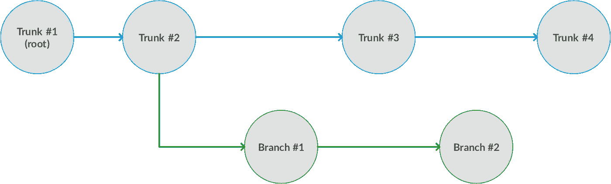
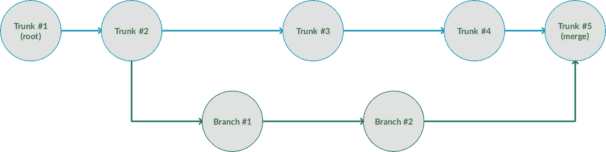

# 理解 Git(第 2 部分)——为团队做贡献

> 原文：<https://medium.com/hackernoon/understanding-git-2-81feb12b8b26>


Trees and branches. Is this some sort of analogy? Photo by [Liam Pozz](https://unsplash.com/photos/4iwLxkESGe4?utm_source=unsplash&utm_medium=referral&utm_content=creditCopyText).

> [了解 Git(第一部分)——解释得像我五岁一样](https://hackernoon.com/understanding-git-fcffd87c15a3)
> → [了解 Git(第二部分)——为团队做贡献](https://hackernoon.com/understanding-git-2-81feb12b8b26)
> 了解 Git(第三部分)——解决冲突(敬请期待！)

几乎每个主要的软件公司和[开源](https://hackernoon.com/tagged/open-source)项目都使用某种类型的“版本控制”来跟踪随时间的变化。版本控制可以帮助你协调团队工作并找出软件错误。

Git 是当今最流行的版本控制系统之一。如果你还不熟悉的话，请看本系列的第一部分“像我五岁时一样解释”的介绍。

本指南涵盖了如何使用 [git](https://hackernoon.com/tagged/git) 为团队做出贡献——无论是在办公室还是在开源社区的网上——并且面向初学者。它将解释从想法到拉动请求的整个流程。

任何**行话**在第一次被描述时都会以粗体突出显示。请随意在官方的 [git 词汇表](https://git-scm.com/docs/gitglossary)或[参考指南](https://git-scm.com/docs)中查找这些术语，了解更多细节。

# 从树干开始

Git 使用了很多“树”的类比，所以要做好准备。你可以把你的主要代码库想象成一棵树的主干🎄

每次你添加更多的变化(又名**提交**)，你的树就会长得更高，笔直向上。即使你删除了代码，这仍然被认为是一个变化，并导致树的增长。这就像文本编辑器中的“撤销”历史如何保存你的击键，包括退格键。

默认情况下，Git 调用主干`master`。你想怎么叫都行；除了它是一个约定俗成的词之外，这个词没有什么特别的。

通过**检查**第一部分中描述的特定“检查点”,你可以在树干上上下移动——相当于在时间中前进和后退。

# 分支

大多数项目都有很多新功能需要添加，还有很多 bug 需要修复。当你想解决其中一个问题时，一种方法是让树长得更高，并直接提交给树干(`master`)。这对于小项目或者只有你一个人进行修改的项目来说很好，但是如果多人同时工作呢？太容易妨碍对方，并以相互冲突的变化而告终。

解决方法是分支。不是提交到主干，而是创建你自己的**分支**(例如`my-cool-feature`而不是`master`)并从那里开始工作。现在你正在长高你的树枝，而不是树干。

当可视化分支时，为了节省空间，它们通常被画在一边。想象下面是一棵丑陋的树，翻倒了，树根在左边。每个圆圈都是一个承诺。每个圆圈越靠右，最近发生的次数越多:



I wouldn’t plant this in my front yard.

有一个蓝色的树干和一个绿色的树枝。每一个都有几个提交，从左到右按时间顺序显示。您的分支在提交`T2`时开始。当您处理您的分支时(提交`B1`和`B2`，其他人直接处理主干(提交`T3`和`T4`)。那些提交还不在您的分支中；你的分支过时了，你很快就会读到。

同样，参见本系列的[第 1 部分](https://hackernoon.com/understanding-git-fcffd87c15a3)来理解`branch`和`commit`命令，或者如果你想要更多的可视化，参见免费的 [git 书籍](https://git-scm.com/book/en/v2/Git-Branching-Basic-Branching-and-Merging)。你也可以在 GitHub 上看到真实的分支可视化，或者在你的终端上输入`git log --all --decorate --oneline --graph`。

# 提交您的更改

现在你在一个分支上有了你的变更，但是最终的目标是把它们作为“官方”代码库的一部分放回到主干上。

一旦您测试了您的更改，您将需要与团队分享它们。通常你会通过一个**拉请求** (PR)或者一个**合并请求** (MR)来完成这个任务——它们是同一个东西，只是术语取决于你使用的是什么软件(例如 GitHub/Bitbucket/GitLab)。您正在*请求*将您的更改*拉入并合并*。从现在开始，我将这些称为 pr。

有些人在做第一次公关时会紧张(我当然也是)，但这真的没什么好害怕的。大多数团队都乐于接受新的 PRs，即使代码在被接受之前还需要一些工作。PRs 是开源生态系统的重要组成部分。

这里有一个关于如何提交公关的详细描述和一些关于公关礼仪的建议。甚至有一个完整的社区“[仅限初次尝试者](http://www.firsttimersonly.com/)”，供那些想开始为开源做贡献但不知道从哪里开始的人使用。

要记住的主要事情是要清楚地解释**为什么**你要做出改变，以便给出背景。

# 讨论和修改

一旦您提交了您的 PR，团队中的其他人将需要查看它并留下反馈。他们可以对特定的代码行提出问题和评论，或者对您的更改给出更一般的反馈。在某些情况下，他们可能会将自己的更改直接推送到您的分支机构，但通常他们会要求您自己进行更改。

如果您想根据反馈进行更改，只需向您现有的分支添加更多的提交，并再次将其推送到`origin`。PR 将自动更新以反映您的更改。

# 保持最新

如果在你的 PR 被接受之前过了一段时间，它可能会变得“陈旧”，这意味着它是基于主干的旧版本(就像前面显示的树)。您的更改可能在一周前起作用，但是不能保证它们仍然和其他对主干的更新的更改一起起作用。

要获得最新信息，您有两种选择:

1.  您可以使用`git merge master`对中的 [**合并**。这将在您的工作之上应用来自主干的任何新的更改。](https://git-scm.com/book/en/v2/Git-Branching-Rebasing)
2.  您可以使用`git rebase master`将 [**调整为**](https://git-scm.com/book/en/v2/Git-Branching-Rebasing)之上的。这将您的工作重新应用到主干上的任何新的变更之上。

在这两种情况下，您自己的更改仍然是相同的——您实际上只是将您的分支移动到主干的顶部，以便与最新的代码保持同步。

不同的团队可能喜欢这种或那种方法；如果你不确定，通常选择`merge`更安全。

# 处理冲突

当合并或重定基础时，你偶尔会遇到**冲突**。这意味着你修改了一行别人也修改了的代码，git 不知道该保留哪个版本。

当这种情况发生时，许多人会感到恐慌。git 的输出看起来很糟糕，带有奇怪的`>>>>>>> ======= <<<<<<<`符号，你可能会认为你已经破坏了整个系统。放心吧！这看起来很奇怪，但稍加练习你就会明白。

这里涉及的内容太多了，但是看看这篇文章可以了解冲突是如何发生的，以及如何解决它们。我还计划在本系列的第 3 部分重点讨论如何处理冲突。

本质上，你只需要删除那些奇怪的符号，并手动组合它们之间的代码。

例如，该行:

```
print "Hello"
```

可能会在两个独立的分支上更改，从而导致冲突:

```
>>>>>>>
print "Hello, world"
=======
print "Hello!"
<<<<<<<
```

解决后，可能会变成:

```
print "Hello, world!"
```

手动将冲突的行合并在一起后——保留“world”*和*的“！”，它们都是单独添加的。

# 接受您的更改

一旦所有的公关意见都得到解决，任何冲突都得到解决，您的分支机构就可以合并了！

代码库的管理员可以通过将您的分支合并到主干中来接受 PR——只需按下 GitHub 上的一个按钮——从而使您的更改正式化。

下面的提交`T5`是一个“合并提交”，将绿色分支中的更改放到主干上。



This isn’t how trees work in nature.

你做出了成功的贡献！🙌你可以在[https://github.com/pulls](https://github.com/pulls)查看你提交的所有简历。

如果您觉得本指南有用，请点击**帮助您👏你想按多少次按钮就按多少次**，这样其他人也能找到它。

感谢阅读，请继续关注第 3 部分。与此同时，去看这个[简单教程](https://www.youtube.com/watch?v=V74l_zS1x8E)视频，然后解决一些[新手](http://www.firsttimersonly.com/)的问题！