# 通过 Clojure 宏理解同象似性

> 原文：<https://medium.com/hackernoon/understanding-homoiconicity-through-clojure-macros-eeb8c1f25369>

## 代码就是数据，数据就是代码

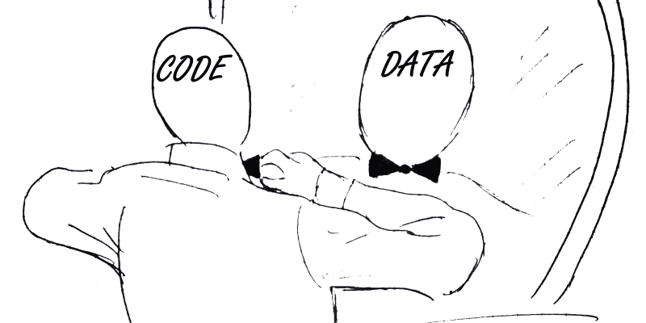

主要参与了。到目前为止，在我的职业生涯中，同象似性对我来说是一个新的概念，当我第一次在 Clojure 遇到它的时候(也是后来在酏剂中)。

如果你在维基百科上查一下，你会发现通常的冗长定义有点道理。

> *“……同象似性是某些编程语言的一个特性，在这些语言中，程序结构与其语法相似，因此程序的内部表示可以通过阅读文本的布局来推断……”*

所以，简言之:**代码就是数据，数据就是代码**。

# 报价和评估

举一个简单的例子:

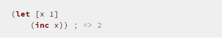

这一行代码执行临时绑定(将 x 绑定到值 1 ),然后增加 x，得到返回值 2。

所以它是可以被执行并产生一些数据的代码。

但是同样，它也可以被认为是一个包含三个元素的列表:

*   一个[符号](http://clojure.org/data_structures#Data Structures-Symbols)命名字母；
*   包含两个元素的向量——一个名为 x 的符号和一个整数；
*   包含两个元素的列表——一个名为 inc 的符号，一个名为 x 的符号。

# 引用

您可以使用 [**引用**](https://clojuredocs.org/clojure.core/quote) 函数获取一些 Clojure 代码，并将其作为数据返回，而不是对其进行评估。

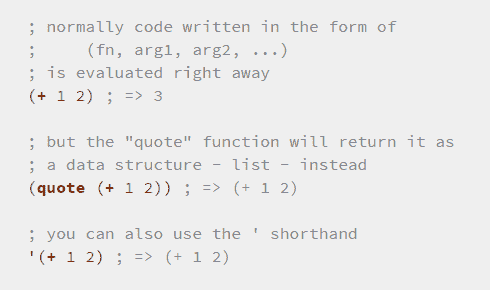

**侧栏:** *任何 F#开发人员阅读本文都会注意到与 F#中的* [*代码引用*](https://msdn.microsoft.com/en-us/library/dd233212.aspx) *的相似之处，尽管您得到的表示并不那么容易操作，也没有内置的方法来评估它。也就是说，您确实有一些选择，包括:*

*   [*F#报价评估员*](http://fsprojects.github.io/FSharp.Quotations.Evaluator/) *和*
*   [*流浪*](http://nessos.github.io/Vagabond/) *，这就是* [*在云中执行代码的方式*](http://www.m-brace.net/)

# *evaluate 评价*

*另一方面，您具有 [**eval**](https://clojuredocs.org/clojure.core/eval) 功能。它接受数据并作为代码执行。*

*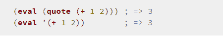*

*在您将一些可执行代码捕获为数据之后，您还可以在执行转换后的代码之前对其进行操作。这就是宏的用武之地。*

# *宏指令*

*[比如 clojure.test](http://clojure.github.io/clojure/clojure.test-api.html) 就是一个用宏编写的单元测试框架。您可以使用“is”宏做一个简单的断言:*

*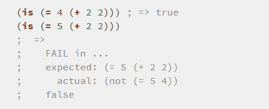*

*并与我们从 NUnit 得到的错误信息进行对比。*

*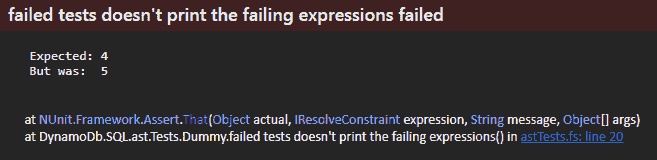*

*失败的表达式被打印出来，这样你就可以直接看到哪里出错了，这不是很好吗？这比我们从 NUnit 得到的一般消息信息量大得多，NUnit 迫使我们四处挖掘并找出哪一行测试失败了。*

****2015 年 05 月 23 日更新:****

**正如 Vasily 在评论中指出的，有一个 F#的断言库叫做*[*un quote*](https://code.google.com/p/unquote/)*，它使用 F#代码引号(上面提到过)，并产生类似于*[*clo jure . test*](http://clojure.github.io/clojure/clojure.test-api.html)*的用户友好的错误消息。这表明，即使没有宏，仅仅能够轻松地将代码捕获为您的语言中的数据结构就可以实现许多用例——菲尔·特雷福德的*[*Foq*](https://foq.codeplex.com/)*mocking 库是另一个很好的例子。**

# *构建断言等于宏*

*作为一个发现的过程，让我们看看如何通过宏来完成。*

## *版本 1*

*首先，我们将定义*可能*工作的最简单的宏:*

*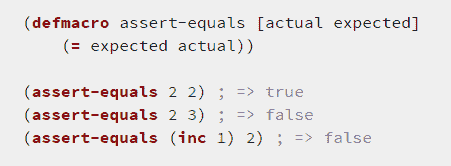*

*哎呀，所以最后一个案例没有成功。*

*这是因为传递给宏的实际值和期望值是代码，而不是整数值 2。*

*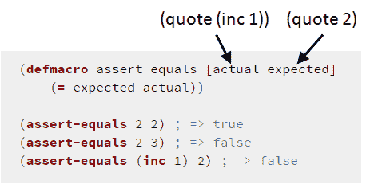*

## *版本 2*

*如果我们在里面做个评估呢？*

*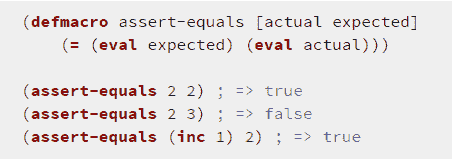*

*这行得通，对吧？对吗？*

*不完全是。*

*我们没有操纵代表代码的数据，而是在编译时对它们进行评估(宏在编译时运行)。*

*您可以通过使用[宏展开](https://clojuredocs.org/clojure.core/macroexpand)来验证这一点:*

**

*所以你可以看到我们的宏已经把输入的代码转换成布尔值 *true* 并作为代码返回。*

## *版本 3*

*我们应该做的是返回我们想要作为数据执行的代码，我们已经知道如何做了——使用*引用*函数。在返回的代码中，我们还需要在断言失败时出错。*

*从我们要执行的代码开始，假设:*

*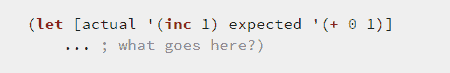*

*嗯，我们想:*

*   *比较实际和预期的评估值，如果不相等则抛出 *AssertionError**
*   *在错误信息中显示实际表达式 *(inc 1)* 和预期表达式 *(+ 0 1)**
*   *显示实际值的评估值— 2*

*那么，也许是这样的？*

*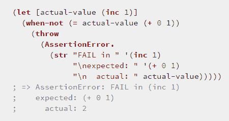*

*现在我们知道了我们的最终目标，我们可以向后工作来定义我们的宏:*

*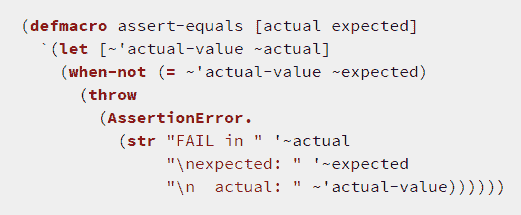*

*看到相似之处了吗？这里需要注意的重要一点是，我们引用了整个 *let* block(通过‘速记’)。但是为了引用*实际的*和*预期的*表达式并按原样返回它们，即 *(inc 1)，(+ 0 1)* ，我们不得不使用 **~** 操作符有选择地取消**某些内容的引用。***

*您可以展开宏，看到它与我们想要输出的代码在语义上是相同的:*

*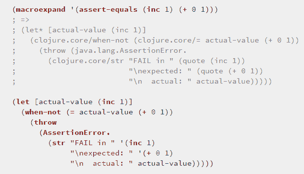*

*在我们继续之前，您可能会对这里正在进行的一些引用操作感到疑惑，所以让我们花一些时间来详细了解它们。*

***输出待评估的*实际*表达式***

*记住，我们的 *defmacro* 块中的*实际*和*预期*参数是 *(inc 1)* 和 *(+ 0 1)* 的引用版本。*

*为了提高效率，我们希望只评估*实际*一次，以防产生副作用。这就是为什么我们需要评估它，并将结果绑定到一个符号。*

*为了生成将在运行时评估 *(inc 1)* 的输出代码*(let[actual-value(Inc 1)]……)*，我们需要引用引用形式的 *actual* 表达式，因此 *~actual* 。*

*如果我们不取消*实际*的引用，请注意扩展代码中的差异。*

*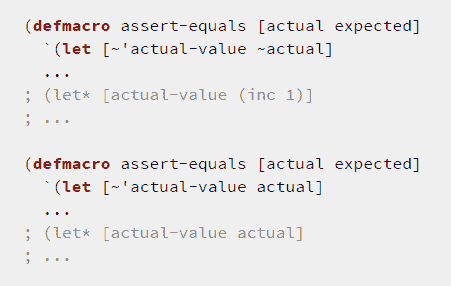*

*如果没有~，生成的代码会寻找一个名为 *actual* 的局部变量，这个变量会因为不存在而失败。*

***输出*实际值*符号***

*为了在 *let* 绑定中输出*实际值*符号，我们必须编写*~‘实际值*，即*(未引用(引用实际值))*。*

**

*我知道，对！？我也花了一段时间才想明白。*

*问:我们能不能只写*'(让[actual-value ~actual] …)* ？*

*A.不，因为它将转换为*(let[user/actual-value(Inc 1)]……)*，这不是一个有效的 let 绑定。*

*好的，那么*~实际值*呢？*

*A.不，因为宏不会被编译，因为我们将在 *defmacro* 的范围内寻找一个不存在的局部变量*实际值*。*

*问:好的..还是*‘实际值*？*

*A.不，因为它将转换为 *(let [(引用实际值)**(Inc 1)]……)*，这在运行时会失败，因为这不是有效的绑定语法。*

*问:那么*~‘实际值*到底是如何工作的呢？*

*A.以下内容:*

1.  **(引用实际值)*捕捉符号*实际值**
2.  *取消对符号的引用，使其显示为输出代码中的样子*

***输出*实际*和*预期*表达式***

*最后，在公式化错误信息时，我们还看到了*' ~实际*和*' ~预期*。*

*下面是带引号和不带引号的扩展代码。*

*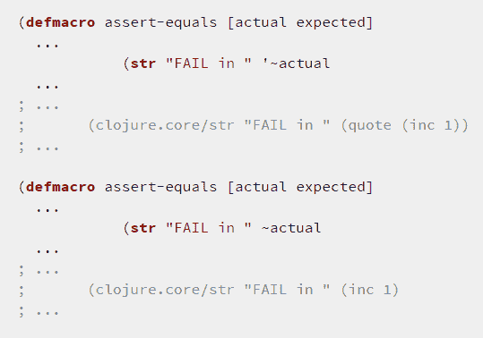*

*看出区别了吗？*

*如果没有引用，生成的代码将会评估 *(inc 1)* 并打印 *FAIL in 2* 。*

*如果引用的话，它会打印 *FAIL in (inc 1)* ，这正是我们想要的。*

***经验法则***

*   *要捕获一个符号，使用 *~ '符号名称**
*   *要引用宏的参数并生成将在运行时评估的代码，请使用 *~arg-name**
*   *要引用宏的参数并生成在运行时引用它的代码，请使用 *'~arg-name**

*最后，让我们测试一下我们的新宏。*

*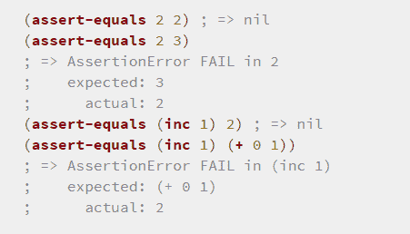*

*太棒了。就这样吗？*

*差不多了。*

*这里我们的宏有一个小问题——在*实际值*上的名字冲突是不安全的。*

*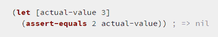*

## *版本 4*

*如果你在一个符号的末尾看到 **#** ，那么这将用于自动生成一个带有随机名称的新符号。这在宏中很有用，因为它可以防止宏中声明的符号泄漏。*

*因此，我们可以不使用 *let* 绑定中的*~‘实际值*，而是执行以下操作:*

*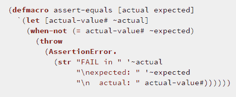*

*展开后，可以看到 *let* 绑定使用了一个随机生成的符号*actual-value _ _ 16087 _ _ auto _ _*:*

*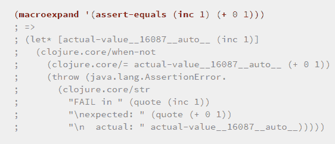*

*这个版本不仅更安全，而且没有令人费解的*(引用实际值))*业务，可读性更好！*

*因此，这里有一个对同象性和宏 Clojure 的简单介绍。宏是一个人工具箱中的强大工具，它允许你像 clojure.test 一样以一种非常自然的方式扩展语言。我希望你会觉得这个想法很有趣，而且我已经很好地解释了这个话题。*

*如果有任何不清楚的地方，请随时在评论中告诉我。*

# *链接*

*   *[学会学习](https://hackernoon.com/learn-to-learn-286558241fd6)*
*   *[不要学一种语法，要学会改变你的思维方式](https://hackernoon.com/dont-learn-a-syntax-learn-to-change-the-way-you-think-18436807012d)*
*   *[clo jure 第二版的喜悦](http://amzn.to/1F2waSN)*
*   *[Y 分钟学会 clo jure](http://learnxinyminutes.com/docs/clojure/)*
*   *[在 Y 分钟内学会 Clojure 宏](http://learnxinyminutes.com/docs/clojure-macros/)*
*   *[clo jure](https://yobriefca.se/blog/2014/05/19/the-weird-and-wonderful-characters-of-clojure/)的怪异和神奇人物*

******

> *[黑客中午](http://bit.ly/Hackernoon)是黑客如何开始他们的下午。我们是 [@AMI](http://bit.ly/atAMIatAMI) 家庭的一员。我们现在[接受投稿](http://bit.ly/hackernoonsubmission)并乐意[讨论广告&赞助](mailto:partners@amipublications.com)机会。*
> 
> *如果你喜欢这个故事，我们推荐你阅读我们的[最新科技故事](http://bit.ly/hackernoonlatestt)和[趋势科技故事](https://hackernoon.com/trending)。直到下一次，不要把世界的现实想当然！*

**