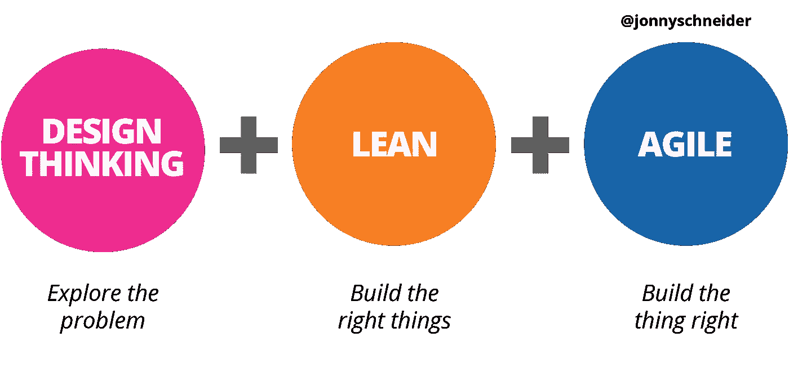
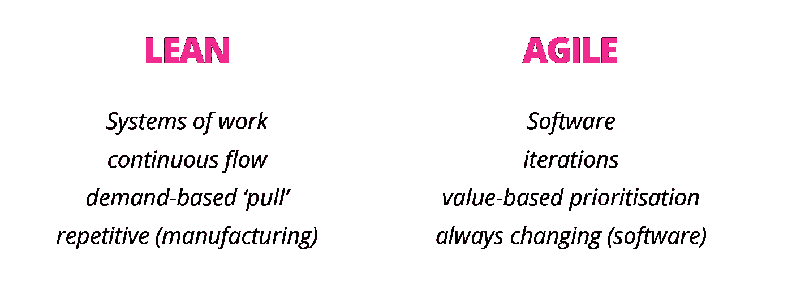
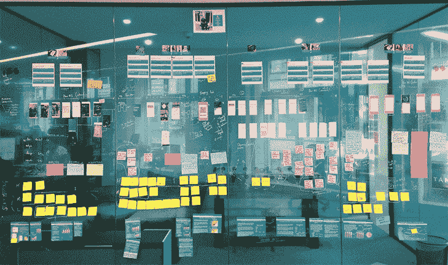
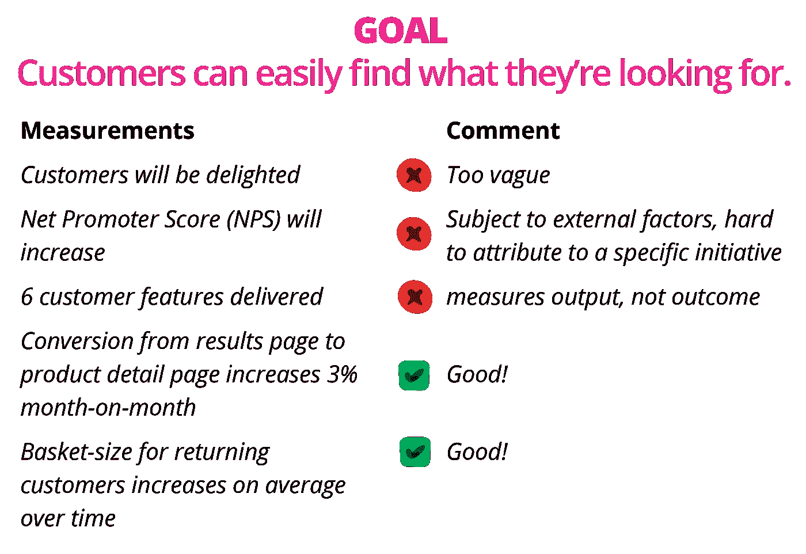
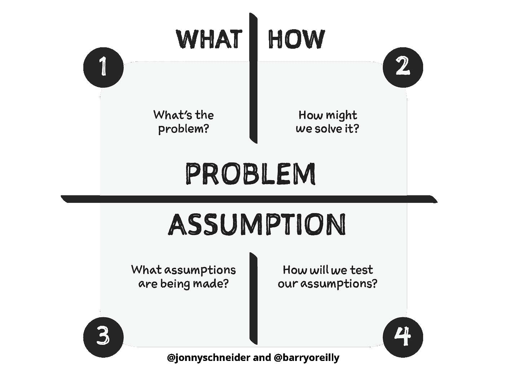
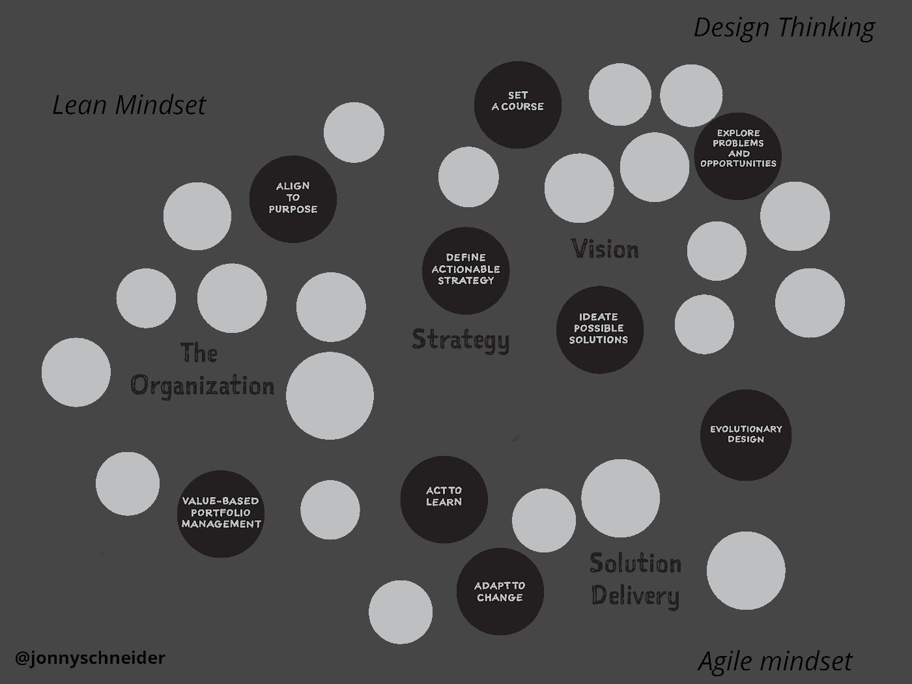
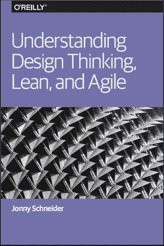

# 设计思维、精益和敏捷如何协同工作

> 原文：<https://medium.com/hackernoon/understanding-how-design-thinking-lean-and-agile-work-together-fe65fd854407>

*原载于 2017 年 9 月 20 日*[*【www.mindtheproduct.com】*](https://www.mindtheproduct.com/2017/09/understanding-design-thinking-lean-agile-work-together/)*。*

敏捷的想法很棒。这是它被编纂成仪式和证书的方式，并且盲目地推出，这没有抓住要点。

当人们谈论精益时，话题往往会在*流程优化、浪费、*和*质量*上结束，而忽略了精益思想所提供的许多东西。

设计思维被认为是设计促进者的新魔术。

这是三种被不思考的大众所破坏的心态，他们抓住了一个更好的东西的量化承诺，并在没有真正思考的情况下遵循这些步骤。人们真的需要改变，但他们却无法真正理解为什么要遵循规则或流程。

*Figure 1\. Three mindsets of product development*

> 设计思维是我们探索和解决问题的方式；精益是我们测试信念和学习正确结果的框架；敏捷是我们如何用软件适应不断变化的环境 *—* [发微博](https://ctt.ec/2d0Gk)

设计思维讲的是*能力*和*学习*。斯坦福设计学院的教学负责人假虎刺属·卡特精彩地描述了一些让设计师变得伟大的能力。像处理歧义、移情学习、综合和实验等能力。设计师创造意义、构建问题和探索潜在解决方案的能力是关键。《日常用品的设计》一书的作者唐纳德·诺曼描述了设计师对第一个想法的不满。问问你自己，上一次你的第一个想法是你最好的想法是什么时候？当我们探索事物时，意义和新的想法就会出现。设计思维就是我们如何探索这些问题和解决方案。每个人都在设计，不管是不是有意识的。如果你在解决一个问题，你就是在设计一个解决方案。设计思维是一种帮助我们做得更好的心态。

精益最初是对制造业科学管理实践的回应。组织通过过程、规则和程序寻求效率，而管理主要是关于控制。但在现代商业中，控制是一种假象。事情太复杂，太不可预测，太动态而无法控制。精益为管理任何*工作系统*提供了一种不同的思维方式。从根本上讲，它是关于探索不确定性，通过实验和学习做出决定，并授权与工作最接近的人决定如何最好地实现预期结果。精益说*是适应性*，而不是*预测性*。

敏捷与精益相关。不同之处主要在于这些心态适用于什么，以及如何适用。在高度不确定的情况下，敏捷提供了构建动态的、能够适应变化的软件的方法。这不仅仅是旋转。它还涉及随着时间的推移扩展和发展解决方案。如果我们承认今天的解决方案与明天的不同，那么我们应该专注于满足我们的直接需求，而不限制我们在以后事情发生变化时做出反应的能力。敏捷的核心是用软件优雅地适应不断变化的需求。

*Figure 2\. Comparing and contrasting Lean and Agile*

当我们将这三种心态结合在一起时，真正的好处就来了。很多时候，问题是“精益还是敏捷？”。答案是“和”，而不是“或”:这是设计思维、精益和敏捷。说起来容易，但是我们怎么做呢，实践起来又是什么样子呢？这里有一些从在野外应用设计思维、精益和敏捷中学到的经验。

# 目标、一致性和自主性

> "在愿景上要固执，但在细节上要灵活."
> —杰夫·贝索斯

构建一个产品很像一个战斗任务。一组*熟练人员*在*高度不确定性*的条件下运作；指挥官设定*明确的结果*和一些*指导原则*；但是我们*期待意想不到的*；而且，我们被训练采取最佳行动，随着形势的发展对新信息做出反应。

所有这些都需要自律。还有练习。

在军事行动中，这被称为*纪律倡议*，士兵们接受训练以练习战斗动作。在迈克·罗泽尔的[改进形](http://www-personal.umich.edu/~mrother/The_Improvement_Kata.html)中，它被称为*刻意练习*，这就是我们如何练习科学思维的动作。这就是产品团队如何与目标保持一致，探索不确定性，并学习实现预期结果的方法。

*Pro tip* :尝试在一面大的*产品墙上*可视化整个端到端的过程，从愿望和假设到设计实验和反馈，这样整个团队就可以一起玩了。

*Figure 3\. A product wall*

# 衡量重要的事情

> “如果衡量标准真的很重要，那是因为它肯定会对决策和行为产生一些可以想象的影响。”道格拉斯·w·哈伯德

你将如何衡量结果？你什么时候会知道你已经实现了？你的指标会帮助你做决定吗？

我们都知道虚荣心指标——比如总浏览量或总新客户数——是没有意义的。但是知道不测量什么并不会使测量正确的事情变得更容易。即使动机是正确的，我们也有很多方法会弄错。假设你在经营一家网上商店，向各种各样的买家出售成千上万种独特的商品。让他们更容易找到他们想要的是你的目标之一。现在试着将目标分解成一些指标，帮助你知道你是否在正确的轨道上。

*Figure 4\. The good and bad of goal-based measurements*

*专业建议*:围绕你想要做出的未来决策来构建你的衡量标准。只衡量那些表明你朝着目标前进的事情。假设驱动的开发提供了一种以简单、可重复的格式构建结果、信念和度量的方法。它为找到正确的度量标准提供了一些结构，并使与其他人交流变得容易。

# 基于学习做出决定

> “不要寻找事实或答案，要寻找更好的问题。我们提出的问题和探索的意义，将产生对战略最有用的见解。”
> —杰森·福克斯博士

我们为什么学习？做出更好的决定。许多解决方案失败了，因为它们没有解决有意义的问题，我们倾向于爱上我们的想法，让我们的偏见战胜我们。即使我们试图通过测试我们的想法和进行实验来降低决策的风险，我们也不总是做对。一个陷阱是将一个好的原型测试结果与问题或客户对解决方案的需求紧密联系在一起。其中的每一个——问题、解决方案、需求——都是独立的关注点，它们需要不同的学习方法。

我们不需要成为科学家来学习正确的东西，洞察力也不一定只属于研究团队。如果我们通过我们的方法思考，它可以帮助我们做出更好的决定。我们可以从以下方面着手:

1.  *定义*我们的信念和假设(以便可以测试)
2.  *决定*学习最重要的东西
3.  *设计*能够传递学习的实验

*专业提示*:[*问题-假设模型*](http://jonnyschneider.com/blog/fastest-path-to-feedback) 是一种简单的入门方式。这是帮助我们提问的一种方式:问题出在哪里？我们如何解决这个问题？我们做了哪些假设？我们将如何检验我们的假设？

*Figure 5\. The Problem-Assumption Model, created by* [*Jonny Schneider*](http://jonnyschneider.com) *and* [*Barry O’Reilly*](http://barryoreilly.com)

# 许多心态，一个团队

最重要的是，这是关于一起工作，一起取得成就。学习是一项团队运动，如果我们要找到我们想要去的地方，合作是关键。没有一种正确的方法，也没有一种单一的思维方式。但总的来说，每种心态的元素都有助于我们找到前进的方向。

*Figure 6\. How the three mindsets overlap*

> 团队应该挑战他们思考和尝试新事物的方式，拥抱有用的东西，从无用的东西中学习，而不是专注于应用一个过程

这种*正确的*方式将因每个团队的具体情况而异。成功是关于团队如何开发新的*能力*，*通过实践学习*，以及*将*应用到所学的东西。

*亲提示*:试试杰夫巴顿的[双轨开发](http://jpattonassociates.com/dual-track-development/)。它描述了团队如何将*产品发现*和*产品开发*更紧密地结合成一个协作。

想多读点？从奥赖利出版社获得免费电子书，然后在 goodreads 上给它评分。

*原载于 2017 年 9 月 20 日*[*www.mindtheproduct.com*](https://www.mindtheproduct.com/2017/09/understanding-design-thinking-lean-agile-work-together/)*。*