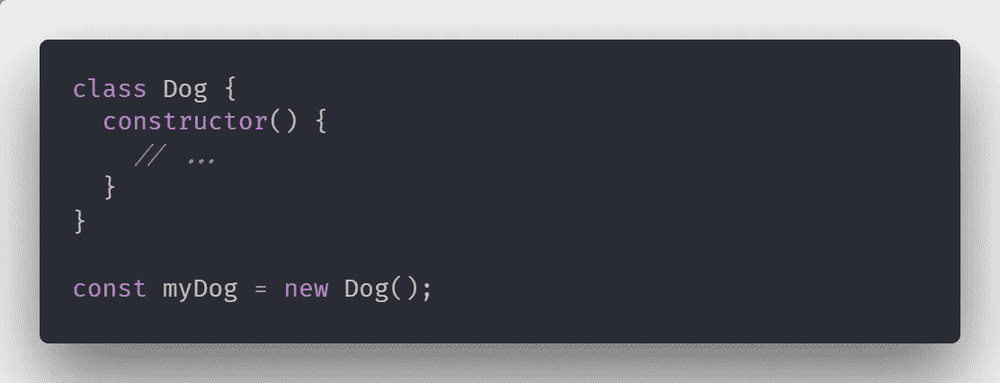
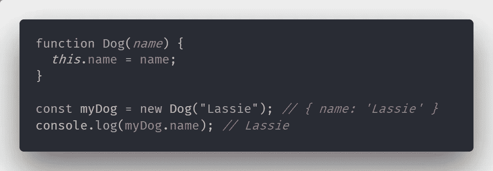
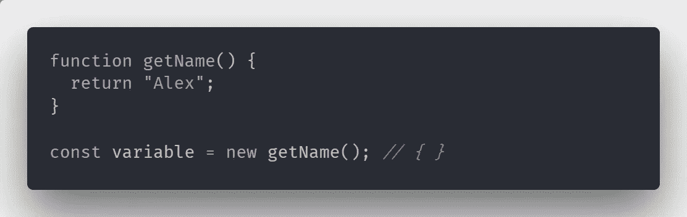
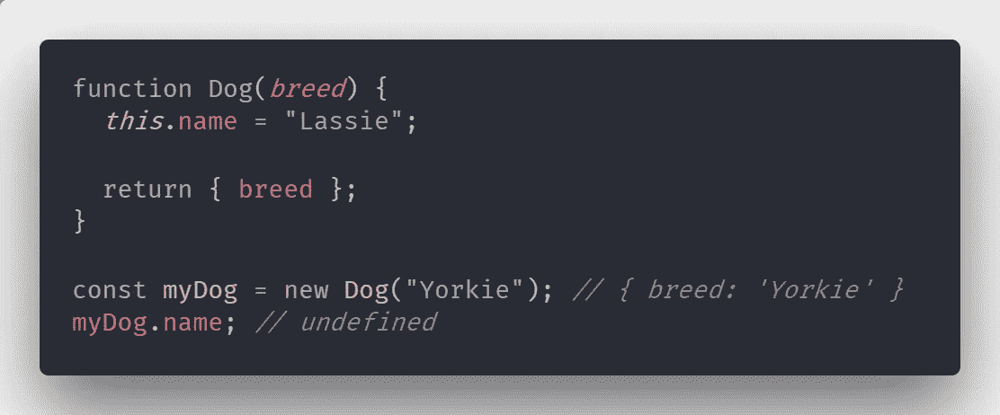

# 理解 JavaScript:新关键字

> 原文：<https://medium.com/hackernoon/understanding-javascript-new-keyword-ec67c8caaa74>

JavaScript 语言的一个特别的部分带来了很多误解，那就是*新的*关键字。如果 JS 不是你的第一门编程语言，并且你做过一些 OOP，你无疑会习惯于看到每当一个类被实例化时使用的 *new* 关键字。

多亏了 ES6 的 JavaScript 的所有特性，上面的代码片段完全如你所料。在有类的语言中，典型的行为非常简单。参数被传递给类的构造函数，它给你一个新的对象。

虽然 JavaScript 语法在视觉上是相同的，但它只是幕后发生的事情的语法糖。

# 没有构造函数

我们需要解决的第一件事是，为了使用 *new* ，我们不需要有一个类。在 JavaScript 中，我们可以用函数代替类来达到同样的效果。事实上，技术上我们可以调用任何前面有 *new* 的函数。

用 *new* 关键字调用的函数通常被称为构造函数。然而，我们可以说没有构造函数，只有构造函数调用，因为任何函数都可以用作构造函数。

这里`variable`将被赋予一个空对象作为值，因为在`getName`函数中没有绑定。函数的返回值是什么并不重要——如果我们调用一个构造函数，我们总是会收到一个对象。

# 构造函数调用

每当我们用 *new* 调用函数时，都会发生一些事情:

*   创建了一个新对象
*   *这个*被绑定到新的对象
*   返回新对象，*除非*函数返回自己的对象
*   新创建的对象作为值赋给变量

换句话说，我们告诉 JavaScript 执行一个函数并返回一个对象。函数中的任何 *this* 绑定都是在被返回的对象上进行的。

即使名字被添加到*这个*，因为函数返回一个对象，它将被使用而不是常规绑定。

# ES6

从 ES6 开始，我们可以像在典型的面向对象语言中一样使用类语法和构造函数。我发现这是一个很好的补充，因为它让来自面向对象语言的人更容易理解这门语言。不过，需要注意的是，类只是 JavaScript 现有功能之上的语法糖。

如果你对更多的 JS 相关内容感兴趣，你可以在这里 [***订阅我的时事通讯***](https://buttondown.email/kondov) 或者你可以看看同一系列的其他文章:

 [## 理解 JavaScript:范围

### 由于数量惊人的库、工具和各种各样的东西使你的开发更容易，很多…

hackernoon.com](https://hackernoon.com/understanding-javascript-scope-1d4a74adcdf5)  [## 理解 JavaScript:原型和继承

### 由于数量惊人的库、工具和各种各样的东西使你的开发更容易，很多…

hackernoon.com](https://hackernoon.com/understanding-javascript-prototype-and-inheritance-d55a9a23bde2)  [## 理解 JavaScript:这个关键字

### 由于数量惊人的库、工具和各种各样的东西使你的开发更容易，很多…

hackernoon.com](https://hackernoon.com/understanding-javascript-the-this-keyword-4de325d77f68)  [## 理解 JavaScript:新关键字

### 由于数量惊人的库、工具和各种各样的东西使你的开发更容易，很多…

hackernoon.com](https://hackernoon.com/understanding-javascript-new-keyword-ec67c8caaa74)  [## 理解 JS:强制

### 由于数量惊人的库、工具和各种各样的东西使你的开发更容易，很多…

hackernoon.com](https://hackernoon.com/understanding-js-coercion-ff5684475bfc)  [## 理解 JS:事件循环

### 由于数量惊人的库、工具和各种各样的东西使你的开发更容易，很多…

hackernoon.com](https://hackernoon.com/understanding-js-the-event-loop-959beae3ac40)