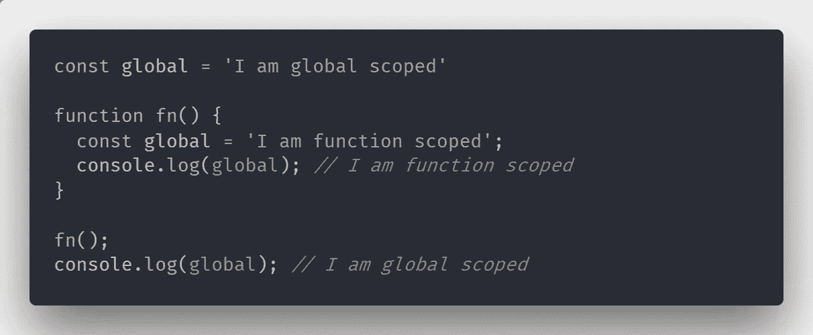
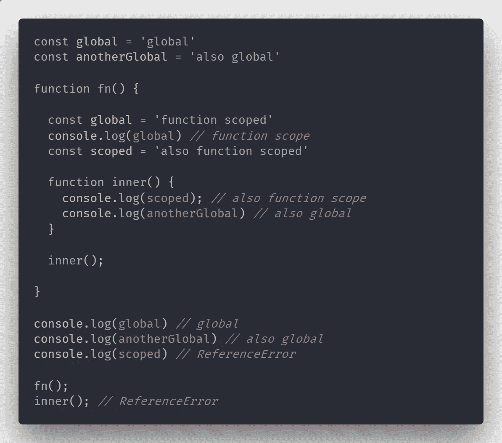
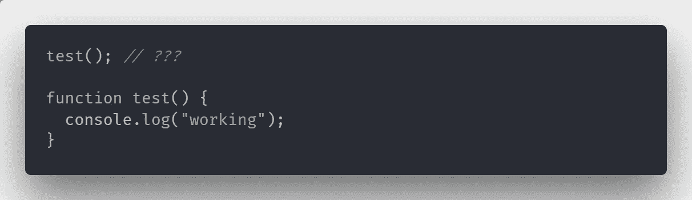
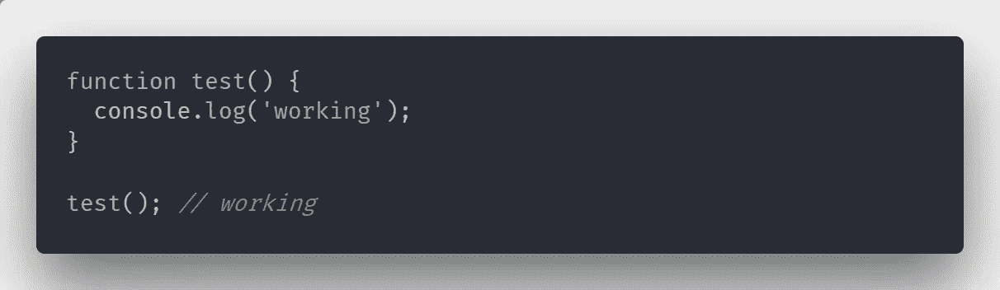
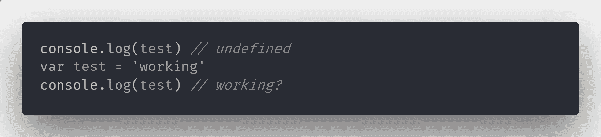
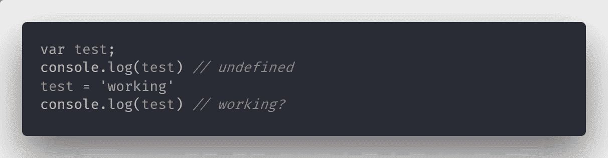
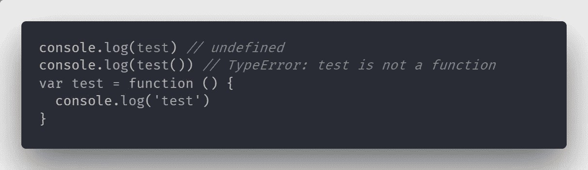
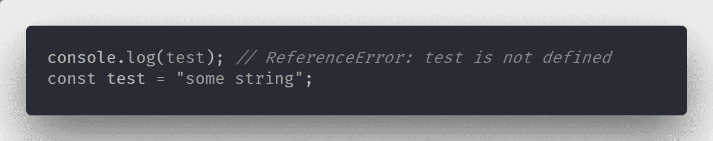

# 理解 JavaScript:范围

> 原文：<https://medium.com/hackernoon/understanding-javascript-scope-1d4a74adcdf5>

Photo by Scott Webb from Pexels

变量或函数的作用域是它可用的代码部分。对于大多数开发人员来说，使用变量和范围是很直观的。我们有一些心理模型来帮助我们理解什么时候某些事情是不可接受的。

> 范围是运行时代码不同部分中函数和变量的可见性

为了掌握 JavaScript 语言，我们必须在现有的心智模型的基础上构建，并深入细节。虽然我确信每个开发人员都可以在没有深入理解范围的情况下编写出优秀的代码，但是只有那些花时间阅读小字体的人才能避免所有的陷阱并回答最棘手的面试问题。

# 范围的类型

JavaScript 中有三种类型的作用域:

*   全局范围—可以在任何地方访问变量。
*   函数范围—变量可以在定义它们的函数的边界内访问。
*   块范围—可以在定义变量的块中访问变量。一个块由`{`和`}`分开。

正如你在例子中看到的，即使`global`变量在函数中被赋予了不同的值，它也只保留在同一个函数的边界中。在它之外，变量有一个不同的值——在全局范围内声明的值。我们也不会因为使用相同的变量名而出错。

这里我们可以看到，`inner()`函数可以访问其父函数`fn()`中声明的变量。每当我们需要一个函数中的变量时，引擎会首先在当前函数的范围内寻找它。那么它将在包含它的函数中上升一级。如果在那里找不到，它将继续上升，直到到达全局范围。如果没有找到变量，我们将得到一个`ReferenceError`。

# 未声明的变量

JavaScript 不会阻止你使用未声明的变量。这意味着您可以在任何时候为变量赋值，而无需使用`const`、`let`或`var`。当你这样做的时候，引擎会试图寻找一个全局范围内的变量。如果没有找到，它会为你创建一个全局变量。

根据经验，避免污染全局范围。如果一个变量是要全局使用的，那么就在全局范围内声明它，这样你的意图就很清楚了。否则，请将其保持在使用它的范围内。

# 提升

JavaScript 中函数和变量的提升是我们可以在实际声明之前使用它们的原因。

上面的代码将记录字符串`"working"`,即使函数在声明之前被调用。

对这种行为给出的常见解释是，函数和变量声明被拉到了它们作用域的顶部。所以当你试图访问它们的时候，它们已经被声明了。上面的例子实际上会变成:

变量也被提升，但方式不同。只有变量的声明被“拉到”顶部。赋值将保持不变。换句话说，我们不能像调用函数那样访问变量的值。

变量被提升到顶部后，上面的代码看起来是这样的:

这就是为什么我们在使用**函数表达式**时需要小心的原因。

同样，只有声明被放在顶部，而函数作为值的实际赋值将保持不变。所以当我们试图调用函数`test`时，我们会得到一个错误。

# 块范围

在 ES6 中，我们得到了两个新的变量声明关键字— `let`和`const`。它们和`let`的主要区别在于用 ES6 关键字声明的变量是块范围的。这意味着它们只在定义它们的代码块中可用。代码块由花括号分隔。

因为我们在讨论范围，所以重要的是要注意用`let`或`const`创建的变量不会被提升。这意味着它们的定义不会像用`var`声明的变量一样被拉到顶部。

确保您的代码没有引用错误的一个方法是确保您只使用`let`和`const`进行变量声明。

# 汇编

现在我们已经理解了提升的概念，我们将深入了解语言的内部，并理解它实际上是如何工作的。V8 引擎通过在执行代码之前将 JavaScript 编译成机器代码来提高性能。在编译过程中，引擎会多次运行我们的代码。在早期的一次运行中，它将声明所有的函数和变量。所以当代码被执行时，它们已经被定义了。

所以，提升实际上是一个心理图像，帮助我们说明为什么我们可以在定义函数和变量之前访问它们。提升的常见解释只是一个代码在执行前如何重组的画面。当引擎实际执行我们的代码时，我们的函数和变量声明根本就不存在了。它们已经在之前的运行中声明过了。

# 结论

范围的概念对于开发人员来说是直观的，但是为了精通一门语言，我们必须意识到它的特殊性。作为 JavaScript 开发人员，我们需要记住的是:

*   未声明的变量
*   块范围的变量
*   提升

 [## 理解 JavaScript:范围

### 由于数量惊人的库、工具和各种各样的东西使你的开发更容易，很多…

hackernoon.com](https://hackernoon.com/understanding-javascript-scope-1d4a74adcdf5)  [## 理解 JavaScript:原型和继承

### 由于数量惊人的库、工具和各种各样的东西使你的开发更容易，很多…

hackernoon.com](https://hackernoon.com/understanding-javascript-prototype-and-inheritance-d55a9a23bde2)  [## 理解 JavaScript:这个关键字

### 由于数量惊人的库、工具和各种各样的东西使你的开发更容易，很多…

hackernoon.com](https://hackernoon.com/understanding-javascript-the-this-keyword-4de325d77f68)  [## 理解 JavaScript:新关键字

### 由于数量惊人的库、工具和各种各样的东西使你的开发更容易，很多…

hackernoon.com](https://hackernoon.com/understanding-javascript-new-keyword-ec67c8caaa74)  [## 理解 JS:强制

### 由于数量惊人的库、工具和各种各样的东西使你的开发更容易，很多…

hackernoon.com](https://hackernoon.com/understanding-js-coercion-ff5684475bfc)  [## 理解 JS:事件循环

### 由于数量惊人的库、工具和各种各样的东西使你的开发更容易，很多…

hackernoon.com](https://hackernoon.com/understanding-js-the-event-loop-959beae3ac40)