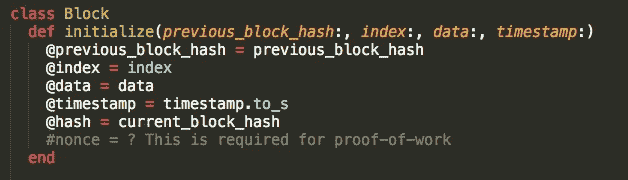
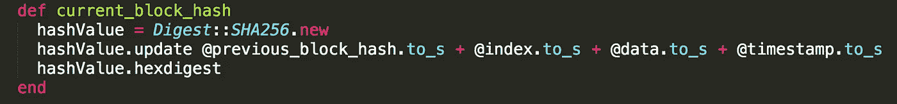

# 了解区块链

> 原文：<https://medium.com/hackernoon/understanding-the-blockchain-64891686738e>

大约两周前，为了更好地理解它，我从零开始建造了一辆[区块链](https://hackernoon.com/tagged/blockchain)。我这样做也是为了准备在 2017 年魔术学院研讨会上的一个题为[区块链革命](http://ma2017.mymagic.my/page/1307096/schedule)的演讲。几天前，我只是在现有的[比特币](https://hackernoon.com/tagged/bitcoin)区块链的基础上构建的。像“分布式”、“分类账”、“去中心化”、“加密哈希”、“工作证明”这样的术语只是在我脑海中唤起一些概念。当我构建自己版本的区块链时，这些变得更加清晰。当我意识到钱和合同现在是如何可编程的时，我也变得非常兴奋！我们所见证的公司通过首次公开募股筹集资金的当前趋势不亚于一场革命。新的生态系统正在萌芽，企业(甚至个人)能够发行自己的数字货币。你不需要成为一个主权国家来做到这一点。太神奇了！你现在可以选择把你的信任放在哪里，这是我非常感兴趣的话题。如果你不相信某种货币/代币，你可以订阅另一种…或另一种..或者甚至创造你自己的！

后退一步，让我们先来看看区块链是如何工作的。从基础上发展我们的理解将有助于我们理解由了不起的区块链开发商、高瞻远瞩的企业家和创新者描绘的更广阔的图景，他们正在建设金钱和合同的未来。

*快速提示:这是为任何想打破区块链行话并理解其运作方式的人准备的。无论您是技术人员还是业务人员，请继续阅读，包括代码片段。*

# **什么是区块链？**

> 使用哈希链接在一起的块(记录)列表，作为分布式、分散的数据库进行维护。

让我们先来看看什么构成了一个块:



Typical constituents of a block

区块链的每个区块包括:

`**previous_block_hash**` **:** 哈希是创建区块链的基础。它包括获取任意长度的字符串，运行算法(比特币使用 [SHA-256](https://en.wikipedia.org/wiki/SHA-2) )并给出固定长度的输出。稍后会有更多的介绍。

`**index**`:识别块的编号

`**data**` :这是*允许货币或合约可编程*的部分。它可以是一个[对象](https://en.wikipedia.org/wiki/Object-oriented_programming)，包含诸如“收件人”、“发件人”地址和“金额”(对于货币)或执行合同的细节/逻辑等信息。

`**timestamp**`:创建块时

`**current_block_hash**` **:** 正如我们将在下一节看到的，区块链的不变性由此而来。

`**nonce**` **:** 添加到块的散列中的字符串(任意)，用于建立工作证明(PoW)，这是竞争节点就接受谁的块作为增长的区块链中的下一个块达成协议所必需的。

# **哈希在区块链中的作用**



Hashing based on block’s constituents

哈希用于唯一标识块的内容。如上面的代码所示，使用 [SHA-256](https://en.wikipedia.org/wiki/SHA-2) 从以下所有内容生成块的散列:前一个块的散列、索引、数据和时间戳。

因此，会生成一个唯一的哈希来标识该块。如果上述任何一项发生更改，相应的哈希将会不同，因此可以知道块的内容已经更改。

此外，由于该块是更长的区块链的一部分，下一个块的`previous_block_hash`将不同，因此也将变得不一致。这反过来影响它后面的块，以此类推。

因此，散列*增强了该块以及之前的块的安全性*，一直到起源块(即第一块)。这种保护区块链的方法使得它实际上是不可改变的。假设区块链是分布式的(即，驻留在不同的节点/计算机上)，坏的行动者需要有足够的散列能力来更新几个块，并且还控制网络来传播他的区块链版本。正如下一节所分享的，当区块链被分散时，这变得更加困难。

在[代码库](https://github.com/pramodhrai/blockchaintutorial)中，当您运行`ruby blockchain_generator.rb`时，输出看起来像这样:

```
{"index":0,"data":"First block is genesis block","timestamp":"2017-10-06 11:48:48 +0800","previous_block_hash":"0","hash":"71474149f9785a5ab14df5196b6848a82c904132397750dfbd24a698fc4c801e"}{"index":1,"data":"I've been added, my index is 1","timestamp":"2017-10-06 11:48:48 +0800","previous_block_hash":"71474149f9785a5ab14df5196b6848a82c904132397750dfbd24a698fc4c801e","hash":"c6c429f3773cf7e5d3f9ca3a4b1b59b437fbff9cdcb2d260418464abd7ab423b"}{"index":2,"data":"I've been added, my index is 2","timestamp":"2017-10-06 11:48:48 +0800","previous_block_hash":"c6c429f3773cf7e5d3f9ca3a4b1b59b437fbff9cdcb2d260418464abd7ab423b","hash":"8bda54e3697cd4a849b6dd46041eb1c0b20fe33adc8269bd7a7897341dd5cffe"}
```

输出显示了如果由一个节点生成，区块链中的块将会是什么样子，从而形成一个集中的区块链。由于使用了分块散列机制，它在一定程度上是安全的，并且它的安全性随着区块链长度的增加而增加。将区块链存储在更多的节点上会使其**分布式，**通过拥有额外的副本来进一步增强其安全性。

由于区块链不变的分布式特性，分布式账本技术(DLT)改进了记录或共享数据的方式，以确保多方之间一致、防篡改的视图，任何一方都可以自由检查数据。通过以透明方式记录经过验证、加密和打上时间戳的交易的 DLT，一些行业可以大幅提高效率。

基于我们到目前为止所覆盖的内容，如果节点能够在不需要中央权威的情况下相互更新，区块链将会是分散的。

# **分散化**

如果一个节点更新所有其他节点，则区块链被*集中*。如果任一节点可以更新其他节点，则区块链*去中心化*。


Any node can update all nodes in a decentralised, distributed blockchain. Gif courtesy of [Sidekick Studio](http://sidekick.studio).

为了安全地做到这一点，需要一种在节点网络中达成共识的方法。

一种常见的方法是使用*工作证明(PoW)。*这是指一种算法，网络中的节点通过该算法实现分布式一致性。这就是需要使用`nonce`的地方。

如上所述，当创建新块时，所有内容都被散列。散列的输出需要满足预设的难度级别，例如，“要求散列中有两个尾随的 0”。

```
Example of a hash that **does not meet the difficulty level defined above, i.e. 'two trailing 0s':** "hash":"5b951c6cb2214dc2bac571b3d25afff21ea81ef2477655882e06c9270862539b"
```

在这种情况下，`nonce`充当一个任意的字符串或者一个计数器，可以对其进行调整，以使整体散列满足难度级别。


Only the nonce can be adjusted to change the output hash in attempts to meet a preset difficulty level

如果`current_block_hash`不满足难度等级，则`nonce`被调整，并且新的`hash`被计算。重复此过程，直到满足由难度设定的条件的`hash`被满足。

目前，在确定 PoW 时只有蛮力起作用，即调整`nonce`并重新计算 hash，直到满足难度级别。这就是为什么比特币的矿工会使用特殊用途的计算机来计算能量。一旦完成，就很容易验证这种能力。因此，确定正确 PoW 的第一个挖掘器通过网络传播该块。其他挖掘者验证正确性(通过他们自己的算法来检查)，接受有效的块并开始挖掘下一个块。

借助 PoW，无需中央可信机构即可达成共识。在比特币中，不需要银行、监管机构或中间人来验证区块(PoW 会这么做)，也不需要验证区块中交易的真实性(哈希可以实现)。

此外，我上面提到的坏演员在控制区块链时会有额外的挑战。他不仅需要更新几个块的散列，还需要在分散的分布式区块链中超过网络中的其他节点来接受他的块。这只有在坏人能够发起多数攻击(T2)的情况下才能实现，随着区块链在大型节点网络中的增长，这变得更加困难。

要了解实施细节，请深入研究中本聪撰写的比特币[白皮书](https://bitcoin.org/bitcoin.pdf)原文。或者看看安德烈亚斯·m·安东诺普洛斯的书《掌握比特币》。

# 有哪几种区块链？

区块链可以是公共的、私有的、许可的、无许可的、集中的、分散的。

所有这些都是可以根据网络要求设置的配置。在这一点上，政府和企业正在尝试以集中/分散的方式使用 DLT，以改善供应链中的商品跟踪，更好地结算交易，减少重复的保险索赔，改善跨境支付等。区块链的变体正在被实验。

# 接下来呢？

到目前为止，通过代码，我们已经了解了什么是块，如何使用散列以及它在区块链中的重要性。在一个块中，如何实现货币/令牌或合同也通过`data`变量简单显示。您还可以看到在分散的对等网络中如何不需要中间人。

这篇文章虽然简短，但却没有充分体现区块链技术的威力，这是有意为之的。这有助于将一些行话转换成有意义的术语，我们可以用这些术语来建立对我们周围发生的革命的理解。从这里开始，你可能想重新关注新闻或深入思考企业如何从使用分布式总账中获益。像你一样，我也将从这里开始，并随着时间的推移分享更多。

如果您想更深入地了解，我还在下面的参考资料部分整理了一个关于下一步该去哪里的资源列表。希望这篇教程对你有用！

# 参考资料/资源

源代码(用 Ruby 写的): [Github](https://github.com/pramodhrai/blockchaintutorial) 。
一切从 2008 年开始:[比特币白皮书](https://bitcoin.org/bitcoin.pdf)
更多关于比特币:[掌握比特币，编程开放区块链](https://www.amazon.com/Mastering-Bitcoin-Programming-Open-Blockchain/dp/1491954388)
下一个主要区块链自比特币:[以太坊白皮书](https://github.com/ethereum/wiki/wiki/White-Paper)
更多关于哈希:[区块极客](https://blockgeeks.com/guides/what-is-hashing/)
关于区块链的真相:来自 [HBR](https://hbr.org/2017/01/the-truth-about-blockchain)

[*Pramodh*](https://sg.linkedin.com/in/pramodh-rai-29605855) *是 LP at*[*Lunex Ventures*](https://lunex.vc/)*。连接上* [*推特*](https://twitter.com/JagoPramodh) *。*