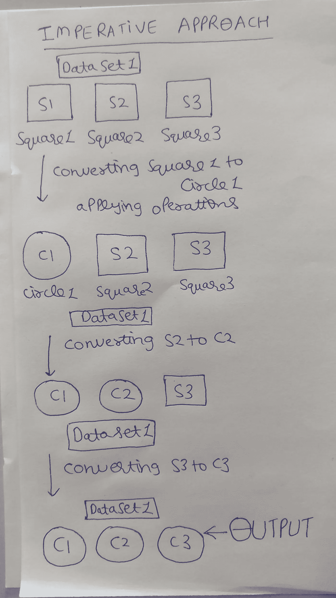
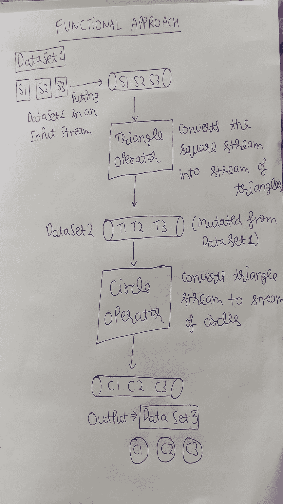
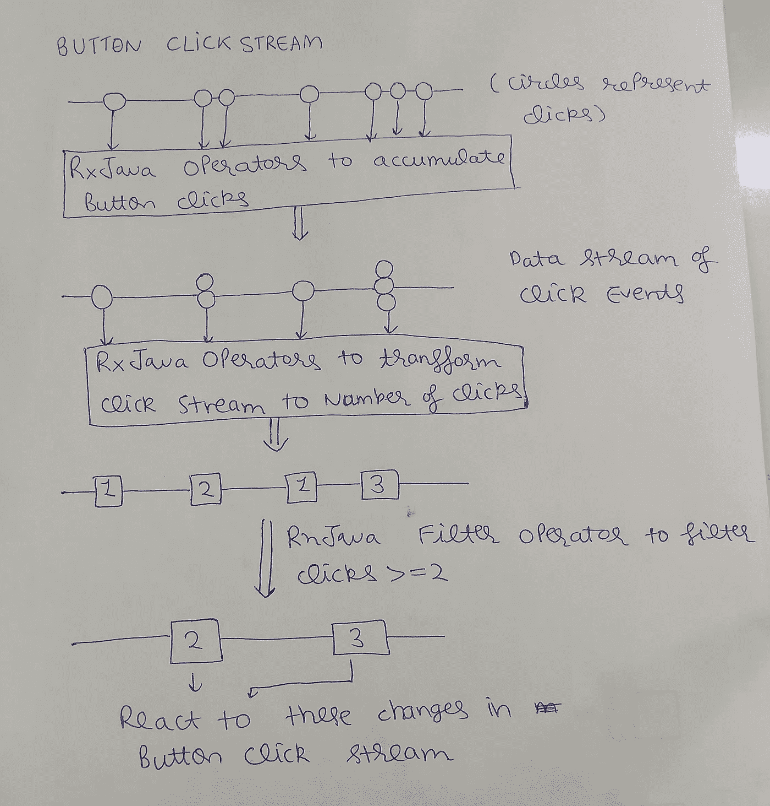

# 理解 RxJava 之谜(第 1 部分)

> 原文：<https://medium.com/hackernoon/understanding-the-enigma-of-rxjava-part-1-8e04a456d9de>

第一次听说 ***函数式反应式编程*** ( ***FRP*** )和 ***RxJava*** 的时候我想到的第一件事就是为什么？！为什么要从我舒适的命令式编程和 AsyncTask 世界中切换出来？当时答案并不明确，但经过最近的经历，我觉得有必要这样做。在这一部分，我会试着说服你，老实说我自己也有一点，去学习 *RxJava* ，然后我们会讨论我们试图使用 *RxJava* 实现什么(Psst…提示，这是一个范例)。在后面的部分中，我们将介绍 RxJava 的基础知识以及它在现实生活中基于 android 应用程序的实现。

# 为什么要用 RxJava？

如果你在问这个问题，那很好。我们开始吧！我开始了这个名为 [Pokify](https://github.com/GauravChaddha1996/Pokify) 的项目，它是基于神奇宝贝的。在那个项目中，我创建了一个简单的 SQLlite Helper 类，并将 Executor 服务用于线程化，将 AsyncTask 用于其他异步操作。管理所有这些是一件痛苦的事情，在无数次咒骂和修复我的愚蠢错误之后，我意识到我的线程和异步操作需要 *RxJava* 。甚至没有浪费一秒钟，我就把自己交给了 RxJava，因为这就是开发人员做的事情，当他们对自己手中的东西不满意时，他们会学习新的东西。

> 如果你也诅咒了 AsyncTask，那么是时候停止诅咒，开始前进了。

哦，我有足够的理由说服你继续前进！
下面是使用 *RxJava* 的一些 ***优点*** :

1.  ***避开*** [***回调地狱***](https://www.quora.com/What-is-callback-hell) ***。如果你曾经做过嵌套网络调用，你就知道我在说什么。这是一个非常常见的问题，也是一个可怕的问题，RxJava 很容易解决这个问题。***
2.  ***穿线轻松百倍。***
    再也不用担心更新视图和得到可怕的“~UI 线程崩溃”。
3.  使用 RxJava，异步操作变得更加容易。
    使用 AsyncTasks 你有一大套问题。代码不干净，测试它是一件痛苦的事，或者如果你试图在设备旋转时缓存一个 AsyncTask 的下载，那么祝你好运！此外，无论是活动生命周期的处理，还是多个网络调用，甚至是嵌套 AsyncTasks 的错误处理……我都可以继续下去，但我想您已经看到了问题所在，对吗？有了 RxJava，所有这些都可以很容易地解决。
4.  ***UI 和视图处理。***
    当用户在编辑视图中搜索某样东西时，是否曾发出网络呼叫？我们不想对每个' R '，' Rx '，' RxJa '或' Rxjava '进行网络调用。我们只想在用户停止输入至少 250 毫秒后这样做。如果你开始考虑命令式编码的解决方案，你会发现其中的缺陷，对吗？有了 RxJava，我们可以使用[去抖](http://reactivex.io/documentation/operators/debounce.html)操作符很容易地解决这个问题。
    其他视图处理工作，比如监听双击或三击，对于 RxJava 来说是小菜一碟。收听编辑视图文本更改要容易无限倍。想要为按钮点击创建多个监听器吗？没问题！使用 RxJava，您还可以利用许多其他很酷的优势来完成这一切。
5.  ***一种标准的错误处理机制。***
    有没有做过简单的天气 app？你必须首先获取位置，然后是天气。如果使用 AsyncTasks，它将有嵌套的任务和嵌套的错误处理机制，这不是很干净。使用 RxJava，您可以获得处理所有这些错误的标准方法。整洁，对不对？
6.  ***RxJava 有很多，字面意思，很多运算符供你使用。***
    你能想到的任何东西都很可能已经有了操作符。那也全都测试过了！
7.  使用 *FRP* 范型(范型的库是 RxJava ),您将能够轻松地添加或删除代码。如果你正确地遵循了 FRP，大多数时候你的结构会告诉你错误是从哪里来的，然后我们就可以消灭它！

我说服你了吗？很好。

现在让我告诉你真相。我们想用 ***RxJava*** 实现的想法，其实就是 ***函数式反应式编程(FRP)*** 。这是我们应该如何编写程序或项目的范例。事实上，它是像 OOPS paradigm 等许多其他范例中的一个。在 android 中轻松跟随它的方法是通过 RxJava，这是一个用于 Java 的 [Reactive](http://reactivex.io/) X 的扩展库，也可以在 Android 中用于 FRP 中的编程。FRP 范式在某些地方也可以不使用 RxJava 来实现，这将在 FRP 的分解中得到明确。

# 函数式反应式编程的崩溃

好了，现在你在我这边了，我们将分解*函数式反应式编程*来清楚地理解它的所有方面；它是什么，以及我们将如何使用 RxJava 在我们的项目中实现它。它由两部分组成: ***功能编程*** 和 ***反应编程*** 。

## 什么是函数式编程？

通常，我们大多数人都有一种命令式思维。我们把事物看作是集合了两种东西的对象:数据和作用于数据的函数。在 OOPS 范式中，数据可以被改变或变异。但是在 ***函数式编程*** 中，我们这样编写程序，以避免数据突变。相反，每当我们需要改变数据时，我们就创建一组新的数据。这有助于转换数据集的函数将始终返回相同的值，因为原始数据集永远不会发生变化。因此，这个函数很容易进行单元测试。

## 命令式方法和功能式方法的区别

好吧，我知道，我知道，你想要一个例子。假设你有一个通用的东西叫做图形。正方形、圆形、三角形都是图形。现在你有一个包含 3 个方块的盒子。你需要通过一些操作将它们全部转换成圆形。解决这个问题的必要方法是遍历列表，将每个项目从正方形转换成三角形，然后再一个一个地转换成圆形。



Imperative approach to problem: Given a data set( list) of 3 squares convert it to data set of circles using operators.

然而，功能方法的不同之处在于，我们将 3 个项目放在一个流中。然后我们把这一串正方形转换成一串三角形，再把这一串转换成一串圆形。



Functional approach to problem: Given a data set( list) of 3 squares convert it to data set of circles using operators.

这两种范式都取得了相同的结果，只是如何实现的问题。对于异步和其他一些操作，命令式方法有很多问题，这就是为什么我们要切换到函数式方法。

## 纯函数

*函数式编程*引入了一个非常酷的概念 ***纯函数。*** 这篇博客[帖子](http://blog.jenkster.com/2015/12/what-is-functional-programming.html)很好地解释了这一点。这是不使用 RxJava 的 FRP 的实现，非常强大。帖子的总结是这样的；
考虑功能:

```
function a()
{
    item = queue.getItem();
    process(item);
    print(item.name);
}
```

该函数有一个隐藏输入:“queue.getItem()”。之所以称之为隐藏，是因为只看函数签名无法确定函数是否需要它。这就是所谓的****侧因*** *。*同样，它打印的是商品名称。这也不能通过签名来预测，因此是一个被称为**副作用的隐藏输出。***

*正如你所想象的，副作用和副作用会导致大量的问题和错误，因为它们是隐藏的，所以不容易被跟踪。它们还会导致测试问题。*

*任何没有隐藏输入或输出的函数都称为纯函数。对于纯函数，查看函数签名，我们可以确定它的输入和输出是什么。示例:*

```
*function int add ( Integer a, Integer b) 
{
    c = a+b;
    return c;
}*
```

****函数式编程*** 是尽可能使用纯函数并去除副作用的编程。函数式语言是鼓励并提供简单方法来进行函数式编程的语言。*

## *何时使用功能方法？*

*我认为函数式编程更适合处理人的数据，而 OOPS 更适合处理人的数据。在 MVP 模式中，模型类应该使用 OOP 范例，而这些类中的函数应该使用函数方法。转换或管理类(像 MVP 中的 presenter 或 views)也应该使用纯函数来操作具有纯函数的模型对象。两全其美的好处！使用功能方法，我们可以获得上面列出的优势。*

## *什么是反应式编程？*

****反应式编程*** 是一种范式，它认为我们的代码应该对变化做出反应。在之后的[中给出了对反应式编程的很好的解释。这篇文章的一个很好的例子是:假设你点了一杯咖啡，在等待的时候，你的注意力转移了，你开始阅读一篇中型文章。现在，只要你点的菜上来，叫到你的名字，你就会对这种变化做出反应，你的注意力就会从文章转移到咖啡上。这是反应式编程。](https://edgecoders.com/how-to-explain-reactive-programming-to-a-5-year-old-e802c5385aee#.iqzs91ibd)*

## *什么是函数式反应式编程？*

*函数式和反应式编程的混合称为 ***函数式反应式编程。*** 在这种情况下，我们对项目进行编码，这样我们就可以使用功能范例对变化做出反应。理解 FRP 的一个很好的资源是 Andre Stalz 的《T4 要点》。为了理解 FRP，让我们用一个例子来看看函数式编程和反应式编程的混合:*

**

*Button click stream example for FRP*

*假设我们必须在一个按钮上听两次或更多次点击。我们可以在 marble 图中看到，首先是用户点击按钮的事件流。这个事件流是一个函数式编程数据集。首先，我们使用 RxJava 的操作符 buffer 来限制点击流。该运算符将合并/累加给定参数时间(250 毫秒)内的所有事件，并将它们作为一个事件相加。为了在 *FRP* 方面非常清楚，我们使用了来自 *RxJava* 的纯函数来获得一个新的数据集，该数据集与原始数据集有所不同。接下来，我们将这些点击事件作为点击次数映射到数据集。我们又有了一个新的变异数据集，它是使用 *RxJava* 的函数方法创建的。然后，我们过滤数据集，找出大于或等于 2 的项目。现在，我们使用反应范式对这些点击数据集做出反应。
为了总结这个例子，我们使用了 *RxJava* 的纯函数操作符来变异我们的按钮点击流(从点击流到累积流到点击流的数量，然后过滤它),然后我们对变异的按钮点击流做出反应。这个范例就是 *FRP* ，因为我们使用函数方法来做反应式编程。*

# *结论*

*我希望我已经说服你尝试在 ***函数式反应编程*** 中编码，并使用 ***RxJava*** 。在下一篇文章中，我将讨论 RxJava 的一些基础知识。如果你有任何疑问或者想纠正 noob 的做法，欢迎在下面评论。*

*如果你觉得这篇文章做了它的工作，点击下面的绿色小心脏按钮。*

*[](http://bit.ly/HackernoonFB)**[](https://goo.gl/k7XYbx)**[](https://goo.gl/4ofytp)*

> *[黑客中午](http://bit.ly/Hackernoon)是黑客如何开始他们的下午。我们是 [@AMI](http://bit.ly/atAMIatAMI) 家庭的一员。我们现在[接受投稿](http://bit.ly/hackernoonsubmission)并乐意[讨论广告&赞助](mailto:partners@amipublications.com)机会。*
> 
> *如果你喜欢这个故事，我们推荐你阅读我们的[最新科技故事](http://bit.ly/hackernoonlatestt)和[趋势科技故事](https://hackernoon.com/trending)。直到下一次，不要把世界的现实想当然！*

*[](https://goo.gl/Ahtev1)*