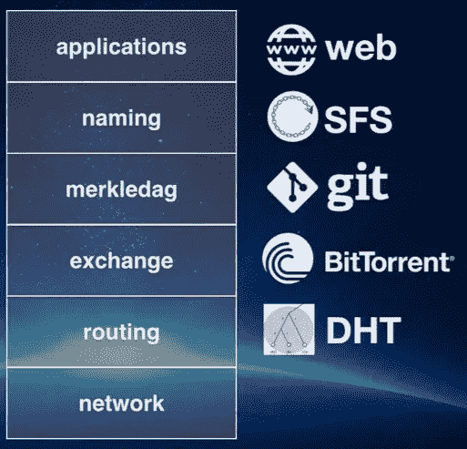

# 理解 IPFS 白皮书第一部分

> 原文：<https://medium.com/hackernoon/understanding-the-ipfs-white-paper-part-1-8ea5340b0a2e>


**本文为《区块链列车日志》第四部分，从这里开始阅读:** [**搭上区块链列车**](/@pors/catching-the-blockchain-train-9a0945aab958) **。**

# 哦不，一张白纸！

加密货币/区块链世界喜欢它的白皮书，IPFS 也不例外。它始于著名的[中本聪的《比特币:点对点电子现金系统](https://bitcoin.org/bitcoin.pdf)白皮书》(它转而引用了另一份你不想知道的白皮书)。当我们深入研究加密货币时，我们将在未来的帖子中查看比特币白皮书。

关于白皮书，您需要知道两件事:

1.  它们以 PDF 格式分发(因为比 HTML 更难改！)
2.  白皮书很难，很吓人，至少包含一个数学公式。

IPFS 白皮书在这里: [IPFS —内容寻址、版本控制、P2P 文件系统(草案 3)](https://ipfs.io/ipfs/QmR7GSQM93Cx5eAg6a6yRzNde1FQv7uL6X1o4k7zrJa3LX/ipfs.draft3.pdf) 。理所应当地，在 IPFS 举办。

要了解 IPFS 是如何工作的，最好一步一步地浏览这份白皮书。我将这篇文章限制在白皮书的第 2 章，看看底层技术:

*   分布式哈希表
*   阻止交换— BitTorrent
*   版本控制系统— Git
*   自我认证的文件系统— SFS

映射到 ISO 类堆栈上:



好了，我们开始吧！

# 分布式哈希表(DHT)

# 什么是 DHT？

DHT 类似于 Python dict 或 Perl hash(如果有密钥，可以检索值)，但是数据分布在多个节点上。维基百科文章[分布式哈希表](https://en.wikipedia.org/wiki/Distributed_hash_table)给出了很好的介绍。

在 IPFS 的例子中，密钥是内容的散列。因此，向 IPFS 节点请求散列为 qmc px 9 zqboyhw 8t 7 AFE 4 dbwfcjyocef 5 PE 4h 3u 7 ek 1 osnq 的内容，IPFS 节点将在 DHT 中查找哪些节点具有该内容。

对于现有的各种分布式哈希表实现，如何有效地找到特定值(快速，尽可能少的网络请求)以及如何管理分布式哈希表以便容易地吸收变化(进入/离开网络的节点，或者表中的新条目)是不同的。

一个这样的实现叫做 Pastry，我喜欢这两个视频，其中很好地解释了[路由](https://www.youtube.com/watch?v=WqQRQz_XYg4)(如何找到值)和[动态](https://www.youtube.com/watch?v=p8iugvHeGcg)(如何处理节点添加/删除)。

# 卡德姆利亚和朋友们

回到白皮书。明确提到了三个 DHT 实现，从 Kademlia 开始。卡迪莉娅有自己的[白皮书](https://pdos.csail.mit.edu/~petar/papers/maymounkov-kademlia-lncs.pdf)，但我们不要去那里…

Kademlia 是几乎所有流行的 P2P 系统中使用的 DHT 协议，维基百科上关于[kademlia](https://en.wikipedia.org/wiki/Kademlia)的文章是一个很好的介绍。

简而言之，Kedemlia 使用节点的 ID 一步一步地接近具有所需散列的节点(来自 Wikipedia 文章):

> *当搜索某个值时，算法需要知道相关的密钥，并分几个步骤探索网络。每一步都将查找更靠近该键的节点，直到所联系的节点返回值或不再找到更靠近的节点。这是非常有效的:像许多其他分布式哈希表一样，Kademlia 在搜索系统中总共 n 个节点的过程中只联系 O(log(n))个节点。*

细节可能会变得相当复杂，我不认为这会增加我们了解 IPFS 的目标，所以我们继续前进。如果你喜欢这类东西:这是一个很好的介绍，如果你想更深入地了解 Kademlia 白皮书的链接是^^^.

IPFS 提到了添加到标准 Kedemlia 中的另外两个 DHT 实现:

*   珊瑚 DSHT:这提高了查找性能，减少了资源的使用。
*   S/Kademlia:使 Kademlia 更能抵御恶意攻击。

# 实践中的 IPFS DHT

DHT 在 IPFS 用于路由，换句话说:

1.  向网络通告添加的数据
2.  并帮助定位任何节点请求的数据。

白皮书指出:

> *小值(等于或小于 1KB)直接存储在 DHT 上。对于更大的值，DHT 存储引用，这些引用是可以服务该块的对等节点的 NodeIds。*

所以让我们看看是否可以直接访问 DHT，添加和检索小数据块。

```
$ ipfs daemon # make sure this runs (and install/setup ipfs first)$ echo 'my tiny text' | ipfs add # add content to the node, smaller than 1KB QmfQKcXMLGvCxx6opNDwb1ptD1LJER6MPHdsMHCB1CXpFF $ ipfs cat QmfQKcXMLGvCxx6opNDwb1ptD1LJER6MPHdsMHCB1CXpFF # just check my tiny text $ ipfs dht get /ipfs/QmfQKcXMLGvCxx6opNDwb1ptD1LJER6MPHdsMHCB1CXpFF # returns not found
```

所以现在我们有了这个文本，我们想从 DHT 中访问它，但是显然，唯一支持的`ipfs dht get`请求是针对以`/ipns/`开头的键的。

好的，我们创建一个 IPNS，看看是否可以直接查询:

```
$ ipfs name publish QmfQKcXMLGvCxx6opNDwb1ptD1LJER6MPHdsMHCB1CXpFF # point a IPNS address to our content 
Published to QmYebHWdWStasXWZQiXuFacckKC33HTbicXPkdSi5Yfpz6: /ipfs/QmfQKcXMLGvCxx6opNDwb1ptD1LJER6MPHdsMHCB1CXpFF $ ipfs resolve QmYebHWdWStasXWZQiXuFacckKC33HTbicXPkdSi5Yfpz6 # check it 
# never returns, hmm IPNS doesn't seem to be ready for production $ ipfs dht get /ipns/QmYebHWdWStasXWZQiXuFacckKC33HTbicXPkdSi5Yfpz6 # same thing but directly 
# does return binary data starting with 4/ipfs/QmfQKcXMLGvCxx6opNDwb1ptD1LJER6MPHdsMHCB1CXpFF
```

这种方法确实有效，但目前看来仅限于 IPNS。

我们还能用 DHT 做什么？

使用 DHT 找出哪些节点可以提供一些数据:

```
$ ipfs dht findprovs QmfQKcXMLGvCxx6opNDwb1ptD1LJER6MPHdsMHCB1CXpFF QmYebHWdWStasXWZQiXuFacckKC33HTbicXPkdSi5Yfpz6 QmRf4ERGvYpVo6HRa2VueZT8pWi8YvyLS3rW6ad2y83tdN # ^^^ there are both my nodes, so that works 
# Now ask the DHT for the address of the first peer that was returned 
$ ipfs dht findpeer QmYebHWdWStasXWZQiXuFacckKC33HTbicXPkdSi5Yfpz6 /ip4/176.92.234.78/tcp/4001 /ip4/85.74.239.218/tcp/38689 /ip4/127.0.0.1/tcp/4001 /ip4/192.168.1.30/tcp/4001 /ip6/::1/tcp/4001 /ip4/192.168.1.3/tcp/4001 /ip4/176.92.234.78/tcp/40443 # Oooh nice! We will visit this address notation in the next episode.
```

总之，我们看到了一点 DHT 的运行，但不如我希望的直观和功能。

是时候进入 IPFS 应用的下一项激动人心的技术了:

# 比特流

# BitTorrent 是如何工作的？

我们都知道 BitTorrent，但我们中的一些人(是的，我也是)需要更深入地了解它。这个演示是一个很好的介绍:[费罗斯·阿巴克哈迪贾:WebTorrent — JSConf。亚洲 2014](https://www.youtube.com/watch?t=961&v=kxHRATfvnlw) 。演讲者谈到他如何实现了一个可以在浏览器中运行的 BitTorrent 客户端，这要感谢 WebRTC(这是一项很酷的技术，可能会在我们的项目中派上用场)。这也解释了 DHT 再次驱动它回家的工作原理。

更多阅读或观看内容:

*   [使用 BitTorrent 进行点对点联网](http://web.cs.ucla.edu/classes/cs217/05BitTorrent.pdf) (PDF)。如果你只读一篇文章，那就写这篇吧。
*   [点对点内容交付——BitTorrent](https://www.youtube.com/watch?v=nmgzOQf6NbQ)(视频)+ [幻灯片](https://courses.cs.washington.edu/courses/cse461/17wi/section-slides/9-p2p.pdf) (PDF)。
*   [BitTorrent 协议规范 v2](http://bittorrent.org/beps/bep_0052.html) (这个规范，不难读懂)。

# BitTorrent 和 IPFS

IPFS 的数据(块)交换受到 BitTorrent 的启发，但不是 100% BitTorrent。白皮书提到了 IPFS 使用的两个 BitTorrent 功能:

*   针锋相对的策略(不分享也不收)
*   首先获得稀有的部分(提高性能和更多，见上面的第一个 PDF)

一个显著的区别是，在 BitTorrent 中，每个文件都有一个单独的对等群(彼此形成一个 P2P 网络)，而 IPFS 是一个所有数据的大对等群。IPFS 的 BitTorrent 变种被称为 BitSwap，我将在下一集讲述它。

让我们试试看是否能看到一些蜂群的活动。

```
# Make sure you have the daemon running 
$ ipfs swarm peers /ip4/104.131.131.82/tcp/4001/ipfs/QmaCpDMGvV2BGHeYERUEnRQAwe3N8SzbUtfsmvsqQLuvuJ /ip4/104.236.151.122/tcp/4001/ipfs/QmSoLju6m7xTh3DuokvT3886QRYqxAzb1kShaanJgW36yx /ip4/128.199.219.111/tcp/4001/ipfs/QmSoLSafTMBsPKadTEgaXctDQVcqN88CNLHXMkTNwMKPnu /ip4/178.62.61.185/tcp/4001/ipfs/QmSoLMeWqB7YGVLJN3pNLQpmmEk35v6wYtsMGLzSr5QBU3
```

当您刚刚启动守护进程时，您会连接到几个“种子对等点”。过了一段时间，同龄人的数量迅速增长。

询问蜂群的另一个命令:

```
$ ipfs swarm addrs QmNRuQrwtGgeVQgndTny4A4Rukg7GR7vzDJrVJxUBfqevk (4)
    /ip4/127.0.0.1/tcp/4001 /ip4/172.31.41.39/tcp/4001
    /ip4/35.167.26.28/tcp/4001 /ip6/::1/tcp/4001 QmNSJohkvvBVmHeN7KUZnm4X84GA6Znbv6ZmvsTAjbw3AB (5)
    /ip4/10.0.1.8/tcp/4001 /ip4/127.0.0.1/tcp/4001
    /ip4/174.44.163.74/tcp/16012 /ip6/::1/tcp/4001 
    /ip6/fd15:462e:f8fd:695e:9161:27dd:7f78:d242/tcp/4001 QmNTJyhCYcbv5GdnqtdEwTfJCgY6pV4PJiNTtAmuoxnQak (3) 
    /ip4/127.0.0.1/tcp/4001 /ip4/94.176.232.68/tcp/4001 
    /ip6/::1/tcp/4001 QmNTZy7TfXvsHczwwV3EYbxRZN5gthgicG9GiroD7C4ZrP (4)
    /ip4/127.0.0.1/tcp/4001 /ip4/172.20.255.127/tcp/4001
    /ip4/54.229.227.53/tcp/4001 /ip6/::1/tcp/4001 
. 
. 
.
```

这些是节点知道的群中的地址，上面的散列是 peerId。

有了这些信息，您就可以像

```
$ ipfs swarm connect /ip4/114.91.202.180/tcp/34746/ipfs/QmfTgdg6GkqJtUrWAYo69GjcLrjQq9LjTjgW3KZ1ux1X6U 
connect QmfTgdg6GkqJtUrWAYo69GjcLrjQq9LjTjgW3KZ1ux1X6U success
```

稍后更多关于 BitSwap 的内容…

# 让我们休息一下

呸，那是一大堆理论和枯燥的材料，我们甚至还没有完成一半！因此，为了让所有人都沉浸其中并解放大脑，去公园散散步，听听这个播客:[加密货币的安静大师——Nick Szabo](https://tim.blog/2017/06/04/nick-szabo/)。它到处都是，但我发现它非常有趣。它从比特级别缩小到诸如“钱是什么？”。

强烈推荐听，当你听完后…

# 版本控制系统— Git

此处转载了白皮书中关于版本控制系统的全部内容:

> 版本控制系统提供了对随时间变化的文件进行建模并有效分发不同版本的工具。
> 
> *流行的版本控制系统 Git 提供了一个强大的 Merkle DAG 对象模型，它以一种分布式友好的方式捕获对文件系统树的更改。*
> 
> 1.不可变对象表示文件(blob)、目录(树)和更改(提交)。
> 
> 2.对象通过其内容的加密散列进行内容寻址。
> 
> 3.嵌入到其他对象的链接，形成一个 Merkle DAG。这提供了许多有用的完整性和工作流属性。
> 
> 4.大多数版本化元数据(分支、标签等。)只是简单的指针引用，因此创建和更新起来并不昂贵。
> 
> 5.版本更改仅更新引用或添加对象。
> 
> 6.将版本变更分发给其他用户只是简单地转移对象和更新远程引用。

让我们一步一步地理解这几行:

> *公元 1 年。不可变对象表示文件(blob)、目录(树)和更改(提交)。*

Git 只添加数据。所以 blobs、树和提交是不可变的。其中任何一个的最后版本是什么，由特殊的参考文献决定(见第 4 和 5 点)。

> *公元 2 年。对象通过其内容的加密散列进行内容寻址。*

在 git 中，引用文件或目录时不使用它们的名称。Git 用 SHA1 散列内容(或列表或提交),并在其数据库中使用这些散列。这篇文章非常深刻地解释了它是如何工作的: [Git under the hood](https://medium.freecodecamp.org/git-internals-for-curious-developers-a1e44e7ecafe) (从“现在让我们看看 Git 是如何做到这一切的”开始阅读)

> *公元 3 年。嵌入到其他对象的链接，形成一个 Merkle DAG。这提供了许多有用的完整性和工作流属性。*

哦，天啊，一条默克尔狗！别担心，它实际上没有听起来那么可怕。

[Merkle 树](https://en.wikipedia.org/wiki/Merkle_tree)是一个二叉树，其中父树包含两个子树的散列连接的散列。这解释了完整性属性:数据块中的任何变化都会导致根节点的变化。只要有一点点元数据(叔叔和父母，可以是不可信的)和一个可信的根节点，我们就可以验证块的有效性。

现在，一条默克狗和一棵默克树是不同的。这里解释了两者的区别:[默克尔图](https://bmcorser.github.io/2014/12/22/merkle-dag.html)和 [JRFC 20 —默克尔图](https://github.com/jbenet/random-ideas/issues/20)

简而言之:Merkle DAG 更通用，因为它不是二叉树而是图，任何节点都可以包含数据，而不仅仅是 Merkle 树中的叶节点。

这仍然是有点模糊，但我会再次解决它时，我们看看 IPFS 默克尔达格。

> *公元 4 年。和 5 大部分版本化元数据(分支、标签等。)只是简单的指针引用，因此创建和更新起来并不昂贵。版本更改仅更新引用或添加对象。*

这里是可视化的:[计算机科学家 Git](http://eagain.net/articles/git-for-computer-scientists/)其中分支、头部和标签只是对提交的引用。

> *公元 6 年。将版本变更分发给其他用户只是简单地转移对象和更新远程引用。*

这里说什么，我觉得不用解释:)

# 自我认证的文件系统— SFS

这用于实现 IPFS 的 IPNS 名字系统。它允许我们为远程文件系统生成一个地址，用户可以在其中验证地址的有效性。

来自白皮书:

> *SFS 引入了一种构建自认证文件系统的技术:使用下面的方案寻址远程文件系统*

```
*/sfs/<Location>:<HostID>*
```

> *其中位置是服务器网络地址，并且:*

```
HostID = hash(public_key || Location)
```

> *因此，SFS 文件系统的名称证明了它的服务器。*

我认为这是不言自明的，我们将在下一集看到它的实际应用:[了解 IPFS 白皮书第二部分](/@pors/understanding-the-ipfs-white-paper-part-2-df40511addbd)

给我发微博告诉我你对这篇文章的看法 [@pors](https://twitter.com/pors) ！

*最初发表于*[*decentralized . blog*](http://decentralized.blog/understanding-the-ipfs-white-paper-part-1.html)*。*