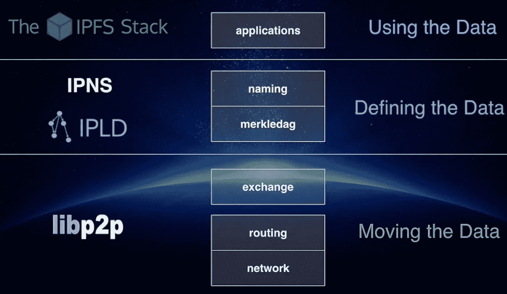
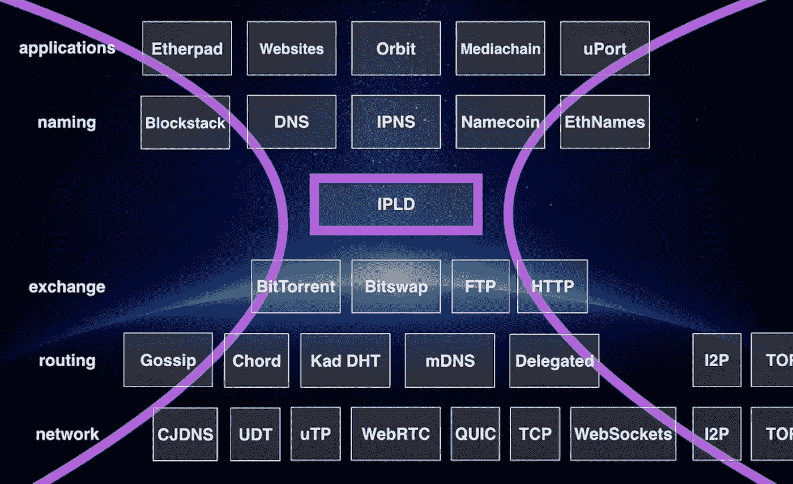

# 了解 IPFS 白皮书第二部分

> 原文：<https://medium.com/hackernoon/understanding-the-ipfs-white-paper-part-2-df40511addbd>

**本文是《区块链列车日志》的第 5 部分，从这里开始阅读:** [**搭上区块链列车**](https://hackernoon.com/catching-the-blockchain-train-9a0945aab958) **。**

# IPFS 白皮书:IPFS 设计

IPFS 堆栈如下所示:



或者更详细地说:



*我从胡安·贝内(IPFS 的 BDFL)的演讲中借用了两张图片。*

白皮书中的 IPFS 设计或多或少会自下而上地经过这些层:

> IPFS 协议分为一系列负责不同功能的子协议:
> 
> 1.身份—管理节点身份生成和验证。
> 
> 2.网络—管理与其他对等方的连接，使用各种底层网络协议。可配置。
> 
> 3.路由—维护信息以定位特定的对等点和对象。响应本地和远程查询。默认为 DHT，但可交换。
> 
> 4.交换—一种新颖的块交换协议(位交换),用于管理高效的块分发。作为市场模型，对数据复制的激励较弱。交易策略可交换。
> 
> 5.对象——带有链接的内容寻址的不可变对象的 Merkle DAG。用于表示任意数据结构，例如文件层次结构和通信系统。
> 
> 6.文件——受 Git 启发的版本化文件系统层次结构。
> 
> 7.命名——一个自我证明的可变名称系统。

以下是我对这些子协议的另一种命名:

1.  身份:命名这些节点
2.  网络:与其他客户端交谈
3.  路由:发布和查找内容
4.  交换:给予和索取
5.  对象:组织数据
6.  档案:呃？
7.  命名:添加可变性

让我们仔细阅读它们，看看我们能否增加对 IPFS 的了解。

# 身份:命名这些节点

IPFS 是一个 P2P 客户网络；没有中央服务器。这些客户端是网络的节点，需要一种方法来被其他节点识别。如果您只是将节点编号为 1、2、3……任何人都可以添加一个具有现有 ID 的节点，并声称自己是该节点。为了防止这种情况，需要一些加密技术。IPFS 是这样做的:

*   生成一个 [PKI](https://en.wikipedia.org/wiki/Public_key_infrastructure) 密钥对(公钥+私钥)
*   散列公钥
*   产生的散列是 NodeId

所有这些都是在节点的`init`阶段完成的:`ipfs init` >产生的键存储在`~/.ipfs/config`中并返回 NodeId。

当两个节点开始通信时，会发生以下情况:

*   交换公钥
*   检查是否:`hash(other.PublicKey) == other.NodeId`
*   如果是，我们已经识别了另一个节点，并且可以例如请求数据对象
*   如果没有，我们从“假”节点断开连接

实际的散列算法在白皮书中没有规定，请在此处阅读相关说明:

> IPFS 更喜欢自我描述的价值观，而不是将系统锁定在一组特定的功能选择上。哈希摘要值以 multihash 格式存储，该格式包括一个指定所用哈希函数的短标头，以及以字节为单位的摘要长度。
> 
> 示例:
> 
> 这允许系统(a)为用例选择最佳功能(例如，更强的安全性与更快的性能)，以及(b)随着功能选择的改变而发展。自描述值允许兼容地使用不同的参数选择。

这些多重散列是自描述散列的整个家族的一部分，它非常棒，来看看:[多重格式](https://github.com/multiformats/multiformats)。

# 网络:与其他客户端交谈

总结如下:IPFS 可以在任何网络上工作(见上图)。

这里有趣的是连接到对等体的网络寻址。IPFS 使用[多地址](https://github.com/multiformats/multiaddr)格式。您可以在启动节点时看到它的运行:

> 群组监听/ip4/127.0.0.1/tcp/4001
> 
> 群组监听/ip4/172.17.0.1/tcp/4001
> 
> 群组监听/ip4/185.24.123.123/tcp/4001
> 
> 群组监听/ip6/2a 02:1234:9:0:21a:4 aff:fed 4:da32/TCP/4001
> 
> /ip6/::1/tcp/4001 上的群组监听
> 
> API 服务器侦听/ip4/127.0.0.1/tcp/5001
> 
> 网关(只读)服务器侦听/ip4/0.0.0.0/tcp/8080

# 路由:发布和查找内容

如[上一集](http://decentralized.blog/understanding-the-ipfs-white-paper-part-1.html)所述，路由层基于分布式哈希表，其目的是:

*   宣布这个节点有一些数据(在下一章讨论的一个`block`),或者
*   找到哪些节点有一些特定的数据(通过参考块的 multihash)，以及
*   如果数据足够小(=< 1KB)，DHT 将数据存储为其值。

命令行接口和 API 没有公开白皮书中指定的完整路由接口。什么有效:

```
# tell the DHT we have this specific content:
$ ipfs dht provide QmYwAPJzv5CZsnA625s3Xf2nemtYgPpHdWEz79ojWnPbdG# ask for peers who have the content:
$ ipfs dht findprovs QmYwAPJzv5CZsnA625s3Xf2nemtYgPpHdWEz79ojWnPbdG
QmYebHWdWStasXWZQiXuFacckKC33HTbicXPkdSi5Yfpz6
QmczCvhy6unZEVC5ukR3BC3BPxYie4jBeRApTUKq97ZnEo
QmPM3WzZ3q1SR3pzXuGPHD7e6z3eWEWCnAvrNw7Wegyc8o
QmPKSqtkDmYsSxQbqNkZG1AmVnZSFyv5WF7fFE2YebNBFG
QmPMJ3HLLLBtW53R2YixhVHmVb3pkR2bHni3qbqq23vBSv
QmPNHJJphV1TB6Z99L6r9Y7bKaCBUQ67X17hicnEmsgWDJ
QmPNhiqGg81o2Perk2i7VNvvVuuLLUMKDxMNwVauP8r5Yv
QmPQJRgP3Vxi52Ho7HfnYdiCRJTRM1TXwgEnyjcwcLuKfb
QmNNxr1ZoyPbwNe2CvYz1CVyvSNWsE8WNwDWQ9t9BDjnj5
QmNT744VjtRFpDYB25EVLx7ha1zAVDKsd3qFjxfQLjPEXq
QmNWwGRWTYeut6qvKDhJBuEJZnbqMPMfuF81MPvHvPBX89
QmNZM5NmzZNPkvH2kPXDYNAB1cAeBNfxLyM9B1crgt3VeJ
QmNZRDzSJybdf4rmt972SH4U9TF6sEK8q2NSEJpEt7SkTp
QmNZdBUV9QXytVcPjcYM8i9AG22G2qwjZmh4ZwpJs9KvXi
QmNbSJ9okrwMphfjudiXVeE7QWkJiEe4JHHiKT8L4Pv7z5
QmNdqMkVqLTsJWj7Ja3oKwLNWcAYUkRjSZPg22B7rvKFMr
QmNfyHTzAetJGBFTRkXXHe5om13Qj4LLjd9SDwJ87T6vCK
QmNmrRTP5sJMUkobujpVXzzjpLACBTzf9weND6prUjdstW
QmNkGG9EZrq699KnjbENARLUg3HwRBC7nkojnmYY8joBXL
QmP6CHbxjvu5dxdJLGNmDZATdu3TizkRZ6cD9TUQsn4oxY# Get all multiaddr's for a peer
$ ipfs dht findpeer QmYebHWdWStasXWZQiXuFacckKC33HTbicXPkdSi5Yfpz6
/ip4/192.168.1.14/tcp/4001
/ip6/::1/tcp/4001
/ip4/127.0.0.1/tcp/4001
/ip4/1.2.3.4/tcp/37665
```

`ipfs put`和`ipfs get`只对 API 中的 ipns 记录有效。也许在 DHT 上存储小数据本身还没有实现？

# 交换:给予和索取

数据被分解成`blocks`，交换层负责分配这些块。它看起来像 BitTorrent，但它是不同的，所以该协议保证它自己的名字:BitSwap。

主要区别在于，BitTorrent 块与寻找相同文件的块的对等体进行交易(torrent swarm)，而 BitSwap 块是跨文件交易的。所以一大群 IPFS 数据。

BitSwap 被建模为一个激励数据复制的市场。这种实现方式被称为比特交换策略，白皮书描述了一种可行的策略，并指出该策略可以被另一种策略取代。一个这样的物物交换系统可以基于虚拟货币，这就是 FileCoin 的用武之地。

当然，每个节点可以决定自己的策略，因此通常使用的策略必须能够抵抗滥用。当大多数节点被设置为具有某种公平的物物交换方式时，它将像这样工作:

*   当对等体连接时，它们交换它们拥有哪些块(`have_list`)以及它们正在寻找哪些块(`want_list`)
*   为了决定一个节点是否将真正共享数据，它将应用它的`BitSwap Strategy`
*   该策略基于这两个对等体之间先前的数据交换
*   当对等体交换块时，它们会跟踪它们共享的数据量(建立信用)和它们接收的数据量(建立债务)
*   在`BitSwap Ledger`中跟踪两个对等体之间的记账
*   如果一个对等体有信用(共享的多于接收的)，我们的节点将发送请求的块
*   如果一个节点有债务，我们的节点将共享或不共享，这取决于一个确定性函数，债务越大，共享的机会就越小
*   数据交换总是从分类帐的交换开始，如果分类帐不同，我们的节点就会断开连接

我认为这是一个很酷的项目:博弈论在实践中！白皮书进一步描述了一些边缘情况，如如果我没有积木可以交换怎么办？答案很简单，收集你的同行正在寻找的区块，这样你就有东西可以交易了。

现在，让我们来看看如何探究比特交换协议的内部结构。

命令行界面有一段`blocks`和一段`bitswap`；那些听起来相关的:)

为了查看 bitswap 的运行情况，我将请求一个大文件`Qmdsrpg2oXZTWGjat98VgpFQb5u1Vdw5Gun2rgQ2Xhxa2t`，它是一个视频(下载它来查看什么视频！):

```
# ask for the file
$ ipfs get Qmdsrpg2oXZTWGjat98VgpFQb5u1Vdw5Gun2rgQ2Xhxa2t# in a seperate terminal, after requesting the file, I inspect the "bitswap wantlist"
$ ipfs bitswap wantlist
QmYEqofNsPNQEa7yNx93KgDycmrzbFkr5oc3NMKXMxx5ff
QmUmDEBm9a8MYyqRdb3YQnoqPmqAo4cEWdKQErirFJdSWD
QmY5VJPbsRZzFCTMrFBx2qtZiyyeLhsjBysyfC1fx2gE9S
QmdbzYgyhqUNCNL8xU2HTSKwao1ck2Gmi5U1ygjQuJd92b
QmbZDe5Dcv9mJr8fiqp5aJL2cbyu64tgzwCS2Vy4P3krCL
QmRjzMzVeYRE5b6tDF3sTXMV1sTffno92uL3WwuFavBrWQ
QmPavzEJQw8atvErXQis6C6GF7DRFbb95doAaFkHe9M38u
QmY9fs1Pkr3nV7RkbGdfGh3q8HuKtMMCCUp22AAbwPYnrS
QmUtxZkuJuyydd124Z2cfx6jXMAMpcXZRF96QMAsXc2y6c
QmbYDTJkmLqMm6ojdL6pLP7C8mMVfVPnUxn3yp8HzXDcXf
QmbW9MZ7cwn8svpixosAuC7GQmUXDTZRuxJ8dJp6HyJzCS
QmdCLGWsYQFhi9y3BmkhUreX2S799iWGyJqvnbK9dzB55c
Qmc7EvnBPf2mPCUCfvjcsaQGLEakBbUN9iycnyrLF3b2or
Qmd1mNnDQPf1BAjFqDHjiLe4g4ZFPAheQCniYkbQPosjDE
QmPip8XzQhJFd487WWw7D8aBuGLwXtohciPtUDSnxpvMFR
QmZn5NAPEDtptMb3ybaMEdcVaoxWHs7rKQ4H5UBcyHiqTZ
.
.
.# find a node where we have debt
$ ipfs dht findprovs Qmdsrpg2oXZTWGjat98VgpFQb5u1Vdw5Gun2rgQ2Xhxa2t
QmSoLMeWqB7YGVLJN3pNLQpmmEk35v6wYtsMGLzSr5QBU3
QmSoLnSGccFuZQJzRadHn95W2CrSFmZuTdDWP8HXaHca9z
QmUh2KnjAvgEbJFSd5JZws4CNvt6LbC4C1sRpBgCbZQiqD
Qmc9pBLfKSwWboKHMvmKx1P7Z738CojuUXkPA1dsPrvSw2
QmZFhGyS2W833nKKkbqZAU2uSvBbWUytDJkKBHimwRmhd6
QmZMxNdpMkewiVZLMRxaNxUeZpDUb34pWjZ1kZvsd16Zic
Qmbut9Ywz9YEDrz8ySBSgWyJk41Uvm2QJPhwDJzJyGFsD6# try one to see if we have downloaded from that node
$ ipfs bitswap ledger QmSoLMeWqB7YGVLJN3pNLQpmmEk35v6wYtsMGLzSr5QBU3
Ledger for <peer.ID SoLMeW>
Debt ratio: 0.000000
Exchanges:  11
Bytes sent: 0
Bytes received: 2883738
```

谢谢`QmSoLMeWqB7YGVLJN3pNLQpmmEk35v6wYtsMGLzSr5QBU3`；你是一个多么慷慨的同伴啊！

现在，看看`block`命令:

```
# Let's pick a block from the wantlist above
$ ipfs block stat QmYEqofNsPNQEa7yNx93KgDycmrzbFkr5oc3NMKXMxx5ff
Key: QmYEqofNsPNQEa7yNx93KgDycmrzbFkr5oc3NMKXMxx5ff
Size: 262158$ ipfs block get QmYEqofNsPNQEa7yNx93KgDycmrzbFkr5oc3NMKXMxx5ff > slice_of_a_movie
# results in a binary file of 262 KB
```

我们将在下一章再看看块是如何适应的。

到目前为止我们描述的栈的三层(网络、路由、交换)都是在 [libp2p](https://libp2p.io/) 中实现的。

让我们沿着烟囱爬上 IPFS 的核心…

# 对象:组织数据

现在变得有趣了。您可以将 IPFS 总结为:分布式的、经过认证的、散列链接的数据结构。这些散列链接的数据结构就是 Merkle DAG 的用武之地(还记得我们上一集吗？).

为了创建任何数据结构，IPFS 提供了一个灵活而强大的解决方案:

*   在图中组织数据，我们称图的节点为`objects`
*   这些对象可以包含数据(任何种类的数据，对 IPFS 透明)和/或到其他对象的链接
*   这些链接——`Merkle Links`——仅仅是目标对象的加密散列

这种组织数据的方式有几个有用的特性(引用自白皮书):

> 1.内容寻址:所有内容都由它的多重哈希校验和唯一标识，包括链接。
> 
> 2.防篡改:所有内容都用其校验和进行验证。如果数据被篡改或损坏，IPFS 会检测出来。
> 
> 3.重复数据删除:保存完全相同内容的所有对象都是平等的，并且只存储一次。这对于索引对象特别有用，比如 git 树和提交，或者数据的公共部分。

为了感受一下 IPFS 的物体，看看这个[物体可视化](https://ipfs.io/ipfs/QmNZiPk974vDsPmQii3YbrMKfi12KTSNM7XMiYyiea4VYZ/example#/ipfs/QmP8WUPq2braGQ8iZjJ6w9di6mzgoTWyRLayrMRjjDoyGr/graphmd/README.md)的例子。

另一个漂亮的特性是使用 unix 风格的路径，Merkle DAG 的结构如下:

`/ipfs/<hash-of-object>/<named-path-to-object`

我们将在下面看到一个例子。

这真的是全部了。让我们通过回放[快速入门](https://gateway.ipfs.io/ipfs/QmYwAPJzv5CZsnA625s3Xf2nemtYgPpHdWEz79ojWnPbdG/quick-start)中的一些例子来看看它的实际应用:

```
$ mkdir foo
$ mkdir foo/bar
$ echo "baz" > foo/baz
$ echo "baz" > foo/bar/baz
$ tree foo/
foo/
├── bar
│   └── baz
└── baz
$ ipfs add -r foo
added QmWLdkp93sNxGRjnFHPaYg8tCQ35NBY3XPn6KiETd3Z4WR foo/bar/baz
added QmWLdkp93sNxGRjnFHPaYg8tCQ35NBY3XPn6KiETd3Z4WR foo/baz
added QmeBpzHngbHes9hoPjfDCmpNHGztkmZFRX4Yp9ftKcXZDN foo/bar
added QmdcYvbv8FSBfbq1VVSfbjLokVaBYRLKHShpnXu3crd3Gm foo# the last hash is the root-node, we can access objects through their path starting at the root, like:
$ ipfs cat /ipfs/QmdcYvbv8FSBfbq1VVSfbjLokVaBYRLKHShpnXu3crd3Gm/bar/baz
baz# To inspect an object identified by a hash, we do
$ ipfs object get /ipfs/QmdcYvbv8FSBfbq1VVSfbjLokVaBYRLKHShpnXu3crd3Gm
{  
  "Links":[  
    {  
      "Name":"bar",
      "Hash":"QmeBpzHngbHes9hoPjfDCmpNHGztkmZFRX4Yp9ftKcXZDN",
      "Size":61
    },
    {  
      "Name":"baz",
      "Hash":"QmWLdkp93sNxGRjnFHPaYg8tCQ35NBY3XPn6KiETd3Z4WR",
      "Size":12
    }
  ],
  "Data":"\u0008\u0001"
}# The above object has no data (except the mysterious \u0008\u0001) and two links# If you're just interested in the links, use "refs":
$ ipfs refs QmdcYvbv8FSBfbq1VVSfbjLokVaBYRLKHShpnXu3crd3Gm
QmeBpzHngbHes9hoPjfDCmpNHGztkmZFRX4Yp9ftKcXZDN
QmWLdkp93sNxGRjnFHPaYg8tCQ35NBY3XPn6KiETd3Z4WR# Now a leaf object without links
$ ipfs object get /ipfs/QmdcYvbv8FSBfbq1VVSfbjLokVaBYRLKHShpnXu3crd3Gm/bar/baz
{  
  "Links":[    ],
  "Data":"\u0008\u0002\u0012\u0004baz\n\u0018\u0004"
}# The string 'baz' is somewhere in there :)
```

数据字段中显示的 Unicode 字符是数据序列化的结果。我认为 IPFS 使用了 [protobuf](https://github.com/google/protobuf) 。如果我说错了请纠正我:)

在我写这篇文章的时候，有一个实验性的`ipfs object`命令的替代品:`ipfs dag`:

```
$ ipfs dag get QmdcYvbv8FSBfbq1VVSfbjLokVaBYRLKHShpnXu3crd3Gm
{  
  "data":"CAE=",
  "links":[  
    {  
      "Cid":{  
        "/":"QmeBpzHngbHes9hoPjfDCmpNHGztkmZFRX4Yp9ftKcXZDN"
      },
      "Name":"bar",
      "Size":61
    },
    {  
      "Cid":{  
        "/":"QmWLdkp93sNxGRjnFHPaYg8tCQ35NBY3XPn6KiETd3Z4WR"
      },
      "Name":"baz",
      "Size":12
    }
  ]
}$ ipfs dag get /ipfs/QmdcYvbv8FSBfbq1VVSfbjLokVaBYRLKHShpnXu3crd3Gm/bar/baz
{  
  "data":"CAISBGJhegoYBA==",
  "links":[    ]
}
```

我们看到了一些不同之处，但我们不要深入探讨。两种输出都遵循白皮书中的 IPFS 对象格式。一个有趣的部分是出现的“Cid ”;这是指较新的[内容标识符](https://github.com/ipld/cid)。

提到的另一个特性是`pin`对象的可能性，这导致这些对象存储在本地节点的文件系统中。ipfs 的当前 go 实现将其存储在`~/.ipfs/datastore`目录下的 [leveldb](https://github.com/google/leveldb) 数据库中。我们已经在之前的帖子中看到了 pinning 的作用。

本章的最后一部分提到了对象级加密的可用性。这个还没有实现:`status wip`(工作进行中；我也必须查找它)。项目页面在这里: [ipfs 密钥库提案](https://github.com/ipfs/specs/tree/master/keystore)。

`ipfs dag`命令暗示了一些新的东西...

# 中场休息:IPLD

如果你仔细研究了这篇文章开头的图片，你可能会想，什么是 IPLD，它是如何融入其中的？根据白皮书，它不适合，因为它根本没有提到！

我的猜测是，IPLD 没有被提及，因为它是后来才被介绍的，但它或多或少地映射到论文中的对象一章。IPLD 比白皮书规定的范围更广，更全面。嘿，胡安，更新白皮书吧！:-)

如果你不想等待更新的白皮书，看看这里:IPLD 网站[(行星间关联数据)](https://ipld.io/)、 [IPLD 规范](https://github.com/ipld/specs/tree/master/ipld)和 [IPLD 实施](https://github.com/ipld/ipld#implementations)。

而这个视频就是一个极好的介绍:[胡安·贝内:进入默克森林](https://www.youtube.com/watch?v=Bqs_LzBjQyk)。

但是如果你不想多读/看:IPLD 和这里的“对象”和“文件”章节描述的差不多。

进入白皮书的下一章…

# 档案:呃？

在 Merkle DAG 对象之上，IPFS 定义了一个具有版本控制的类似 Git 的文件系统，包含以下元素:

*   `blob`:在 IPFS，blobs 中只有数据，它代表一个文件的概念。blobs 中没有链接
*   `list`:列表也是一个 IPFS 文件的表示，但是由多个 blobs 和/或列表组成
*   `tree`:blob、列表和/或树的集合:充当目录
*   `commit`:树中历史的快照(就像 git 提交一样)。

现在我听到你在想:这些斑点、列表和树不就是我们在 Mergle DAG 看到的东西吗？我们在那里有带数据的对象，有或没有链接，以及漂亮的类似 Unix 的文件路径。

我听到你这样想，因为当我读到这一章时，我也是这样想的。搜索了一会儿后，我开始觉得这一层被抛弃了，IPLD 在“对象”层停止了，在这一层之上的一切都是开放的，无论是什么实现。如果一位专家正在阅读这篇文章，并认为我完全错了:请告诉我，我会用新的见解来纠正它。

那么，`commit`文件类型呢？白皮书的标题是“IPFS -内容寻址、版本化、P2P 文件系统”，但是版本化还没有实现[好像是](https://github.com/ipfs/notes/issues/23)。

关于版本控制[这里](https://gist.github.com/flyingzumwalt/a6821e843366d606aeb1ba53525b8669)和[这里](https://github.com/oduwsdl/ipwb/issues/61)有一些头脑风暴正在进行。

这就剩下一层了…

# 命名:添加可变性

由于 IPFS 中的链接是内容可寻址的(内容上的加密哈希表示内容的块或对象)，数据根据定义是不可变的。它只能被内容的另一个版本替换，因此它获得了一个新的“地址”。

解决方案是创建不可变内容的“标签”或“指针”(就像 git 分支和标签一样)。这些标签可用于表示对象(或对象图)的最新版本。

在 IPFS，可以使用我在上一篇文章中描述的自我认证的文件系统来创建这个指针。它被命名为 IPNS，工作原理是这样的:

*   一个节点的根地址是`/ipns/<NodeId>`
*   它指向的内容可以通过向该地址发布一个 IPFS 对象来更改
*   通过发布，节点的所有者(知道用`ipfs init`生成的密钥的人)加密地签署这个“指针”。
*   这使得其他用户能够验证所有者发布的对象的真实性。
*   就像 IPFS 路径一样，IPNS 路径也是以哈希开头，后面跟一个类似 Unix 的路径。
*   IPNS 记录通过 DHT 公布和解决。

我已经在[了解 IPFS](http://decentralized.blog/getting-to-know-ipfs.html) 一文中展示了`ipfs publish`命令的实际执行。

白皮书中的这一章还介绍了一些使地址更人性化的方法，但我将把这些留到下一集再动手操作。我们必须去掉地址中的这些散列，让它在我们的老式浏览器中很好地工作:[让 IPFS 变得对人类友好的十个可怕尝试](http://decentralized.blog/ten-terrible-attempts-to-make-ipfs-human-friendly.html)。

给我发推特 [@pors](https://twitter.com/pors) 或者在下面留言，让我知道你对这篇文章的看法！