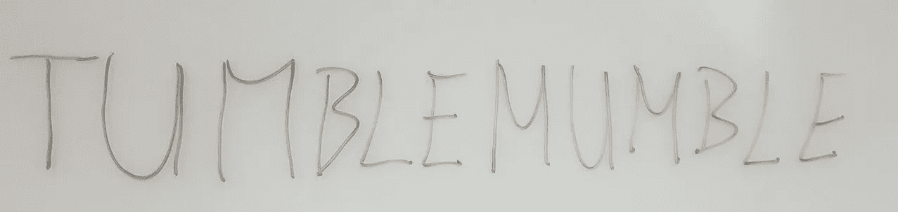
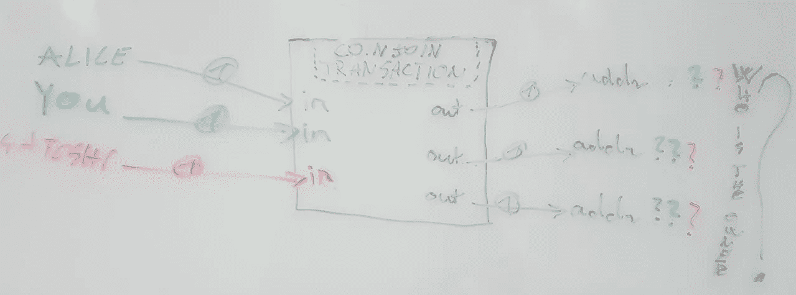
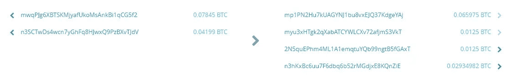

# 理解 TumbleBit 第 1 部分:制作案例

> 原文：<https://medium.com/hackernoon/understanding-tumblebit-part-1-making-the-case-823d786113f3>

我认为 TumbleBit 是比特币领域最令人兴奋的创新，它不依赖于任何协议变化，因此它适用于今天的比特币。请耐心等待，因为你能够使用它只是时间问题。

如果你考虑好货币的属性，与其他替代品相比，比特币表现出色。

> 持久性、便携性、可分性、稀缺性、可接受性和可替代性。

我们可以做得更好，好得多。**的可接受性**与*的用户采用度相关，*持续增长。Lightning Network 准备解决可移植性问题，因为它将实现即时交易，主流可能甚至不知道确认是羊还是牛。

*TumbleBit* 旨在让比特币**再次变得可替代**。是的，曾经有一段时间比特币更具可替代性，然而，如今区块链监控行业和反洗钱/KYC 法规正在威胁我们神奇的互联网货币。

# 谁需要隐私？我没什么好隐瞒的

比特币让你可以选择做自己的银行。这种使用它的方式比使用传统机构需要更多的隐私意识，因为它们为你提供隐私对抗你的邻居和你的跟踪者前夫。如果我们不提高比特币的可替代性，你可以开始练习过完美的生活，你不仅要遵守政府的规则，还要遵守你在这个世界上接触过的每个人的期望。

# TumbleBit 没准备好，还能用什么？

## 更改地址

比特币区块链把你的每一笔交易都链接到你的比特币地址和对方的比特币地址。幸运的是，你可以有无限多的地址，因此，如果你确保每次想要接收比特币时都生成一个新地址，这是一个好的开始。

## 明智地选择你的比特币钱包

使用**比特币银行、**如 CoinBase 和 Circle 或**网络钱包、**如 Blockchain.info 将是理想的，如果他们会关心你的隐私，但他们不会。即使他们知道，你也不应该相信他们。

通过使用一个 **SPV 钱包**，比如 MultiBit、Electrum、菌丝体和面包钱包，你不那么容易受到钱包提供商本身的攻击，尽管好奇的第三方能够以惊人的效率将你的地址[链接在一起](https://www.youtube.com/watch?v=HScK4pkDNds)。

如果你想获得最好的隐私，并且你能负担得起使用一个钱包作为一个完整的节点。这样你需要担心的事情就少多了。

## 使用 TOR

第一，把你的 IP 地址藏在 TOR 后面。

另一种是混淆/匿名/混合/翻滚你的比特币:

## 集中式比特币混合器

“主流”比特币论坛非常不鼓励使用集中式比特币混合器，因为它们能够窃取你的比特币，并且经常出现退出骗局。具有讽刺意味的是，在 deep web 上，它们是最受欢迎的选项，因为如果它们碰巧不是恶意的，它们提供了当今可实现的最强大和最容易的隐私。它们很实用。

你寄给他们一些比特币，他们寄回来完全不相关的。

问题是，混子很容易**偷你的钱**或者更糟:**剥夺你的权利**。

## CoinJoin/联合市场

一个比特币交易可以有多个输入和多个输出。

**CoinJoin** (CJ) 的思想是，如果多方将他们的输入和输出连接在一起，那么没有人能够区分哪个输入属于哪个输出。

没有固定金额的 CJ 不提供隐私。所以这个方案需要很大的流动性。这就是 JoinMarket 通过以流动性提供者可以收取费用的方式激励参与者所解决的问题。[您今天就可以使用](https://github.com/JoinMarket-Org/joinmarket) JoinMarket。

## 硬币洗牌

你可能听说过 **CoinShuffle。**它是完全去中心化的 CoinJoin，而 [**ShufflePuff**](https://github.com/DanielKrawisz/Shufflepuff) 几乎是它在菌丝体中的生产就绪实现。JoinMarket 不那么分散，因为它使用一个中央服务器，它的对等点可以在那里通信。因为服务器不能学习和窃取任何东西，CoinShuffle 相对于 JoinMarket 的好处，如果有的话，我也不清楚。

Example of a JoinMarket transaction in the Bitcoin testnet

与传统的混合器相比，基于 CoinJoin 的技术**可以防止偷**你的硬币，而且没有使用混合器，没有中央党来解除你的身份。这在理论上听起来很棒，然而在实践中却面临着严峻的挑战。这里有一段摘自 [TumbleBit 白皮书](https://eprint.iacr.org/2016/575.pdf)的摘录，可以更深入地了解这些挑战，但是如果您对此不感兴趣，可以随意跳过。这只是一些超级无聊的网络巫师的东西:

> CoinShuffle 和 CoinJoin 在单个事务中执行它们的混合，这使得它们特别容易受到 DoS 攻击，在 DoS 攻击中，一个用户加入混合后中止，从而为所有其他用户中断协议。权力下放后，攻击者还可以很容易地创建多个 Sybils，并诱使 Alice A 与这些 Sybils 混合，以实现付款的去集中化。此外，比特币的最大交易量为 100KB，这限制了这些系统每用户 538 人。

# TumbleBit 如何融入？

集中式混合器就像 Freeza，CoinJoin 就像基本形式的小悟空。小悟空无法如此击败弗里扎，但他的战斗方式至少是正确的:诚实。小悟空就像 JoinMarket 一样不会作弊。

## 1.经典不倒翁模式:超级赛扬

大家可以把 TumbleBit 想象成一个比特币搅拌机，只处理固定数量的比特币，虽然它没有能力窃取你的比特币并对你进行去个性化，但另一方面它的作用远远不止于此。
经典不倒翁只是第一种可行模式。这是最简单的模式，计划首先实施。

如果说集中式调音台的技术类似 Freeza，那么 TumbleBit 的第一种模式就是超级赛扬小悟空。

## 2.单向支付枢纽模式:超级赛扬 3

从最终用户的角度来看，第二种模式可能在某种程度上是这样工作的。

1.  你可以作为支付者或接受者加入 TumbleBit 支付中心。
    成为比特币的支付方，你可以存入 3 个比特币。
    您无需在线即可保持与中心的连接。
2.  作为支付方，你可以立即向任何接收方发送面值为 0.1 的比特币。
3.  完成业务后，可以关闭连接。
    如果你是比特币的付款人，就不需要把所有的 3 个比特币都花光。
    如果你是比特币的接收者，那么你不需要在每收到 0.1 个比特币后就关闭该频道。

最重要的一点需要注意的是**你是匿名交易，即时**。唯一的事情，使它不太实际的是，你必须使用固定面值。

## 3.双向支付枢纽模式:超级赛扬神

还有第三种模式，它正在创造者的头脑中逐渐成熟，但尚未公开。不过，让支付方和接受方成为同一个人，或许是可行的。因此，通过加入 TumbleBit 中心，你可以匿名发送和接收金钱，即时免费。这难道不是比特币的市场卖点吗？
*注意，在这种情况下，金额也必须固定。*

> 固定面值的约束在未来能否消除？也许我们会想出一个办法。

TumbleBit 的第三种模式是超级赛扬神模式。它的权力水平是如此之高，以至于我们现在甚至不能理解它的局限性。

# 有趣的问题

最后，我想谈谈一个同样适用于闪电网络的有趣问题。TumbleBit 的问题不是缺乏流动性，而是流动性过多。为了让 TumbleBit 发挥作用，Tumbler Hub 必须将许多比特币放入托管账户。如果它不能，一些人将不能使用它。所以 TumbleBit 的日益壮大其实是直接的比特币购买压力。

创作者将如何处理这种情况？TumbleBit 会成为比特币的下一个大事件吗？我要写这个系列文章的第二部分吗？下期龙珠 Z 集揭晓…

如果你觉得这篇文章很有用，并且想了解更多关于 TumbleBit 的信息，请随意投票、点赞、发微博、评论、分享或提供任何反馈。我需要一些动力来创作下一部。

[第二部分:终局——基于比特币的即时、匿名、可扩展的支付系统](/@nopara73/understanding-tumblebit-part-2-the-endgame-instant-anonymous-scaleable-payment-system-on-top-479e7eb9ca24)

> [黑客中午](http://bit.ly/Hackernoon)是黑客如何开始他们的下午。我们是 [@AMI](http://bit.ly/atAMIatAMI) 家庭的一员。我们现在[接受投稿](http://bit.ly/hackernoonsubmission)并乐意[讨论广告&赞助](mailto:partners@amipublications.com)机会。
> 
> 如果你喜欢这个故事，我们推荐你阅读我们的[最新科技故事](http://bit.ly/hackernoonlatestt)和[趋势科技故事](https://hackernoon.com/trending)。直到下一次，不要把世界的现实想当然！

