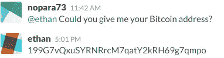
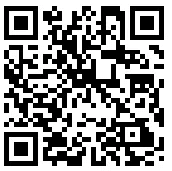
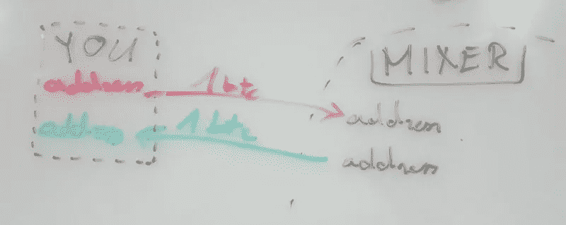
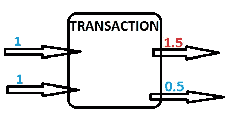

# 理解 TumbleBit 第二部分:终结——基于比特币的即时、匿名、可扩展的支付系统

> 原文：<https://medium.com/hackernoon/understanding-tumblebit-part-2-the-endgame-instant-anonymous-scaleable-payment-system-on-top-479e7eb9ca24>

在[理解 TumbleBit 第一部分:提出理由](https://hackernoon.com/understanding-tumblebit-part-1-making-the-case-823d786113f3)中，我谈到了隐私的重要性，比特币的隐私状况，并将 TumbleBit 与其他替代品进行了比较。你完全不需要为了理解这篇文章而去阅读它。简单回顾一下，看看这条推文:

今天我就来推测一下超级喷机神的水平。也许，只是也许你会觉得这一切都有意义，并对比特币的未来变得比以往任何时候都更兴奋。
在这篇文章中，我将概述 TumbleBit 的想法、梦想、愿景和最终目标，**一个不可信、即时、免费、匿名、可扩展的支付系统。**在比特币之上。

# 好吧，但是要多久？

目前有多种实现方式，一种是来自 C++开发者的[概念验证](https://github.com/BUSEC/TumbleBit/tree/master/POC_code)，一种是来自 Python 开发者的[更高级的代码库](https://github.com/BUSEC/TumbleBit)。并且有一个 [NTumbleBit](https://github.com/NTumbleBit/NTumbleBit) 在。NET Core，一个生产就绪 TumbleBit:经典的不倒翁模式，你知道超级赛亚人那个。然而，它还没有经过测试，没有文档记录，用户不友好，没有部署。其他人也在计划实施它。

TumbleBit: Classic Tumbler Mode

一般来说，Ethan Heilman 和波士顿大学的其他密码学家更专注于理论和学术部分，而 Nicolas 和我则专注于实践和实现部分。最终，我们所有人每天都在接触，一起工作，互相帮助。例如，我刚刚对伊森进行了一次精彩而精心策划的社会工程攻击:

因此，如果你愿意，我可以给你一个贡献的机会

# 使用支付中心与连锁混合

链上混合有一个基本问题。想想 mixing 是如何工作的，你向 mixing 发送一些比特币，它会发回完全不相关的比特币:

假设你买了两个比特币。一个去丝绸之路 [hodl](https://bitcointalk.org/index.php?topic=375643.0) 买[羊驼袜子](https://99bitcoins.com/is-alpaca-the-mascot-of-bitcoin/)，因此你送 1 个 BTC 去搅拌机买袜子。然而，比特币并非如此。你实际上必须花掉你所有的两个 BTC。你在联谊会上花了 1 BTC，1 BTC 的零钱会返还给你。
如果你后来又买了一个 1 BTC，并决定用 1.5 BTC 买些东西，那么交易会是这样的:

你在把硬币连在一起。从隐私的角度来看，这并不理想。这是区块链监视公司兴旺发达的主要原因之一。因此任何经常访问比特币区块链的比特币混合都是不理想的。
为什么我们不把所有的比特币都发送到 CoinBase，并继续在他们的系统内交易？等一下，我们现在有即时交易！更好的是，我们也刚刚收回了我们的隐私！

不过，有两个问题。第一，CB 可以偷我们的硬币，第二，CB 可以让我们失去男性化。我们只有即时、免费、可扩展的支付系统，尽管我们想要一个**不可信**、即时、免费、**匿名**、可扩展的支付系统。这个支付系统将是 CoinBase: Super Saiyan God 模式，或者用一个更蹩脚的名字，CoinBase，双向支付中心模式。

CoinBase: Super Saiyan God

问题是，**我们怎么拿一个集中式的调音台，像 CoinBase 到 Supa 赛亚-jin Goddo 级别？**或者更确切地说，我如何让你相信这是可能的？

# 不可靠的

使用双向多方支付渠道，我们可以使 CoinBase 变得不可信。我不会深入细节，你可以在很多地方读到它，我只想指出这样一个事实，即 CoinBase 要想工作，必须有至少和通过它的量一样多的比特币。这是一个非常现实的经济瓶颈，可能会导致许多 CoinBase 枢纽，或者让我们说 TumbleBit 枢纽从现在开始。另一方面，这是一个积极的比特币价格压力，所以继续 hodling。

# 匿名的

我们如何隐藏支付中心内部谁派谁去支付中心？TumbleBit 为此提供了一个迷人的解决方案。它基于大卫·乔姆 1999 年的盲签名。

 [## Chaum 风格的电子现金是如何工作的？(所有维基链接都断了)

### Chaumian 电子现金盲签名的基本思想是:假设一个中心发行者(Chaumian 电子现金是…

bitcoin.stackexchange.com](http://bitcoin.stackexchange.com/a/10666/26859) 

我应该提到超级喷机神级还没有刻在石头上，或者我应该说它没有写在白皮书里？在这一点上，它的可实现性是不确定的，只有 SSJ3 级别是确定的，这是我在本文中完全驳回的，因为它是关于 TumbleBit 的最终游戏，而不是中间游戏。

你怎么看？创造者会从一天的长时间运行、比特币全节点要求、未经测试、无文档记录、用户不友好、未部署的 CLI 软件转向一个不可信、即时、免费、匿名、可扩展的支付系统吗？下期滚翻位 Z 集揭晓……

[第三部分:即使是不倒翁也不能侵犯你的隐私。怎么会？](/@nopara73/understanding-tumblebit-part-3-not-even-the-tumbler-can-breach-your-privacy-how-8d49d89e3a0d)

> [黑客中午](http://bit.ly/Hackernoon)是黑客如何开始他们的下午。我们是 [@AMI](http://bit.ly/atAMIatAMI) 家庭的一员。我们现在[接受投稿](http://bit.ly/hackernoonsubmission)并乐意[讨论广告&赞助](mailto:partners@amipublications.com)机会。
> 
> 如果你喜欢这个故事，我们推荐你阅读我们的[最新科技故事](http://bit.ly/hackernoonlatestt)和[趋势科技故事](https://hackernoon.com/trending)。直到下一次，不要把世界的现实想当然！

