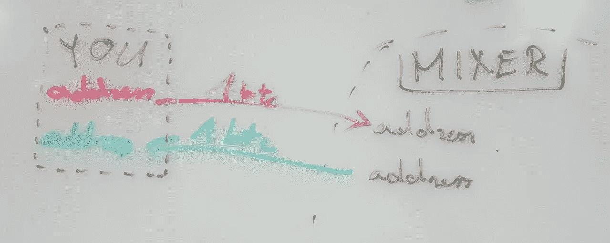
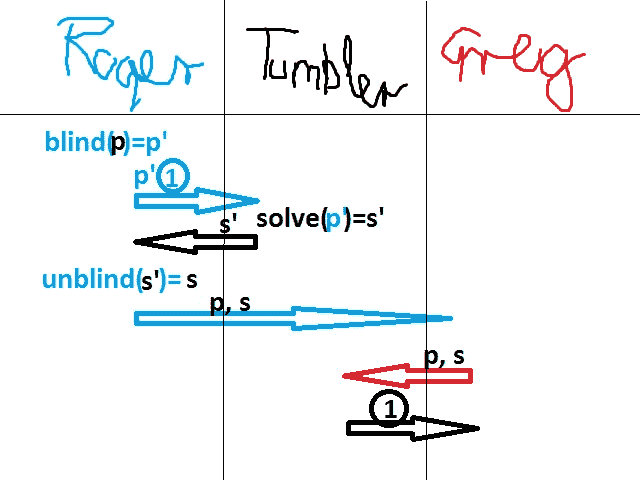

# 理解不倒翁第三部分:即使是不倒翁也不能侵犯你的隐私

> 原文：<https://medium.com/hackernoon/understanding-tumblebit-part-3-not-even-the-tumbler-can-breach-your-privacy-how-8d49d89e3a0d>

在[第 1 部分:立案](https://hackernoon.com/understanding-tumblebit-part-1-making-the-case-823d786113f3)中，我谈到了隐私的重要性，比特币的隐私状态，并将 TumbleBit 与其他替代产品进行了比较。在《T2》第二部分《T3》中，我勾勒了游戏的结局，强调了 TumbleBit 最终能够实现的潜力,《T4》是一个基于比特币的无信任、即时、免费、匿名、可扩展的支付系统。您不需要为了理解本文而阅读它们。

在第 2 部分中，我同样概述了 TumbleBit 解决的两个主要问题:

1.  **匿名:**我们怎么才能隐藏谁从不倒翁那里派来了谁？
2.  **无信任者:**我们如何防止不倒翁偷窃？

在本文中，我将阐述 TumbleBit 解决第一个问题的基本思路，并使您理解。**为什么不倒翁不能把你们的比特币联系起来？**

虽然我以前的文章很有希望令人兴奋，读起来很有趣，但这将是另一种有趣的方式。这个旨在给你一个“啊哈”的时刻。技术上的顿悟。如果失败了，请随意评论“你真差劲”。

# 问题:传统的比特币翻滚保险

首先，我想快速回顾一下传统调音台是什么。如果您是专家或已经阅读了第 1 部分，请随意跳过这一部分。

“主流”比特币论坛非常不鼓励使用集中式比特币混合器，因为它们能够窃取您的比特币，并且经常出现退出欺诈。具有讽刺意味的是，在深度网络上，它们是最受欢迎的选择，因为如果它们碰巧不是恶意的，它们提供了当今最强和最容易实现的隐私。简单地说，它们是实用的。

你给他们寄一些比特币，他们会把完全不相关的送回来。

问题在于混音器很容易**偷你的钱**或者更糟的是**去你的头**。

# 去甲肾上腺素化解决方案

这就是有趣的地方。TumbleBit 提供了一个迷人的解决方案。它基于大卫·乔姆 1999 年的盲签名。

 [## Chaum 风格的电子现金是如何运作的？(所有维基链接都已断开)

### 以下是盲签名 Chaumian 电子现金的基本思想:假设一个中央发行者(Chaumian 电子现金是…

bitcoin.stackexchange.com](http://bitcoin.stackexchange.com/questions/9544/how-does-chaum-style-e-cash-work-all-the-wiki-links-are-broken/10666#10666) 

先别走，我不会进入数学领域。如果你不愿意浏览以上链接，我想说 99%的人都不愿意，我希望你能相信我。数学就在那里，而且是正确的！

现在让我们言归正传，考察罗杰是如何通过 TumbleBit 向格雷戈里捐赠 1 个比特币的。

## 不倒翁的视角

> 我想玩一个游戏。我做了一堆拼图。我为每个解决方案支付 1 比特币。另外，我用 1 个比特币解决任何难题。

到目前为止，它没有多大意义，对不对？请注意，不倒翁说它解决任何难题，而不仅仅是它创造的难题。这很重要，继续读下去。

## 罗杰的观点

> 太棒了，我可以用这个游戏，匿名付钱给格雷格。我选了一个谜题，然后蒙住它。然后我让不倒翁用 1 个比特币解决了这个令人迷惑的难题。
> 
> 不倒翁解决了之后，我解开了这个盲解。
> 
> 最后，我把这个解决方案和最初的难题交给 Greg。

开始明白了吗？

## 格雷格的观点

> 罗杰说，我可以用这个解决方案从平底玻璃杯中兑换 1 个比特币。事实上。谢谢罗杰！

## 把它们放在一起

如果你还不明白，不要担心，我请了最好的插图画家来帮助你理解:

> p:难题
> s:解决方案
> p ':盲解难题
> s ':盲解

**罗杰蒙蔽了一个谜题，让不倒翁用 1 个比特币解开这个被蒙蔽的谜题，解开被蒙蔽的解。然后，他将最初的谜题和解决方案交给 Greg，并与他们一起从不倒翁中兑换了 1 个比特币。**

关键的见解是，当格雷格和其他 800 名收款人用他们自己的解决方案来兑换比特币时，不倒翁无法将盲解谜题和盲解链接在一起，这是之前为罗杰和其他 800 名收款人解决的问题。

这是 TumbleBit 匿名技术背后的主要思想。当然，最终的算法有很大的不同，因为 TumbleBit 进一步解决了信任的问题，这使得这个方案变得复杂。

*你怎么看？引入盲签名的大卫·乔姆和将盲签名应用于比特币的伊森·海尔曼是世界上最酷的密码学家吗？你想知道 TumbleBit 如何解决偷硬币的问题吗？在* [*中找出下一个了解 TumbleBit 的插曲*](/@nopara73/understanding-tumblebit-part-4-not-even-the-tumbler-can-steal-your-coins-482e7076ef22) *！*

> [黑客中午](http://bit.ly/Hackernoon)是黑客如何开始他们的下午。我们是 [@AMI](http://bit.ly/atAMIatAMI) 家庭的一员。我们现在[接受投稿](http://bit.ly/hackernoonsubmission)，并乐意[讨论广告&赞助](mailto:partners@amipublications.com)机会。
> 
> 如果你喜欢这个故事，我们推荐你阅读我们的[最新科技故事](http://bit.ly/hackernoonlatestt)和[趋势科技故事](https://hackernoon.com/trending)。直到下一次，不要把世界的现实想当然！

