# 了解 TumbleBit 第 4 部分:即使是不倒翁也不能偷走你的硬币

> 原文：<https://medium.com/hackernoon/understanding-tumblebit-part-4-not-even-the-tumbler-can-steal-your-coins-482e7076ef22>

我将向你展示不倒翁如何转发你的比特币，而不会对你进行退出欺诈。

> “哼，这已经很无聊了，我就不读了。”—现在还不要做出不成熟的决定。如果我告诉你，在这篇文章结束的时候，你已经掌握了建造一个不可信变形人的所有知识，会怎么样？

在[第一部分:制作案例](https://hackernoon.com/understanding-tumblebit-part-1-making-the-case-823d786113f3)中，我描述了 TumbleBit 为什么重要，在[第二部分:最后阶段](https://hackernoon.com/understanding-tumblebit-part-2-the-endgame-instant-anonymous-scaleable-payment-system-on-top-479e7eb9ca24)中，我描述了这个想法可以带我们走多远，在[第三部分:即使不倒翁也不能侵犯你的隐私](https://hackernoon.com/understanding-tumblebit-part-3-not-even-the-tumbler-can-breach-your-privacy-how-8d49d89e3a0d)中，我最后描述了 TumbleBit 的第一个关键属性是如何实现的:**匿名**。在这篇文章中，我定义了缺失的部分，它的第二个关键属性:**不信任**。我在这里表达的不仅仅是 TumbleBit 构建的基本概念，而是支付渠道、支付枢纽和闪电网络的基本概念。如果你对这些感兴趣，请留下来！

# 发展状况

我不得不首先回答你们最感兴趣的问题。我什么时候能使用它？
虽然 [TumbleBit 核心协议](https://github.com/NTumbleBit/NTumbleBit)已经基本就绪，你可以通过 CLI 界面和比特币核心以极其不切实际的方式使用它，但 TumbleBit 需要流动性，这将无法实现。
另一方面，将 TumbleBit 集成到现有的比特币钱包中也是不可行的。问题是**如果从隐私的角度来看，你的同行在混合中使用的钱包被搞砸了，即使你以正确的方式使用 TumbleBit，使用 fullnode，你的匿名也因为你的同行而被搞砸了。**解决方案是建立一个比特币钱包，它不会破坏完整节点级别的隐私，也不会像完整节点那样繁琐。这就是 [HiddenWallet](https://hackernoon.com/introducing-hiddenwallet-full-block-spv-tumblebit-wallet-testing-release-1054a15a9bb1) 和 [BreezeWallet](https://github.com/stratisproject/Breeze) 的用武之地。我们都在独立开发一款专用的 TumbleBit 钱包。
我没有讲太多细节，只是把我的隐藏钱包的路线图的一部分放在这里:

*   [整块下载 SPV](/@nopara73/bitcoin-privacy-landscape-in-2017-zero-to-hero-guidelines-and-research-a10d30f1e034) — **就绪，不稳定**
*   [TumbleBit 集成，经典的不倒翁模式](https://hackernoon.com/understanding-tumblebit-part-1-making-the-case-823d786113f3)——**我目前正在做。**
*   [事务过滤块下载](/@nopara73/full-node-level-privacy-even-for-mobile-wallets-transaction-filtered-full-block-downloading-wallet-16ef1847c21)—10-100 倍性能提升。
*   发布稳定版。

# 很酷的加密材料

*注意:我在这里只描述了不可信硬币交换如何工作的基本概念，当然不是完整的 TumbleBit 协议。*

更具体地说，我正在描述单向支付中心是如何工作的。

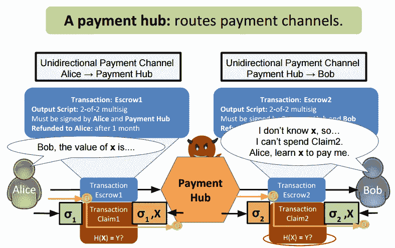

上图显示了单向支付中心的工作原理。如果你已经明白了，那么对不起，我只是浪费了你两分钟的时间，让你阅读介绍，并要求你停止在这里阅读。如果没有，留下来，你会看到神奇。

首先想象一下**爱丽丝**想送**鲍勃** 1 BTC。她是怎么做到的？她给鲍勃发了一张 BTC。我希望你能跟上。

接下来介绍**轮毂**。

现在，爱丽丝想通过集线器将 1 BTC 发送给鲍勃。我知道这是毫无意义的，但它是有意义的。她是怎么做到的？首先，爱丽丝向集线器发送 1 个 BTC，然后集线器向鲍勃发送 1 个 BTC。到目前为止，我们刚刚引入了第二个无意义的交易，因此我们可以支付两倍的网络费用，并且我们可以等待两倍的时间。然而，情况变得更糟。如果集线器决定偷 Alice 的钱，但没有将硬币转发给 Bob，该怎么办？让我们试着解决这个问题，好吗？

假设 Alice 和 Tumbler 正在发送一些特殊的事务，而不是常规的事务，这暂时不会解决问题，尽管它会使我们更接近解决方案。

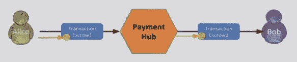

如您所见，我们介绍的交易是**托管交易**。

这到底意味着什么？让我们检查 Alice 到集线器的事务。事务说:*“嘿，我是事务，我会说话。我从 Alice 的钱包出来，去 Hub 的钱包，但是，我还没有到那里，只是在两者之间。问题是哈勃不能让我一个人呆着。它只能陪我和爱丽丝一起度过。如果试图消费我的交易没有得到爱丽丝和集线器的签名，该交易将被比特币网络拒绝。然而，还有更多。如果我在一个月内没有被花掉，我会让爱丽丝在没有哈勃签名的情况下花掉我。”*

类似地，从集线器到 Bob 的交易:

我决定不写下这笔交易到底说了什么，因为这显然是中文，我懒得翻译。你必须从上面的方框中算出。

我们现在有什么？

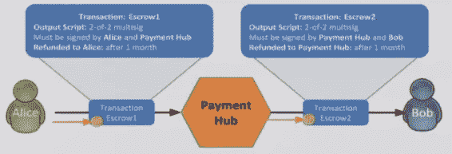

我们刚刚进行了四次交易，以便通过集线器将 1 个 BTC 从 Alice 转移到 Bob。这是正常交易费用的四倍。事实上，它甚至更大，因为托管交易比正常交易更大，不是在金钱上，而是在实际大小上，以字节为单位，这是当你用比特币支付交易费时真正重要的事情。我们解决了什么？没什么，中枢还是可以偷我们的硬币。等等，为什么是四笔交易？想想看，托管交易不是从 Alice 到 Hub 的交易。这是一个介于两者之间的特殊交易。因此，必须有另一个交易将该交易花费到集线器的钱包中。我们称之为**索赔交易**。

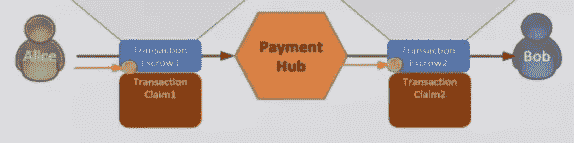

你还记得 Escrow1 事务是怎么说的吗？难道不觉得有点奇怪吗？它没有过多地谈论自己，而是谈论想要花费它的交易，即索赔交易。现在，我有一个问题。你知道当 Alice 签署了索赔交易，而 Hub 还没有签署时，我们怎么称呼它吗？

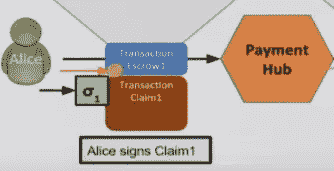

叫做**开通支付通道**。然后集线器可以偷你的硬币，不是吗？是的，可以，但是，这是我们要解决的最后一个问题。现在，让我们**关闭支付通道**:

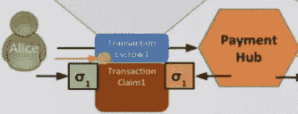

完全相同的事情发生在 Hub 和 Bob 之间的支付渠道。

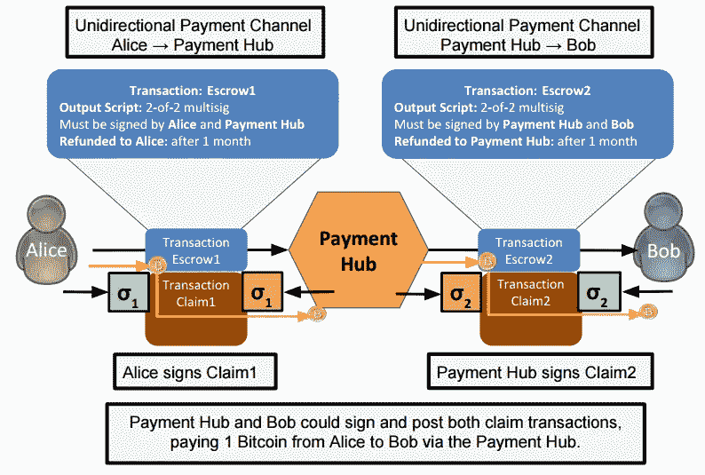

很整洁，是吧？你刚刚掌握了一个超级复杂的插图。
现在让我们回到刚刚发现的问题上来。

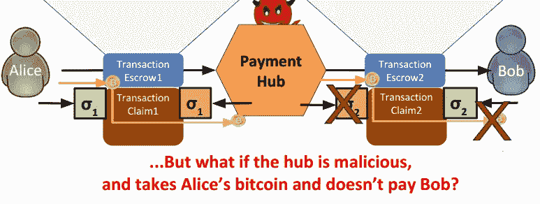

如果爱丽丝在网络中心向鲍勃签署索赔 2 交易之前签署索赔 1 交易，网络中心将能够窃取爱丽丝的钱。如果 Hub 首先签署索赔 2 交易，则 Alice 可以拒绝签署索赔 1，等到 Escrow1 到期，她可以将其退还给自己，Bob 可以接受索赔 2 交易。我认为这种情况合适的密码术语是 [Catch-22](https://en.wikipedia.org/wiki/Catch-22_(logic)) 。我们能做些什么来避免这种情况吗？如果我们可以说 Alice 签名声明 1 和 Hub 签名声明 2 必须同时发生，那么我们所有的问题都将迎刃而解。

幸运的是，有几种方法可以做到这一点。例如，使用**散列锁**:

只有 Hub 知道 x。

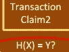

如果我们说 Claim2 不能在没有 X 的情况下发生，那么 Hub 可以签署 Claim2 而不用担心它会被 Bob 欺诈:

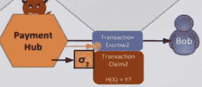

如果 Bob 希望索赔事务发生，它必须学习 x。

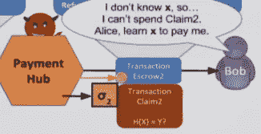

爱丽丝怎么学 X？Claim1 事务必须包括使用相同 x 的散列锁。

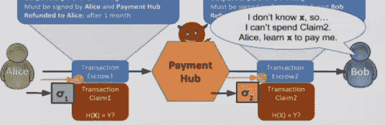

请注意，Alice 也签署了声明 1，并且当她签署声明 1 时，Hub 能够窃取她的钱，而无需支付 Bob。这一次应该是一样的，因为只有集线器知道 X，对吗？Hub 只需通过签名和**提供 X** 就可以花费 Claim1 交易。就在集线器提供 X 的那一刻，Alice 知道了 X，并告诉了 Bob，Bob 现在能够使用 Claim2 交易。*是的，这是你第一个“啊哈时刻”的时候，因为你刚刚掌握了原子性。*

第二个“啊哈时刻”到了，因为你刚刚意识到，现在你完全理解了我在开始解释时给你添麻烦的这个超级复杂的插图。

我们取得了什么成就？我们想出了如何利用支付渠道，通过第三方把钱从一个地方汇到另一个地方。这是愚蠢的，当你可以直接发送比特币时，为什么会有人想做这种复杂的耻辱？那么，如果鲍勃宁愿接受莱特币，而不是比特币，会发生什么变化？完全没有。Escrow2 和 Claim2 是发生在莱特币还是比特币上并不重要。这就是分散加密交换的工作方式。

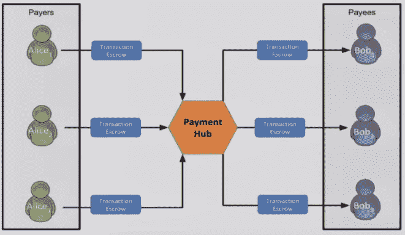

还不明白吗？不要担心，观看视频的前四分钟，TumbleBit 的创造者 Ethan Heilman 为您解释了这个概念:

我碰巧又写了这个系列的一部分，来看看:[了解 TumbleBit 第 5 部分:试试看！](https://medium.com/p/65b7a8d21a96/edit)

> [黑客中午](http://bit.ly/Hackernoon)是黑客如何开始他们的下午。我们是 [@AMI](http://bit.ly/atAMIatAMI) 家庭的一员。我们现在[接受投稿](http://bit.ly/hackernoonsubmission)并乐意[讨论广告&赞助](mailto:partners@amipublications.com)机会。
> 
> 如果你喜欢这个故事，我们推荐你阅读我们的[最新科技故事](http://bit.ly/hackernoonlatestt)和[趋势科技故事](https://hackernoon.com/trending)。直到下一次，不要把世界的现实想当然！

